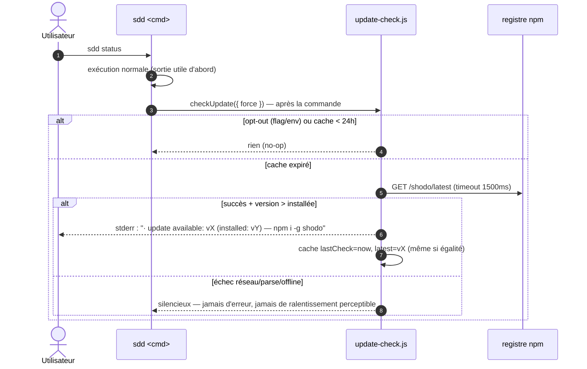

## 1. Intent & Context (*The Why*)

* **Problem Statement / Need:** npm ne notifie personne : une install globale reste figée et le cache npx ré-utilise une vieille version. L'utilisateur « classique » ne saura jamais qu'une v2.1 existe sans aller vérifier.
* **User / System Impact:** Après chaque commande `sdd`, une notice discrète (stderr, cache 24 h, best-effort) signale la version plus récente et la commande d'update. Opt-outs : flag `--no-update-check` et env `SDD_NO_UPDATE_CHECK=1`.
* **In Scope (What is added / modified):**
  * `src/cli/update-check.js` [NEW] : fetch registre (`registry.npmjs.org/shodo/latest`, stdlib, timeout 1,5 s), cache 24 h, comparaison semver.
  * `src/cli/main.js` [MOD] : hook post-commande (notice après l'exécution, jamais avant), flag global `--no-update-check`, lecture env.
  * `src/model/audit.js` [MOD] : tolérance root-layout `.update-check.json` (si pattern dotfile non déjà générique).
  * `test/update-check.test.js` [NEW] + `test/cli.test.js` [MOD].
* **Out of Scope (Strict Exclusions):**
  * Auto-update, telemetry, check de schema (rôle `sdd migrate`), notices custom par connecteur.

> *Clean Omission Note : Section 4.3 Infrastructure & Runtime : sans objet — stdlib `fetch` (Node ≥18), aucune dépendance.*

---

## 2. Flow & Architecture



---

## 3. File Inventory & Responsibilities

### 3.1. Factorized File Tree

```text
src/cli/
├── update-check.js                   [NEW] checkUpdate({ cwd, timeoutMs }) → notice | null ; cache 24h (mémoire + .sdd/.update-check.json)
└── main.js                           [MOD] --no-update-check (option globale), hook post-run (run() enveloppe le handler), env SDD_NO_UPDATE_CHECK
src/model/audit.js                    [MOD] root-layout : tolérance dotfile .update-check.json (si le pattern n'est pas déjà startsWith('.'))
src/cli/help.js                       [MOD] flag documenté
README.md                             [MOD] note « update notice » (comportement + opt-outs)
test/update-check.test.js             [NEW] @unit/@component : cache, semver, échec silencieux, opt-outs
test/cli.test.js                      [MOD] notice après commande, pas avant ; exit codes inchangés
```

### 3.2. Key Contracts & Signatures

```js
// src/cli/update-check.js
export async function checkUpdate({ cwd, pkg, timeoutMs = 1500, now = Date.now() });
//   → { notice: string | null, cached: boolean }
//   registre : https://registry.npmjs.org/shodo/latest → { version } (stdlib fetch)
//   cache    : mémoire par process + .sdd/.update-check.json { lastCheck, latest } si .sdd/ existe
//   semver   : comparaison majeure.mineure.patch — pas de range, pas de prerelease

// main.js — hook post-run
run() → handler(...) → finally { notice = checkUpdate(...) si !optOut; notice && process.stderr.write(...) }
//   la notice n'interagit JAMAIS avec l'exit code de la commande
```

---

## 4. Detailed Specifications

### 4.1. Data Models & API Contracts

* **Cache** : `.sdd/.update-check.json` — `{ "lastCheck": <epoch ms>, "latest": "2.1.0" }` ; fichier toléré (dotfile) par `root-layout` ; jamais dans le graphe ; si `.sdd/` absent → cache mémoire seule (durée de vie = session).
* **Déclenchement** : une seule fois par invocation `run()` — pas par sous-commande ; dry-run inclus (c'est une invocation) mais aucune écriture de cache si `--dry-run`… non : le check n'écrit rien dans le repo utilisateur de toute façon hors dotfile cache — le cache s'écrit même en dry-run (il est toléré).
* **Opt-outs** : flag `--no-update-check` OU env `SDD_NO_UPDATE_CHECK` (valeur quelconque non vide) ⇒ no-op total (ni fetch ni écriture).
* **Comparaison semver** : strict 3 segments numériques ; versions distantes malformées ⇒ silencieux.

### 4.2. UI & Interaction Specifications (CLI)

| État | Déclencheur | Comportement |
|---|---|---|
| **Notice** | version distante > installée, cache expiré | 1 ligne stderr après la sortie : `· update available: vX.Y.Z (installed: vA.B.C) — npm i -g shodo` |
| **Fraîcheur** | check < 24 h | Aucun fetch, aucun affichage. |
| **Égalité / inférieure** | distante ≤ installée | Cache mis à jour (lastCheck), aucun affichage. |
| **Offline / timeout** | fetch > 1,5 s ou erreur | Silencieux ; lastCheck quand même mis à jour (évite de re-sonder à chaque commande offline). |
| **Opt-out** | flag ou env | No-op total. |
| **CI** | aucune exception — le check passe en CI aussi | Idem normal (l'invocation CI courte ne doit pas se faire sonder en boucle : le cache partagé la protège). |

---

## 5. Business Invariants & Test Traceability

* **INV-1 · Après la commande, stderr, 1×/24h** — la notice n'précède jamais la sortie utile ; cache 24 h ; un seul affichage par invocation.
  ↳ *Covered by:* [`update-check.test.js`](#appendix-file-index), [`cli.test.js`](#appendix-file-index)
* **INV-2 · Best-effort strict** — timeout 1,5 s ; tout échec est silencieux ; l'exit code et le timing perçu de la commande ne sont jamais affectés.
  ↳ *Covered by:* [`update-check.test.js`](#appendix-file-index)
* **INV-3 · Opt-outs** — `--no-update-check` et `SDD_NO_UPDATE_CHECK` désactivent tout (fetch + écriture).
  ↳ *Covered by:* [`update-check.test.js`](#appendix-file-index)
* **INV-4 · Cache hors graphe** — dotfile `.sdd/.update-check.json` toléré par root-layout ; mémoire seule si `.sdd/` absent.
  ↳ *Covered by:* [`update-check.test.js`](#appendix-file-index), [`cli.test.js`](#appendix-file-index)
* **INV-5 · Registre npm officiel** — endpoint `registry.npmjs.org/shodo/latest`, stdlib fetch, pas d'endpoint maison.
  ↳ *Covered by:* [`update-check.test.js`](#appendix-file-index)

---

## 6. Technical Watchouts & Anti-Patterns

* **Ne jamais jeter depuis le hook** : un throw dans le check tuerait des commandes qui ont réussi — envelopper tout le check dans try/catch total, testé (fetch rejeté, JSON malformé, fs en lecture seule).
* **Timeout réel** : `AbortSignal.timeout(1500)` sur le fetch — un timeout « théorique » sans abort laisse des requêtes pendre et retarde le process.
* **lastCheck en cas d'échec** : mettre à jour le cache même en échec réseau — sinon chaque commande offline re-sonde (latence +1,5 s cumulée).
* **stderr, pas stdout** : `--json` et les pipes doivent rester propres — stdout est un contrat machine.
* **Comparaison d'equal-version** : `2.0.0 === 2.0.0` ⇒ pas de notice mais cache rafraîchi (sinon re-fetch à chaque run).
* **Node < 18.17** : `fetch` global n'existe qu'à partir de 18 — le plancher du package est 18.17, ok, mais ne pas introduire de `undici` direct.
* **Tests sans réseau** : injecter un `fetchImpl` (ou mocker via serveur local éphémère) — aucun test ne parle au vrai registre ; tester timeout, 500, JSON malformé, version plus vieille/égale/plus récente.

---

## 7. Sequential Execution Plan

- [x] **Phase 1: Module de check**
  - [x] `src/cli/update-check.js` : fetch+timeout+semver+cache (mémoire + dotfile).
  - [x] `src/model/audit.js` : tolérance `.update-check.json`.
  - [x] Tests unitaires (fetchImpl injecté : succès/échec/timeout/semver) (@unit).
- [x] **Phase 2: Hook CLI**
  - [x] `main.js` : `--no-update-check`, env, hook post-run dans `run()` (finally, try/catch total).
  - [x] `help.js` + README.
  - [x] Tests composant/e2e : notice après commande, stdout `--json` propre, opt-outs (@component).
- [x] **Phase 3: Gates**
  - [x] Gates : `npm test`, `node bin/sdd.js validate`, `node bin/sdd.js render --check`.

---

## 8. BDD Validation & Quality Gates

### 8.1. Exhaustive Gherkin Scenarios

```gherkin
Feature: Notice de mise à jour

  @unit
  Scenario: [INV-5][INV-2] Fetch registre et comparaison semver
    Given un fetchImpl qui répond { version: "2.1.0" } et une version installée "2.0.0"
    When checkUpdate
    Then notice contient "2.1.0" et "npm i -g shodo" ; avec { version: "1.9.9" } la notice est null

  @unit
  Scenario: [INV-2] Échecs silencieux
    Given fetchImpl qui timeout / 500 / JSON malformé
    When checkUpdate
    Then notice null, aucune exception levée, lastCheck mis à jour

  @unit
  Scenario: [INV-1] Cache 24h
    Given un cache lastCheck il y a 2h avec latest "2.1.0"
    When checkUpdate (fetchImpl comptant ses appels)
    Then 0 fetch, notice rendue depuis le cache ; avec lastCheck il y a 25h, 1 fetch

  @component
  Scenario: [INV-1][INV-4] Notice après la commande, cache dotfile
    Given un workspace avec .sdd/ et un fetchImpl renvoyant 2.1.0
    When run(["status"]) via le CLI
    Then stdout contient la sortie status intacte, stderr contient la notice, et .sdd/.update-check.json existe

  @component
  Scenario: [INV-3] Opt-outs
    Given SDD_NO_UPDATE_CHECK=1 puis --no-update-check
    When run(["status"]) dans les deux cas
    Then 0 fetch, aucun stderr, aucun cache écrit

  @component
  Scenario: [INV-4] root-layout tolère le cache
    Given un workspace avec .sdd/.update-check.json présent
    When `sdd validate`
    Then exit 0 — aucun finding root-layout

  @e2e
  Scenario: [INV-1..INV-5] Parcours complet
    Given un workspace seedé et fetchImpl version supérieure
    When status puis status (--json) puis --no-update-check
    Then notice 1× sur stderr au 1er run, supprimée au 2e (cache), jamais sur stdout, opt-out silencieux
```

### 8.2. Execution Commands & Quality Gates

```bash
# 1. Tests ciblés
node --test test/update-check.test.js test/cli.test.js

# 2. Suite complète
npm test

# 3. Gates canoniques
node bin/sdd.js validate
node bin/sdd.js render --check
```

---

<a id="appendix-file-index"></a>
## Appendix: File Index

| Short File Name | Project Relative Path |
|---|---|
| `update-check.js` | `src/cli/update-check.js` |
| `main.js` | `src/cli/main.js` |
| `audit.js` | `src/model/audit.js` |
| `help.js` | `src/cli/help.js` |
| `readme` | `README.md` |
| `update-check.test.js` | `test/update-check.test.js` |
| `cli.test.js` | `test/cli.test.js` |
