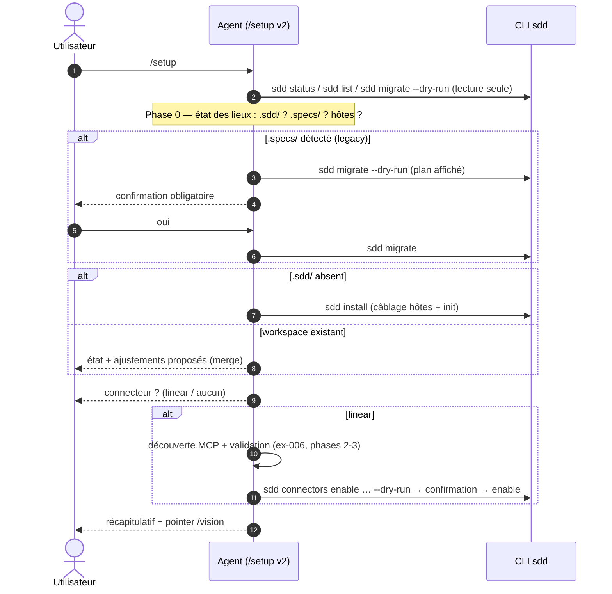

## 1. Intent & Context (*The Why*)

* **Problem Statement / Need:** Trois portes d'entrée concurrentes : `sdd install` (hôtes + init, aveugle au legacy et aux connecteurs), `/setup` v1 (MCP only, présume un workspace), et l'ancien skill externe `spec-driven-setup` (.specs/ Evaneos). L'adoptant ne sait pas laquelle invoquer.
* **User / System Impact:** `/setup` devient l'unique point d'entrée conversationnel : état des lieux systématique (`.sdd/`, `.specs/`, hôtes), phases conditionnelles (migration proposée et confirmée, câblage + init, connecteur optionnel), tout passant par la CLI. Le protocole v1 (006) est étendu, pas remplacé — la validation MCP reste sa phase 3.
* **In Scope (What is added / modified):**
  * `skills/setup/SKILL.md` : protocole v2 — phase 0 "état des lieux" (détection `.sdd/` / `.specs/` / hôtes via `sdd status` + `ls`), phase de migration (`sdd migrate --dry-run` → confirmation → `sdd migrate`), câblage via `sdd install`, connecteur optionnel (ex-006 inchangé), sortie récapitulative (ce qui est fait / ce qui reste — pointer `/vision`).
  * `README.md` : `/setup` présenté comme l'unique voie d'adoption (install reste une primitive CLI documentée).
  * Le skill externe obsolète (`spec-driven-setup` chez l'utilisateur) est noté retiré dans le report — hors repo.
* **Out of Scope (Strict Exclusions):**
  * Toute mécanique CLI nouvelle (`sdd migrate`/`install`/`connectors enable` sont livrés) ; validation MCP (inchangée).

> *Clean Omission Note : Section 3 se réduit au skill + README : aucun fichier `src/` ni `test/` — les primitives CLI sont l'interface d'écriture.*

---

## 2. Flow & Architecture



---

## 3. File Inventory & Responsibilities

### 3.1. Factorized File Tree

```text
skills/setup/SKILL.md                [MOD] protocole v2 : phase 0 état des lieux, migration legacy conditionnelle, install, connecteur optionnel, récap
README.md                            [MOD] /setup = voie d'adoption unique (install = primitive)
```

### 3.2. Key Contracts & Signatures

```markdown
## Protocole v2 — phases ordonnées, chacune conditionnelle et confirmée
0. État des lieux (lecture seule): sdd status / list --json / test .specs/ présence /
   detectHosts équivalent — matrice "à faire" présentée à l'utilisateur
1. Migration legacy (si .specs/ ET pas de .sdd/ valide):
   sdd migrate --dry-run affiché → confirmation explicite → sdd migrate
   (coexistence .specs/ + .sdd/: arbitrage présenté — migrate reconstruit .sdd/)
2. Câblage + init (si .sdd/ absent): sdd install (hôtes détectés, --dry-run d'abord)
3. Connecteur (optionnel, si utilisateur en veut un): interview → découverte MCP
   (ex-006 phases inchangées) → sdd connectors enable … --dry-run → confirmation
4. Récapitulatif: ce qui a été fait / ce qui reste (connecteur sans validation ?) → pointer /vision
Idempotence: relance → phase 0 détecte l'existant → seules les phases manquantes s'exécutent
```

---

## 4. Detailed Specifications

### 4.1. Data Models & API Contracts

* **Interface CLI** : uniquement les commandes livrées — `sdd status` (état), `sdd list --json`, `sdd migrate [--dry-run]`, `sdd install [--dry-run] [--host]`, `sdd connectors enable <id> [settings] [--dry-run]`. Aucun flag nouveau.
* **Détection** : `.specs/` = legacy (convention documentée du framework) ; `.sdd/` = workspace actuel ; hôtes = mêmes marqueurs que `sdd install` (`opencode.json`, `.claude/`, `.agents/`).
* **Valeurs jamais devinées** : la phase connecteur hérite des INV-1/2 de la feature 02 (vérifié ou marqué, repli explicite).

### 4.2. UI & Interaction Specifications (CLI)

| État | Déclencheur | Comportement |
|---|---|---|
| **Repo vierge** | rien de détecté | Phases 2 (+3 si voulu) — install puis connecteur. |
| **Legacy `.specs/`** | `.specs/` présent | Phase 1 : dry-run migration → confirmation → migrate → phases suivantes. |
| **Workspace complet** | `.sdd/` présent, sans legacy | État des lieux + ajustements ; connecteur si demandé. |
| **Workspace + legacy** | les deux | Arbitrage présenté (migrate reconstruit `.sdd/`) — jamais de migration silencieuse. |
| **Sans MCP** | connecteur demandé, serveur introuvable | Deux options explicites (non validé / local) — INV-4. |

---

## 5. Business Invariants & Test Traceability

* **INV-1 · État des lieux systématique** — la phase 0 précède toute action ; idempotent de bout en bout.
  ↳ *Covered by:* protocole SKILL.md §phase-0 (couche agent — CLI sous-jacente déjà testée 004-008)
* **INV-2 · Migration jamais silencieuse** — dry-run affiché + confirmation ; arbitrage explicite si `.sdd/` valide coexiste.
  ↳ *Covered by:* protocole SKILL.md §phase-1 + tests `sdd migrate` (003)
* **INV-3 · Toute écriture via CLI** — migrate/install/connectors enable, dry-run préalable ; rule 7.
  ↳ *Covered by:* protocole SKILL.md §phases 1-3
* **INV-4 · Connecteur repliable** — sans MCP : deux options explicites ; jamais de secret.
  ↳ *Covered by:* protocole SKILL.md §phase-3 (hérite INV-1/2 feature 02)
* **INV-5 · Idempotent** — relance = phase 0 → phases manquantes seulement.
  ↳ *Covered by:* protocole SKILL.md §idempotence

---

## 6. Technical Watchouts & Anti-Patterns

* **Ne pas dupliquer la logique de détection** : le skill interroge la CLI (`sdd status`, `sdd list`) et le FS pour `.specs/` — il ne réimplémente pas `assertNoCoexistence` ; la CLI reste l'arbitre (les commandes mutatrices refusent déjà la coexistence).
* **Migration avec workspace existant** : `sdd migrate` reconstruit `.sdd/` depuis la source — le skill doit présenter l'arbitrage (`.sdd/` actuel serait écrasé) avec les dates/états des deux côtés, pas juste "oui/non".
* **Skill v1 vs v2** : réécrire `SKILL.md` en gardant les garde-fous secrets/MCP de la v1 (INV-4 de 006) — ne pas perdre la section secrets en route.
* **Le skill externe `spec-driven-setup`** : sa présence chez l'utilisateur crée de l'ambiguïté (deux `/setup` conceptuels) — le report note son retrait, mais ne rien modifier hors repo dans cette spec.
* **Dogfood** : tester le protocole sur ce repo (workspace complet → phase 0 seule) et sur un clone temporaire de la branche v2 du repo (legacy) — jamais sur un repo utilisateur.

---

## 7. Sequential Execution Plan

- [x] **Phase 1: Protocole v2**
  - [x] `skills/setup/SKILL.md` : réécriture (phases 0-3, gardes secrets/MCP, matrice d'état, récap).
- [x] **Phase 2: Docs**
  - [x] `README.md` : `/setup` voie unique (section Installation ajustée).
- [x] **Phase 3: Dogfood & gates**
  - [x] Relecture croisée INV-1..5 ; dogfood phase 0 sur ce repo.
  - [x] Gates : `npm test`, `node bin/sdd.js validate`, `node bin/sdd.js render --check`.

---

## 8. BDD Validation & Quality Gates

### 8.1. Exhaustive Gherkin Scenarios

> Couche agentique : contrats comportementaux du protocole (la couche CLI est testée par 004-008). Validation par relecture + dogfood.

```gherkin
Feature: Protocole /setup unifié

  @protocol
  Scenario: [INV-1] État des lieux systématique
    Given n'importe quel repo (vierge, legacy, complet)
    When /setup démarre
    Then la phase 0 détecte .sdd/, .specs/ et les hôtes avant toute action, et seules les phases manquantes s'exécutent

  @protocol
  Scenario: [INV-2] Migration proposée et confirmée
    Given un repo avec .specs/ legacy et sans .sdd/
    When /setup atteint la phase migration
    Then `sdd migrate --dry-run` est affiché, la migration n'arrive qu'après confirmation explicite

  @protocol
  Scenario: [INV-3] Toute écriture via CLI
    Given une phase de mutation confirmée
    When l'agent applique
    Then les commandes exécutées sont sdd migrate / sdd install / sdd connectors enable (dry-run préalable) — aucun fichier édité à la main

  @protocol
  Scenario: [INV-4] Connecteur repliable
    Given un utilisateur qui veut linear mais sans MCP découvrable
    When la phase connecteur s'exécute
    Then deux options explicites sont proposées (non validé / local) — jamais d'échec silencieux

  @protocol
  Scenario: [INV-5] Relance idempotente
    Given un workspace complet
    When /setup est relancé
    Then phase 0 seule, aucun doublon, ajustements proposés en merge
```

### 8.2. Execution Commands & Quality Gates

```bash
# 1. Suite complète (la couche CLI doit rester verte)
npm test

# 2. Gates canoniques
node bin/sdd.js validate
node bin/sdd.js render --check
```

---

<a id="appendix-file-index"></a>
## Appendix: File Index

| Short File Name | Project Relative Path |
|---|---|
| `setup-skill` | `skills/setup/SKILL.md` |
| `readme` | `README.md` |
