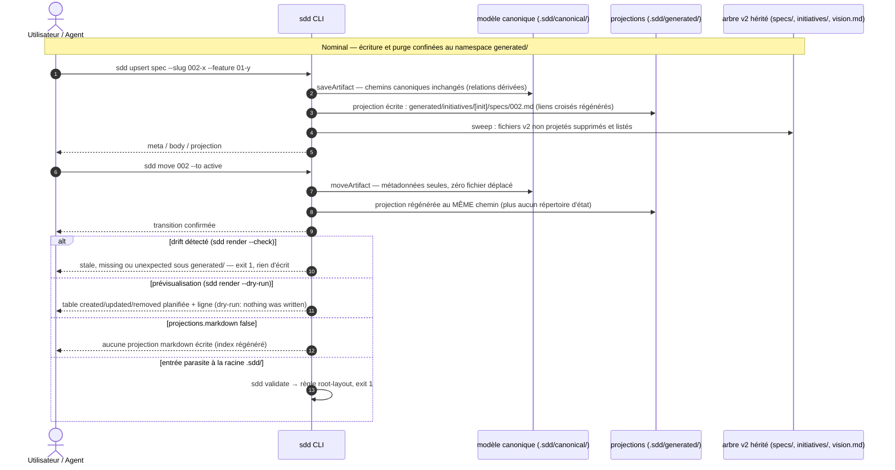

## 1. Intent & Context (*The Why*)

* **Problem Statement / Need:** les projections markdown sont éparpillées à la racine du workspace (`vision.md` isolée) et dans deux arbres parallèles au modèle, avec des répertoires d'état (`specs/<état>/`, `initiatives/<étatInit>/…`) : impossible de distinguer visuellement l'authored du généré — d'où la confusion récurrente « deux vision.md ». Le layout canonique v3 (feature `01`) a rendu l'état métadonné ; les projections interim v2 sont le dernier vestige des chemins encodant l'état.
* **User / System Impact:** cutover dur vers le namespace `generated/` : toutes les projections markdown vivent sous `.sdd/generated/` — l'authored (`canonical/`, `knowledge/`) et le généré deviennent visuellement disjoints, le double `vision.md` disparaît. `sdd render` purge toute projection non projetée (y compris l'ancien arbre v2 lors du cutover) et `render --check` ne couvre que `generated/`. La conversion du workspace courant de ce repo est une tâche one-shot de la phase 3 ; git sert de filet.
* **In Scope (What is added / modified):**
  * Namespace `generated/` : nouvelles cibles de projection — `generated/vision.md`, `generated/initiatives/<slug>/README.md`, `generated/initiatives/<slug>/features/<fslug>.md` (features aplaties au niveau initiative) et `generated/initiatives/<slug>/specs/<id>.md` (specs aplaties au niveau initiative, triées par id, nom de fichier = id seul) ; liens croisés régénérés depuis les chemins de projection.
  * Prune de `sdd render` reworkée : purge de `generated/` (orphelins) + sweep de l'arbre v2 (`.sdd/specs/`, `.sdd/initiatives/`, `.sdd/vision.md`) ; suppressions listées dans la sortie et prévisualisables via `--dry-run`.
  * `sdd render --check` : couverture restreinte à `generated/`, exit 1 sur tout drift (stale, missing, unexpected).
  * Option `projections.markdown` honorée : `false` = aucune projection markdown écrite ; le CLI tolère l'absence de l'option dans `config.json` (défaut : activé).
  * `sdd validate` : nouvelle règle `root-layout` — racine `.sdd/` exhaustive (`config.json`, `canonical/`, `generated/`, `knowledge/`), toute autre entrée est une violation.
  * Cutover one-shot du workspace courant + repointage des documents écrivains (`skills/`, `agents/`, `templates/`, `README.md`) vers les chemins de projection `generated/`.
* **Out of Scope (Strict Exclusions):**
  * La migration industrielle `sdd migrate`, le renommage `.sdd/` → `.sdd/`, le rework des scanners legacy (`src/core/artifact.js`, `src/migrate/**`) et le repointage des références aux chemins de MODÈLE — feature `03-sdd-migration`.
  * Le rendu HTML optionnel et l'entrée de racine `site/` — feature `04-static-site` (elle étendra `ALLOWED_ROOT_ENTRIES`).
  * Le format de `index.json` : version 3 inchangée, seul le champ `projection` est reciblé (prévu par tech.md §6 « conventions interim scellées »).
  * La grammaire `<ref>`, le graphe, le cycle de vie (`move`/`done`/`link`), le mirroring Linear : inchangés.

> *Clean Omission Note : Section 4.3 Infrastructure & Runtime : sans objet (aucune variable d'environnement, conteneur ou pipeline modifié — les gates CI appellent déjà `sdd validate` et `sdd render --check`).*

---

## 2. Flow & Architecture



**Note d'intention (feature) :** `generated/` n'est pas un miroir 1:1 de `canonical/` — le rendu optimise la lecture : specs aplaties au niveau initiative, triées par id, liens croisés générés. Le modèle encode le graphe ; le rendu optimise la lecture. Conséquence mécanique : le chemin d'une projection ne dépend plus d'aucun état — un `sdd move` régénère le contenu au même chemin et ne renomme plus aucun fichier de projection.

---

## 3. File Inventory & Responsibilities

### 3.1. Factorized File Tree

```text
src/
├── core/
│   ├── paths.js                                 [MOD] GENERATED_DIRNAME, generatedRoot(), ALLOWED_ROOT_ENTRIES (racine exhaustive)
│   └── config.js                                (inchangé — normalizeConfig tolère déjà l'absence de projections.markdown ; verrouillé par test)
├── model/
│   ├── layout.js                                [MOD] projectionRelativePath réécrite (generated/, aplatie, sans option initiativeState) ; stateDirOf supprimée
│   ├── index.js                                 (inchangé — le champ projection est reciblé par la valeur, pas par le format)
│   └── graph.js                                 (inchangé — children déjà triés par slug, donc par id)
├── render/
│   ├── projections.js                           [MOD] écriture sous generated/ ; prune = orphelins generated/ + sweep v2 ; option dryRun ; check « unexpected »
│   └── markdown.js                              [MOD] renderVisionRoadmap : linkTarget(artifact.projection, …) — fin du « vision.md » codé en dur ; liens croisés recalculés
└── cli/
    ├── context.js                               [MOD] refresh honore projections.markdown et transmet dryRun
    ├── help.js                                  [MOD] ligne render [--check] [--dry-run] + mention generated/
    └── commands/
        ├── render.js                            [MOD] --dry-run (suppressions prévisualisées) ; charge la config ; ligne (dry-run: nothing was written)
        └── validate.js                          [MOD] règle root-layout : racine .sdd/ exhaustive (dotfiles tolérés)
test/
├── generated-namespace.test.js                  [NEW] @unit U1–U4, @component C1–C6, @integration I1–I2 (scénarios §8.1)
├── model-schema.test.js                         [MOD] assertions projectionRelativePath → generated/ ; test stateDirOf retiré
├── canonical-layout.test.js                     [MOD] C1/C2/C9 : assertions de projections v2 → generated/
├── cli.test.js                                  [MOD] upsert/move/drift/cycle : chemins generated/, sweep v2, dry-run render
├── render.test.js                               [MOD] rendu + drift sur generated/ ; liens croisés aplatis
├── config.test.js                               [MOD] tolérance de l'absence de projections.markdown (INV-4)
├── model-store.test.js                          [MOD] findByRef : assertion de projection → generated/ (erratum de traçabilité, cf. spec 003 §3.1)
└── helpers.js                                   (inchangé — FIXTURES v2 réservées aux scanners gelés test/artifact.test.js, test/migrate.test.js)
docs (repointage des chemins de PROJECTION uniquement — chemins de MODÈLE : feature 03)
├── README.md                                    [MOD] schéma Model-First + note interim → generated/
├── templates/SPEC_TEMPLATE.md                   [MOD] note rule 7 : projection .sdd/generated/
├── templates/VISION_TEMPLATE.md                 [MOD] exemples de liens roadmap → generated/initiatives/
├── skills/spec,build-spec,test-spec,sync-behavior,   [MOD] ×10 SKILL.md : chemins de projection repointés
│   sync-contracts,sync-models,sync-tech,vision,
│   initiative,feature
└── agents/spec-writer,implementer,qa-tester,reviewer, [MOD] ×9 : chemins de projection repointés
    delivery-orchestrator,knowledge-orchestrator,
    product-orchestrator,product-challenger,product-designer
```

### 3.2. Key Contracts & Signatures

```js
// src/core/paths.js — constantes du namespace généré et racine exhaustive
export const GENERATED_DIRNAME = 'generated';
export const generatedRoot = (cwd) => path.join(cwd, SPECS_DIRNAME, GENERATED_DIRNAME);  // .sdd/generated/
/** Racine .sdd/ exhaustive (INV-1) — la feature 04-static-site y ajoutera 'site'. */
export const ALLOWED_ROOT_ENTRIES = ['config.json', CANONICAL_DIRNAME, GENERATED_DIRNAME, KNOWLEDGE_DIRNAME];
// STATE_DIRS / STATE_BY_DIR restent exportés : scanners legacy gelés (src/core/artifact.js, src/migrate/**).

// src/model/layout.js — fin des chemins d'état : la projection dérive des relations seul
projectionRelativePath(meta);          // signature SANS option { initiativeState } (supprimée)
//   vision     → generated/vision.md
//   initiative → generated/initiatives/[slug]/README.md
//   feature    → generated/initiatives/[initiative]/features/[slug].md       (aplatie au niveau initiative)
//   spec       → generated/initiatives/[initiative]/specs/[id].md            (nom de fichier = id, INV-5 du domaine)
// stateDirOf() supprimée (plus aucun appelant de production).

// src/render/projections.js — rendu, purge et prévisualisation
renderProjections(cwd, artifacts, { check = false, prune = true, dryRun = false } = {});
//   - écrit chaque artifact.projection sous .sdd/generated/ (dirs à la volée)
//   - prune : purge de generated/ (orphelins .md non projetés) + sweep v2
//     MANAGED = ['generated', 'specs', 'initiatives', 'vision.md']
//     (les 3 entrées v2 ne sont qu'un horizon de purge transitoire, retirable en feature 03)
//   - check : results enrichis de kind 'orphan' / status 'unexpected' — generated/ SEUL (INV-3)
//   - dryRun : calcule created/updated/removed (sweep v2 compris) sans rien écrire
//   → [{ slug, kind, status: 'created'|'updated'|'unchanged'|'removed'|'missing'|'stale'|'unexpected', path }]
// pruneEmptyDirectories(cwd, dir, baseDir) : s'arrête au sous-arbre managé parcouru — jamais au-dessus.

// src/render/markdown.js — liens croisés générés depuis les chemins de projection
renderVisionRoadmap : linkTarget(artifact.projection, entry.projection)   // plus de 'vision.md' codé en dur
linkTarget(fromRelative, toRelative)                                      // inchangée — les chemins sont auto-descriptifs
// GENERATED_SECTIONS inchangé (sections dérivées du graphe, stripping à l'import).

// src/cli/context.js — la configuration pilote la projection markdown
refresh(cwd, artifacts, { check = false, dryRun = false, config = null } = {});
//   config.projections?.markdown === false → aucune écriture de projection markdown (index régénéré sauf check)
//   config null → loadConfig(cwd) ; normalizeConfig est déjà tolérant à l'absence de l'option (défaut true, INV-4)

// src/cli/commands/render.js — dry-run, garde CI et option markdown
//   --check prioritaire (lecture seule, exit 1 si stale|missing|unexpected, ne couvre que generated/)
//   --dry-run : table des changements planifiés + '(dry-run: nothing was written)'
//   markdown off : info « projections désactivées », index régénéré, exit 0 en --check (0 projection vérifiée)

// src/cli/commands/validate.js — nouvelle règle de racine (INV-1)
{ artifact: '.sdd/', rule: 'root-layout', detail }   // entrée hors ALLOWED_ROOT_ENTRIES (dotfiles tolérés)
```

---

## 4. Detailed Specifications

### 4.1. Data Models & API Contracts

* **Métadonnées & graphe : inchangés** (schema v3, aucune migration de modèle). Seule la couche projection change de cible.
* **`canonical/index.json` (version 3)** : format inchangé ; champ `projection` reciblé vers `.sdd/generated/…` (reciblage explicitement scellé par tech.md §6 — pas de version 4). Entrée type après cutover :

```json
{
  "kind": "spec",
  "id": "002",
  "slug": "002-generated-projections",
  "title": "Namespace generated/ pour les projections",
  "state": "planned",
  "meta": ".sdd/canonical/initiatives/layout-v3/features/02-generated-namespace/specs/002.json",
  "body": ".sdd/canonical/initiatives/layout-v3/features/02-generated-namespace/specs/002.md",
  "projection": ".sdd/generated/initiatives/layout-v3/specs/002.md",
  "relations": { "feature": "02-generated-namespace", "initiative": "layout-v3" },
  "progress": { "done": false, "children": 0, "completedChildren": 0, "complete": false },
  "remote": {}
}
```

* **Arbre `generated/` livré** (exemple réel du repo) — `sdd init` ne le pré-alloue PAS (INV-3 du domaine) ; il naît au premier rendu :

```text
.sdd/
├── config.json
├── canonical/                            # inchangé — source de vérité, authored
│   └── …
├── generated/                            # 100% généré par le CLI — jamais édité
│   ├── vision.md                         # une seule vision (le double racine disparaît)
│   └── initiatives/layout-v3/
│       ├── README.md                     # roadmap features générée
│       ├── features/
│       │   ├── 01-canonical-tree.md      # feature aplatie, liste specs générée
│       │   └── 02-generated-namespace.md
│       └── specs/                        # aplaties au niveau initiative, triées par id
│           └── 002.md                    # nom de fichier = id seul (INV-5)
└── knowledge/                            # authored — hors périmètre du render (jamais lu ni purgé)
    └── …
```

* **Tri par id** : `graph.children` trie déjà par slug (préfixé par l'id) → les listes générées (`## 4.`, `## 6.`, `## 5.`) sont ordonnées par id ; l'aplatissement nomme les fichiers `<id>.md` → le listing du répertoire est trié par id. L'unicité des ids au niveau du modèle (règle `spec-id-uniqueness` existante) est la condition de l'aplatissement : deux specs partageant un id produiraient une collision silencieuse sous `generated/initiatives/<slug>/specs/` — le filet existe déjà.
* **Prune (mécanique)** : `pruneStaleProjections` collecte les `.md` sous l'horizon managé (`generated/` + sweep v2 `specs/`, `initiatives/`, `vision.md`), retranche l'ensemble attendu (`artifacts.map(a => a.projection)`) et supprime le reste. En `--check`, seuls les candidats sous `generated/` sont rapportés (`unexpected`) ; le sweep v2 n'est qu'un comportement d'écriture.

### 4.2. UI & Interaction Specifications (CLI)

| État | Déclencheur | Comportement système |
|---|---|---|
| **Rendu nominal** | `sdd render` | Écrit les projections attendues sous `generated/` (dirs à la volée), purge les orphelins de `generated/` et l'arbre v2 hérité ; table des changements (`created`/`updated`/`removed`). |
| **Prévisualisation** | `sdd render --dry-run` | Mêmes calculs, zéro écriture ; suppressions listées ; sortie terminée par `(dry-run: nothing was written)`. |
| **Garde CI** | `sdd render --check` | Lit `generated/` seul ; `stale`/`missing`/`unexpected` → exit 1, rien d'écrit ; exit 0 sinon. Un workspace v2 non converti échoue (projections `missing` sous `generated/`). |
| **Markdown désactivé** | `projections.markdown: false` | Aucune projection markdown écrite par aucune commande (index régénéré) ; `render --check` sort 0 vacuement ; l'absence de l'option dans `config.json` vaut défaut activé (INV-4). |
| **Écriture d'artefact** | `upsert` / `move` / `done` / `link` | `refresh()` régénère index + projections `generated/` (ou rien si markdown off) ; un `move` ne renomme plus aucune projection (chemins indépendants de l'état). |
| **Audit de racine** | `sdd validate` | Nouvelle règle `root-layout` : toute entrée de `.sdd/` hors `config.json`, `canonical/`, `generated/`, `knowledge/` → finding, exit 1 ; dotfiles (`.DS_Store`, `.gitkeep`) tolérés ; `knowledge/` absent toléré (règle existante). |
| **Bootstrap** | `sdd init` | Inchangé : `.sdd/` + `canonical/` + `config.json` — `generated/` n'est PAS pré-alloué (INV-3 du domaine). |
| **Erreur** | ref inconnue, drift, violation | `ResolutionError` / exit 1 ; `--check` et `validate` sont en lecture seule, aucun effet de bord. |

> *Section 4.3 Infrastructure, Configuration & Runtime : sans objet (aucune variable d'environnement, conteneur ou pipeline modifié).*

---

## 5. Business Invariants & Test Traceability

Chaque invariant de la feature `02-generated-namespace` (INV-1…INV-4) est couvert par au moins un scénario Gherkin en §8.1 :

* **INV-1 · Namespace `generated/` exclusif et racine exhaustive**
  Toute projection vit sous `generated/`, vision comprise (`generated/vision.md`) — la racine `.sdd/` ne contient que `config.json`, `canonical/`, `generated/`, `knowledge/` (l'entrée `site/` sera ajoutée par la feature `04-static-site` via `ALLOWED_ROOT_ENTRIES`). `sdd validate` traite toute autre entrée de racine comme une violation (règle `root-layout`, exit 1 ; dotfiles tolérés).
  ↳ *Covered by:* [`generated-namespace.test.js`](#appendix-file-index), [`cli.test.js`](#appendix-file-index)

* **INV-2 · `generated/` intégralement régénérable — purge listée et prévisualisable**
  `sdd render` purge tout fichier markdown de `generated/` non projeté par le modèle et balaie l'ancien arbre v2 (`.sdd/specs/`, `.sdd/initiatives/`, `.sdd/vision.md`) ; `knowledge/`, `canonical/` et `config.json` sont hors de portée du render. Toute suppression est listée dans la sortie et prévisualisable via `--dry-run` (aucune écriture).
  ↳ *Covered by:* [`generated-namespace.test.js`](#appendix-file-index), [`cli.test.js`](#appendix-file-index)

* **INV-3 · `render --check` échoue sur tout drift et ne couvre que `generated/`**
  `sdd render --check` sort 1 sur projection `stale`, `missing` ou fichier markdown inattendu sous `generated/` (`unexpected`) ; il n'écrit rien et n'inspecte jamais `knowledge/` ni les chemins v2 hérités.
  ↳ *Covered by:* [`generated-namespace.test.js`](#appendix-file-index), [`cli.test.js`](#appendix-file-index)

* **INV-4 · Option `projections.markdown` honorée et tolérée par défaut**
  `projections.markdown: false` coupe toute écriture de projection markdown (l'index reste régénéré) ; l'absence de la clé dans `config.json` vaut activé (`normalizeConfig`), un config.json sans clé `projections` est accepté tel quel.
  ↳ *Covered by:* [`config.test.js`](#appendix-file-index), [`generated-namespace.test.js`](#appendix-file-index)

---

## 6. Technical Watchouts & Anti-Patterns

* **Le sweep v2 est destructif — git est le filet :** le premier `sdd render` post-cutover supprime intégralement `.sdd/specs/`, `.sdd/initiatives/` et `.sdd/vision.md`. Toujours exécuter le cutover du workspace courant sur un commit propre, `--dry-run` d'abord, et vérifier `git status` avant de committer. La conversion one-shot est une tâche de la phase 3, jamais un effet de bord silencieux d'un test.
* **Le prune ne s'exécute que sur un modèle non vide :** `sdd render` sort tôt quand le modèle est vide (warn « model is empty ») — ce garde existant protège d'une purge catastrophique si `loadModel` ne trouve rien (canonical/ déplacé ou corrompu). Ne pas le contourner pour « forcer » un nettoyage.
* **Ne jamais remonter au-dessus de l'horizon managé :** `pruneEmptyDirectories` doit s'arrêter à la racine du sous-arbre parcouru (`generated/`, puis `specs/`, `initiatives/`) — un garde `directory === base` par appel. Un vidage trop zélé pourrait supprimer `generated/` elle-même ou remonter vers `.sdd/`.
* **Horizon de purge transitoire :** les entrées `specs`, `initiatives`, `vision.md` du `MANAGED` ne sont qu'un sweep de cutover — plus aucune projection attendue n'y vit après bascule. Elles seront retirées en feature 03 avec les scanners legacy ; ne pas « nettoyer » ce code avant sans rouvrir la feature.
* **`--check` reste aveugle au v2 volontairement :** `render --check` ne couvre que `generated/` (arbitrage scellé). Un workspace v2 non converti échoue quand même au `--check` car ses projections attendues sont `missing` sous `generated/` — le garde CI force donc la conversion. Ne pas ajouter les chemins v2 au périmètre de `--check`.
* **`linkTarget` doit rester alimenté par les chemins de projection :** le `vision.md` codé en dur de `renderVisionRoadmap` est précisément le bug corrigé ici ; tout nouveau lien généré passe par `linkTarget(artifact.projection, …)`. Ne jamais recoder un chemin relatif en dur (les chemins `generated/` sont auto-descriptifs).
* **Fichiers non markdown :** le prune ne collecte que les `.md` — un binaire parasite sous `generated/` n'est ni purgé ni signalé par `--check`. Périmètre assumé : le CLI est le seul écrivain et n'écrit que du markdown ; `validate` ne contrôle que la racine.
* **`generated/` permise mais non exigée :** la règle `root-layout` liste `generated` parmi les entrées permises sans l'exiger (workspace avec `projections.markdown: false` ou modèle vide reste valide). Ne pas transformer `generated/` en entrée obligatoire.
* **Références de MODÈLE dans les writers :** les skills/agents mentionnant des chemins de modèle v2 (`.sdd/model/…`, ex. `skills/build-spec/SKILL.md`) ne sont PAS repointés ici — seul le repointage des chemins de PROJECTION est dans le scope de 02 ; la passe complète des docs suit le renommage de la feature 03.
* **`sdd import` reste gelé :** sur un workspace v2 tiers, `import` + `render` convertit déjà (import → canonical, render → `generated/` + sweep v2), mais le flux n'est ni industrialisé ni documenté comme migration — c'est `sdd migrate` (feature 03). Ne pas améliorer les scanners legacy.
* **Pitfall mermaid :** aucun token `<...>` dans les textes de messages du diagramme (interprétés comme HTML par mermaid) — utiliser la notation `[...]`.

---

## 7. Sequential Execution Plan

- [x] **Phase 1: Fondations & contrats de chemins**
  - [x] `src/core/paths.js` : `GENERATED_DIRNAME`, `generatedRoot()`, `ALLOWED_ROOT_ENTRIES` (conserver `STATE_DIRS`/`STATE_BY_DIR` pour les scanners gelés).
  - [x] `src/model/layout.js` : `projectionRelativePath(meta)` réécrite (chemins `generated/`, features et specs aplaties au niveau initiative, signature sans `initiativeState`) ; suppression de `stateDirOf`.
  - [x] Tests @unit U1–U2 dans `test/generated-namespace.test.js` + tolérance config (U5) dans `test/config.test.js`.

- [x] **Phase 2: Cœur rendu & CLI**
  - [x] `src/render/projections.js` : écriture sous `generated/`, prune orphelins + sweep v2, option `dryRun`, statut `unexpected` en check.
  - [x] `src/render/markdown.js` : `renderVisionRoadmap` basé sur `artifact.projection` (liens croisés recalculés).
  - [x] `src/cli/context.js` (`refresh` + config), `src/cli/commands/render.js` (`--dry-run`, markdown off), `src/cli/commands/validate.js` (règle `root-layout`), `src/cli/help.js`.
  - [x] Tests @unit U3–U4 + @component C1–C6 dans `test/generated-namespace.test.js` ; adaptation `test/render.test.js`, `test/model-schema.test.js`, `test/canonical-layout.test.js`.

- [x] **Phase 3: Cutover one-shot, repointage, E2E & quality gates**
  - [x] Cutover du workspace courant (commit propre, `--dry-run` d'abord) : `sdd render` → vérifier `git status` (`generated/**` ajoutés, arbre v2 supprimé, `canonical/index.json` reciblé) ; supprimer les répertoires vides résiduels si besoin.
  - [x] Repointer les writers (chemins de PROJECTION uniquement) : `README.md`, `templates/SPEC_TEMPLATE.md`, `templates/VISION_TEMPLATE.md`, 10 `skills/*/SKILL.md`, 9 `agents/*.md`.
  - [x] Tests @integration I1–I2 + @e2e E1–E2 dans `test/generated-namespace.test.js` + `test/cli.test.js`.
  - [x] Exécuter 100 % des gates : `npm test` (suite verte), `node bin/sdd.js validate` exit 0, `node bin/sdd.js render --check` sans drift.

---

## 8. BDD Validation & Quality Gates

### 8.1. Exhaustive Gherkin Scenarios

```gherkin
Feature: Namespace generated/ — projections régénérées, purge v2 et garde de racine

  # ============================================================================
  # 1. Unit Tests (@unit) — test/generated-namespace.test.js + test/config.test.js
  # ============================================================================

  @unit
  Scenario: [U1][INV-1] Chemins de projection dérivés des relations seul sous generated/
    Given les métadonnées vision, initiative "demo", feature "01-login" et spec "042-login" (relations complètes)
    When projectionRelativePath(meta) est appelée pour chacune, sans aucune option
    Then vision → generated/vision.md et initiative → generated/initiatives/demo/README.md
    And feature → generated/initiatives/demo/features/01-login.md (aplatie au niveau initiative)
    And spec → generated/initiatives/demo/specs/042.md — aplatie au niveau initiative, nom de fichier = id seul, aucun segment d'état

  @unit
  Scenario: [U2][INV-1] generatedRoot et racine exhaustive, init inchangé
    Given un cwd temporaire
    When generatedRoot(cwd) et ALLOWED_ROOT_ENTRIES sont évalués
    Then generatedRoot vaut .sdd/generated/ et ALLOWED_ROOT_ENTRIES vaut exactement [config.json, canonical, generated, knowledge]
    And standardLayout(cwd) est inchangé — sdd init ne pré-alloue pas generated/

  @unit
  Scenario: [U3][INV-2] Le prune supprime une projection orpheline de generated/ et la liste
    Given un workspace seedé et rendu, avec un fichier parasite .sdd/generated/initiatives/notes.md
    When renderProjections est appelée en mode écriture
    Then le parasite est supprimé et les résultats contiennent kind "orphan", status "removed", path "generated/initiatives/notes.md"

  @unit
  Scenario: [U4][INV-1] Les liens croisés générés pointent l'arbre aplati en relatif
    Given une feature projetée à generated/initiatives/demo/features/01-login.md et sa spec à generated/initiatives/demo/specs/042.md
    When linkTarget(feature.projection, spec.projection) et linkTarget("generated/vision.md", initiative.projection) sont évaluées
    Then le premier lien vaut ../specs/042.md et le second ./initiatives/demo/README.md

  @unit
  Scenario: [U5][INV-4] loadConfig tolère l'absence de projections.markdown
    Given un config.json sans clé projections, puis un config.json avec projections.markdown false
    When loadConfig est appelée sur chaque config
    Then projections.markdown vaut true (défaut) dans le premier cas et false dans le second

  # ============================================================================
  # 2. Component Tests (@component) — test/generated-namespace.test.js
  # ============================================================================

  @component
  Scenario: [C1][INV-2] Le move garde le même chemin de projection (fin des renommages d'état)
    Given un workspace seedé (initiative → feature → spec 042 planned) et rendu sous generated/
    When sdd move 042 --to active
    Then la projection reste à generated/initiatives/demo/specs/042.md avec le contenu mis à jour
    And aucune projection n'est renommée ni supprimée et canonical/ est bit-à-bit inchangé

  @component
  Scenario: [C2][INV-2] Le render bascule un workspace v2 : generated/ écrit, arbre v2 purgé
    Given un workspace au layout v2 (specs/, initiatives/, vision.md présents) avec canonical/ à jour
    When sdd render
    Then les projections attendues sont écrites sous generated/ et toutes les projections v2 héritées sont supprimées et listées
    And canonical/, knowledge/ et config.json sont intacts, les répertoires vides vidés sont élagués

  @component
  Scenario: [C3][INV-2] render --dry-run prévisualise les suppressions sans rien écrire
    Given un workspace avec projections v2 héritées et generated/ absent
    When sdd render --dry-run
    Then la sortie liste les suppressions planifiées (sweep v2 compris) et se termine par (dry-run: nothing was written)
    And l'arborescence est bit-à-bit inchangée après l'exécution

  @component
  Scenario: [C4][INV-3] render --check échoue sur tout drift de generated/ et lui seul
    Given un workspace rendu avec une projection stale, une projection supprimée et un md parasite sous knowledge/
    When sdd render --check
    Then exit 1 avec stale et missing listés, et le parasite de knowledge/ est ignoré (hors périmètre)
    And un md parasite ajouté sous generated/ produit un finding kind "orphan" status "unexpected"

  @component
  Scenario: [C5][INV-1] validate applique la racine exhaustive avec tolérance des dotfiles
    Given un workspace conforme après render, plus une entrée parasite .sdd/docs/ et un dotfile .DS_Store
    When sdd validate
    Then une règle root-layout signale docs/ et sort 1, sans finding pour .DS_Store

  @component
  Scenario: [C6][INV-4] projections.markdown false coupe toute écriture de projection markdown
    Given un workspace avec config projections.markdown false
    When sdd upsert initiative, puis sdd render, puis sdd render --check
    Then aucun fichier markdown n'est écrit hors canonical/, l'index est régénéré, et --check sort 0 (zéro projection attendue)

  # ============================================================================
  # 3. Integration Tests (@integration) — test/generated-namespace.test.js
  # ============================================================================

  @integration
  Scenario: [I1][INV-1][INV-2] Cycle complet CLI : arbre généré exact et stable
    Given un workspace après sdd init
    When upsert initiative → feature → spec, puis move de chacun
    Then generated/ contient exactement vision.md, initiatives/demo/README.md, initiatives/demo/features/01-login.md et initiatives/demo/specs/042.md
    And chaque move régénère le contenu aux mêmes chemins — aucune création ni suppression de fichier de projection

  @integration
  Scenario: [I2][INV-1] validate vert sur la racine exhaustive, violation sinon
    Given un workspace après render (racine = config.json, canonical/, generated/, knowledge/)
    When sdd validate, puis création de .sdd/legacy/, puis re-validate
    Then exit 0 dans le premier cas, et règle root-layout avec exit 1 dans le second

  # ============================================================================
  # 4. End-to-End Tests (@e2e) — test/cli.test.js
  # ============================================================================

  @e2e
  Scenario: [E1][INV-1..INV-4] Cutover complet d'un workspace v2 vers generated/
    Given un workspace avec l'arbre v2 hérité (specs/, initiatives/, vision.md) et canonical/ à jour
    When sdd render, puis sdd render --check, puis sdd validate
    Then generated/ est peuplé, l'arbre v2 a disparu (git sert de filet), l'index liste projection en .sdd/generated/…
    And --check sort 0, validate sort 0, knowledge/ est intact et la racine est conforme

  @e2e
  Scenario: [E2][INV-2] Idempotence du render : re-render et dry-run sans effet de bord
    Given un workspace au terme du cutover précédent
    When sdd render, puis sdd render --dry-run, puis un second sdd render
    Then tous les statuts sont unchanged, l'arborescence est bit-à-bit identique après chaque exécution
    And la sortie du dry-run se termine par (dry-run: nothing was written)
```

### 8.2. Execution Commands & Quality Gates

```bash
# 1. Tests ciblés (namespace + rendu + config)
node --test test/generated-namespace.test.js test/render.test.js test/config.test.js

# 2. Suite complète (gate principal — aucun linter configuré dans ce repo)
npm test

# 3. Gates canoniques du framework (après cutover du workspace)
node bin/sdd.js validate
node bin/sdd.js render --check
```

---

<a id="appendix-file-index"></a>
## Appendix: File Index

| Short File Name | Project Relative Path |
|---|---|
| `paths.js` | `src/core/paths.js` |
| `config.js` | `src/core/config.js` |
| `layout.js` | `src/model/layout.js` |
| `index.js` | `src/model/index.js` |
| `graph.js` | `src/model/graph.js` |
| `projections.js` | `src/render/projections.js` |
| `markdown.js` | `src/render/markdown.js` |
| `context.js` | `src/cli/context.js` |
| `help.js` | `src/cli/help.js` |
| `render-cmd.js` | `src/cli/commands/render.js` |
| `validate.js` | `src/cli/commands/validate.js` |
| `generated-namespace.test.js` | `test/generated-namespace.test.js` |
| `model-schema.test.js` | `test/model-schema.test.js` |
| `canonical-layout.test.js` | `test/canonical-layout.test.js` |
| `cli.test.js` | `test/cli.test.js` |
| `render.test.js` | `test/render.test.js` |
| `config.test.js` | `test/config.test.js` |
| `helpers-test.js` | `test/helpers.js` |
| `README-repo.md` | `README.md` |
| `spec-template.md` | `templates/SPEC_TEMPLATE.md` |
| `vision-template.md` | `templates/VISION_TEMPLATE.md` |
| `spec-skill.md` | `skills/spec/SKILL.md` |
| `build-spec-skill.md` | `skills/build-spec/SKILL.md` |
| `test-spec-skill.md` | `skills/test-spec/SKILL.md` |
| `sync-behavior-skill.md` | `skills/sync-behavior/SKILL.md` |
| `sync-contracts-skill.md` | `skills/sync-contracts/SKILL.md` |
| `sync-models-skill.md` | `skills/sync-models/SKILL.md` |
| `sync-tech-skill.md` | `skills/sync-tech/SKILL.md` |
| `vision-skill.md` | `skills/vision/SKILL.md` |
| `initiative-skill.md` | `skills/initiative/SKILL.md` |
| `feature-skill.md` | `skills/feature/SKILL.md` |
| `spec-writer-agent.md` | `agents/spec-writer.md` |
| `implementer-agent.md` | `agents/implementer.md` |
| `qa-tester-agent.md` | `agents/qa-tester.md` |
| `reviewer-agent.md` | `agents/reviewer.md` |
| `delivery-orchestrator.md` | `agents/delivery-orchestrator.md` |
| `knowledge-orchestrator.md` | `agents/knowledge-orchestrator.md` |
| `product-orchestrator.md` | `agents/product-orchestrator.md` |
| `product-challenger.md` | `agents/product-challenger.md` |
| `product-designer.md` | `agents/product-designer.md` |
