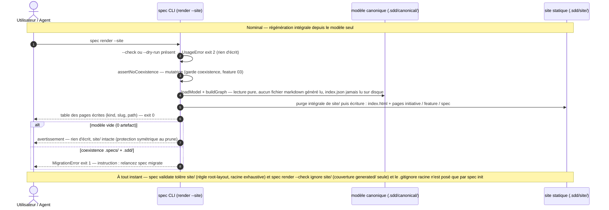

## 1. Intent & Context (*The Why*)

* **Problem Statement / Need:** le graphe du delivery (initiatives → features → specs, progression, badges d'état) n'est navigable qu'en ouvrant les fichiers un par un — `index.json` est lisible par une machine, pas par un humain. Dernière feature de l'initiative `layout-v3` (les features 01–03 délivrent 100 % de la valeur « layout », livraison déferrable) : un site statique de consultation offre une vue navigable du delivery sans jamais toucher aux artefacts.
* **User / System Impact:** `spec render --site` génère un site HTML de consultation dans `.sdd/site/` — artefact de **CONSOMMATION** : jamais source de vérité, jamais commité, jamais lu par le CLI. Le modèle reste la seule source de vérité ; la racine `.sdd/` devient exhaustive avec `site/` en entrée optionnelle (tolérée, jamais exigée, jamais pré-allouée). Le `.gitignore` racine est posé par le script de setup du workspace (`spec init`), jamais par le render.
* **In Scope (What is added / modified):**
  * Extension de la racine exhaustive : `SITE_DIRNAME`, `siteRoot()`, `ALLOWED_ROOT_ENTRIES` + `'site'` — `spec validate` tolère `.sdd/site/` (permise sans être exigée) ; toute autre entrée racine reste une violation `root-layout`.
  * `src/render/site.js` [NEW] : génération HTML zéro dépendance (template literals + builtins `node:`) — dashboard `index.html`, page par initiative (roadmap features avec checkboxes d'état), page par feature (ses specs), page par spec (corps markdown converti) ; navigation croisée + fil d'Ariane ; chrome en français.
  * Convertisseur markdown minimal couvrant les constructions des templates du framework (titres, fences dont Gherkin rendu en blocs, listes, tables, blockquotes, inline) — pas de parse markdown complet.
  * Branche `--site` de `spec render` : purge intégrale puis écriture de `.sdd/site/` (philosophie migrate, idempotent) ; n'écrit **que** dans `.sdd/site/` ; garde de coexistence (mutatrice) ; indépendante de `projections.markdown` ; `--check`/`--dry-run` mutuellement exclusifs avec `--site`.
  * `spec init` = script de setup du workspace : ajout idempotent de `.sdd/site/` au `.gitignore` racine s'il existe ET si l'entrée est absente — règle scellée : **init ajoute, render ne touche jamais**.
  * Tests : `test/static-site.test.js` [NEW] ; adaptations `test/generated-namespace.test.js` (liste racine à 5 entrées) et `test/cli.test.js` (e2e) ; `README.md`.
* **Out of Scope (Strict Exclusions):**
  * Hébergement et déploiement automatisés (GitHub Pages, CI), serveur local de prévisualisation, édition ou commentaire via le site (lecture seule).
  * L'écriture du `.gitignore` racine par toute commande autre que `spec init`, et sa création s'il est absent.
  * Page vision dédiée ; corps authored des initiatives/features sur leurs pages (les pages portent la vue graphe ; les corps restent dans `canonical/` et `generated/`) ; recherche, TOC interactif, syntax highlighting généralisé.
  * Toute modification du namespace `generated/` (horizon `MANAGED` inchangé — `site/` hors purge et hors `--check`), de `projections.markdown`, du format `index.json` (version 3), de la grammaire `<ref>`, de la migration et du mirroring.
  * Toute lecture de `.sdd/site/` par le CLI (aucune commande ne la consomme).

> *Clean Omission Note : Section 4.3 Infrastructure & Runtime : sans objet (aucune variable d'environnement, conteneur ou pipeline modifié — zéro dépendance npm par arbitrage ; le site est un artefact local non commité).*

---

## 2. Flow & Architecture



**Note d'intention :** le site est rendu depuis le modèle seul (`loadModel` + `buildGraph` in-process) — l'incohérence site/modèle est impossible par construction, et le site ne dépend ni des projections markdown ni de l'index sur disque. `--site` est un mode d'écriture autonome : il n'écrit ni `generated/`, ni l'index, ni le `.gitignore` (INV-3).

---

## 3. File Inventory & Responsibilities

### 3.1. Factorized File Tree

```text
src/
├── core/
│   ├── paths.js                                 [MOD] SITE_DIRNAME='site', siteRoot(), ALLOWED_ROOT_ENTRIES + 'site' (tolérée, jamais exigée)
│   └── config.js                                (inchangé — la config n'est jamais chargée dans la branche --site : site indépendante de projections.markdown)
├── render/
│   ├── site.js                                  [NEW] génération HTML zéro dépendance : buildSiteModel, renderBodyHtml, renderSite (purge + écriture)
│   ├── projections.js                           (inchangé — MANAGED=['generated'] : site/ hors purge et hors --check)
│   └── markdown.js                              (inchangé)
└── cli/
    ├── main.js                                  [MOD] flag --site enregistré (OPTIONS + transmission flags)
    ├── help.js                                  [MOD] ligne render + option --site (chaînes CLI anglaises, convention existante — le chrome français est celui du site)
    └── commands/
        ├── render.js                            [MOD] branche --site : conflit flags → UsageError, garde coexistence, modèle vide, purge+écriture, table, --json, exit 0
        └── init.js                              [MOD] script de setup : entrée .sdd/site/ idempotente au .gitignore racine (existe ET absent)
test/
├── static-site.test.js                          [NEW] @unit U1–U4, @component C1–C8, @integration I1–I2 (§8.1)
├── cli.test.js                                  [MOD] @e2e E1–E2 : parcours complet avec --site, inviolabilité du périmètre
├── generated-namespace.test.js                  [MOD] U2 : ALLOWED_ROOT_ENTRIES à 5 entrées (assertion deepEqual ; init-layout et root-layout C5/I2 inchangés)
└── helpers.js                                   (inchangé — makeWorkspace ne crée pas de .gitignore : les tests l'écrivent explicitement)
README.md                                        [MOD] section CLI : spec render --site + règle « init ajoute .sdd/site/ au .gitignore, render ne touche jamais » + arbre avec site/ optionnelle
```

### 3.2. Key Contracts & Signatures

```js
// src/core/paths.js — extension de la racine exhaustive (INV-3 feature)
export const SITE_DIRNAME = 'site';
export const siteRoot = (cwd) => path.join(cwd, SPECS_DIRNAME, SITE_DIRNAME);   // .sdd/site/
/** Racine .sdd/ exhaustive — `site` ajouté par la feature 04 : toléré, jamais exigé,
 *  jamais pré-alloué (le site/ naît au premier `render --site`). */
export const ALLOWED_ROOT_ENTRIES = ['config.json', CANONICAL_DIRNAME, GENERATED_DIRNAME, KNOWLEDGE_DIRNAME, SITE_DIRNAME];

// src/render/site.js — génération HTML zéro dépendance (builtins node: + template literals)
export function buildSiteModel(artifacts);
//   → { vision: { title } | null,
//       initiatives: [{ kind, id, slug, title, state, relations, dates, progress: { children, completed, complete }, features: [refs] }],
//       features:    [{ ..., specs: [refs] }],
//       specs:       [{ ..., fields, body }] }
//   Lecture pure : progression/complétude via buildGraph, dates via la métadonnée chargée — aucune I/O.
export function renderBodyHtml(body);
//   Convertisseur markdown minimal, ligne par ligne (§4.1) — échappement HTML systématique,
//   HTML inline des corps dégradé en texte, liens réduits à leur label.
export async function renderSite(cwd, artifacts);
//   1. purge intégrale : removeDir(siteRoot(cwd)) avec force — philosophie migrate, idempotent
//   2. écriture : site/index.html, site/initiatives/[slug].html, site/features/[slug].html, site/specs/[id].html
//   → [{ kind, slug, status: 'written', path }]   // paths relatifs à .sdd/ (ex. 'site/index.html'), symétrique de renderProjections

// src/cli/commands/render.js — branche --site (avant toute logique existante ; comportement sans --site strictement inchangé)
//   flags.site :
//     1. flags.check || flags.dryRun → UsageError exit 2, rien d'écrit (INV-4 : --check couvre generated/ seul ;
//        un artefact régénéré à la demande n'a rien à prévisualiser)
//     2. assertNoCoexistence(cwd) — mutatrice (arbitrage 9, garde scellé par la feature 03)
//     3. loadModel(cwd) — la config n'est JAMAIS chargée (arbitrage 8 : site indépendante de projections.markdown)
//     4. modèle vide → warn, rien d'écrit, exit 0 (site/ pré-existante intacte)
//     5. renderSite + table [kind, slug, path] ; --json → printJson({ site: true, results }) ; exit 0

// src/cli/commands/init.js — script de setup du workspace (arbitrage 1)
//   après le layout minimal : si <cwd>/.gitignore existe ET ne contient pas exactement la ligne `.sdd/site/`
//   → ajout idempotent de la ligne (fichier jamais créé, jamais réécrit autrement, jamais par le render)
//   → ligne info uniquement quand l'entrée est réellement ajoutée (sinon silence)
```

---

## 4. Detailed Specifications

### 4.1. Data Models & API Contracts

* **Modèle de données du site (`buildSiteModel`)** : le site consomme les mêmes données que `index.json` (shape : `kind`, `id`, `slug`, `title`, `state`, `relations`, `progress`) et les dérivations du graphe (`buildGraph`) — calculées in-process depuis `loadModel`. **Jamais** `index.json` lu sur disque, **jamais** un fichier markdown généré (arbitrage 6). Les dates (`createdAt`/`updatedAt`), absentes de l'index, viennent de la métadonnée chargée ; les corps de spec sont transportés pour la page spec.

* **Grammaire d'URL (pages, liens relatifs, aplaties à la racine de `site/`)** — les slugs sont immuables (PDR-001) et les ids de spec globalement uniques (INV-5 du domaine) → la bijection page↔artefact est stable entre deux rendus :

| Artefact | Page | Navigation entrante |
|---|---|---|
| (dashboard) | `site/index.html` | — |
| initiative | `site/initiatives/[slug].html` | dashboard, fil d'Ariane des pages feature et spec |
| feature | `site/features/[slug].html` | page initiative, fil d'Ariane de la page spec |
| spec | `site/specs/[id].html` | page feature, fil d'Ariane |

* **Arbre `site/` livré** (`spec init` ne le pré-alloue pas — il naît au premier `render --site` ; chaque appel le reconstruit intégralement) :

```text
.sdd/site/
├── index.html                          # dashboard : initiatives avec badges d'état, progression %, dates
├── initiatives/[slug].html             # en-tête (badge, progression, dates) + roadmap features (checkboxes d'état)
├── features/[slug].html                # en-tête + liste des specs liées (badge, done)
└── specs/[id].html                     # en-tête (badge, dates, fields) + corps markdown converti
```

* **Convertisseur markdown minimal (`renderBodyHtml`)** : ligne par ligne, zéro dépendance, couvrant exactement les constructions des templates du framework ; tout contenu est échappé HTML (`&`, `<`, `>`) **avant** toute substitution inline ; le HTML inline des corps est dégradé en texte (jamais interprété) :

| Construction | Rendu |
|---|---|
| `#` à `####` | `<h1>`–`<h4>` avec ancre slugifiée |
| Bloc fenced (langue libre) | `<pre class="code">` — contenu littéral échappé, jamais interprété (titres et pipes dans les fences = code) |
| Bloc fenced `gherkin` | `<pre class="code gherkin">` — style dédié + mots-clés (Feature, Scenario, Background, Rule, Examples, Given, When, Then, And, But) en gras |
| `- [x]` / `- [ ]` | item de liste avec glyphe ☑ / ☐ |
| Liste `- ` / `* `, sous-niveau indenté à 2 espaces (`↳ `, `- `) | `<ul>` imbriqués (2 niveaux max — horizon des templates) |
| `> ` | `<blockquote>` |
| Table pipe (ligne d'en-tête + ligne de séparation en tirets) | `<table>` avec `<thead>` et `<tbody>` |
| `**gras**`, `*italique*`, backtick-code | `<strong>`, `<em>`, `<code>` (après échappement) |
| Lien `[label](href)` | label seul — href ignoré : les href des corps sont des ancres/chemins de projections sans signification dans le site, la navigation du chrome prime |
| `---` seul sur une ligne | `<hr>` |
| Tout le reste | `<p>` — ligne vide = séparateur |

* **Chrome français (arbitrage 7)** : libellés fixes dans le module — `Sommaire`, `Initiative(s)`, `Feature(s)`, `Spec(s)`, `Progression`, `Planifié` / `Actif` / `Archivé` (badges pour planned/active/archived), `Créé`, `Mis à jour`, `Aucune feature cadrée`, `Aucune spec liée`. CSS : une seule constante du module, inlinée dans chaque page via `<style>` — aucune feuille externe, aucune dépendance (arbitrage 4). Navigation par liens relatifs de même profondeur (`initiatives/layout-v3.html` depuis le dashboard, `specs/004.html` depuis une page feature).

### 4.2. UI & Interaction Specifications (CLI)

```text
Dashboard — .sdd/site/index.html
+--------------------------------------------------------------------------+
| SDD — [titre de la vision]                    Sommaire > Tableau de bord |
+--------------------------------------------------------------------------+
| INITIATIVES                                                              |
| +----------------------------------------------------------------------+ |
| | [Actif] layout-v3 — Layout canonique v3                             | |
| | Progression [============    ] 75% (3/4 features)                    | |
| | 4 features · 12 specs · Créé 2026-08-30 · Mis à jour 2026-09-13      | |
| | → initiatives/layout-v3.html                                        | |
| +----------------------------------------------------------------------+ |
+--------------------------------------------------------------------------+

Page initiative — .sdd/site/initiatives/layout-v3.html
+--------------------------------------------------------------------------+
| Sommaire > Initiatives > layout-v3                        [Actif]  75%   |
| Initiative : Layout canonique v3                                         |
| Créé 2026-08-30 · Mis à jour 2026-09-13                                  |
+--------------------------------------------------------------------------+
| Roadmap features                                                         |
| [x] 01-canonical-tree      Layout canonique v3      [Archivé] → features/… |
| [x] 02-generated-namespace Projections generated/   [Archivé] → features/… |
| [x] 03-sdd-migration       Cutover racine .sdd/     [Archivé] → features/… |
| [ ] 04-static-site         Site statique            [Actif]   → features/… |
+--------------------------------------------------------------------------+

Page feature — .sdd/site/features/04-static-site.html
+--------------------------------------------------------------------------+
| Sommaire > Initiatives > layout-v3 > 04-static-site          [Actif]    |
| Feature : Site statique de consultation                                  |
+--------------------------------------------------------------------------+
| Specs liées                                                              |
| 004  Site statique de consultation      [Planifié] → specs/004.html      |
+--------------------------------------------------------------------------+

Page spec — .sdd/site/specs/004.html
+--------------------------------------------------------------------------+
| Sommaire > Initiatives > layout-v3 > 04-static-site > 004    [Planifié] |
| Spec 004 — Site statique de consultation                                 |
| Domain … · Change Type New Capability · Complexité Medium                |
| Créé 2026-09-13 · Mis à jour 2026-09-13                                  |
+--------------------------------------------------------------------------+
| [corps markdown converti : titres, listes, fences, tables, blockquotes,  |
|  blocs gherkin stylés — le reste dégradé en paragraphes échappés]        |
+--------------------------------------------------------------------------+
```

#### State / Interaction Matrix

| État | Déclencheur | Comportement système |
|---|---|---|
| **Rendu site** | `spec render --site` | Purge intégrale de `.sdd/site/` puis écriture des pages ; table `[kind, slug, path]` (ou `--json`) ; exit 0. |
| **Conflit de flags** | `spec render --site --check` / `--dry-run` | `UsageError` exit 2, rien d'écrit : le drift-check couvre `generated/` seul (INV-4) et un artefact régénéré à la demande n'a rien à prévisualiser. |
| **Modèle vide** | `spec render --site` (0 artefact) | Avertissement, exit 0, rien d'écrit — `site/` pré-existante intacte (protection symétrique au prune du render). |
| **Coexistence** | `spec render --site` avec `.specs/` + `.sdd/` | `MigrationError` exit 1 — « relancez `spec migrate` » ; rien d'écrit (garde mutatrice, arbitrage 9). |
| **Bootstrap (setup)** | `spec init` avec `.gitignore` racine sans l'entrée | Ajout idempotent de la ligne `.sdd/site/` ; ligne info. Le fichier n'est jamais créé s'il est absent. |
| **Bootstrap (idempotent)** | `spec init` re-exécuté, ou `.gitignore` absent | Aucune modification du `.gitignore`, pas de doublon. |
| **Audit de racine** | `spec validate` avec `.sdd/site/` présente | Aucun finding (`site` dans `ALLOWED_ROOT_ENTRIES`) ; toute autre entrée → `root-layout`, exit 1 (règle inchangée). |
| **Garde CI** | `spec render --check` | `site/` jamais inspectée — couverture `generated/` seul (INV-4) ; exit dicté par le drift `generated/` uniquement. |
| **Markdown désactivé** | `projections.markdown: false` | `render` (plain) n'écrit aucune projection ; `render --site` génère quand même le site (arbitrage 8 — la config n'est jamais chargée dans la branche `--site`). |

> *Section 4.3 Infrastructure, Configuration & Runtime : sans objet (aucune variable d'environnement, conteneur ou pipeline modifié — zéro dépendance npm par arbitrage ; le site est un artefact local non commité).*

---

## 5. Business Invariants & Test Traceability

Chaque invariant de la feature `04-static-site` (INV-1…INV-4) est couvert par au moins un scénario Gherkin en §8.1 :

* **INV-1 · Artefact de consommation — jamais source de vérité, jamais commité**
  Le site est dérivé du modèle seul et régénéré intégralement à chaque appel ; aucune commande du CLI ne lit `.sdd/site/` (`--check`, `validate`, `migrate` l'ignorent). L'entrée `.sdd/site/` du `.gitignore` racine est posée par le script de setup (`spec init`, idempotent, fichier jamais créé) — `render --site` ne touche jamais le `.gitignore` ni quoi que ce soit hors `.sdd/site/`.
  ↳ *Covered by:* [`static-site.test.js`](#appendix-file-index) (C1, C3, C5, C8), [`cli.test.js`](#appendix-file-index) (E1, E2)

* **INV-2 · Génération sans dépendance runtime externe**
  `src/render/site.js` n'importe que des builtins `node:` et produit l'HTML via template literals : aucune lib de templating, aucun CSS externe (styles inlinés depuis une constante unique du module), navigation par liens relatifs ; `package.json` inchangé.
  ↳ *Covered by:* [`static-site.test.js`](#appendix-file-index) (U1, U2)

* **INV-3 · `spec render --site` n'écrit que dans `.sdd/site/`**
  Aucune projection markdown, aucun index, aucun `.gitignore` : l'arborescence hors `.sdd/site/` est bit-à-bit inchangée après l'appel. La racine `.sdd/` tolère `site/` (`ALLOWED_ROOT_ENTRIES` étendue — permise sans être exigée, comme `generated/`) ; toute autre entrée reste une violation `root-layout`.
  ↳ *Covered by:* [`static-site.test.js`](#appendix-file-index) (C2, C4, C6), [`generated-namespace.test.js`](#appendix-file-index) (U2 adapté)

* **INV-4 · `spec render --check` couvre `generated/` seul — site régénéré à la demande**
  `--check` n'inspecte jamais `site/` (même falsifiée) et son exit ne dépend que du drift `generated/` ; `--site` et `--check`/`--dry-run` sont mutuellement exclusifs (`UsageError` exit 2).
  ↳ *Covered by:* [`static-site.test.js`](#appendix-file-index) (C6, I2), [`cli.test.js`](#appendix-file-index) (E1)

---

## 6. Technical Watchouts & Anti-Patterns

* **Échappement HTML systématique, avant tout le reste :** les corps contiennent des fences mermaid/HTML (chevrons, esperluettes) — tout contenu passe par `escapeHtml` AVANT toute substitution inline, et le convertisseur n'interprète JAMAIS le HTML inline des corps (dégradation assumée en texte). Sinon : site corrompu, injection de markup à l'affichage.
* **Fences = contenu littéral :** tout l'intérieur d'un bloc fenced est du code échappé — des titres, des pipes ou du gherkin qui y ressemblent ne sont JAMAIS interprétés (ni titres, ni tables, ni blocs). Ne pas « enrichir » le convertisseur au point de réinterpréter l'intérieur des fences.
* **Purge confinée à `siteRoot` :** la purge intégrale appelle `removeDir(siteRoot(cwd))` — jamais une purge « du répertoire parent » : `.sdd/` elle-même ne doit jamais pouvoir être la cible. La constante `SITE_DIRNAME` est la seule frontière (pas de garde `baseDirectory` ici : la purge est directe, comme la reconstruction de `spec migrate`).
* **`.gitignore` : jamais créé, jamais par le render :** `spec init` n'écrit l'entrée QUE si le fichier existe déjà (créer un `.gitignore` dans un workspace non-git serait un effet de bord hors périmètre) et l'idempotence matche la ligne exacte `.sdd/site/` (slash final) — pas un substring `site/` qui matcherait `my-site/`. Aucune autre commande ne touche ce fichier : poser l'entrée depuis `render --site` violerait INV-3.
* **Workspace migré sans init ré-exécuté :** `spec migrate` ne pose pas l'entrée `.gitignore` (hors de son périmètre) — un workspace migré dont le `.gitignore` n'a pas l'entrée verra son premier `site/` non ignoré. Remédiation documentée : relancer `spec init` (idempotent) ou ajouter la ligne à la main. Ne pas « réparer » en faisant poser l'entrée par le render.
* **Site hors `projections.markdown` :** la branche `--site` ne charge JAMAIS la config — brancher le site sur `projections.markdown` réintroduirait un couplage arbitré (arbitrage 8). Le site est généré même quand les projections markdown sont coupées.
* **Jamais d'index.json sur disque ni de lecture de `generated/` :** le site est rendu depuis `loadModel` + `buildGraph` in-process — lire l'index du disque ou parser les projections réintroduirait une source de drift (« incohérence impossible par construction », arbitrage 8).
* **Régénération intégrale, pas d'incrémental :** purge systématique puis écriture — ne pas optimiser en statuts `created`/`updated` ni en diff de répertoire : l'idempotence par reconstruction est l'arbitrage (philosophie migrate), et la purge garantit qu'aucun fichier parasite ne survit dans `site/`.
* **Slugs = noms de fichiers :** les slugs (immuables, PDR-001) et les ids de spec (uniques, INV-5 du domaine) servent de noms de page — ne jamais les transformer ni encoder (une transformation casserait la bijection page↔artefact et la stabilité des URLs entre deux rendus).
* **Liens de corps dégradés :** `[label](href)` est rendu comme son label — ne pas résoudre les href des corps vers le site (ancres internes, chemins de projections) : la navigation initiative↔feature↔spec est portée par le chrome généré.
* **Tests du `.gitignore` :** `makeWorkspace` ne crée pas de `.gitignore` — les tests l'écrivent explicitement (`writeFiles`) pour couvrir les trois cas (existe + absente → ajout ; existe + présente → inchangé ; absent → rien). Ne jamais dépendre de l'environnement hôte.
* **Pitfall mermaid :** aucun token `<...>` dans les textes de messages du diagramme (interprétés comme HTML) — notation `[...]`.

---

## 7. Sequential Execution Plan

- [x] **Phase 1: Fondations & contrats de chemins**
  - [x] `src/core/paths.js` : `SITE_DIRNAME`, `siteRoot()`, `ALLOWED_ROOT_ENTRIES` + `'site'` (docstring : tolérée, jamais exigée, jamais pré-allouée).
  - [x] `src/render/site.js` : `escapeHtml`, constante CSS unique, `buildSiteModel(artifacts)` (lecture pure), `renderBodyHtml(body)` (convertisseur minimal, gherkin inclus).
  - [x] Tests @unit U1–U4 dans `test/static-site.test.js` ; adaptation U2 de `test/generated-namespace.test.js` (5 entrées).

- [x] **Phase 2: Pages & CLI**
  - [x] `src/render/site.js` : `renderSite(cwd, artifacts)` — purge + écriture (chrome, dashboard, pages initiative/feature/spec, fil d'Ariane, liens croisés relatifs, états vides français).
  - [x] `src/cli/commands/render.js` : branche `--site` (UsageError conflit, garde coexistence, modèle vide, table, `--json`, exit 0) ; `src/cli/main.js` (flag) ; `src/cli/help.js`.
  - [x] `src/cli/commands/init.js` : entrée `.gitignore` idempotente (existe ET absent).
  - [x] Tests @component C1–C8 + @integration I1–I2 dans `test/static-site.test.js`.

- [x] **Phase 3: E2E, documentation & quality gates**
  - [x] Tests @e2e E1–E2 dans `test/cli.test.js`.
  - [x] `README.md` : section CLI (`spec render --site`) + règle « init ajoute `.sdd/site/` au `.gitignore`, render ne touche jamais » + arbre `.sdd/` avec `site/` en entrée optionnelle.
  - [x] Exécuter 100 % des gates : `npm test` (suite verte), `node bin/spec.js validate` exit 0, `node bin/spec.js render --check` sans drift.

---

## 8. BDD Validation & Quality Gates

### 8.1. Exhaustive Gherkin Scenarios

```gherkin
Feature: Site statique de consultation — artefact de consommation régénéré à la demande

  # ============================================================================
  # 1. Unit Tests (@unit) — test/static-site.test.js
  # ============================================================================

  @unit
  Scenario: [U1][INV-2] Le module site est zéro dépendance
    Given le fichier src/render/site.js et le package.json du repo
    When les imports du module sont inspectés et package.json est lu
    Then chaque import provient exclusivement des builtins node: et package.json ne déclare aucune dépendance runtime

  @unit
  Scenario: [U2][INV-2] Le convertisseur minimal couvre les constructions des templates
    Given un corps avec titres # à ####, fences dont un gherkin, listes à 2 niveaux avec checkboxes, une table pipe, un blockquote, du inline gras/code et un lien
    When renderBodyHtml est appelé sur ce corps
    Then titres, listes imbriquées, table, blockquote et styles inline sont rendus, et le bloc gherkin est stylé avec ses mots-clés en gras
    And le lien est réduit à son label et tout contenu HTML inline est échappé en texte — jamais interprété

  @unit
  Scenario: [U3][INV-1] buildSiteModel dérive la progression du graphe sans aucune I/O
    Given une chaîne initiative → feature → 2 specs dont une avec progress.done
    When buildSiteModel(artifacts) est appelée
    Then la progression de la feature vaut 50% (1/2 specs complètes) et la complétude de l'initiative reflète le graphe
    And les dates createdAt/updatedAt de chaque entrée proviennent de la métadonnée — aucun fichier lu

  @unit
  Scenario: [U4][INV-1] La grammaire d'URL est relative et fermée sur l'arbre site/
    Given le site model d'un workspace avec initiative, feature et spec
    When les pages sont générées et tous les liens croisés sont extraits (dashboard, roadmaps, specs, fil d'Ariane)
    Then chaque cible est un chemin relatif résolvant vers une page de site/ (index.html, initiatives/[slug].html, features/[slug].html, specs/[id].html)

  # ============================================================================
  # 2. Component Tests (@component) — test/static-site.test.js
  # ============================================================================

  @component
  Scenario: [C1][INV-1] render --site produit l'arbre site/ exact avec le contenu du modèle
    Given un workspace seedé (vision, initiative active, features et specs d'états mixtes)
    When spec render --site
    Then site/ contient exactement index.html et les pages initiatives/features/specs attendues
    And le dashboard affiche badges d'état, progression % et dates, et la roadmap de l'initiative porte les checkboxes d'état
    And exit 0

  @component
  Scenario: [C2][INV-3] Frontière d'écriture : rien hors .sdd/site/ n'est touché
    Given un workspace seedé et rendu (generated/ à jour, index.json présent) avec un .gitignore racine
    When spec render --site
    Then le snapshot bit-à-bit de .sdd/ hors site/ (canonical, generated, config.json) et du .gitignore est identique avant et après

  @component
  Scenario: [C3][INV-1] Régénération intégrale idempotente
    Given un workspace avec un site généré et un fichier parasite .sdd/site/x.html
    When spec render --site deux fois de suite
    Then le parasite disparaît au premier appel (purge intégrale) et le second appel reconstruit un arbre identique

  @component
  Scenario: [C4][INV-3] validate tolère site/ et refuse toute autre entrée
    Given un workspace conforme avec .sdd/site/ générée, puis une entrée parasite .sdd/autre/
    When spec validate
    Then aucun finding root-layout avec site/ présente
    And avec l'entrée parasite : un finding « unexpected root entry » et exit 1

  @component
  Scenario: [C5][arbitrage 1] init pose l'entrée .gitignore idempotemment
    Given quatre workspaces : .gitignore sans l'entrée, .gitignore contenant déjà .sdd/site/, .gitignore absent, et un re-init du premier
    When spec init sur chacun
    Then l'entrée est ajoutée exactement une fois (pas de doublon au re-init), un .gitignore déjà conforme est inchangé
    And aucun .gitignore n'est créé quand il est absent

  @component
  Scenario: [C6][INV-4] --check ignore site/ et refuse le conflit de flags
    Given un workspace avec generated/ à jour et une site/ falsifiée
    When spec render --check
    Then exit 0 — aucun finding ne mentionne site/ (couverture generated/ seul)
    And spec render --site --check sort exit 2 UsageError sans rien écrire

  @component
  Scenario: [C7][arbitrage 9] Garde de coexistence sur --site
    Given un workspace en coexistence .specs/ + .sdd/
    When spec render --site
    Then MigrationError exit 1 avec l'instruction de relancer spec migrate et site/ n'est pas créée

  @component
  Scenario: [C8][INV-1] Modèle vide : avertissement, rien d'écrit
    Given un workspace initialisé sans artefact et une site/ pré-existante
    When spec render --site
    Then un avertissement est émis, exit 0, aucune écriture et site/ reste intacte

  # ============================================================================
  # 3. Integration Tests (@integration) — test/static-site.test.js
  # ============================================================================

  @integration
  Scenario: [I1][INV-1][INV-3] Cycle complet : setup gitignore par init, site générée, racine conforme
    Given un workspace avec un .gitignore racine
    When spec init, upsert vision → initiative → feature → spec, puis spec render --site
    Then le .gitignore contient exactement une fois la ligne .sdd/site/
    And site/ est complète, spec validate sort 0 avec site/ présente et spec render --check sort 0 (site ignorée)

  @integration
  Scenario: [I2][arbitrage 8] Le site est indépendant de projections.markdown
    Given un workspace avec config projections.markdown false
    When spec render (plain), puis spec render --site
    Then aucune projection markdown n'est écrite (generated/ absent) mais le site est généré intégralement
    And spec render --check sort 0 vacuement et le modèle reste la seule source du site

  # ============================================================================
  # 4. End-to-End Tests (@e2e) — test/cli.test.js
  # ============================================================================

  @e2e
  Scenario: [E1][INV-1..INV-4] Parcours complet depuis un workspace vierge
    Given un workspace vide avec le CLI construit
    When spec init, upsert de la chaîne avec états mixtes, spec move, spec render --site, spec validate, spec render --check
    Then site/ est complète et navigable (dashboard → initiative → feature → spec, fil d'Ariane cohérent)
    And validate sort 0 avec site/ présente, render --check sort 0 sans jamais mentionner site/, le .gitignore porte l'entrée exactement une fois

  @e2e
  Scenario: [E2][INV-3] Inviolabilité du périmètre et idempotence
    Given un workspace au terme du parcours précédent
    When spec render --site puis un second spec render --site
    Then le snapshot de tout le workspace hors .sdd/site/ est bit-à-bit identique après chaque exécution et l'arbre site/ est inchangé au second appel
```

### 8.2. Execution Commands & Quality Gates

```bash
# 1. Tests ciblés (site + racine exhaustive + CLI)
node --test test/static-site.test.js test/generated-namespace.test.js test/cli.test.js

# 2. Suite complète (gate principal — aucun linter configuré dans ce repo)
npm test

# 3. Gates canoniques du framework
node bin/spec.js validate
node bin/spec.js render --check
```

---

<a id="appendix-file-index"></a>
## Appendix: File Index

| Short File Name | Project Relative Path |
|---|---|
| `paths.js` | `src/core/paths.js` |
| `site.js` | `src/render/site.js` |
| `projections.js` | `src/render/projections.js` |
| `main.js` | `src/cli/main.js` |
| `help.js` | `src/cli/help.js` |
| `render-cmd.js` | `src/cli/commands/render.js` |
| `init.js` | `src/cli/commands/init.js` |
| `static-site.test.js` | `test/static-site.test.js` |
| `generated-namespace.test.js` | `test/generated-namespace.test.js` |
| `cli.test.js` | `test/cli.test.js` |
| `README-repo.md` | `README.md` |
