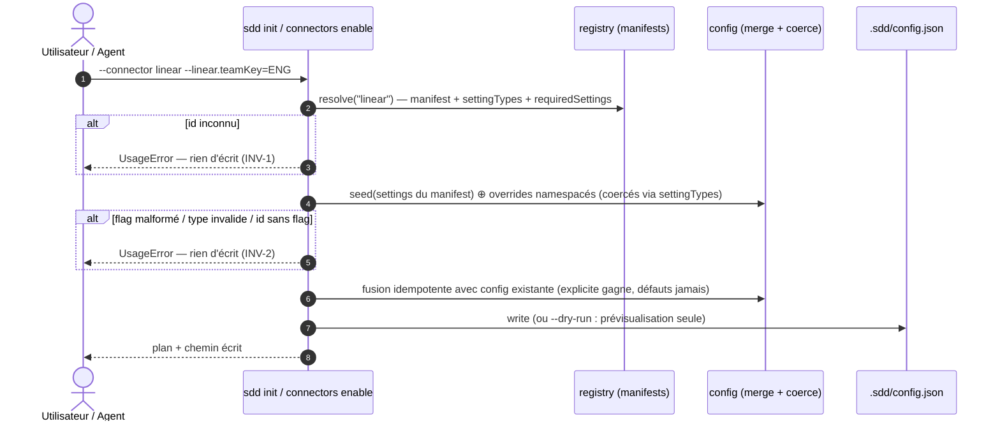

## 1. Intent & Context (*The Why*)

* **Problem Statement / Need:** Amorcer un workspace avec un miroir distant exige aujourd'hui de connaître la forme exacte de `.sdd/config.json` : `sdd connectors enable linear` active le connecteur mais les settings (`teamKey`, `labels`, `stateMap`, `createOnMove`) ne se renseignent qu'à la main. `sdd init` ignore totalement les connecteurs.
* **User / System Impact:** `sdd init` devient l'unique point d'entrée déclaratif : connecteurs déclarés par flags, settings seedés depuis les manifests, overrides namespacés, interview TTY optionnelle. La config reste validable structurellement par `sdd validate`.
* **In Scope (What is added / modified):**
  * Contrat de manifest étendu : `settingTypes` (string|boolean|number) + `requiredSettings` — déclarés **par connecteur** dans `extension.json`.
  * `sdd init --connector <id>… --<id>.<key>[.<subkey>]=<value>… [--interactive]` — seeding manifest + merge profond, re-init idempotent.
  * `sdd connectors enable|disable <id>` accepte les mêmes settings (namespacés ou rattachés au `<id>` positionnel).
  * Module interactif `src/cli/interactive.js` (TTY, prompter injectable, `@clack/prompts` en dép dynamique).
  * Règle `validate` `connector-settings` : connecteur activé ⇒ `requiredSettings` du manifest présentes et typées.
* **Out of Scope (Strict Exclusions):**
  * Connecteur GitHub, toute validation réseau/MCP (feature `02-setup-skill`), migration de config legacy (déjà normalisée v3).

> *Clean Omission Note : Section 4.3 Infrastructure & Runtime : limitée à l'ajout de la dépendance `@clack/prompts` (import dynamique, chemin `--interactive` uniquement) — le claim « zero-dependency » du README est retiré.*

---

## 2. Flow & Architecture



---

## 3. File Inventory & Responsibilities

### 3.1. Factorized File Tree

```text
src/
├── cli/
│   ├── main.js                       [MOD] collecte des flags dotted (values['linear.teamKey']) → flags.settings
│   ├── interactive.js                [NEW] interview TTY (@clack/prompts, import dynamique) ; prompter injectable pour tests
│   └── commands/
│       ├── init.js                   [MOD] --connector/--interactive/--dry-run ; merge idempotent si .sdd/ existe
│       ├── connectors.js             [MOD] enable/disable acceptent les settings namespacés/locaux
│       └── validate.js               [MOD] règle connector-settings (requiredSettings + types)
├── connectors/
│   └── registry.js                   [MOD] contrat manifest : settingTypes, requiredSettings, coerceSetting()
├── core/
│   └── config.js                     [MOD] mergeSettingOverrides (profond, typé), cohérence connecteurs
extensions/
├── linear/extension.json             [MOD] settingTypes + requiredSettings:["teamKey"]
└── _TEMPLATE/extension.json          [MOD] contrat documenté
test/
├── declarative-init.test.js          [NEW] @unit/@component/@integration : parsing, coercion, merge, validate
├── cli.test.js                       [MOD] e2e init déclaratif + --interactive non-TTY
├── registry.test.js                  [MOD] contrat manifest étendu
└── config.test.js                    [MOD] merge profond typé
package.json / README.md              [MOD] dep @clack/prompts, section CLI mise à jour
```

### 3.2. Key Contracts & Signatures

```js
// extensions/<id>/extension.json — contrat étendu (additif, rétrocompatible)
{
  "settings": { "teamKey": "", "createOnMove": false, "labels": { "spec": "spec" } },  // défauts (inchangé)
  "settingTypes": { "teamKey": "string", "createOnMove": "boolean", "labels": "object" },
  "requiredSettings": ["teamKey"]                       // vérifiées par validate si enabled
}

// src/connectors/registry.js
export function coerceSetting(id, key, raw, type);      // → valeur typée | UsageError (INV-2)
export function manifestFor(cwd, id);                   // manifest résolu (builtin + extensions/)

// src/core/config.js
export function mergeSettingOverrides(base, overrides); // merge profond {teamKey} ⊕ {labels:{spec}} (INV-2)
export function mergeConnectorConfigs(existing, incoming); // idempotent : valeur explicite > défaut manifest (INV-3)

// src/cli/main.js — flags dotted collectés tels quels
flags.settings  // { 'linear.teamKey': 'ENG', 'linear.labels.spec': 'SPEC' }

// src/cli/interactive.js
export async function runInteractive({ catalog, prompter }); // → { connectors: [{id, settings}] } | UsageError si non-TTY (INV-4)
```

---

## 4. Detailed Specifications

### 4.1. Data Models & API Contracts

* **`.sdd/config.json`** : structure inchangée (`connectors[]`), les settings gagnent en garantie de type via coercion manifest. Aucun bump de version.
* **Flags settings** : grammaire `--<id>.<key>[.<subkey>]=<value>` (profondeur ≤ 2). Sur `connectors enable <id>`, les clés non-namespacées (`--teamKey=ENG`) sont rattachées au `<id>` positionnel ; un namespace ≠ `<id>` → `UsageError`.
* **Coercion** : `boolean` accepte `true|false` ; `number` exige numérique ; `object` attend des feuilles via subkeys. Échec → `UsageError` citant `id.key`.
* **Merge idempotent** : config existante ⊕ déclaration — les valeurs explicites (flags ou interview) gagnent ; les défauts du manifest ne ré-écrasent jamais une valeur utilisateur ; un connecteur jamais déclaré est ajouté, jamais retiré.

### 4.2. UI & Interaction Specifications (CLI)

| État | Déclencheur | Comportement système |
|---|---|---|
| **Init local** | `sdd init` (sans flag) | Comportement actuel préservé : `.sdd/` + `canonical/` + config sans connecteur. Silencieux, CI-safe. |
| **Init déclaratif** | `sdd init --connector linear --linear.teamKey=ENG` | Résout le manifest, seed + merge, écrit, affiche le plan (`settings: teamKey=ENG, labels=<défauts>`). |
| **Interview** | `sdd init --interactive` (TTY) | Multi-select connecteurs (exclut `local`, intrinsèque), puis prompt type-aware par feuille de settings (défauts pré-remplis). |
| **Interview hors TTY** | `sdd init --interactive` (CI) | `UsageError` invitant aux flags — aucun prompt (INV-4). |
| **Dry-run** | `+ --dry-run` | Affiche la config résolue (JSON), n'écrit rien. |
| **Adoption tardive** | `sdd connectors enable linear --teamKey=ENG` | Même mécanique de merge, connecteur activé. |
| **Erreur** | id inconnu, flag malformé, type invalide | `UsageError`, exit 2, rien d'écrit. |

---

## 5. Business Invariants & Test Traceability

* **INV-1 · Manifest-driven, rejet avant écriture**
  Le CLI ne contient aucune connaissance spécifique à un connecteur ; un `--connector <id>` absent du catalogue (builtin + `extensions/*/extension.json`) → `UsageError`, zéro octet écrit.
  ↳ *Covered by:* [`declarative-init.test.js`](#appendix-file-index), [`registry.test.js`](#appendix-file-index)

* **INV-2 · Settings namespacés, merge profond typé**
  `--linear.labels.spec=SPEC` merge dans `settings.labels` ; namespace inconnu, clé malformée ou valeur non coercible → `UsageError` ; les types viennent du `settingTypes` du manifest.
  ↳ *Covered by:* [`declarative-init.test.js`](#appendix-file-index), [`config.test.js`](#appendix-file-index)

* **INV-3 · Re-init idempotent, `local` intrinsèque**
  Re-exécuter `sdd init` fusionne sans dupliquer ni effacer ; les défauts du manifest ne ré-écrasent jamais une valeur utilisateur ; `local` n'apparaît jamais dans `connectors[]`.
  ↳ *Covered by:* [`cli.test.js`](#appendix-file-index), [`declarative-init.test.js`](#appendix-file-index)

* **INV-4 · Interactif explicite et CI-safe**
  Les prompts ne surviennent que si `--interactive` ET `process.stdout.isTTY` ; sinon `UsageError` clair. Sans `--interactive`, aucun prompt jamais.
  ↳ *Covered by:* [`cli.test.js`](#appendix-file-index) (prompter injectable pour la variante TTY)

* **INV-5 · Validation structurelle**
  `sdd validate` émet `connector-settings` (exit 1) si un connecteur activé manque d'une `requiredSettings` du manifest ou porte un type invalide ; `enable`/`init` partagent la même mécanique de merge.
  ↳ *Covered by:* [`declarative-init.test.js`](#appendix-file-index)

---

## 6. Technical Watchouts & Anti-Patterns

* **parseArgs et flags dotted :** avec `strict: false`, `node:util` expose `values['linear.teamKey']` — ne pas tenter de les déclarer dans `OPTIONS` ; les collecter en rejetant tout flag dotted qui ne débute pas par un `<id>` connu (sinon faute silencieuse).
* **Coercion booléenne stricte :** refuser `1/0/yes/no` — `createOnMove=1` doit échouer (sinon divergence config/manifest et surprises au sync).
* **Merge ne doit pas muter :** les helpers de `config.js` retournent de nouveaux objets — une mutation en place corromprait `defaultConfig()` partagé entre tests.
* **`@clack/prompts` en import dynamique :** un import statique alourdirait chaque invocation CLI et casserait les tests non-TTY ; le chemin interactif charge la dép à la demande et échoue proprement si absente.
* **Interactive testable :** `runInteractive` reçoit un `prompter` injectable — ne jamais importer clack au niveau module (sinon les tests unitaires déclenchent des lectures stdin).
* **Manifest rétrocompatible :** `settingTypes`/`requiredSettings` absents ⇒ tout est `string` optionnel (anciens manifests tiers continuent de fonctionner) — ne pas rendre le contrat cassant.
* **Ordre d'écriture :** `connectors[]` trié par id après merge — sinon le diff de config.json devient bruité et `render --check`-adjacent (lecteurs externes) instable.

---

## 7. Sequential Execution Plan

- [x] **Phase 1: Contrat manifest & coercion**
  - [x] `src/connectors/registry.js` : `manifestFor`, `coerceSetting`, lecture `settingTypes`/`requiredSettings` (défauts rétrocompatibles).
  - [x] `extensions/linear/extension.json` + `_TEMPLATE` : types + requis.
  - [x] Tests `registry.test.js` (@unit).

- [x] **Phase 2: Parsing flags & merge config**
  - [x] `src/cli/main.js` : collecte `flags.settings` (dotted), rejet des namespaces inconnus.
  - [x] `src/core/config.js` : `mergeSettingOverrides` (profond, typé), `mergeConnectorConfigs` (idempotent).
  - [x] `src/cli/commands/init.js` : `--connector`/`--dry-run`, merge sur workspace existant ; `connectors.js` : settings sur enable/disable.
  - [x] Tests `declarative-init.test.js` + `config.test.js` (@unit/@component).

- [x] **Phase 3: Interactif & validation**
  - [x] `src/cli/interactive.js` : prompter injectable + implémentation clack (import dynamique), gate TTY.
  - [x] `src/cli/commands/validate.js` : règle `connector-settings`.
  - [x] Tests interactifs (prompter factice) + validate (@component).

- [x] **Phase 4: E2E, docs & gates**
  - [x] `test/cli.test.js` : parcours déclaratif complet, re-init idempotent, `--interactive` non-TTY, dry-run.
  - [x] `package.json` (dep), `README.md` (section CLI, retrait du claim zero-dep).
  - [x] Exécuter 100 % des gates : `npm test`, `sdd validate` exit 0, `sdd render --check` sans drift.

---

## 8. BDD Validation & Quality Gates

### 8.1. Exhaustive Gherkin Scenarios

```gherkin
Feature: Init déclaratif multi-connecteurs

  @unit
  Scenario: [INV-2] Merge profond des overrides namespacés
    Given les settings manifest { teamKey: "", labels: { spec: "spec" } }
    When mergeSettingOverrides(base, { teamKey: "ENG", "labels.spec": "SPEC" })
    Then settings vaut { teamKey: "ENG", labels: { spec: "SPEC" } } — les autres défauts intacts

  @unit
  Scenario: [INV-2] Coercion typée et rejet
    When coerceSetting("linear", "createOnMove", "true", "boolean") et coerceSetting("linear", "teamKey", "42", "number")
    Then true (booléen) et 42 (nombre) ; coerceSetting("linear", "createOnMove", "1", "boolean") lève UsageError citant "linear.createOnMove"

  @unit
  Scenario: [INV-1] manifestFor résout builtin et extensions, rejette l'inconnu
    Given le catalogue { linear: builtin, custom: extensions/custom/ }
    When manifestFor("ghost")
    Then UsageError — le catalogue ne connaît que linear et custom

  @component
  Scenario: [INV-1][INV-2] init déclaratif nominal et erreurs
    Given un workspace sans .sdd/
    When `sdd init --connector linear --linear.teamKey=ENG --linear.labels.spec=SPEC`
    Then config.json porte linear activé avec teamKey "ENG", labels.spec "SPEC", stateMap aux défauts du manifest
    When `sdd init --connector ghost` puis `--linear.teamKey` (sans valeur) puis `--ghost.teamKey=X`
    Then trois UsageError, exit 2, et le workspace inchangé dans les trois cas

  @component
  Scenario: [INV-3] re-init idempotent
    Given un workspace où linear.teamKey=ENG (explicitement posé)
    When un second `sdd init --connector linear` (aucun override)
    Then teamKey reste "ENG" (le défaut manifest n'a pas ré-écrasé), un seul connecteur linear, connecteurs triés

  @component
  Scenario: [INV-5] validate refuse un connecteur activé incomplet
    Given un config.json manuel où linear est enabled sans teamKey
    When `sdd validate`
    Then un finding connector-settings cite requiredSettings ["teamKey"], exit 1

  @integration
  Scenario: [INV-5] adoption tardive via connectors enable
    Given un workspace local-only
    When `sdd connectors enable linear --teamKey=ENG --createOnMove=true`
    Then linear est enabled avec teamKey "ENG" (booléen createOnMove true), settings locaux du connecteur fusionnés

  @integration
  Scenario: [INV-4] --interactive sans TTY
    Given un process sans TTY (stdout pipe)
    When `sdd init --interactive`
    Then UsageError invitant aux flags, aucun prompt, rien d'écrit

  @e2e
  Scenario: [INV-1..INV-5] parcours complet dry-run → init → validate
    Given un workspace vierge
    When `sdd init --connector linear --linear.teamKey=ENG --dry-run` (aperçu JSON, rien d'écrit), puis sans --dry-run, puis re-init avec override, puis `sdd validate` et `sdd render --check`
    Then le dry-run n'a rien écrit, la config finale est typée et triée, validate exit 0, projections sans drift
```

### 8.2. Execution Commands & Quality Gates

```bash
# 1. Tests ciblés
node --test test/declarative-init.test.js test/registry.test.js test/config.test.js

# 2. Suite complète
npm test

# 3. Gates canoniques
node bin/sdd.js validate
node bin/sdd.js render --check
```

---

<a id="appendix-file-index"></a>
## Appendix: File Index

| Short File Name | Project Relative Path |
|---|---|
| `main.js` | `src/cli/main.js` |
| `interactive.js` | `src/cli/interactive.js` |
| `init.js` | `src/cli/commands/init.js` |
| `connectors.js` | `src/cli/commands/connectors.js` |
| `validate.js` | `src/cli/commands/validate.js` |
| `registry.js` | `src/connectors/registry.js` |
| `config.js` | `src/core/config.js` |
| `linear-manifest` | `extensions/linear/extension.json` |
| `template-manifest` | `extensions/_TEMPLATE/extension.json` |
| `declarative-init.test.js` | `test/declarative-init.test.js` |
| `registry.test.js` | `test/registry.test.js` |
| `config.test.js` | `test/config.test.js` |
| `cli.test.js` | `test/cli.test.js` |
