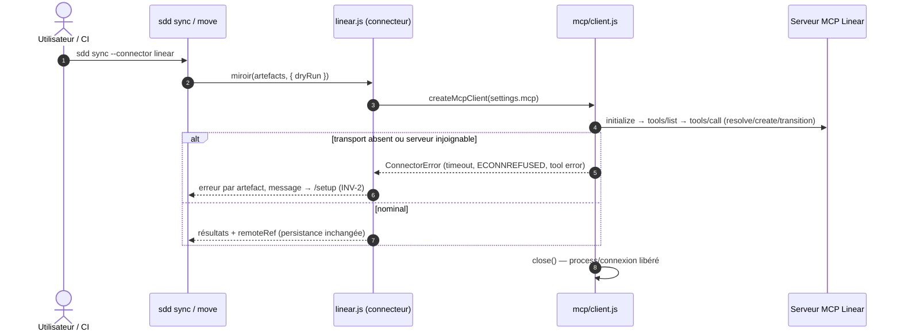

## 1. Intent & Context (*The Why*)

* **Problem Statement / Need:** Le connecteur Linear détient un secret (`LINEAR_API_KEY`) et appelle l'API GraphQL en direct — contraire au principe « zéro clé API » (ADR-002). L'environnement fournit déjà un transport authentifié : le serveur MCP Linear.
* **User / System Impact:** `src/connectors/linear.js` devient client MCP (JSON-RPC stdio + HTTP) : le transport résolu vit dans `settings.mcp` (écrit par `/setup`), l'auth ne quitte jamais l'environnement, `sync`/`move` restent déterministes et CI-friendly, le contrat miroir (`remoteRef`, `--dry-run`, call-sites) est inchangé.
* **In Scope (What is added / modified):**
  * Client MCP minimal sur standard library (`src/connectors/mcp/client.js`) : handshake `initialize`, `tools/list`, `tools/call`, timeouts → `ConnectorError`.
  * Deux transports : **stdio** (spawn `{ command, args }`) et **HTTP** (POST JSON-RPC + réponse streamable/SSE, pour `mcp.linear.app`).
  * Réécriture de `linear.js` : mapping miroir → tools Linear MCP ; suppression du fetch GraphQL et de toute notion d'apiKey.
  * Manifest : bloc `authentication` supprimé, `settings.mcp` ajouté (défauts + `settingTypes.mcp=object`), `requiredSettings: ["teamKey", "mcp"]`.
  * Garde-fou « zéro secret » : `sdd validate` rejette des settings contenant des clés `apiKey|token|secret` (règle `connector-settings` étendue).
* **Out of Scope (Strict Exclusions):**
  * Connecteur GitHub (transport `gh`), découverte MCP par le CLI (rôle de l'agent `/setup`), validation sémantique side CLI.

> *Clean Omission Note : Section 4.3 Infrastructure & Runtime : sans objet — aucune dépendance nouvelle (JSON-RPC sur `node:child_process` + `node:http`/`node:https`), aucune variable d'environnement requise.*

---

## 2. Flow & Architecture



---

## 3. File Inventory & Responsibilities

### 3.1. Factorized File Tree

```text
src/connectors/
├── mcp/
│   ├── client.js                     [NEW] JSON-RPC 2.0 : createMcpClient({command,args}|{url}) → {call, listTools, close}
│   └── linear-tools.js               [NEW] mapping miroir → tools Linear MCP (noms, args, parsing)
├── linear.js                         [MOD] réécrit sur createMcpClient — plus de fetch GraphQL ni apiKey
└── registry.js                       (inchangé)
extensions/linear/extension.json      [MOD] - authentication, + settings.mcp (défauts vides), settingTypes.mcp=object, requiredSettings ["teamKey","mcp"]
extensions/linear/README.md           [MOD] doc transport MCP (fin des tokens)
extensions/_TEMPLATE/extension.json   [MOD] contrat documenté (settings.mcp optionnel)
src/cli/commands/validate.js          [MOD] règle connector-settings : +mcp requis, +rejet clés secrètes
test/
├── mcp-client.test.js                [NEW] @unit/@component : handshake, call, timeout, close, fake serveur stdio
├── linear-connector.test.js          [MOD] réécrit contre un serveur MCP factice (plus de mock HTTP GraphQL)
└── declarative-init.test.js          [MOD] settings.mcp typé object, validate secret-reject
```

### 3.2. Key Contracts & Signatures

```js
// src/connectors/mcp/client.js — JSON-RPC 2.0, zéro dépendance
export function createMcpClient({ command, args = [], url, timeoutMs = 15000 });
//   stdio: spawn(command, args) — stdin/stdout frames JSON-RPC (Content-Length inutile : newline-delimited), handshake initialize/initialized
//   http(url): POST JSON-RPC (streamable HTTP), lecture de la réponse (JSON ou flux SSE)
//   → { call(tool, args) → résultat | ConnectorError, listTools(), close() }

// src/connectors/mcp/linear-tools.js — mapping miroir (INV-3)
export const linearTools = {
  resolve:    (ref)      => ({ tool: 'get_issue',  args: /* id/slug → issue */ }),
  list:       (filter)   => ({ tool: 'list_issues', args: filter }),
  transition: (ref, st)  => ({ tool: 'update_issue', args: { state: st } }),
  create:     (artifact) => ({ tool: 'create_issue', args: { teamKey, title, labels } }),
  link:       (ref, meta)=> ({ tool: 'update_issue', args: meta }),
};

// settings.mcp (dans .sdd/config.json) — transport résolu par /setup, jamais de secret
{ "mcp": { "command": "npx", "args": ["-y", "@linear/mcp-server"] } }   // stdio
{ "mcp": { "url": "https://mcp.linear.app/sse" } }                       // HTTP
```

---

## 4. Detailed Specifications

### 4.1. Data Models & API Contracts

* **`settings.mcp`** : exactement une des deux formes (`command`+`args` | `url`) ; les deux → `UsageError`/finding ; `args` tableau de strings ; profondeur ≤ 2 (grammaire `--linear.mcp.command=npx`, `--linear.mcp.args=-y,-y2` → virgule ou répétition, à fixer : répétition `--linear.mcp.args=-y --linear.mcp.args=npx` supportée par `multiple`).
* **Cycle de vie client** : un client par invocation de commande ; `close()` always (finally) — pas de zombie, pas de socket résident.
* **Erreurs** : timeout, handshake échoué, tool error → `ConnectorError` (`code: 'CONNECTOR_ERROR'`), message incluant le transport et l'invite `/setup`.

### 4.2. UI & Interaction Specifications (CLI)

| État | Déclencheur | Comportement système |
|---|---|---|
| **Nominal** | `sdd sync --connector linear` (settings.mcp résolu) | Plan + résultats par artefact, `remoteRef` persistés ; sortie identique à l'actuel (INV-3). |
| **Sans transport** | settings.mcp absent | `ConnectorError` « no MCP transport configured — run /setup », exit 1. |
| **Serveur mort** | spawn/HTTP échoue | `ConnectorError` (timeout/ECONNREFUSED), artefacts restés inchangés. |
| **Validate** | settings avec clés secrètes, ou linear enabled sans `mcp` | finding `connector-settings`, exit 1. |

---

## 5. Business Invariants & Test Traceability

* **INV-1 · Zéro secret dans le framework** — le manifest perd son bloc `authentication` ; `validate` rejette des settings portant des clés `apiKey|token|secret` ; aucun fallback auth directe.
  ↳ *Covered by:* [`declarative-init.test.js`](#appendix-file-index), [`linear-connector.test.js`](#appendix-file-index)
* **INV-2 · Inopérant sans transport résolu** — sans `settings.mcp` : `sync`/`move` échouent avec invite `/setup`, `validate` émet un finding (`requiredSettings` inclut `mcp`).
  ↳ *Covered by:* [`declarative-init.test.js`](#appendix-file-index)
* **INV-3 · Contrat miroir inchangé** — `resolve/list/transition/create/link`, `remoteRef`, `--dry-run`, call-sites `sync/move/done` : aucun changement d'interface.
  ↳ *Covered by:* [`linear-connector.test.js`](#appendix-file-index)
* **INV-4 · Client éphémère, zéro dépendance** — un client par invocation, `close()` garanti ; JSON-RPC sur standard library uniquement.
  ↳ *Covered by:* [`mcp-client.test.js`](#appendix-file-index)

---

## 6. Technical Watchouts & Anti-Patterns

* **Handshake MCP avant tout call** : `initialize` puis notification `initialized` — appeler un tool avant la réponse d'initialize produit des erreurs obscures ; séquencer strictement.
* **SSE/streamable HTTP :** `mcp.linear.app` répond en flux — ne pas lire la réponse comme un JSON unique ; parser les events et matcher l'id de requête ; ne pas implémenter la reconnexion (le client est éphémère, INV-4).
* **Framing stdio :** newline-delimited JSON côté serveurs Node ; ne PAS implémenter Content-Length/LSP framing (inutile, source de bugs).
* **Zombies de process :** `close()` doit tuer le spawn (SIGTERM + exit handler) ; un `sync` en erreur ne doit pas laisser de serveur MCP vivant — testé.
* **Timeouts** : défaut 15 s, par call ET sur le handshake ; un serveur qui accepte la connexion mais ne répond pas doit expirer.
* **Secret-scan prudents :** ne rejeter que les clés explicites (`apiKey`, `token`, `secret` en clé ou fin de clé, case-insensitive) — un setting nommé `tokenBucketRate` légitime ne doit pas trigger.
* **Flags `args` répétables :** `--linear.mcp.args` doit accepter la répétition (tableau) — un split naïf sur espaces casserait les chemins avec espaces.
* **Tests sans réseau :** fake serveur MCP = petit script Node spawné sur stdio ; aucun test ne parle à `mcp.linear.app`.

---

## 7. Sequential Execution Plan

- [x] **Phase 1: Client MCP core**
  - [x] `src/connectors/mcp/client.js` : stdio + HTTP, handshake, `call`/`listTools`/`close`, timeouts → `ConnectorError`.
  - [x] `test/mcp-client.test.js` : fake serveur stdio (handshake, call, timeout, close sans zombie).
- [x] **Phase 2: Connecteur Linear**
  - [x] `src/connectors/mcp/linear-tools.js` (mapping) + réécriture `linear.js` (suppression GraphQL/apiKey).
  - [x] Manifests (`extension.json` ×2) : `-authentication`, `+settings.mcp`, `requiredSettings ["teamKey","mcp"]`.
  - [x] `test/linear-connector.test.js` réécrit contre le fake MCP.
- [x] **Phase 3: Validation & garde-fous**
  - [x] `validate.js` : `mcp` requis pour linear, rejet clés secrètes ; `declarative-init.test.js` étendu.
- [x] **Phase 4: E2E, docs & gates**
  - [x] `extensions/linear/README.md`, `README.md` (surface, plus de token), knowledge post-spec.
  - [x] Gates : `npm test`, `node bin/sdd.js validate`, `node bin/sdd.js render --check`.

---

## 8. BDD Validation & Quality Gates

### 8.1. Exhaustive Gherkin Scenarios

```gherkin
Feature: Connecteur Linear via MCP

  @unit
  Scenario: [INV-4] Handshake et call sur un serveur stdio factice
    Given un serveur MCP factice spawné (script Node stdio)
    When createMcpClient({ command: node, args: [fake.js] }).call("get_issue", { id: "ENG-1" })
    Then la réponse tool est retournée et close() termine le process (aucun zombie)

  @unit
  Scenario: [INV-4] Timeout sur serveur muet
    Given un serveur factice qui n'accuse pas l'initialize
    When call avec timeoutMs: 100
    Then ConnectorError "timeout" en ~100ms

  @component
  Scenario: [INV-1] Aucun secret ne passe validate
    Given un config.json où linear.settings contient "apiKey": "lin_api_xxx"
    When `sdd validate`
    Then finding connector-settings "settings must not contain secrets (apiKey)", exit 1

  @component
  Scenario: [INV-2] Connecteur inopérant sans transport
    Given linear enabled sans settings.mcp
    When `sdd sync --connector linear` puis `sdd validate`
    Then ConnectorError "no MCP transport configured — run /setup" et un finding requiredSettings citant mcp

  @integration
  Scenario: [INV-3] sync nominal contre le serveur factice
    Given un workspace seedé (spec 042 planned) et settings.mcp vers le fake
    When `sdd sync --connector linear`
    Then l'issue est créée (remoteRef persisté), transition reflected, sortie identique au format actuel

  @e2e
  Scenario: [INV-1..INV-4] move avec dry-run puis réel
    Given un workspace connecté au fake MCP
    When `sdd move 042 --to active --dry-run` puis `sdd move 042 --to active`
    Then le dry-run ne contacte pas en écriture et n'écrit rien, le move réel applique modèle + miroir, validate exit 0
```

### 8.2. Execution Commands & Quality Gates

```bash
# 1. Tests ciblés
node --test test/mcp-client.test.js test/linear-connector.test.js test/declarative-init.test.js

# 2. Suite complète
npm test

# 3. Gates canoniques
node bin/sdd.js validate
node bin/sdd.js render --check
```

---

<a id="appendix-file-index"></a>
## Appendix: File Index

| Short File Name | Project Relative Path |
|---|---|
| `client.js` | `src/connectors/mcp/client.js` |
| `linear-tools.js` | `src/connectors/mcp/linear-tools.js` |
| `linear.js` | `src/connectors/linear.js` |
| `registry.js` | `src/connectors/registry.js` |
| `validate.js` | `src/cli/commands/validate.js` |
| `linear-manifest` | `extensions/linear/extension.json` |
| `linear-ext-readme` | `extensions/linear/README.md` |
| `template-manifest` | `extensions/_TEMPLATE/extension.json` |
| `mcp-client.test.js` | `test/mcp-client.test.js` |
| `linear-connector.test.js` | `test/linear-connector.test.js` |
| `declarative-init.test.js` | `test/declarative-init.test.js` |
