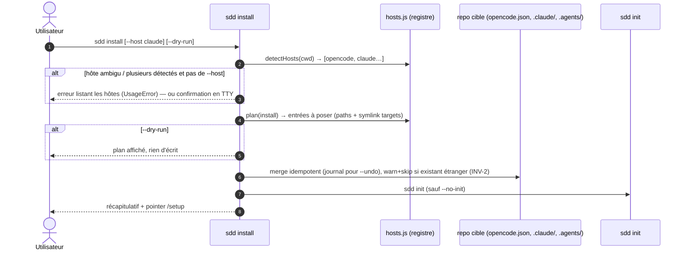

# Spec: 008 - Commande sdd install

## Metadata
* **Domain:** `.sdd/knowledge/domains/spec-model/`
* **Change Type:** `New Capability`
* **Complexity:** `Medium`
* **Feature:** `01-install-command`
* **Initiative:** `adoption`

---

## 1. Intent & Context (*The Why*)

* **Problem Statement / Need:** La distribution npm/npx livre le binaire mais pas le pipeline : câbler `skills/`/`agents/`/`templates/` dans l'hôte agentique du repo cible reste manuel (symlinks, `opencode.json`), chaque adoptant réinvente le montage.
* **User / System Impact:** `sdd install` = une commande du clone au pipeline : détection d'hôte, câblage idempotent pointant vers le module installé, puis `sdd init`. Supporte `--undo` et `--dry-run` (tenets du framework).
* **In Scope (What is added / modified):**
  * Commande `sdd install` : registre d'hôtes (`opencode`, `claude`, `agents`), détection auto, câblage par merge/symlink, `--undo` journalisé, `--dry-run`, `--init/--no-init`.
  * `src/cli/hosts.js` : registre d'hôtes extensible (détection + plan de câblage par hôte).
  * README : section Installation (npm / npx / clone + `sdd install`).
* **Out of Scope (Strict Exclusions):**
  * Hôtes hors registre (extensible, hors scope v1), publication npm, connecteurs (`/setup`), gestion de versions.

> *Clean Omission Note : Section 4.3 Infrastructure & Runtime : sans objet — aucune dépendance nouvelle, tout sur `node:fs`.*

---

## 2. Flow & Architecture



---

## 3. File Inventory & Responsibilities

### 3.1. Factorized File Tree

```text
src/cli/
├── hosts.js                          [NEW] registre d'hôtes : detectHosts(cwd), installPlan(host, pkgRoot), apply/undo
└── commands/install.js               [NEW] orchestration : détection → câblage (journalisé) → init ; flags --host/--init/--no-init/--dry-run/--undo
src/cli/main.js                       [MOD] commande install + options host/init/undo
src/cli/help.js                       [MOD] ligne install
README.md                             [MOD] section Installation (npm i -g shodo / npx shodo install / clone)
test/install-command.test.js          [NEW] @unit/@component/@integration/@e2e : détection, plans, idempotence, undo, dry-run, aucun-hôte
```

### 3.2. Key Contracts & Signatures

```js
// src/cli/hosts.js
export function detectHosts(cwd);                     // → [{ id, evidence }] — opencode.json / .claude/ / .agents/
export function installPlan(cwd, host, { pkgRoot });  // → [{ kind: 'opencode-path'|'symlink', target, source }]
export async function applyPlan(cwd, plan, journal);  // idempotent ; existant étranger → warn+skip (INV-2)
export async function undoPlan(cwd, journal);         // retire exactement les entrées journalisées

// journal (réversible) — stocké à la pose, retiré à l'undo
.sdd/.install-journal.json            // [{ kind, target, created }] — toléré par root-layout (cf. .migration-failed.json)

// registre d'hôtes (extensible)
const HOSTS = {
  opencode: { detect: (cwd) => exists('opencode.json'), install: (plan) => merge skills.paths },
  claude:   { detect: (cwd) => exists('.claude/'),     install: (plan) => symlink .claude/{skills,agents}/shodo → pkg },
  agents:   { detect: (cwd) => exists('.agents/'),     install: (plan) => symlink .agents/{skills,agents}/shodo → pkg },
};
```

---

## 4. Detailed Specifications

### 4.1. Data Models & API Contracts

* **pkgRoot** : résolu depuis le module courant (`import.meta.url` → `fileURLToPath`) — `sdd install` pointe les skills/agents/templates du **package en cours d'exécution** ; fonctionne en npx, npm -g et clone.
* **Journal** : `.sdd/.install-journal.json` créé par `install`, consommé et supprimé par `--undo` ; si `.sdd/` absent au moment du câblage, `sdd init` le crée et le journal est écrit après init (ordre : câblage → init → journal, ou journal dans le câblage si `.sdd/` existe déjà — à arbitrer : journal écrit après `init` pour garantir son emplacement).
* **`--host`** : validation stricte contre le registre (`UsageError` si inconnu) ; `auto` = détection.

### 4.2. UI & Interaction Specifications (CLI)

| État | Déclencheur | Comportement |
|---|---|---|
| **Nominal** | `sdd install` (1+ hôtes détectés) | Plan → câblage → `sdd init` → récap + pointer `/setup`. |
| **Ambigu** | plusieurs hôtes, pas de `--host`, TTY | Confirmation demandée (choix des hôtes). |
| **Ambigu non-TTY** | idem, CI | `UsageError` listant les hôtes détectés (`--host` requis). |
| **Aucun hôte** | rien de détecté | `sdd init` seul + instructions manuelles (INV-5). |
| **Conflit** | cible existante ≠ package | warn + skip, jamais d'écrasement (INV-2). |
| **Dry-run** | `+ --dry-run` | Plan affiché (hôte, entrées, init), zéro écriture (INV-4). |
| **Undo** | `sdd install --undo` | Retire exactement le journal (symlinks + entrées opencode), rien d'autre (INV-1). |

---

## 5. Business Invariants & Test Traceability

* **INV-1 · Câblage vers le module installé, réversible** — paths/symlinks pointent `node_modules/shodo/**` (ou le pkgRoot effectif) ; re-install idempotent ; `--undo` retire exactement le journal.
  ↳ *Covered by:* [`install-command.test.js`](#appendix-file-index)
* **INV-2 · Jamais d'écrasement d'existant** — cible étrangère préexistante ⇒ warn + skip ; `opencode.json` merge par structure, jamais réécrit brut.
  ↳ *Covered by:* [`install-command.test.js`](#appendix-file-index)
* **INV-3 · Offline** — aucun réseau, aucune clé ; `init` garde sa sémantique.
  ↳ *Covered by:* [`install-command.test.js`](#appendix-file-index)
* **INV-4 · Dry-run et ordre de phases** — détection → câblage → init ; `--dry-run` n'écrit rien.
  ↳ *Covered by:* [`install-command.test.js`](#appendix-file-index)
* **INV-5 · Dégrade proprement sans hôte** — init seul + instructions manuelles.
  ↳ *Covered by:* [`install-command.test.js`](#appendix-file-index)

---

## 6. Technical Watchouts & Anti-Patterns

* **pkgRoot via `import.meta.url`** : résoudre depuis le module exécuté — `process.cwd()` ne dit rien de l'emplacement du package (npx cache, global, clone).
* **`--undo` sans journal** : doit échouer proprement (« nothing to undo »), pas supprimer des chemins à la devinette — le journal est la seule source.
* **Symlinks Windows** : `--host claude` via symlink peut échouer sans privilèges sur Windows — détecter `symlink()` EPERM et fallback copie + warn (l'invariant INV-1 « pas de copie » s'assouplit explicitement dans ce cas, message dit comment re-installer après update).
* **opencode.json existant** : merge `skills.paths` sans toucher au reste du JSON — préserver l'ordre des clés existantes, ne jamais réécrire le fichier entier.
* **Journal et root-layout** : `.install-journal.json` doit être toléré par `root-layout` (comme `.migration-failed.json`) — sinon `validate` casse après install.
* **Câblage templates** : les templates ne sont pas nécessaires aux agents au runtime (ils lisent le pkg) — ne pas les symlink par défaut (bruit), les lister dans la doc manuelle.
* **Tests hermétiques** : workspace temporaire avec faux `opencode.json`/`.claude/` et pkgRoot pointant vers le vrai repo — jamais écrire hors tmpdir.

---

## 7. Sequential Execution Plan

- [x] **Phase 1: Registre d'hôtes**
  - [x] `src/cli/hosts.js` : detectHosts, installPlan, applyPlan/undoPlan + journal.
  - [x] `root-layout` : tolérance `.install-journal.json`.
  - [x] Tests détection/plan (@unit).
- [x] **Phase 2: Commande install**
  - [x] `install.js` : orchestration + flags + `--undo` + ambiguity gate TTY/CI.
  - [x] `main.js`/`help.js` wiring ; tests @component/@integration.
- [x] **Phase 3: E2E, docs & gates**
  - [x] README (Installation : npm / npx / clone) ; test e2e parcours complet + undo.
  - [x] Gates : `npm test`, `node bin/sdd.js validate`, `node bin/sdd.js render --check`.

---

## 8. BDD Validation & Quality Gates

### 8.1. Exhaustive Gherkin Scenarios

```gherkin
Feature: Commande sdd install

  @unit
  Scenario: [INV-1] Détection et plan
    Given un repo cible avec opencode.json et .claude/
    When detectHosts puis installPlan(host, { pkgRoot })
    Then les hôtes [opencode, claude] sont détectés et le plan liste les entrées pointant pkgRoot

  @component
  Scenario: [INV-1][INV-4] Install idempotent avec dry-run
    Given un repo cible sans .sdd/
    When `sdd install --dry-run` puis `sdd install` puis un second `sdd install`
    Then le dry-run n'écrit rien ; opencode.json porte skills.paths une seule fois ; le symlink .claude/skills/shodo pointe pkgRoot ; le second install est no-op

  @component
  Scenario: [INV-2] Conflit préservé
    Given .claude/skills/shodo préexistant pointant ailleurs
    When `sdd install`
    Then warn + skip, la cible préexistante est intacte

  @component
  Scenario: [INV-5] Aucun hôte détecté
    Given un repo vierge sans marqueurs d'hôte
    When `sdd install`
    Then sdd init s'exécute seul et des instructions de câblage manuel sont affichées

  @integration
  Scenario: [INV-1] Undo exact
    Given un install journalisé
    When `sdd install --undo`
    Then symlinks et entrée opencode.json retirés, le reste du fichier intact, journal supprimé

  @e2e
  Scenario: [INV-1..INV-5] Parcours complet puis re-install
    Given un repo cible vierge
    When `npx shodo install` équivalent (install --host claude), puis `sdd validate`, puis `sdd install --undo`
    Then workspace initialisé, câblage actif, validate exit 0, après undo plus aucune trace posée par l'install
```

### 8.2. Execution Commands & Quality Gates

```bash
# 1. Tests ciblés
node --test test/install-command.test.js

# 2. Suite complète
npm test

# 3. Gates canoniques
node bin/sdd.js validate
node bin/sdd.js render --check
```

---

<a id="appendix-file-index"></a>
## Appendix: File Index

| Short File Name | Project Relative Path |
|---|---|
| `hosts.js` | `src/cli/hosts.js` |
| `install.js` | `src/cli/commands/install.js` |
| `main.js` | `src/cli/main.js` |
| `help.js` | `src/cli/help.js` |
| `readme` | `README.md` |
| `install-command.test.js` | `test/install-command.test.js` |
