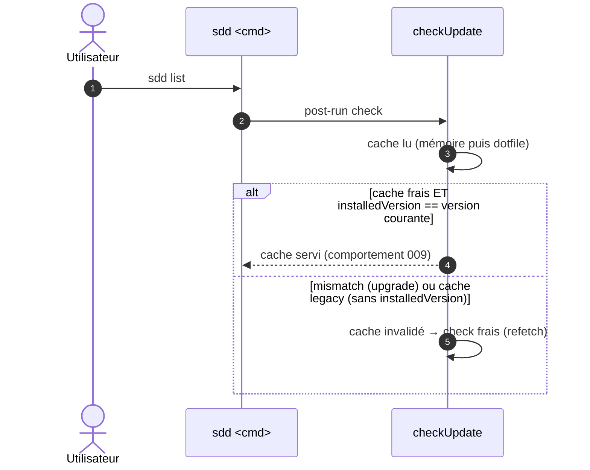

# Spec: 011 - Invalidation du cache update-check au changement de version

## Metadata
* **Domain:** `.sdd/knowledge/domains/spec-model/`
* **Change Type:** `Bugfix`
* **Complexity:** `Small`
* **Feature:** `04-update-cache-invalidation`
* **Initiative:** `adoption`

---

## 1. Intent & Context (*The Why*)

* **Problem Statement / Need:** Le cache 24 h du check-update peut contenir `latest: null` (check pendant la fenêtre de réplication npm, ou offline). Constaté en production : après publication d'une version et upgrade du binaire, la notice reste absente jusqu'à expiration — le cache survit au changement de version installée.
* **User / System Impact:** Le cache embarque `installedVersion` ; toute divergence avec la version du binaire en cours invalide le cache (check frais). Les caches legacy sans ce champ sont invalidés aussi. Un upgrade déclenche donc toujours un check frais.
* **In Scope (What is added / modified):**
  * `src/cli/update-check.js` : champ `installedVersion` dans le cache (mémoire + dotfile) ; invalidation au mismatch ; caches legacy sans champ traités invalidés.
  * `test/update-check.test.js` : scénarios d'invalidation.
* **Out of Scope (Strict Exclusions):**
  * Toute autre sémantique du check (timeouts, opt-outs, semver — inchangés, cf. 009).

> *Clean Omission Note : Section 4.3 : sans objet — aucune dépendance, aucun réseau nouveau.*

---

## 2. Flow & Architecture



---

## 3. File Inventory & Responsibilities

### 3.1. Factorized File Tree

```text
src/cli/update-check.js               [MOD] installedVersion dans le cache ; invalidation au mismatch ; legacy sans champ → invalidé
test/update-check.test.js             [MOD] @unit : mismatch mémoire/dotfile, legacy cache, upgrade déclenche refetch, écriture embarque la version
README.md                             [MOD] une ligne : le cache s'invalide au changement de version du binaire
```

### 3.2. Key Contracts & Signatures

```js
// cache — schéma additif
{ lastCheck: <epoch ms>, latest: "2.0.2" | null, installedVersion: "2.0.1" }

// invalidation (lecture)
cache invalide si  lastCheck ≥ 24h            (009, inchangé)
                OU installedVersion !== pkg.version   (NOUVEAU)
                OU installedVersion absent (legacy)
```

---

## 4. Detailed Specifications

### 4.1. Data Models & API Contracts

* **Écritures** : chaque `memoryCache.set` / `writeDotfileCache` (chemins : succès, échec réseau, égalité de version) porte `installedVersion` = version du package lu dans package.json (même source que 009).
* **Lecture** : le mismatch ne supprime pas le dotfile — il le fait juste ignorer puis réécrire frais au prochain check (simplicité, zéro fs supplémentaire).
* **Rétrocompatibilité** : cache sans `installedVersion` ⇒ invalidé (comportement le plus sûr, aucun code de migration).

### 4.2. UI & Interaction Specifications (CLI)

| État | Déclencheur | Comportement |
|---|---|---|
| **Upgrade** | installedVersion ≠ version courante, cache < 24h | Cache ignoré, check frais, notice si plus récent (le cas `latest: null` périmé disparaît). |
| **Cache legacy** | dotfile sans `installedVersion` | Idem — check frais. |
| **Nominal** | même version, cache < 24h | Comportement 009 inchangé. |

---

## 5. Business Invariants & Test Traceability

* **INV-1 · Upgrade ⇒ check frais** — un cache dont `installedVersion` ≠ version courante est ignoré, même < 24h.
  ↳ *Covered by:* [`update-check.test.js`](#appendix-file-index)
* **INV-2 · Caches legacy invalidés** — sans `installedVersion`, le cache est ignoré.
  ↳ *Covered by:* [`update-check.test.js`](#appendix-file-index)
* **INV-3 · Schéma additif** — `{ lastCheck, latest, installedVersion }`, API `{ notice, cached }` inchangée, tolérance root-layout intacte.
  ↳ *Covered by:* [`update-check.test.js`](#appendix-file-index)

---

## 6. Technical Watchouts & Anti-Patterns

* **Tous les chemins d'écriture** : l'échec réseau (déjà 3 sites d'écriture : mémoire, dotfile, et le chemin succès) doit porter `installedVersion` — un seul site manquant laisse le bug survivre sur ce chemin.
* **Ne pas invalider l'égalité** : `installedVersion` identique ⇒ comportement 009 strictement inchangé (sinon les tests N2/U5/U6 cassent et le check re-sonde à chaque run).
* **Dotfile partiellement formé** (clé présente, valeur non-string) : traiter comme invalide (parse tolérant existant).
* **Tests** : injecter `pkg` (déjà une seam) pour simuler le mismatch — jamais bumpé le vrai package.json.

---

## 7. Sequential Execution Plan

- [x] **Phase 1: Invalidation**
  - [x] `update-check.js` : écriture `installedVersion` sur tous les chemins ; lecture avec invalidation (mismatch + legacy).
  - [x] Tests : mismatch refetch, legacy invalidé, égalité inchangée, écritures complètes (@unit).
- [x] **Phase 2: Docs & gates**
  - [x] README (une ligne) ; e2e upgrade → notice (@component).
  - [x] Gates : `npm test`, `node bin/sdd.js validate`, `node bin/sdd.js render --check`.

---

## 8. BDD Validation & Quality Gates

### 8.1. Exhaustive Gherkin Scenarios

```gherkin
Feature: Invalidation du cache update-check au changement de version

  @unit
  Scenario: [INV-1] Cache frais mais version installée différente
    Given un cache < 24h avec installedVersion "2.0.1" et latest "2.0.2"
    When checkUpdate sur un binaire "2.0.2" (fetchImpl comptant ses appels)
    Then 1 fetch (cache invalidé) — pas de notice si latest == installée, notice si supérieure

  @unit
  Scenario: [INV-2] Cache legacy sans installedVersion
    Given un dotfile { lastCheck: now, latest: "9.9.9" } sans installedVersion
    When checkUpdate
    Then cache ignoré, 1 fetch

  @unit
  Scenario: [INV-3] Égalité de version : comportement 009 inchangé
    Given un cache < 24h avec installedVersion == version courante
    When checkUpdate
    Then 0 fetch, notice depuis le cache si applicable

  @component
  Scenario: [INV-1] e2e upgrade
    Given un workspace dont le cache dit latest "2.0.2", installedVersion "2.0.1"
    When le binaire passe à 2.0.2 et `sdd list` s'exécute
    Then notice "v2.0.2 (installed: v2.0.2)" si registre supérieur, sinon silence — cache réécrit avec installedVersion "2.0.2"
```

### 8.2. Execution Commands & Quality Gates

```bash
node --test test/update-check.test.js
npm test
node bin/sdd.js validate
node bin/sdd.js render --check
```

---

<a id="appendix-file-index"></a>
## Appendix: File Index

| Short File Name | Project Relative Path |
|---|---|
| `update-check.js` | `src/cli/update-check.js` |
| `update-check.test.js` | `test/update-check.test.js` |
| `readme` | `README.md` |
