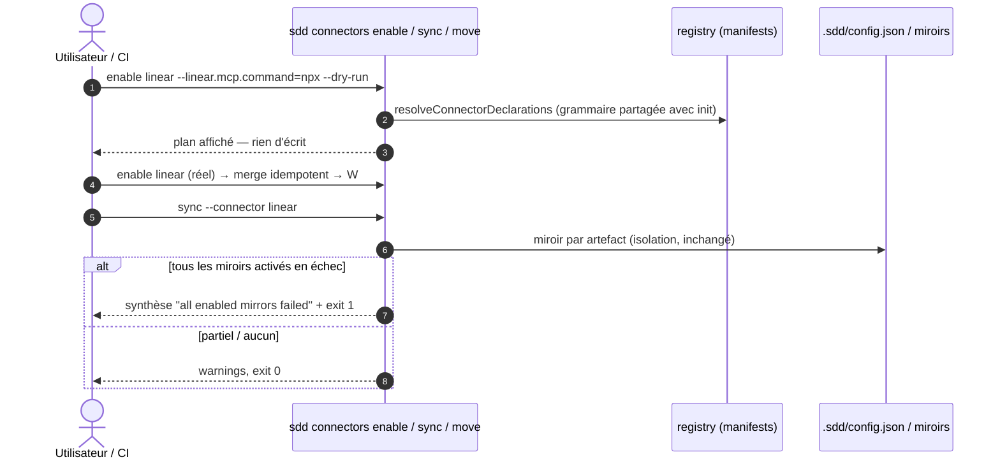

# Spec: 007 - Durcissement surface connecteurs

## Metadata
* **Domain:** `.sdd/knowledge/domains/spec-model/`
* **Change Type:** `Refactor`
* **Complexity:** `Medium`
* **Feature:** `01-connector-hardening`
* **Initiative:** `connector-ecosystem`

---

## 1. Intent & Context (*The Why*)

* **Problem Statement / Need:** Trois scories post-005 relevées en revue : grammaire de settings divergente (`connectors enable` refuse les subkeys namespacées que `init` accepte), `--dry-run` ignoré par `connectors enable`, et `sync`/`move` exit 0 même quand tous les miroirs échouent (invisible en CI). Le hint « run /setup » est codé en dur pour `linear`, contraire au principe manifest-driven.
* **User / System Impact:** Surface connecteurs homogène et CI-friendly : même grammaire partout, dry-run réel, exit code honnête sur échec total de miroir, zéro id de connecteur dans `src/`.
* **In Scope (What is added / modified):**
  * `connectors enable|disable` : grammaire unifiée via les helpers du registre (subkeys namespacées == id positionnel, répétition → tableau, coercion typée) + `--dry-run`.
  * Agrégation d'exit dans `sync`/`move` : tous les miroirs activés échouent ⇒ exit 1 + synthèse ; partiel ⇒ exit 0 + warnings.
  * Champ manifest optionnel `hint` (string) lu par `connectors list/enable` ; suppression du codage en dur `id === 'linear'`.
* **Out of Scope (Strict Exclusions):**
  * Connecteur GitHub (reporté), contrat `settings.mcp`/secret-scan/`requiredSettings` (livrés en 005), sémantique d'exit de `validate`.

> *Clean Omission Note : Section 4.3 Infrastructure & Runtime : sans objet — aucune dépendance, aucune variable d'environnement.*

---

## 2. Flow & Architecture



---

## 3. File Inventory & Responsibilities

### 3.1. Factorized File Tree

```text
src/cli/commands/
├── connectors.js                     [MOD] grammaire unifiée (helpers registry), --dry-run, hint depuis manifest, plus de 'linear' codé en dur
├── sync.js                           [MOD] agrégation : all-fail ⇒ exit 1 (synthèse), partiel ⇒ 0
└── move.js                           [MOD] idem sur l'agrégation miroir
src/connectors/registry.js            [MOD] lecture du champ manifest optionnel hint (rétrocompatible)
extensions/linear/extension.json      [MOD] + "hint" (reprise /setup)
test/
├── connector-hardening.test.js       [NEW] @unit/@component/@integration : grammaire, dry-run, hint, exit codes
├── declarative-init.test.js          [MOD] parité de grammaire init/enable
└── cli.test.js                       [MOD] exit codes sync/move (fake MCP)
```

### 3.2. Key Contracts & Signatures

```js
// extensions/<id>/extension.json — champ optionnel (rétrocompatible)
{ "hint": "Run /setup — it discovers the MCP transport in your host config" }

// src/connectors/registry.js
export function manifestHint(manifest);              // → string | null (absent ⇒ null)

// src/cli/commands/sync.js + move.js — agrégation
// pour chaque connecteur activé : succeeded = au moins un résultat non-error
// enabled ≥ 1 && aucun succeeded ⇒ exitCode 1 + synthèse "all enabled mirrors failed (n/n)"
// partiel (≥1 succeeded) ⇒ warnings par artefact, exit 0
```

---

## 4. Detailed Specifications

### 4.1. Data Models & API Contracts

* **Grammaire `connectors enable <id>`** : unifiée avec `init` — top-level non-namespacé (`--teamKey=ENG`) rattaché au `<id>` positionnel ; namespacé accepté si == `<id>` (`--linear.mcp.command=npx`) ; namespace étranger/malformé → `UsageError` exit 2, rien d'écrit.
* **`--dry-run`** : plan affiché (settings résolus, merge projeté), zéro octet écrit — même sémantique que `init --dry-run`.
* **Exit `sync`/`move`** : agrégation par connecteur (une opération réussie ⇒ connecteur succeeded) ; le décompte `(failed/total)` figure dans la synthèse d'échec total. `--dry-run` inchangé (exit 0, pas de contact écrit).

### 4.2. UI & Interaction Specifications (CLI)

| État | Déclencheur | Comportement |
|---|---|---|
| **Enable (grammaire complète)** | `connectors enable linear --linear.mcp.command=npx --linear.mcp.args=-y` | Merge idempotent, connecteur activé. |
| **Enable dry-run** | `+ --dry-run` | Plan affiché, rien d'écrit. |
| **Hint** | enable d'un connecteur dont les `requiredSettings` sont incomplètes | Le `hint` du manifest est affiché (absent ⇒ rien). |
| **Sync échec total** | tous les miroirs activés en échec | Warnings par artefact + synthèse `all enabled mirrors failed (n/n)`, exit 1. |
| **Sync partiel** | ≥ 1 miroir succeeded | Warnings, exit 0. |
| **Sync sans miroir** | aucun connecteur activé | Comportement actuel : warning, exit 0. |

---

## 5. Business Invariants & Test Traceability

* **INV-1 · Grammaire unifiée + dry-run réel** — `connectors enable|disable` passent par les mêmes helpers que `init` (subkeys namespacées, répétition → tableau, coercion) ; `--dry-run` n'écrit rien ; le contournement documenté dans `/sdd-setup` est retiré de `SKILL.md`.
  ↳ *Covered by:* [`connector-hardening.test.js`](#appendix-file-index), [`declarative-init.test.js`](#appendix-file-index)
* **INV-2 · Exit honnête sur échec total** — ≥ 1 miroir activé et tous en échec ⇒ exit 1 ; partiel ou aucun ⇒ 0 ; isolation par artefact et messages 005 inchangés.
  ↳ *Covered by:* [`connector-hardening.test.js`](#appendix-file-index), [`cli.test.js`](#appendix-file-index)
* **INV-3 · Zéro id de connecteur dans src/** — le hint vient du manifest ; grep de conformité (aucune occurrence de `'linear'` en logique dans `src/`, hors fixtures/tests).
  ↳ *Covered by:* [`connector-hardening.test.js`](#appendix-file-index) (assertion de hint manifest-driven)
* **INV-4 · Merge inchangé** — idempotence et explicit-wins passent par les helpers existants ; aucune duplication de logique.
  ↳ *Covered by:* [`connector-hardening.test.js`](#appendix-file-index)

---

## 6. Technical Watchouts & Anti-Patterns

* **Agrégation ≠ exception :** ne pas transformer l'échec total en `throw` (casserait le rapport par artefact) — muter `process.exitCode` après affichage de la synthèse, warnings d'abord.
* **`disable` sans settings :** `disable <id> --dry-run` doit fonctionner sans aucun flag settings ; la grammaire étendue est optionnelle, pas obligatoire.
* **Hint vs validation :** le hint s'affiche quand `requiredSettings` est incomplet, pas quand le connecteur est merely disabled — ne pas le mostrar sur `connectors list` (bruit).
* **Tests d'exit :** les commandes retournent des exceptions pour les erreurs d'usage ; l'exit 1 du sync all-fail passe par `process.exitCode` — les tests doivent exécuter via `run()` (même pattern que les tests 004 des chemins d'erreur).
* **Ne pas casser la parité `/sdd-setup` :** mettre à jour `skills/setup/SKILL.md` (la note « pas de dry-run sur connectors enable » devient fausse) — édition knowledge/skill autorisée (fichier authored).

---

## 7. Sequential Execution Plan

- [x] **Phase 1: Grammaire unifiée & dry-run**
  - [x] `connectors.js` : résolution via helpers registry, `--dry-run`, suppression du codage en dur.
  - [x] `registry.js` : `manifestHint`.
  - [x] `extensions/linear/extension.json` : champ `hint`.
  - [x] Tests grammaire/dry-run/hint (@unit/@component).
- [x] **Phase 2: Exit codes sync/move**
  - [x] `sync.js` + `move.js` : agrégation all-fail ⇒ exit 1 + synthèse.
  - [x] Tests exit codes contre fake MCP (vivant / mort / mixte) (@component).
- [x] **Phase 3: E2E, docs & gates**
  - [x] `skills/setup/SKILL.md` : retirer la note dry-run obsolète (F2 de la revue 006).
  - [x] `test/cli.test.js` e2e, `declarative-init.test.js` parité.
  - [x] Gates : `npm test`, `node bin/sdd.js validate`, `node bin/sdd.js render --check`.

---

## 8. BDD Validation & Quality Gates

### 8.1. Exhaustive Gherkin Scenarios

```gherkin
Feature: Durcissement surface connecteurs

  @unit
  Scenario: [INV-3] Hint lu depuis le manifest
    Given le manifest linear avec "hint": "Run /setup …"
    When manifestHint("linear")
    Then le hint est retourné ; pour un manifest sans hint, null

  @component
  Scenario: [INV-1] Enable avec grammaire complète et dry-run
    Given un workspace local-only
    When `sdd connectors enable linear --linear.mcp.command=npx --linear.mcp.args=-y --dry-run`
    Then le plan affiche mcp.command=npx, mcp.args=[-y], rien n'est écrit
    When sans --dry-run
    Then linear est activé, config merge idempotent, exit 0

  @component
  Scenario: [INV-1] Namespace étranger rejeté
    When `sdd connectors enable linear --ghost.teamKey=X`
    Then UsageError exit 2, rien d'écrit

  @component
  Scenario: [INV-2] Sync all-fail → exit 1, partiel → exit 0
    Given deux connecteurs activés pointant vers des serveurs factices (l'un mort, l'autre vivant)
    When `sdd sync`
    Then warnings pour le mort, exit 0
    When le vivant est désactivé et `sdd sync` relancé
    Then synthèse "all enabled mirrors failed (1/1)" et exit 1

  @integration
  Scenario: [INV-4] Enable idempotent via la nouvelle grammaire
    Given linear activé avec teamKey=ENG
    When `sdd connectors enable linear --mcp.command=npx` (top-level non-namespacé)
    Then teamKey préservé, mcp.command=npx, un seul connecteur linear

  @e2e
  Scenario: [INV-1..INV-3] Parcours complet
    Given un workspace vierge
    When enable dry-run → enable → hint vérifié (sans transport) → sync all-fail (exit 1) → validate (finding, exit 1)
    Then tous les exits attendus, config finale cohérente, aucune écriture inattendue
```

### 8.2. Execution Commands & Quality Gates

```bash
# 1. Tests ciblés
node --test test/connector-hardening.test.js test/declarative-init.test.js

# 2. Suite complète
npm test

# 3. Gates canoniques
node bin/sdd.js validate
node bin/sdd.js render --check
```

---

<a id="appendix-file-index"></a>
## Appendix: File Index

| Short File Name | Project Relative Path |
|---|---|
| `connectors.js` | `src/cli/commands/connectors.js` |
| `sync.js` | `src/cli/commands/sync.js` |
| `move.js` | `src/cli/commands/move.js` |
| `registry.js` | `src/connectors/registry.js` |
| `linear-manifest` | `extensions/linear/extension.json` |
| `setup-skill` | `skills/setup/SKILL.md` |
| `connector-hardening.test.js` | `test/connector-hardening.test.js` |
| `declarative-init.test.js` | `test/declarative-init.test.js` |
| `cli.test.js` | `test/cli.test.js` |
