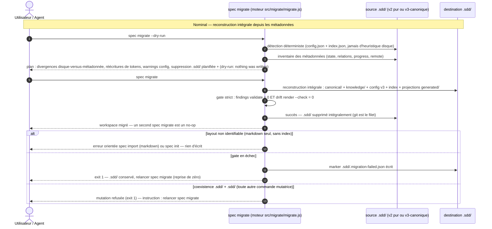

# Spec: 003 - Racine .sdd et migration idempotente

## Metadata
* **Domain:** `.sdd/knowledge/domains/workspace-management/`
* **Change Type:** `Refactor`
* **Complexity:** `Large`
* **Feature:** `03-sdd-migration`
* **Initiative:** `layout-v3`

---

## 1. Intent & Context (*The Why*)

* **Problem Statement / Need:** la racine des workspaces est `.sdd/`, désalignée du nom du framework (sdd-framework), et aucun chemin de migration n'existe pour convertir les workspaces antérieurs vers le layout final sans perte. Trois conventions interim restent ouvertes (tech.md §6) : scanners legacy gelés (`src/core/artifact.js`, `src/migrate/{import,parse}.js`, patch de compat en tête de `import.js`), horizon de purge v2 dans `src/render/projections.js` (`MANAGED` contient encore `specs`, `initiatives`, `vision.md`), et 34 documents du plugin pointant des chemins de modèle/projection obsolètes. 3ᵉ livraison de l'initiative `layout-v3` (après `01-canonical-tree` et `02-generated-namespace`).
* **User / System Impact:** cutover dur de la racine : la constante `SPECS_DIRNAME` passe de `.specs` à `.sdd` — après bascule, le CLI ne reconnaît **que** `.sdd/`. La nouvelle commande `spec migrate [--dry-run]` reconstruit `.sdd/` **intégralement** depuis la source (jamais de merge), préserve le graphe (ids, slugs, relations, `progress`, `remote`), convertit `config.json` au schéma v3, réécrit mécaniquement les tokens de racine dans les corps et fields, valide strictement (`spec validate` **et** `spec render --check` exit 0) puis retire `.sdd/`. La conversion du workspace courant de ce repo est une tâche one-shot du plan (git filet) ; l'import markdown v2 est re-owné pour fonctionner sur le layout `.sdd/` final.
* **In Scope (What is added / modified):**
  * Renommage de racine dans `src/core/paths.js` (`SPECS_DIRNAME = '.sdd'`) ; transfert du savoir layout-legacy (`STATE_DIRS`, `STATE_BY_DIR`, `MODEL_DIRNAME`, `modelRoot`) de `core/` vers `src/migrate/v2-layout.js` — `core/` ne sait plus rien des chemins à états.
  * `spec migrate [--dry-run]` : détection déterministe du layout via `config.json` + `index.json` (v2 pur, v3-canonique-sous-`.specs`, `generated/` absent), plan listant divergences ↔ métadonnées et réécritures de tokens, reconstruction intégrale depuis les métadonnées, gate strict, suppression de la source au succès, marker d'échec sinon.
  * Garde de coexistence (INV-5) : `.sdd/` + `.sdd/` présents ⇒ toute mutation CLI refusée (exit 1) ; lectures sur `.sdd/` uniquement.
  * Rework des scanners gelés : suppression de `src/core/artifact.js` (listers v2 → `src/migrate/v2-layout.js`, regex `\d{3}` → `\d{3,4}`), `import.js` re-owné (patch de compat levé, réécriture de tokens, refus si un modèle JSON existe, finalisation partagée avec migrate), `parse.js` (regex 4 chiffres, `extractParentInitiative`).
  * Retrait de l'horizon de purge v2 : `MANAGED = ['generated']` dans `src/render/projections.js` (le sweep v2 n'a plus de raison d'être après bascule racine).
  * `CONFIG_VERSION` 2 → 3 : `convertConfig` (options obsolètes retirées avec avertissement), `schemas/config.schema.json` mis à jour.
  * `src/core/rules.js` : forme absolue (slash initial + `.sdd/…`) = violation ; mention nue `.sdd/…` = workspace-relatif (tolérance verrouillée par test).
  * Erratum de traçabilité de la spec 002 (§3.1) : ajout de `test/model-store.test.js` à l'inventaire — appliqué via `spec upsert` (rule 7), pas à la main.
  * Cutover one-shot du workspace de ce repo + repointage doc-wide des 34 fichiers writers (liste exhaustive §4.3 ; convention : chemins de modèle = `.sdd/canonical/…`).
* **Out of Scope (Strict Exclusions):**
  * L'entrée racine optionnelle `site/` (feature `04-static-site` — elle étendra `ALLOWED_ROOT_ENTRIES`).
  * Le rollback hors git et la conservation opt-in de `.sdd/` après succès (feature §5 : git est le filet).
  * Le mirroring Linear et les backends distants : les refs `remote` sont préservées telles quelles, aucune resynchronisation n'est déclenchée par la migration.
  * Le format de `index.json` (version 3 inchangée — les préfixes `meta`/`body`/`projection` dérivent de `SPECS_DIRNAME`), la grammaire `<ref>`, le graphe, les transitions, la structure de `knowledge/` (hors réécriture de tokens).

---

## 2. Flow & Architecture



**Note d'intention :** la migration est une **reconstruction**, pas un déplacement : chaque destination sous `.sdd/` est recalculée depuis les métadonnées (`state`, `relations`), la position disque de la source n'est jamais un critère. Les projections ne sont jamais copiées de `.sdd/generated/` — elles sont re-rendues depuis le modèle reconstruit.

---

## 3. File Inventory & Responsibilities

### 3.1. Factorized File Tree

```text
src/
├── core/
│   ├── paths.js                                 [MOD] SPECS_DIRNAME='.sdd' ; retrait STATE_DIRS/STATE_BY_DIR/MODEL_DIRNAME/modelRoot (→ migrate/) ; docstrings .sdd/
│   ├── config.js                                [MOD] CONFIG_VERSION=3 ; convertConfig(raw) avec warnings d'options obsolètes
│   ├── errors.js                                [MOD] MigrationError (code MIGRATION_ERROR, exit 1)
│   ├── rules.js                                 [MOD] pattern forme absolue (slash initial + `.sdd/`) ; docstring workspace-relatif `.sdd/`
│   ├── transitions.js                           [MOD] stateDir() supprimée (morte depuis le layout v3)
│   └── artifact.js                              [DEL] scanners v2 déplacés dans src/migrate/v2-layout.js
├── model/
│   ├── audit.js                                 [NEW] computeFindings(cwd) — moteur de validate extrait, réutilisé par le gate
│   ├── schema.js                                [MOD] stateDirLabel() supprimée (code mort) ; import STATE_DIRS retiré
│   ├── index.js / store.js / graph.js / layout.js   (inchangés — préfixes et chemins dérivés de SPECS_DIRNAME)
├── render/
│   ├── projections.js                           [MOD] MANAGED=['generated'] — fin du sweep v2 et du démontage des répertoires hérités
│   └── markdown.js                              (inchangé)
├── migrate/
│   ├── v2-layout.js                             [NEW] listers legacy v2 (ex-core/artifact.js, regex \d{3,4}) + STATE_DIRS/STATE_BY_DIR/MODEL_DIRNAME
│   ├── parse.js                                 [MOD] regex \d{3,4} (TITLE_PREFIX, extractSpecSlugs) ; extractParentInitiative ; patch de compat levé
│   ├── import.js                                [MOD] patch de compat levé ; réécriture de tokens des corps importés ; refus si modèle JSON ; finish partagé
│   └── migrate.js                               [NEW] LEGACY_ROOT_DIRNAME, detectLayout, planMigration, runMigration, assertNoCoexistence, marker d'échec
└── cli/
    ├── main.js                                  [MOD] commande migrate enregistrée ; OPTIONS inchangées (--dry-run/--json déjà globales)
    ├── help.js                                  [MOD] ligne migrate ; chemins et exemples .sdd/
    └── commands/
        ├── migrate.js                           [NEW] spec migrate [--dry-run] [--json] — plan, exécution, gate, suppression source
        ├── validate.js                          [MOD] délègue le calcul des findings à model/audit.js
        ├── upsert.js / move.js / done.js / link.js   [MOD] assertNoCoexistence avant toute écriture
        ├── render.js                            [MOD] assertNoCoexistence en mode écriture (--check/--dry-run passent)
        ├── import.js                            [MOD] assertNoCoexistence ; message d'orientation spec migrate
        ├── init.js / model.js / status.js / backend.js   [MOD] garde coexistence (init --force, model --write) ; chaînes d'affichage .sdd/
test/
├── sdd-migration.test.js                        [NEW] @unit U1–U6, @component C1–C7, @integration I1–I2, @e2e E1–E2 (§8.1)
├── migrate.test.js                              [MOD] parse reworké (4 chiffres, extractParentInitiative) ; import post-bascule + refus modèle JSON
├── artifact.test.js                             [DEL] couvert par sdd-migration.test.js (listers v2 déplacés)
├── helpers.js                                   [MOD] FIXTURES (source legacy) épinglées sur la racine littérale .sdd/ ; seedModel suit SPECS_DIRNAME
├── transitions.test.js                          [MOD] test stateDir retiré
├── config.test.js                               [MOD] version 3 + convertConfig warnings
└── canonical-layout.test.js / cli.test.js / render.test.js / model-store.test.js / model-schema.test.js / generated-namespace.test.js / graph.test.js   [MOD] assertions de chemins .sdd/ → .sdd/
docs — repointage doc-wide (liste exhaustive en §4.3)
├── README.md                                    [MOD] arbre, exemples CLI, section configuration → .sdd/
├── plugin.json                                  [MOD] model='.sdd/canonical', projections='.sdd'
├── schemas/config.schema.json                   [MOD] version const 3 ; descriptions .sdd/
├── rules/spec-rules.md                          [MOD] §7 modèle canonique .sdd/canonical/ ; exemples §1
├── templates/SPEC_TEMPLATE.md / VISION_TEMPLATE.md / FEATURE_TEMPLATE.md   [MOD] notes rule 7, liens de projection, exemple Domain
├── agents/ ×9, skills/ ×14                      [MOD] chemins de modèle v2 → .sdd/canonical/… ; projections .sdd/generated/ → .sdd/generated/
└── extensions/README.md, extensions/linear/{README.md,extension.json}, extensions/_TEMPLATE/backend.js   [MOD] descripteur d'artefact v3 + chemins
```

### 3.2. Key Contracts & Signatures

```js
// src/core/paths.js — racine unique du framework ; core/ ne connaît plus aucun chemin à état
export const SPECS_DIRNAME = '.sdd';
// canonicalRoot / knowledgeRoot / generatedRoot / standardLayout / ALLOWED_ROOT_ENTRIES : signatures inchangées
// STATE_DIRS, STATE_BY_DIR, MODEL_DIRNAME, modelRoot() : DÉPLACÉS vers src/migrate/v2-layout.js

// src/core/errors.js — nouvelle erreur de migration
export class MigrationError extends SpecFrameworkError {}   // code MIGRATION_ERROR, exit 1

// src/migrate/migrate.js — moteur de conversion (source de vérité de la détection)
export const LEGACY_ROOT_DIRNAME = '.specs';   // racine legacy + token de réécriture
export function detectLayout(cwd);
//   → { layout: 'migrated' | 'coexistence' | 'v3-canonical' | 'v2-model' | 'unsupported',
//       sourceRoot: '.sdd/canonical' | '.sdd/model' | null, detail }
//   migrated     : .sdd/canonical/ présent ET .sdd/ absent
//   coexistence  : .sdd/canonical/ présent ET .sdd/ présent  → reprise de zéro (INV-1)
//   v3-canonical : .sdd/canonical/index.json (version 3) présent, .sdd/ absent
//                  (un ancien .sdd/model/ résiduel est listé comme divergence legacy-residue, jamais lu)
//   v2-model     : .sdd/model/index.json (version ≤ 2) présent, .sdd/ absent
//   unsupported  : tout le reste (markdown seul → orienter spec import ; vide → orienter spec init)
export function planMigration(cwd);
//   → { layout, artifacts: [{ kind, slug, id, state, relations }],
//       divergences: [{ kind, slug, type: 'position-mismatch' | 'state-mismatch' | 'unresolved-relations' | 'legacy-residue', expected, actual }],
//       rewrites: [{ file, occurrences, sample }],          // INV-3 : chaque réécriture listée
//       configWarnings: [string], removals: [string] }      // tout calculé, rien d'écrit
export async function runMigration(cwd, { dryRun = false } = {});
//   dry-run → plan imprimé + '(dry-run: nothing was written)', zéro écriture
//   écrit   → reconstruction, gate strict (audit + render --check in-process),
//             succès : suppression de .sdd/ | échec : .sdd/.migration-failed.json + exit 1
//   → { status: 'migrated' | 'failed' | 'noop', stage?, divergences, rewrites, removedRoot }
export function assertNoCoexistence(cwd);      // INV-5 : throw MigrationError (exit 1) si .sdd/ ET .sdd/ présents

// src/model/audit.js — moteur de validate extrait (lecture pure, aucun exitCode)
export async function computeFindings(cwd);    // → findings[] (mêmes règles : portable-paths, invariant-traceability,
                                               //   canonical-layout, spec-id-uniqueness, graph-integrity, root-layout)

// src/core/config.js — schéma v3
export const CONFIG_VERSION = 3;
export function convertConfig(raw);            // → { config, warnings } — clés top-level inconnues et backends
                                               //   'filesystem' retirés avec warning ; version forcée à 3

// src/core/rules.js — portabilité (arbitrage 10)
export const ABSOLUTE_PATH_PATTERNS = [
  /* patterns existants inchangés */
  /\/\.sdd\b/g,                                // forme absolue (slash initial + .sdd/…) = violation ; mention nue .sdd/… = workspace-relatif (tolérée)
];

// src/render/projections.js — horizon de purge réduit (arbitrage 9)
const MANAGED = ['generated'];                 // 'specs', 'initiatives', 'vision.md' retirés — le sweep v2 disparaît

// src/migrate/import.js — re-owné (patch de compat levé)
export async function importMarkdown(cwd, { force = false, dryRun = false } = {});
//   refuse (UsageError, exit 2) si .sdd/canonical/index.json ou .sdd/model/index.json existe → orienter spec migrate
//   lit le markdown legacy v2 sous .sdd/, réécrit les tokens de racine des corps importés,
//   dérive les relations depuis le CONTENU (## 6. → spec ; bloc Parent Initiative → feature),
//   puis finish partagé : index + projections + gate strict + suppression de .sdd/ au succès
```

Marker d'échec (écrit uniquement quand le gate échoue ; dotfile toléré par la règle `root-layout`) :

```json
{ "failedAt": "2026-09-13T10:00:00.000Z", "stage": "validate | render-check", "message": "3 finding(s)" }
```

---

## 4. Detailed Specifications

### 4.1. Data Models & API Contracts

* **Détection de layout (arbitrage 2 — déterministe, déclarative)** : seuls `config.json` et `index.json` sont lus comme marqueurs ; jamais d'heuristique de disque (ni présence de `generated/`, ni forme des répertoires). Ordre d'évaluation : coexistence → v3-canonical → v2-model → unsupported. Un `config.json` de version ≠ layout détecté produit une divergence `legacy-residue` (warning, pas un blocage). Un `index.json` absent ou corrompu ⇒ `unsupported` avec message de récupération git — la métadonnée JSON, elle, est toujours la source de la reconstruction.
* **Reconstruction depuis les métadonnées (INV-2)** : pour chaque artefact source, `state`, `relations`, `progress.done`, `remote`, `fields`, `id`, `slug`, `title`, dates sont lus dans le JSON de métadonnée ; la destination `.sdd/canonical/…` est `modelRelativePaths(meta)` recalculée — jamais déduite de la position du fichier. Charges par layout :
  * *v3-canonical* : walk récursif des JSON sous `.sdd/canonical/` (équivalent `loadModel`, tolérant aux fichiers mal placés — l'identité vient de la métadonnée).
  * *v2-model* : walk des JSON sous `.sdd/model/` (specs sous dirs d'état) ; les relations absentes du v2 sont **dérivées du contenu, jamais de la position** : spec → feature via la section `## 6.` (`extractSpecSlugs`, `\d{3,4}`), feature → initiative via le bloc `> **Parent Initiative:**` (`extractParentInitiative`, nouveau helper `parse.js`). Une spec référencée par aucune feature ⇒ divergence **bloquante** `unresolved-relations` (le gate `graph-integrity` échouerait sinon) : abort avant toute écriture.
* **Divergences (INV-2)** : listées dans le plan `--dry-run` — `position-mismatch` (fichier présent à un chemin non dérivable des métadonnées), `state-mismatch` (répertoire d'état v2 ≠ `state` métadonnée), `unresolved-relations` (bloquant), `legacy-residue` (résidus v2 non reconstruits : ancien `model/`, projections héritées, `generated/` obsolète — jamais copiés, absorbés par la suppression de la source). Seules `unresolved-relations` et les erreurs de lecture abortent en mode écriture ; les divergences de position sont informatives et la reconstruction suit les métadonnées.
* **Réécriture mécanique des tokens (INV-3)** : motif littéral `.sdd/` (racine + slash final) → `.sdd/`, appliqué à (a) chaque corps d'artefact, (b) chaque valeur string de `fields`, (c) chaque markdown authored sous `knowledge/**`. Chaque réécriture est listée dans le plan (fichier, nombre d'occurrences, extrait avant/après). Les mentions de `.specs` **sans** slash final ne sont pas réécrites : elles sont listées à part comme « mentions non réécrites » (information). Aucun fuzzy-matching, aucune réécriture sémantique de chemins (`.sdd/model/specs/active/…` devient `.sdd/model/specs/active/…` — historiquement faux mais mécaniquement exact ; les chemins de modèle v2 dans les docs du plugin sont corrigés sémantiquement par la tâche de repointage §4.3, pas par le moteur). Idempotent : `.sdd/` n'est jamais re-réécrit.
* **`config.json` v3 (arbitrage 4)** : `convertConfig` conserve les clés connues (`version`, `sourceOfTruth`, `projections`, `backends`), retire toute autre clé top-level et tout backend `filesystem` avec warning listé, force `version: 3`, écrit `.sdd/config.json`. `schemas/config.schema.json` : `"version": { "const": 3 }`, descriptions repointées `.sdd/`.
* **`index.json`** : format v3 inchangé ; `buildIndex` préfixe automatiquement `.sdd/canonical/…` et `.sdd/generated/…` via `SPECS_DIRNAME` — aucune migration de format, aucune version 4.
* **Préservation (INV-3)** : ids, slugs, relations, `progress` (dont `done`), `remote` sont recopiés tels quels depuis les métadonnées source ; `createdAt`/`updatedAt` conservés ; aucune resynchronisation distante.
* **Portabilité post-bascule (arbitrage 10)** : `validate` considère les chemins `.sdd/…` nus comme workspace-relatifs (aucun finding — verrouillé par test) et traite la forme absolue (slash initial + `.sdd/…`) comme violation `portable-paths`.

### 4.2. UI & Interaction Specifications (CLI)

| État | Déclencheur | Comportement système |
|---|---|---|
| **Prévisualisation** | `spec migrate --dry-run` | Détection + plan complet (artefacts par kind, divergences, réécritures de tokens, warnings config, suppressions planifiées) ; se termine par `(dry-run: nothing was written)` ; exit 0 même si des divergences bloquantes existent (elles sont listées comme abort planifié). |
| **Workspace v2 pur** | `spec migrate` | Relations dérivées du contenu → `.sdd/` reconstruit → gate → `.sdd/` supprimé. |
| **Workspace v3 sous `.sdd/`** | `spec migrate` | Reconstruction directe depuis les métadonnées → gate → `.sdd/` supprimé. |
| **Déjà migré** | `spec migrate` | No-op : « already migrated », exit 0, rien d'écrit. |
| **Coexistence** | `spec migrate` (reprise) | `.sdd/` partiel ou en échec est **effacé intégralement** (listé) puis reconstruit de zéro (INV-1). |
| **Coexistence** | toute autre commande mutatrice (`upsert`, `move`, `done`, `link`, `render` en écriture, `import`, `init --force`, `model --write`, `sync`, `backend enable/disable`) | Refusée (exit 1) : « `.sdd/` et `.sdd/` coexistent — relancez `spec migrate` ». Les lectures (`status`, `list`, `validate`, `render --check`/`--dry-run`, `model` en lecture) opèrent sur `.sdd/` uniquement. |
| **Gate en échec** | `spec validate` findings ≠ 0 **ou** drift `render --check` ≠ 0 | `.sdd/.migration-failed.json` écrit (stage + message), `.sdd/` conservé, exit 1, erreur remontée. |
| **Markdown seul** | `spec migrate` | `unsupported` : erreur orientant vers `spec import` (conversion complète markdown) ou `spec init` (workspace vierge). |
| **Markdown seul, post-bascule** | `spec import [--dry-run]` | Conversion complète via le finish partagé : import des markdown v2 sous `.sdd/canonical/`, tokens réécrits, gate strict, suppression de `.sdd/` au succès. Refuse (exit 2, `UsageError`) si un modèle JSON existe → orienter `spec migrate`. |

Sortie type d'un `spec migrate --dry-run` :

```text
Migration plan (layout: v3-canonical, source: .sdd/canonical)
  artifacts     12 (1 vision, 1 initiative, 3 features, 7 specs)
  divergences   1 — feature 02-generated-namespace: state-mismatch (metadata "archived", directory "planned")
  rewrites      58 token rewrite(s) across 21 file(s), e.g. .sdd/canonical/…/001.md (2)
  config        1 warning(s) — unknown top-level key "legacyDirs" dropped
  removals      .sdd/ (whole tree, after strict gate)
(dry-run: nothing was written)
```

### 4.3. Infrastructure, Configuration & Runtime — repointage doc-wide (arbitrage 10)

Convention post-bascule : **chemins de modèle = `.sdd/canonical/…`** (jamais `.sdd/model/…`), projections = `.sdd/generated/…`, config = `.sdd/config.json`. Les 34 fichiers writers (inventaire vérifié par balayage des tokens `.specs`) :

| Groupe | Fichiers (workspace-relatifs) | Nature du repointage |
|---|---|---|
| Racine plugin | `README.md`, `plugin.json` | Arbre, exemples CLI, section configuration ; `plugin.json` : `model='.sdd/canonical'`, `projections='.sdd'` |
| Schéma | `schemas/config.schema.json` | `version` const 3 ; descriptions `.sdd/config.json`, `.sdd/canonical/…` |
| Règles | `rules/spec-rules.md` | §7 : modèle canonique `.sdd/canonical/` + arbre v3 ; §1 : exemple `.sdd/canonical/…` (remplace `.sdd/specs/active/...`) ; §7 commandes (le patch « import » devient la conversion markdown) |
| Templates | `templates/SPEC_TEMPLATE.md`, `templates/FEATURE_TEMPLATE.md`, `templates/VISION_TEMPLATE.md` | Note rule 7 (métadonnées `.sdd/canonical/…`, projection `.sdd/generated/…`) ; FEATURE_TEMPLATE:66 : lien v2 `specs/planned/…` → projection `generated/initiatives/[initiative]/specs/[id].md` ; exemple `Domain` → `.sdd/knowledge/…` |
| Agents (7 writers à chemins de MODÈLE v2) | `agents/spec-writer.md`, `agents/implementer.md`, `agents/qa-tester.md`, `agents/reviewer.md`, `agents/product-designer.md`, `agents/product-orchestrator.md`, `agents/delivery-orchestrator.md` | Chemins de modèle `.sdd/model/…` → formes canoniques v3 `.sdd/canonical/initiatives/…` (specs : `…/features/<feature>/specs/<id>.{json,md}`) |
| Agents (reliquats projection) | `agents/knowledge-orchestrator.md`, `agents/product-challenger.md` | Projections `.sdd/generated/…` → `.sdd/generated/…` |
| Skills (7 à chemins de MODÈLE v2) | `skills/spec/SKILL.md`, `skills/build-spec/SKILL.md`, `skills/update-spec/SKILL.md`, `skills/vision/SKILL.md`, `skills/initiative/SKILL.md`, `skills/feature/SKILL.md`, `skills/sync-knowledge/SKILL.md` | Idem agents : `.sdd/model/…` → `.sdd/canonical/…` |
| Skills (reliquats projection) | `skills/test-spec/SKILL.md`, `skills/sync-behavior/SKILL.md`, `skills/sync-contracts/SKILL.md`, `skills/sync-models/SKILL.md`, `skills/sync-tech/SKILL.md`, `skills/new-adr/SKILL.md`, `skills/new-pdr/SKILL.md` | Projections → `.sdd/generated/…` ; exemples knowledge → `.sdd/knowledge/…` |
| Extensions | `extensions/README.md` (dont descripteur d'artefact lignes 66-67 → `model: { directory: 'initiatives/<init>/features/<f>', meta: '…/specs/<id>.json', body: '…/specs/<id>.md' }`, `projection: 'generated/initiatives/<init>/specs/<id>.md'`), `extensions/linear/README.md`, `extensions/linear/extension.json`, `extensions/_TEMPLATE/backend.js` | Chemins modèle + config → `.sdd/…` |

Le workspace de ce repo (`.sdd/**` : corps canoniques, fields, `knowledge/**`) n'est **pas** repointé à la main : sa conversion passe par la one-shot `spec migrate` (phase 3), qui applique la réécriture mécanique des tokens (INV-3). Les chaînes d'affichage du CLI (`init.js`, `status.js`, `model.js`, `backend.js`, `help.js`, `backends/linear.js` docstring `.remote-map`) sont mises à jour dans le même scope — les chemins fonctionnels dérivent déjà de `SPECS_DIRNAME`.

> *Clean Omission Note : aucune variable d'environnement, conteneur ou pipeline modifié — les gates CI appellent déjà `spec validate` et `spec render --check`.*

---

## 5. Business Invariants & Test Traceability

Chaque invariant de la feature `03-sdd-migration` (INV-1…INV-6) est couvert par au moins un scénario Gherkin en §8.1 :

* **INV-1 · Reconstruction intégrale, jamais de merge — idempotence par construction**
  `spec migrate` reconstruit **toujours** `.sdd/` de zéro depuis la source ; un `.sdd/` existant (partiel, en échec, obsolète) est effacé avant reconstruction. Un second `spec migrate` sur un workspace déjà migré est un no-op. Aucun chemin de merge ni de diff de répertoire.
  ↳ *Covered by:* [`sdd-migration.test.js`](#appendix-file-index) (U1, C1, C3, C7), [`cli.test.js`](#appendix-file-index) (E1)

* **INV-2 · Destinations dérivées des métadonnées (`state`, `relations`), jamais de la position disque**
  Chaque fichier est écrit à `modelRelativePaths(meta)` recalculé depuis la métadonnée source ; un fichier mal placé ou dans un répertoire d'état divergent est reconstruit à sa destination dérivée et la divergence est listée dans le plan `--dry-run` (`position-mismatch`, `state-mismatch`, `unresolved-relations` — bloquant, `legacy-residue`).
  ↳ *Covered by:* [`sdd-migration.test.js`](#appendix-file-index) (U1, U5, C2), [`cli.test.js`](#appendix-file-index) (E1)

* **INV-3 · Préservation du graphe et réécriture mécanique des tokens, chaque réécriture listée**
  ids, slugs, relations, `progress` (dont `done`) et refs `remote` sont préservés tels quels. `config.json` est converti au schéma v3 (options obsolètes et backends `filesystem` retirés avec avertissement listé). Les tokens de racine `.sdd/` (slash final) des corps, des valeurs `fields` et des markdown `knowledge/**` sont réécrits en `.sdd/` mécaniquement ; chaque réécriture apparaît dans le plan avec fichier et nombre d'occurrences.
  ↳ *Covered by:* [`sdd-migration.test.js`](#appendix-file-index) (U2, U3, U6, C7, I1), [`config.test.js`](#appendix-file-index)

* **INV-4 · Succès strict — sinon marker d'échec, source conservée, erreur remontée**
  La migration ne déclare le succès que si `spec validate` produit 0 finding **et** `spec render --check` 0 drift sur le workspace migré (gate in-process, mêmes moteurs que les commandes). Sinon : `.sdd/.migration-failed.json` écrit (stage + message), `.sdd/` conservé intégralement, exit 1. Le rollback hors git est explicitement Out-of-Scope.
  ↳ *Covered by:* [`sdd-migration.test.js`](#appendix-file-index) (C4, E2, I1)

* **INV-5 · Coexistence `.sdd/` + `.sdd/` : mutations refusées, lectures sur `.sdd/`**
  Tant que les deux racines coexistent, toute commande mutatrice est refusée (exit 1) avec l'instruction de relancer `spec migrate` ; en lecture, le CLI opère exclusivement sur `.sdd/` (dérivations `SPECS_DIRNAME`).
  ↳ *Covered by:* [`sdd-migration.test.js`](#appendix-file-index) (C5, E2), [`cli.test.js`](#appendix-file-index) (E1)

* **INV-6 · `--dry-run` sur toutes les écritures de la migration**
  `spec migrate --dry-run` et `spec import --dry-run` calculent le plan complet (divergences, réécritures, warnings, suppressions) sans aucune écriture ; l'arborescence est bit-à-bit inchangée et la sortie se termine par `(dry-run: nothing was written)`.
  ↳ *Covered by:* [`sdd-migration.test.js`](#appendix-file-index) (C6, I2)

---

## 6. Technical Watchouts & Anti-Patterns

* **Cutover destructif — git est le filet :** au succès, `.sdd/` est supprimé intégralement (canonical, knowledge, generated, config, résidus v2). Toujours : commit propre → `spec migrate --dry-run` → lecture du plan → `spec migrate` → `git status` → gates. La one-shot du repo courant est une tâche de plan explicite (phase 3), jamais un effet de bord de test.
* **Token rewrite strictement littéral :** uniquement `.sdd/` avec slash final, via une regex échappée. Ne jamais « améliorer » avec du matching approximatif (une mention `.specsfoo` ou un bloc de code contenant `.sdd/` serait corrompu) ni étendre aux mentions sans slash (listées, jamais réécrites). Les corps historiques (specs 001/002) décrivant l'ancienne racine deviennent mécaniquement `.sdd/…` — assumé : la convention doc-wide sémantique ne s'applique qu'aux documents du plugin (§4.3), pas aux corps.
* **Jamais d'heuristique de disque dans la détection :** ajouter « si `generated/` existe alors… » rouvrirait l'arbitrage. Un `index.json` corrompu/absent = `unsupported` assumé, message orienté git (restaurer l'index) — ne pas « deviner » le layout.
* **Gate in-process, pas de fork :** le gate réutilise `computeFindings` (`src/model/audit.js`) et `renderProjections({ check: true })` — ne pas appeler les commandes CLI qui mutent `process.exitCode`. `validate.js` et `audit.js` restent en lecture pure.
* **Garde de coexistence bien placé :** `assertNoCoexistence` doit couvrir uniquement les chemins d'écriture ; le poser dans `loadContext` casserait `render --check`, `status` et `validate` pendant la coexistence (qui doivent lire `.sdd/`). `migrate` et `import` s'affranchissent explicitement du garde.
* **Horizon MANAGED réduit :** après retrait du sweep v2, un `.sdd/` contenant des entrées `specs/`, `initiatives/` ou `vision.md` parasites n'est plus purgé au render — `validate` (règle `root-layout`) les refuse et la reprise passe par `spec migrate`. Ne pas réintroduire le sweep « par sécurité ».
* **Projections jamais copiées :** `.sdd/generated/` n'est jamais recopié vers `.sdd/generated/` — les projections sont re-rendues depuis le modèle reconstruit (contenu potentiellement divergent, chemins de liens régénérés).
* **Mirrors silencieux :** la migration ne déclenche aucune opération distante ; les refs `remote` sont copiées telles quelles. Un backend activé n'est ni interrogé ni resynchronisé — `spec sync` reste l'outil de réconciliation (Out-of-Scope ici).
* **Dead code d'état en chemin :** `stateDir()` (`transitions.js`), `stateDirLabel()` (`schema.js`) et les import `STATE_DIRS` associés sont supprimés avec les scanners — sinon `core/` garde une connaissance fantôme du layout v2. Les tests `transitions.test.js`/`artifact.test.js` sont adaptés/supprimés en conséquence.
* **`spec import` vs `spec migrate` :** `import` refuse dès qu'un modèle JSON existe (`.sdd/canonical/index.json` ou `.sdd/model/index.json`) — sinon il reconstruirait depuis les positions des markdown (violation d'INV-2). Ne pas ré-autoriser ce cas.
* **Fixtures de test :** les fixtures v2 (`test/helpers.js` `FIXTURES`) écrivent sous la racine **littérale** `.sdd/` (source legacy) — ne pas les router via `SPECS_DIRNAME`, qui vaut `.sdd/` après bascule ; `seedModel` suit au contraire la constante (écrit sous `.sdd/canonical/`).
* **Erratum 002 via le CLI :** l'ajout de `test/model-store.test.js` à l'inventaire §3.1 de la spec 002 passe par `spec upsert spec --slug 002-generated-namespace --feature 02-generated-namespace --from <corps corrigé>` (rule 7) — jamais une édition à la main du canonique ; et il sera lui-même token-réécrit par la one-shot s'il précède.
* **Pitfall mermaid :** aucun token `<...>` dans les textes de messages du diagramme (interprétés comme HTML) — notation `[...]`.

---

## 7. Sequential Execution Plan

- [x] **Phase 1: Racine, config & fondations de portabilité**
  - [x] `src/core/paths.js` : `SPECS_DIRNAME = '.sdd'` ; retrait `STATE_DIRS`/`STATE_BY_DIR`/`MODEL_DIRNAME`/`modelRoot` ; docstrings.
  - [x] `src/core/errors.js` : `MigrationError` (code `MIGRATION_ERROR`, exit 1).
  - [x] `src/core/config.js` : `CONFIG_VERSION = 3` + `convertConfig(raw)` (warnings) ; `schemas/config.schema.json` (const 3, descriptions).
  - [x] `src/core/rules.js` : pattern forme absolue (slash initial + `.sdd/…`) + tolérance nue testée ; `src/core/transitions.js` (`stateDir`) et `src/model/schema.js` (`stateDirLabel`) nettoyés.
  - [x] `src/render/projections.js` : `MANAGED = ['generated']` (sweep v2 et démontage des répertoires hérités retirés).
  - [x] Tests @unit U1–U4 dans `test/sdd-migration.test.js` + adaptation `test/config.test.js`, `test/transitions.test.js`.

- [x] **Phase 2: Moteur de migration, import re-owné & garde de coexistence**
  - [x] `src/migrate/v2-layout.js` [NEW] : listers v2 (ex-`src/core/artifact.js`, regex `\d{3,4}`) + constantes d'état ; suppression de `src/core/artifact.js` et `test/artifact.test.js`.
  - [x] `src/migrate/parse.js` : `\d{3,4}`, `extractParentInitiative`, patch de compat levé ; `src/migrate/import.js` : réécriture de tokens, refus modèle JSON, finish partagé.
  - [x] `src/migrate/migrate.js` [NEW] : `detectLayout`, `planMigration`, `runMigration`, `assertNoCoexistence`, marker ; `src/model/audit.js` [NEW] : `computeFindings` extrait de `validate.js`.
  - [x] `src/cli/commands/migrate.js` [NEW] + enregistrement `main.js`/`help.js` ; garde `assertNoCoexistence` sur `upsert`, `move`, `done`, `link`, `render` (écriture), `import`, `init --force`, `model --write`, `sync`, `backend`.
  - [x] Tests @unit U5–U6, @component C1–C7, @integration I1–I2 dans `test/sdd-migration.test.js` ; adaptation `test/migrate.test.js`, `test/helpers.js` ; suppression `test/artifact.test.js`.

- [x] **Phase 3: Cutover one-shot, repointage doc-wide, E2E & quality gates**
  - [x] One-shot du workspace courant : commit propre → `spec migrate --dry-run` → vérifier le plan (divergences, réécritures) → `spec migrate` → `git status` (`.sdd/**` ajoutés, `.sdd/` supprimé) → re-gates.
  - [x] Erratum spec 002 (§3.1) : `spec upsert spec --slug 002-generated-namespace --feature 02-generated-namespace --from <corps>` avec `test/model-store.test.js` ajouté à l'inventaire.
  - [x] Repointage doc-wide des 34 fichiers writers (liste §4.3) : chemins de modèle → `.sdd/canonical/…` (formes v3), projections → `.sdd/generated/…`, `plugin.json`, `config.schema.json`.
  - [x] Chaînes d'affichage du CLI (`init.js`, `status.js`, `model.js`, `backend.js`, `help.js`, `backends/linear.js`) repointées `.sdd/`.
  - [x] Tests @e2e E1–E2 dans `test/sdd-migration.test.js` + `test/cli.test.js` ; adaptation des assertions de chemins des suites existantes.
  - [x] Exécuter 100 % des gates : `npm test` (suite verte), `node bin/spec.js validate` exit 0, `node bin/spec.js render --check` sans drift.

---

## 8. BDD Validation & Quality Gates

### 8.1. Exhaustive Gherkin Scenarios

```gherkin
Feature: Migration .sdd/ — cutover de racine, reconstruction et coexistence

  # ============================================================================
  # 1. Unit Tests (@unit) — test/sdd-migration.test.js
  # ============================================================================

  @unit
  Scenario: [U1][INV-1][INV-2] detectLayout est déterministe et déclaré par config/index
    Given cinq workspaces : .sdd/ seul avec canonical/, .sdd/ + .sdd/, .sdd/canonical/index.json v3,
      .sdd/model/index.json v2, et un workspace markdown sans index
    When detectLayout(cwd) est appelé sur chacun
    Then les layouts valent respectivement migrated, coexistence, v3-canonical, v2-model, unsupported
    And aucun autre fichier du disque n'a influencé la décision (aucune heuristique de forme de répertoire)

  @unit
  Scenario: [U2][INV-3] La réécriture de tokens est littérale, scopée et listée
    Given un corps contenant ".sdd/canonical/x.json", une field "Domain" valant "`.sdd/knowledge/domains/auth/`",
      un markdown sous knowledge/ et une mention ".specs" sans slash
    When le moteur de réécriture est appliqué aux corps, fields et knowledge
    Then chaque occurrence ".sdd/" devient ".sdd/" et la sortie rewrites liste fichier + occurrences
    And la mention sans slash est laissée intacte et listée comme non réécrite

  @unit
  Scenario: [U3][INV-3] convertConfig produit un config v3 épuré avec warnings
    Given un config v2 avec une clé top-level inconnue "legacyDirs" et un backend "filesystem"
    When convertConfig(raw) est appelée
    Then le config sortant vaut version 3, sans "legacyDirs" ni backend filesystem, projections et backends conservés
    And warnings contient exactement un message pour la clé inconnue et un pour le backend retiré

  @unit
  Scenario: [U4][arbitrage 10] La règle portable-paths considère .sdd/ comme workspace-relatif
    Given un corps mentionnant ".sdd/canonical/initiatives/demo/specs/042.md" et un autre mentionnant la forme ancrée : slash suivi de `.sdd/config.json`
    When findPortablePathViolations est appelée sur chaque corps
    Then la première mention ne produit aucun finding et la seconde produit une violation pour le chemin de config ancré (forme absolue)

  @unit
  Scenario: [U5][INV-2] Le plan liste les divergences disque-versus-métadonnée sans jamais s'en servir comme destination
    Given un workspace v2 dont la spec 042 porte state "active" dans sa métadonnée mais repose dans le répertoire planned/,
      et une spec 1042 référencée par aucune feature
    When planMigration(cwd) est appelée
    Then divergences contient state-mismatch (042, expected "active" d'après la métadonnée, actual répertoire "planned/")
    And la reconstruction destinerait 042 selon state "active" (métadonnée) — jamais selon le répertoire
    And une divergence bloquante unresolved-relations est listée pour 1042 (abort planifié en mode écriture)

  @unit
  Scenario: [U6][arbitrage 8] Les scanners legacy tolèrent les ids à 4 chiffres et dérivent les relations du contenu
    Given un markdown v2 avec "## 6." référençant "1042-login" et un bloc "> **Parent Initiative:** `demo`"
    When extractSpecSlugs puis extractParentInitiative sont appelés sur le document
    Then extractSpecSlugs retourne ["1042-login"] et extractParentInitiative retourne "demo"

  # ============================================================================
  # 2. Component Tests (@component) — test/sdd-migration.test.js
  # ============================================================================

  @component
  Scenario: [C1][INV-1] Migration d'un workspace v2 pur : reconstruction intégrale, graphe préservé
    Given un workspace .sdd/ avec model/index.json v2 (vision, initiative demo, feature 01-login, specs 042 et 1042)
    When runMigration(cwd) est exécutée
    Then .sdd/canonical contient exactement les mêmes artefacts aux chemins dérivés (specs nommées par id)
    And ids, slugs, relations dérivées du contenu, progress et remote sont identiques à la source
    And .sdd/ a disparu et un second runMigration retourne noop

  @component
  Scenario: [C2][INV-2] Les destinations suivent les métadonnées, pas la position disque
    Given un workspace v3 sous .sdd/ avec une feature 02-x dont la métadonnée porte state "archived"
      mais qui repose physiquement dans un répertoire planned/
    When planMigration puis runMigration sont exécutées
    Then la feature est reconstruite à sa destination dérivée des relations seul sous .sdd/canonical/initiatives/
    And la divergence state-mismatch figure dans le plan avec expected "archived" et actual répertoire "planned/"
    And aucun fichier n'est copié depuis son emplacement divergent — le contenu vient de la métadonnée et du corps

  @component
  Scenario: [C3][INV-1] Un .sdd/ partiel est repris de zéro
    Given un workspace en coexistence : .sdd/ source saine et .sdd/ amoindri (spec manquante, index tronqué)
    When spec migrate est relancé
    Then .sdd/ est effacé intégralement (suppression listée) puis reconstruit bit-à-bit selon le plan
    And la spec manquante est de retour et .sdd/ est supprimé au succès

  @component
  Scenario: [C4][INV-4] Échec du gate strict : marker d'échec, source conservée, exit 1
    Given un workspace source dont une spec porte un id dupliqué (finding spec-id-uniqueness garanti)
    When runMigration est exécutée
    Then .sdd/ est reconstruit, le gate validate échoue, .sdd/.migration-failed.json est écrit avec stage "validate"
    And exit 1, .sdd/ est intact et aucune projection n'est rendue après l'échec

  @component
  Scenario: [C5][INV-5] Coexistence : mutations refusées, lectures sur .sdd/
    Given un workspace en coexistence après un gate en échec
    When spec upsert, spec move, spec render (écriture), spec import, spec init --force, spec model --write sont tentés
    Then chacun sort 1 avec l'instruction de relancer spec migrate et rien n'est écrit
    And spec status, spec list, spec validate, spec render --check et spec render --dry-run s'exécutent en lisant .sdd/ uniquement

  @component
  Scenario: [C6][INV-6] migrate --dry-run n'écrit rien
    Given un workspace v3 sous .sdd/ avec divergences et tokens à réécrire
    When spec migrate --dry-run est exécuté
    Then le plan complet est imprimé (divergences, rewrites, warnings, removals), terminé par (dry-run: nothing was written)
    And l'arborescence est bit-à-bit inchangée après l'exécution

  @component
  Scenario: [C7][INV-1][INV-3] Second migrate = no-op et préservation vérifiée champ par champ
    Given un workspace fraîchement migré (ids, slugs, relations, progress.done, remote populate)
    When spec migrate est relancé puis spec status --json sur chaque artefact
    Then le second migrate est un no-op (already migrated, exit 0) et tous les champs préservés sont identiques

  # ============================================================================
  # 3. Integration Tests (@integration) — test/sdd-migration.test.js
  # ============================================================================

  @integration
  Scenario: [I1][INV-3][INV-4] Conversion complète v3-canonical avec config v3 et tokens réécrits
    Given un workspace .sdd/ complet (config v2 avec clé obsolète, bodies et knowledge mentionnant .sdd/, remote refs Linear)
    When spec migrate --dry-run puis spec migrate, puis spec validate et spec render --check
    Then le dry-run liste les divergences, les réécritures token par fichier et le warning de config
    And .sdd/ est peuplé : config v3 sans option obsolète, canonical reconstruit, knowledge déplacé avec tokens .sdd/,
      index v3 préfixé .sdd/, projections re-rendues sous .sdd/generated/
    And remote et progress sont préservés, validate sort 0, render --check sort 0, .sdd/ n'existe plus

  @integration
  Scenario: [I2][INV-6][arbitrage 8] spec import convertit un workspace markdown-only post-bascule
    Given un workspace avec uniquement des markdown v2 sous .sdd/ (aucun index JSON)
    When spec import --dry-run puis spec import
    Then le dry-run prévisualise l'import et la suppression de source sans rien écrire
    And .sdd/canonical est peuplé avec relations dérivées du contenu et tokens réécrits, le gate passe, .sdd/ est supprimé
    And un spec import sur un workspace doté d'un modèle JSON est refusé avec orientation vers spec migrate

  # ============================================================================
  # 4. End-to-End Tests (@e2e) — test/sdd-migration.test.js + test/cli.test.js
  # ============================================================================

  @e2e
  Scenario: [E1][INV-1..INV-6] Parcours complet : workspace v2 pur vers workspace .sdd/ opérationnel
    Given un workspace v2 pur (model/index.json, projections héritées, config v2)
    When spec migrate --dry-run, spec migrate, spec upsert spec, spec move, spec validate, spec render --check
    Then le dry-run n'a rien écrit, la migration a préservé le graphe et supprimé .sdd/
    And le cycle CLI complet fonctionne sur .sdd/ (upsert écrit sous .sdd/canonical/, projections sous .sdd/generated/)
    And un second spec migrate est un no-op et validate + render --check sortent 0

  @e2e
  Scenario: [E2][INV-4][INV-5] Échec de gate, verrou de coexistence, reprise de zéro
    Given une migration dont le gate échoue (drift render --check simulé), laissant .sdd/ + .sdd/ coexister avec le marker
    When une mutation (spec upsert) est tentée puis spec migrate relancé après correction de la source
    Then la mutation est refusée (exit 1) pendant la coexistence, le marker est lisible
    And le re-migrate efface .sdd/, reconstruit, passe le gate, supprime .sdd/.migration-failed.json puis .sdd/
```

### 8.2. Execution Commands & Quality Gates

```bash
# 1. Tests ciblés (migration + scanners reworkés + config)
node --test test/sdd-migration.test.js test/migrate.test.js test/config.test.js

# 2. Suite complète (gate principal — aucun linter configuré dans ce repo)
npm test

# 3. Gates canoniques du framework (après cutover one-shot du workspace)
node bin/spec.js validate
node bin/spec.js render --check
```

---

<a id="appendix-file-index"></a>
## Appendix: File Index

| Short File Name | Project Relative Path |
|---|---|
| `paths.js` | `src/core/paths.js` |
| `config.js` | `src/core/config.js` |
| `rules.js` | `src/core/rules.js` |
| `transitions.js` | `src/core/transitions.js` |
| `artifact-legacy.js` | `src/core/artifact.js` (supprimé — listers déplacés) |
| `audit.js` | `src/model/audit.js` |
| `schema.js` | `src/model/schema.js` |
| `layout.js` | `src/model/layout.js` |
| `store.js` | `src/model/store.js` |
| `index.js` | `src/model/index.js` |
| `projections.js` | `src/render/projections.js` |
| `v2-layout.js` | `src/migrate/v2-layout.js` |
| `parse-legacy.js` | `src/migrate/parse.js` |
| `import-legacy.js` | `src/migrate/import.js` |
| `migrate-engine.js` | `src/migrate/migrate.js` |
| `main.js` | `src/cli/main.js` |
| `help.js` | `src/cli/help.js` |
| `migrate-cmd.js` | `src/cli/commands/migrate.js` |
| `validate.js` | `src/cli/commands/validate.js` |
| `upsert.js` | `src/cli/commands/upsert.js` |
| `move.js` | `src/cli/commands/move.js` |
| `done.js` | `src/cli/commands/done.js` |
| `link.js` | `src/cli/commands/link.js` |
| `render-cmd.js` | `src/cli/commands/render.js` |
| `import-cmd.js` | `src/cli/commands/import.js` |
| `init.js` | `src/cli/commands/init.js` |
| `model-cmd.js` | `src/cli/commands/model.js` |
| `status.js` | `src/cli/commands/status.js` |
| `backend-cmd.js` | `src/cli/commands/backend.js` |
| `linear.js` | `src/backends/linear.js` |
| `sdd-migration.test.js` | `test/sdd-migration.test.js` |
| `migrate.test.js` | `test/migrate.test.js` |
| `artifact.test.js` | `test/artifact.test.js` (supprimé) |
| `helpers-test.js` | `test/helpers.js` |
| `transitions.test.js` | `test/transitions.test.js` |
| `config.test.js` | `test/config.test.js` |
| `cli.test.js` | `test/cli.test.js` |
| `canonical-layout.test.js` | `test/canonical-layout.test.js` |
| `render.test.js` | `test/render.test.js` |
| `model-store.test.js` | `test/model-store.test.js` |
| `model-schema.test.js` | `test/model-schema.test.js` |
| `generated-namespace.test.js` | `test/generated-namespace.test.js` |
| `graph.test.js` | `test/graph.test.js` |
| `README-repo.md` | `README.md` |
| `plugin-manifest.json` | `plugin.json` |
| `config-schema.json` | `schemas/config.schema.json` |
| `spec-rules.md` | `rules/spec-rules.md` |
| `spec-template.md` | `templates/SPEC_TEMPLATE.md` |
| `feature-template.md` | `templates/FEATURE_TEMPLATE.md` |
| `vision-template.md` | `templates/VISION_TEMPLATE.md` |
| `spec-writer-agent.md` | `agents/spec-writer.md` |
| `implementer-agent.md` | `agents/implementer.md` |
| `qa-tester-agent.md` | `agents/qa-tester.md` |
| `reviewer-agent.md` | `agents/reviewer.md` |
| `product-designer-agent.md` | `agents/product-designer.md` |
| `product-orchestrator.md` | `agents/product-orchestrator.md` |
| `product-challenger.md` | `agents/product-challenger.md` |
| `delivery-orchestrator.md` | `agents/delivery-orchestrator.md` |
| `knowledge-orchestrator.md` | `agents/knowledge-orchestrator.md` |
| `spec-skill.md` | `skills/spec/SKILL.md` |
| `build-spec-skill.md` | `skills/build-spec/SKILL.md` |
| `update-spec-skill.md` | `skills/update-spec/SKILL.md` |
| `vision-skill.md` | `skills/vision/SKILL.md` |
| `initiative-skill.md` | `skills/initiative/SKILL.md` |
| `feature-skill.md` | `skills/feature/SKILL.md` |
| `sync-knowledge-skill.md` | `skills/sync-knowledge/SKILL.md` |
| `test-spec-skill.md` | `skills/test-spec/SKILL.md` |
| `sync-behavior-skill.md` | `skills/sync-behavior/SKILL.md` |
| `sync-contracts-skill.md` | `skills/sync-contracts/SKILL.md` |
| `sync-models-skill.md` | `skills/sync-models/SKILL.md` |
| `sync-tech-skill.md` | `skills/sync-tech/SKILL.md` |
| `new-adr-skill.md` | `skills/new-adr/SKILL.md` |
| `new-pdr-skill.md` | `skills/new-pdr/SKILL.md` |
| `extensions-readme.md` | `extensions/README.md` |
| `linear-readme.md` | `extensions/linear/README.md` |
| `linear-extension.json` | `extensions/linear/extension.json` |
| `template-backend.js` | `extensions/_TEMPLATE/backend.js` |
