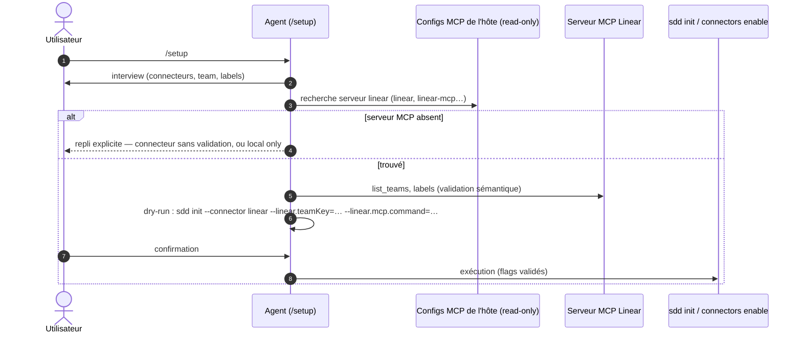

# Spec: 006 - Skill /setup — interview et validation MCP

## Metadata
* **Domain:** `.sdd/knowledge/domains/spec-model/`
* **Change Type:** `New Capability`
* **Complexity:** `Medium`
* **Feature:** `02-setup-skill`
* **Initiative:** `setup-experience`

---

## 1. Intent & Context (*The Why*)

* **Problem Statement / Need:** La configuration d'un connecteur exige des valeurs sémantiquement valides (`teamKey` existe, labels corrects) et un transport MCP résolu — informations que le CLI ne peut ni deviner ni vérifier (offline, ADR-002). C'est le rôle naturel de l'agent : interview, découverte dans l'environnement, validation via MCP, puis délégation au CLI.
* **User / System Impact:** Un nouveau skill `/setup` guide l'adoptant de zéro à un workspace configuré et validé : connecteurs activés, settings vérifiés contre les vraies sources, transport MCP résolu depuis les configs de l'hôte — le tout persisté par les commandes `sdd` (jamais d'écriture directe).
* **In Scope (What is added / modified):**
  * `skills/setup/SKILL.md` : protocole conversationnel complet (interview → découverte → validation MCP → dry-run → application).
  * Découverte **read-only** des serveurs MCP dans les configs d'hôte connues (`.mcp.json` Claude Code, `opencode.json`, `.agents/**`) ; écriture du transport résolu via `--linear.mcp.*`.
  * Validation via MCP : `teamKey` (list teams), labels (existants ou à créer, dits explicitement).
  * README (liste des skills) ; structure prête pour les futurs connecteurs (github via `gh`).
* **Out of Scope (Strict Exclusions):**
  * Provisioning de l'hôte (l'agent ne modifie jamais `.mcp.json`/`opencode.json`) — lecture seule.
  * Connecteur GitHub et détection `gh` ; implémentation MCP (feature `03-linear-mcp`) ; toute logique CLI.

> *Clean Omission Note : Section 3 (File Inventory) se réduit au skill + doc : ce spec ne touche aucun fichier `src/` ni `test/` — la couche CLI livrée en 004/005 est son unique interface d'écriture.*

---

## 2. Flow & Architecture



---

## 3. File Inventory & Responsibilities

### 3.1. Factorized File Tree

```text
skills/setup/SKILL.md                [NEW] protocole /setup : interview, découverte read-only, validation MCP, dry-run, application
README.md                            [MOD] liste des skills (+ /setup)
```

### 3.2. Key Contracts & Signatures

```markdown
## Protocole SKILL.md — phases ordonnées
1. Interview: connecteurs cibles, team, labels — une question à la fois
2. Découverte: parse .mcp.json / opencode.json / .agents/** (read-only)
   → transport résolu {command,args} | {url} ; absent → repli explicite (INV-2)
3. Validation: teamKey via MCP list_teams ; labels via MCP — chaque valeur
   non vérifiable est marquée "(non vérifiée)" dans la synthèse (INV-1)
4. Synthèse + dry-run: la commande `sdd init …` complète est affichée
5. Application: exécution après confirmation — jamais d'écriture directe (INV-3)
6. Idempotence: relance détecte l'existant (sdd status), propose le merge (INV-4)
```

---

## 4. Detailed Specifications

### 4.1. Data Models & API Contracts

* **Interface avec le CLI** : uniquement les commandes livrées — `sdd status`, `sdd init --connector linear --linear.<key>=<v>…`, `sdd connectors enable` ; flags settings namespacés (004), transport `--linear.mcp.command/-args/url` (005).
* **Config d'hôte lues** : `.mcp.json` (Claude Code : `mcpServers`), `opencode.json` (`mcp`), `.agents/**` — formats mappés en `{command,args}|{url}` ; format inconnu → ignoré sans erreur.
* **Valeurs jamais devinées** : tout défaut vient du manifest ou de l'utilisateur — l'agent n'invente ni team ni URL.

### 4.2. UI & Interaction Specifications (CLI)

| État | Déclencheur | Comportement |
|---|---|---|
| **Nominal** | `/setup` sur repo sans `.sdd/` | Interview → découverte → validation → synthèse → dry-run → confirmation → `sdd init` validé. |
| **MCP absent** | serveur linear introuvable dans l'hôte | Repli explicite proposé : activer sans validation sémantique (moyens donnés), ou rester local — jamais d'échec silencieux. |
| **Workspace existant** | re-run `/setup` | `sdd status` lu d'abord ; ajustements proposés en merge (idempotent). |
| **Utilisateur refuse** | confirmation refusée | Rien n'est exécuté ; la synthèse reste consultable. |

---

## 5. Business Invariants & Test Traceability

* **INV-1 · Valeurs vérifiées ou marquées** — l'agent ne passe au CLI que des valeurs validées via MCP ; toute valeur non vérifiable est marquée « (non vérifiée) » dans la synthèse avant application.
  ↳ *Covered by:* protocole SKILL.md §3-4 (couche agent — non automatisable ; la barrière dure reste le CLI, tests 004/005)
* **INV-2 · Repli explicite si MCP absent** — pas de secret, pas d'invention : l'agent propose les deux chemins (non validé / local) et laisse l'humain choisir.
  ↳ *Covered by:* protocole SKILL.md §2
* **INV-3 · Persistence exclusivement via CLI** — `sdd init`/`connectors enable` avec dry-run affiché et confirmation ; jamais d'écriture `.sdd/config.json` ni de fichier modèle (rule 7).
  ↳ *Covered by:* protocole SKILL.md §5 + tests CLI 004 (dry-run, idempotence)
* **INV-4 · Idempotent** — relance détecte l'existant (`sdd status`), propose le merge, ne duplique rien.
  ↳ *Covered by:* protocole SKILL.md §6

---

## 6. Technical Watchouts & Anti-Patterns

* **Ne jamais paraphraser la config hôte en secrets** : si une config MCP hôte contient un token (env var dans `command`), l'agent le transmet tel quel au transport — ne jamais l'afficher, le logger ou le copier dans un setting.
* **Découverte tolérante** : configs d'hôte malformées → ignorées (warning), jamais bloquantes ; la présence de plusieurs serveurs linear-like → demander à l'humain.
* **Ordre des phases non négociable** : pas de dry-run avant validation complète de la synthèse ; pas d'exécution avant confirmation explicite.
* **Rester dans le langage de l'utilisateur** : le skill s'adresse à l'adoptant — pas de jargon CLI non expliqué dans les questions.
* **Dogfood** : le skill s'applique à ce repo lui-même pour sa propre validation (le workspace existe déjà → branche idempotence).

---

## 7. Sequential Execution Plan

- [x] **Phase 1: Protocole**
  - [x] `skills/setup/SKILL.md` : frontmatter, description, phases 1-6, exemples de synthèse/dry-run, garde-fous INV-1..4.
- [x] **Phase 2: Wiring docs**
  - [x] `README.md` : section skills + mention `/setup` dans le flow d'adoption.
- [x] **Phase 3: Dogfood & gates**
  - [x] Relecture croisée du protocole contre INV-1..4 ; dry-run mental sur ce repo (workspace existant).
  - [x] Gates : `npm test`, `node bin/sdd.js validate`, `node bin/sdd.js render --check`.

---

## 8. BDD Validation & Quality Gates

### 8.1. Exhaustive Gherkin Scenarios

> Couche agentique : les scénarios sont des contrats comportementaux du protocole — la couche CLI sous-jacente (dry-run, merge, validate) est automatisée par les specs 004/005 ; le skill est validé par relecture et dogfood, pas par node:test.

```gherkin
Feature: Skill /setup — interview et validation MCP

  @protocol
  Scenario: [INV-1] Toute valeur est vérifiée ou marquée
    Given un adoptant qui déclare team "ENG" et label "SPEC"
    When l'agent interroge le MCP (list_teams, labels)
    Then la synthèse affiche chaque valeur avec son statut (vérifiée / non vérifiée) et le dry-run n'est proposé qu'après

  @protocol
  Scenario: [INV-2] Repli explicite sans MCP
    Given aucun serveur linear dans les configs de l'hôte
    When l'agent atteint la phase découverte
    Then les deux options de repli sont proposées et l'humain arbitre — aucune exécution

  @protocol
  Scenario: [INV-3] Persistence via CLI uniquement
    Given une synthèse confirmée
    When l'agent applique
    Then la commande exécutée est `sdd init --connector linear --linear.teamKey=… --linear.mcp.…` (dry-run préalable) — aucun fichier écrit à la main

  @protocol
  Scenario: [INV-4] Re-run idempotent
    Given un workspace déjà configuré avec linear
    When /setup est relancé
    Then l'existant est détecté (sdd status), des ajustements en merge sont proposés, rien n'est dupliqué
```

### 8.2. Execution Commands & Quality Gates

```bash
# 1. Suite complète (la couche CLI doit rester verte)
npm test

# 2. Gates canoniques
node bin/sdd.js validate
node bin/sdd.js render --check
```

---

<a id="appendix-file-index"></a>
## Appendix: File Index

| Short File Name | Project Relative Path |
|---|---|
| `setup-skill` | `skills/setup/SKILL.md` |
| `readme` | `README.md` |
