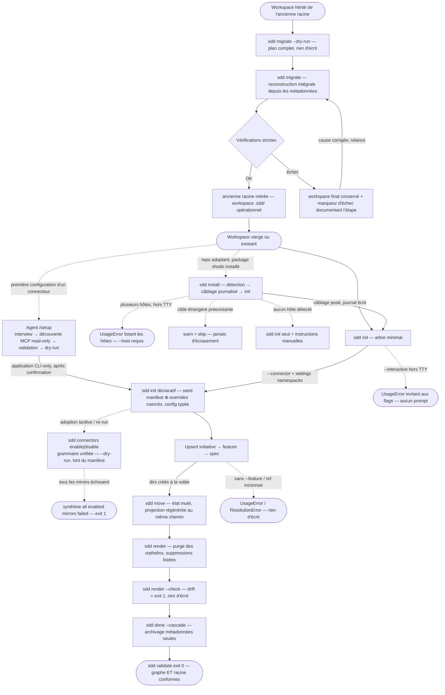

# Domaine : Workspace Management (spec-model) — Comportement Produit

> **Mission :** Gouverner le workspace SDD : créer, lier, faire vivre, migrer et archiver les artefacts du modèle canonique (`vision`, `initiative`, `feature`, `spec`) via le CLI `spec`, avec un cycle de vie porté par les métadonnées — jamais par les chemins.
> **Acteurs & Personas :** Utilisateur humain (lead/dev qui pilote le process), Agent (orchestrateurs spécialisés : `/initiative`, `/feature`, `/spec`, `/sync-knowledge`…), Agent amorceur (`/setup` — configuration des connecteurs, protocole `skills/setup/SKILL.md`).

---

## 1. Périmètre & Frontières du Domaine (Bounded Context)

* **Ce qui relève de ce domaine (In Scope) :**
  * Bootstrap et layout du workspace : `.sdd/canonical/` sans état, tout répertoire créé à la volée.
  * Amorçage one-command d'un repo adoptant : `sdd install` — détection des hôtes agentiques, câblage idempotent et réversible des skills/agents pointant le package installé, enchaînement `sdd init`, `--undo` journal-based (cf. `PAR-WM-08`).
  * Amorçage déclaratif des connecteurs : déclaration par flags (`sdd init --connector …`), settings seedés depuis les manifests avec overrides namespacés, interview TTY optionnelle, re-init idempotent — la config des miroirs se pose à la création du workspace comme après coup via `sdd connectors enable|disable` (même grammaire que `init`, `--dry-run` réel ; le mirroring lui-même reste hors graphe).
  * Amorçage guidé des connecteurs : l'agent `/setup` conduit l'adoptant de zéro à un workspace configuré et validé — interview, découverte read-only du transport MCP de l'hôte, validation sémantique via MCP, application CLI-only (cf. `PAR-WM-07`).
  * Cycle de vie des artefacts : cadrage du graphe, transitions d'état, achèvement en cascade.
  * Intégrité du graphe : relations, unicité des ids, dérivabilité des chemins.
  * Gouvernance des projections : elles vivent sous `.sdd/generated/`, écrites et purgées exclusivement par le CLI — jamais éditées à la main.
  * Migration de workspaces : conversion de tout workspace hérité de l'ancienne racine vers la racine finale `.sdd/`, par reconstruction intégrale depuis les métadonnées (`sdd migrate` — livrée, cf. `PAR-WM-06`).
* **Ce qui relève d'autres domaines (Out of Scope & Frontières) :**
  * *Rendu des projections markdown :* feature `02-generated-namespace` (livrée) — namespace `.sdd/generated/`, purge des orphelins listée et prévisualisable, garde de drift `render --check` (cf. `PAR-WM-05`).
  * *Entrée racine optionnelle `site/` :* déléguée à `04-static-site` (à venir — elle étendra la racine autorisée).
  * *Mirroring distant :* Linear reste un miroir ; le modèle canonique est la seule vérité ; l'authentification vit dans le transport MCP de l'environnement — jamais dans le framework ([ADR-002](../../decisions/architecture/ADR-002-transport-connecteurs-environnement.md)) ; la validation sémantique des settings (teamKey, labels) est agent-side (`/setup`), jamais CLI.

---

## 2. Vue d'Ensemble & Diagramme des Flux

---

## 3. Cartographie des Parcours

| Réf | Parcours | Acteur principal | Déclencheur | Résultat visible |
|---|---|---|---|---|
| `PAR-WM-01` | Bootstrap du workspace | Utilisateur / Agent | `sdd init [--connector <id>… \| --interactive]` | `.sdd/` + `canonical/` + `config.json` (connecteurs déclarés par flags ou interview optionnelle) |
| `PAR-WM-02` | Cadrer le graphe | Agent orchestrateur | `sdd upsert <kind>` | Artefacts écrits à leur emplacement canonique définitif |
| `PAR-WM-03` | Piloter le cycle de vie | Utilisateur / Agent | `sdd move <ref> --to <state>` | État muté ; projections régénérées au même chemin — zéro fichier déplacé ni renommé |
| `PAR-WM-04` | Achever & archiver en cascade | Agent orchestrateur | `sdd done <ref> --cascade` | Spec puis parents complets archivés |
| `PAR-WM-05` | Synchroniser & auditer les projections | Utilisateur / Agent | `sdd render` / `--dry-run` / `--check` | Projections sous `.sdd/generated/` fidèles au modèle ; drift signalé sans écriture |
| `PAR-WM-06` | Migrer un workspace hérité | Utilisateur / Agent | `sdd migrate [--dry-run]` | Workspace reconstruit intégralement à la racine `.sdd/`, ancienne racine retirée — ou plan complet sans écriture en `--dry-run` |
| `PAR-WM-07` | Amorçage guidé d'un connecteur (`/setup`) | Agent amorceur (`/setup`) | Commande `/setup` ou demande de configuration d'un miroir | Workspace configuré et validé : connecteur activé, settings vérifiés, transport MCP résolu — persisté exclusivement par le CLI |
| `PAR-WM-08` | Amorcer un repo adoptant (`sdd install`) | Utilisateur / Agent | `sdd install [--host <id>] [--dry-run] [--undo] [--no-init]` | Hôtes câblés (skills/agents → package installé), workspace initialisé, récap + pointer `/setup` — ou plan affiché en `--dry-run`, câblages retirés en `--undo` |

---

## 4. Fiches Détaillées des Parcours

### `PAR-WM-01` : Bootstrap du workspace
* **Acteur :** Utilisateur / Agent.
* **Prérequis :** répertoire de travail ; `--force` seul écrase une config existante.
* **Déclencheur :** `sdd init`.
* **Déroulement nominal :** 1. création de `.sdd/` et `.sdd/canonical/` ; 2. écriture de `config.json` ; 3. aucun autre répertoire n'est pré-alloué.
* **Post-conditions :** workspace minimal ; le reste naît à la volée à la première écriture.
* **Variantes :** *Init déclaratif :* `sdd init --connector linear --linear.teamKey=ENG --linear.labels.spec=SPEC` — résout le manifest du connecteur, seed les défauts, merge les overrides coercés, écrit `config.json` et affiche le plan (`settings: teamKey=ENG, labels.spec=SPEC, stateMap=<défauts>…`). *Adoption tardive (grammaire unifiée) :* `sdd connectors enable linear --teamKey=ENG --mcp.command=npx --mcp.args=-y` sur un workspace déjà initialisé partage la grammaire d'`init` — clés top-level (`--teamKey=ENG`) et chemins dotted top-level d'un setting déclaré (`--mcp.command=npx`) rattachées au connecteur positionnel, forme namespacée acceptée si elle porte le même id (`--linear.mcp.command=…`) ; un namespace étranger est refusé sans rien écrire. *Preview de la config :* `--dry-run` (sur `init` comme sur `connectors enable|disable`) affiche la config résolue/projetée (JSON) sans rien écrire. *Re-init idempotent :* ré-exécuter `sdd init` (ou `sdd connectors enable linear`) fusionne sans dupliquer ni effacer — les défauts du manifest ne ré-écrasent jamais une valeur déjà posée. *Interview TTY :* `sdd init --interactive` — multi-select des connecteurs (le modèle local est intrinsèque, jamais proposé) puis prompts typés feuille par feuille, défauts pré-remplis. *Hors TTY (CI) :* `--interactive` sans terminal → erreur invitant aux flags explicites, aucun prompt, rien d'écrit.

### `PAR-WM-02` : Cadrer le graphe
* **Acteur :** Agent orchestrateur (skills `/initiative`, `/feature`, `/spec`).
* **Prérequis :** workspace initialisé ; pour une spec, une feature parente existante.
* **Déclencheur :** `sdd upsert <kind> --slug … [--feature <ref>]`.
* **Déroulement nominal :** 1. résolution du parent ; 2. dérivation des `relations` (l'initiative dérive de la feature) ; 3. écriture JSON + MD à l'emplacement définitif.
* **Post-conditions :** artefact indexé, projections régénérées sous `.sdd/generated/` ; re-upserter un slug existant met à jour titre/état in situ sans déplacer le répertoire.
* **Variantes :** *Re-parentage :* `sdd link <ref> --feature|--initiative` change le parent et reloge les fichiers de la spec (et de ses descendants pour une feature) — seule opération qui déplace des fichiers.

### `PAR-WM-03` : Piloter le cycle de vie
* **Acteur :** Utilisateur / Agent.
* **Prérequis :** artefact existant ; transition cible légale : `planned → active|archived`, `active → planned|archived`, `archived → active`.
* **Déclencheur :** `sdd move <ref> --to <state>` (saisie tolérante : `archive`, `Active`, `plan`…).
* **Déroulement nominal :** 1. mutation de `state` + `updatedAt` dans la métadonnée ; 2. régénération index + projections **au même chemin** — plus aucun répertoire d'état ni renommage ; 3. confirmation de la transition.
* **Post-conditions :** arborescence bit-à-bit inchangée ; idempotent, `--dry-run` n'écrit rien.

### `PAR-WM-04` : Achever & archiver en cascade
* **Acteur :** Agent orchestrateur (`/sync-knowledge`), après quality gates verts.
* **Prérequis :** spec livrée ; parents à archiver identifiables par complétude des enfants.
* **Déclencheur :** `sdd done <ref> [--cascade]`.
* **Déroulement nominal :** 1. `progress.done = true` + archivage de la spec ; 2. remontée : chaque parent dont **tous** les enfants sont complets est archivé à son tour ; 3. régénération des projections affectées.
* **Post-conditions :** `--undo` rouvre l'artefact en `active` ; aucun fichier déplacé.

### `PAR-WM-05` : Synchroniser & auditer les projections
* **Acteur :** Utilisateur / Agent.
* **Prérequis :** workspace initialisé ; `knowledge/`, `canonical/` et `config.json` sont hors de portée de cette commande.
* **Déclencheur :** `sdd render` (rendu + purge), `sdd render --dry-run` (prévisualisation), `sdd render --check` (garde CI).
* **Déroulement nominal (rendu) :** 1. les projections attendues sont écrites sous `.sdd/generated/` (vision, README d'initiative, features et specs aplaties triées par id) ; 2. tout markdown non projeté est purgé et sa suppression listée ; 3. table des changements (`created` / `updated` / `removed`).
* **Variantes :** *Prévisualisation :* `--dry-run` exécute les mêmes calculs sans rien écrire et se termine par `(dry-run: nothing was written)`. *Garde CI :* `--check` est en lecture seule et sort 1 dès qu'une projection est obsolète, manquante ou parasite — seule `generated/` est couverte.
* **Post-conditions :** `generated/` reflète exactement le modèle ; avec `projections.markdown: false`, aucune projection markdown n'est écrite ni exigée (`--check` sort 0 vacuement).

### `PAR-WM-06` : Migrer un workspace hérité
* **Acteur :** Utilisateur / Agent.
* **Prérequis :** un workspace hérité de l'ancienne racine, identifiable par ses métadonnées déclarées (index des artefacts) ; commit git propre — git est le filet, la bascule est destructrice au succès.
* **Déclencheur :** `sdd migrate --dry-run` (prévisualisation), puis `sdd migrate`.
* **Déroulement nominal :** 1. le type de workspace est déterminé uniquement par ses métadonnées déclarées — jamais par la forme des répertoires ni par leur contenu accessoire ; 2. `--dry-run` produit un plan complet sans rien écrire : inventaire des artefacts, divergences entre le disque et les métadonnées, réécritures de chemins, avertissements de configuration, suppressions planifiées ; 3. exécution : le workspace final est **reconstruit intégralement** depuis les métadonnées — chaque artefact est réécrit à l'emplacement que ses relations dictent, jamais à celui où il traîne ; un workspace à moitié construit est repris de zéro, jamais fusionné ; 4. vérifications strictes du résultat (intégrité du graphe, fidélité des projections) ; 5. au succès, l'ancienne racine est retirée intégralement.
* **Post-conditions :** workspace opérationnel à la racine `.sdd/`, graphe préservé à l'identique (identifiants, slugs, relations, avancement, refs distantes) ; un second `sdd migrate` ne fait rien.
* **Variantes :** *Déjà migré :* no-op, rien d'écrit. *Coexistence (migration pendue ou en échec) :* le workspace à moitié construit est effacé puis reconstruit de zéro — c'est la seule issue, toutes les autres écritures étant refusées. *Workspace non identifiable (markdown seul, sans index de métadonnées) :* erreur orientée `sdd import` (conversion complète) ou `sdd init` (workspace vierge) — rien d'écrit.

### `PAR-WM-07` : Amorçage guidé d'un connecteur (`/setup`)
* **Acteur :** Agent amorceur — le protocole de référence est le skill `skills/setup/SKILL.md` ; cette fiche résume son parcours observable côté adoptant.
* **Prérequis :** un répertoire de travail ; pour la validation sémantique, un serveur MCP Linear accessible dans l'environnement — sinon repli explicite.
* **Déclencheur :** `/setup` (ou demande de configuration d'un connecteur miroir).
* **Déroulement nominal :** 1. interview — une question à la fois (connecteurs cibles, team, labels), après un premier `sdd status` ; 2. découverte read-only des configs MCP de l'hôte (`.mcp.json`, `opencode.json`, `.agents/**`) → transport résolu `{command,args}` ou `{url}` ; 3. validation sémantique via MCP (team, labels) — toute valeur non vérifiable entre en synthèse marquée « (non vérifiée) » ; 4. synthèse complète puis `sdd init --connector linear … --dry-run` (la commande exacte est affichée) ; 5. après confirmation explicite, application par la commande validée (`sdd init` ou `sdd connectors enable`) — jamais d'écriture manuelle de fichier ; 6. clôture par `sdd validate`.
* **Post-conditions :** connecteur activé avec `teamKey` et transport MCP résolus ; `sdd validate` exit 0 ; aucun secret affiché, copié ou persisté.
* **Variantes :** *Serveur MCP introuvable :* repli explicite — activer sans validation sémantique (valeurs marquées « (non vérifiée) ») ou rester local ; l'humain arbitre, rien ne s'exécute sans lui. *Confirmation refusée :* rien n'est exécuté, la synthèse reste consultable. *Workspace déjà configuré (relance) :* ajustements proposés en merge après lecture de `sdd status` — rien n'est dupliqué.

### `PAR-WM-08` : Amorcer un repo adoptant (`sdd install`)
* **Acteur :** Utilisateur / Agent.
* **Prérequis :** package shodo installé (`npm i -g shodo`, `npx shodo install`, ou clone) ; repo cible quelconque (workspace `.sdd/` absent ou existant). Tout est offline.
* **Déclencheur :** `sdd install` — flags : `--host auto|opencode|claude|agents`, `--init/--no-init`, `--dry-run`, `--undo`.
* **Déroulement nominal :** 1. détection des hôtes par marqueurs (`opencode.json`, `.claude/`, `.agents/`) — un `--host` explicite gagne toujours sur la détection ; 2. plan pur : entrées `opencode-path` / `symlink` pointant le package **en cours d'exécution** (résolu depuis le module — jamais le répertoire courant) ; 3. câblage idempotent : merge structurel de `skills.paths` dans `opencode.json` (clés et ordre préservés, valeur ajoutée une seule fois), symlinks `.claude/{skills,agents}/shodo` (resp. `.agents/…`) ; 4. `sdd init` (sauf `--no-init`) puis écriture du journal — dans un `finally`, le câblage reste réversible même si init échoue ; 5. récapitulatif + pointer vers le skill `/setup`.
* **Post-conditions :** skills/agents câblés vers le module installé (zéro copie divergente) ; journal `.sdd/.install-journal.json` posé ; un second install est un no-op ; `sdd validate` reste exit 0 (fichier journal toléré).
* **Variantes :** *Dry-run :* plan affiché (hôtes, entrées, init), rien d'écrit. *Ambiguïté TTY :* multi-select des hôtes détectés (annulation ⇒ erreur propre) ; hors TTY (CI) : erreur listant les hôtes, `--host` requis. *Cible étrangère préexistante :* warn + skip — jamais d'écrasement ; symlink shodo périmé (pointant un ancien pkgRoot journalisé) : repointé vers le package courant. *Windows EPERM :* fallback copie récursive + warning (ré-installer après update du package pour rafraîchir). *Aucun hôte détecté :* `sdd init` seul + instructions de câblage manuel ; les templates ne sont pas câblés (les agents les lisent du package au runtime). *Undo :* `sdd install --undo` retire exactement les entrées journalisées (symlinks + valeur `opencode.json`), supprime le journal ; sans journal : erreur propre, rien d'écrit.

---

## 5. Invariants & Règles Métier

* **`RULE-WM-01` (État en métadonnées) :** l'état de cycle de vie vit exclusivement dans la métadonnée `state` et l'index ; aucun chemin ne l'encode, `sdd move` ne déplace aucun fichier.
* **`RULE-WM-02` (Slug immuable) :** le slug d'un artefact — donc son chemin — ne change jamais après création ; seul le titre est modifiable (PDR-001).
* **`RULE-WM-03` (Ids uniques et non réutilisés) :** l'id de spec est unique au niveau du modèle, alloué séquentiellement (max+1), jamais réalloué ; 3 ou 4 chiffres.
* **`RULE-WM-04` (Chemin dérivé des relations) :** tout chemin canonique dérive des slugs/ids et de `relations` seul ; une spec sans parent est rejetée avant toute écriture.
* **`RULE-WM-05` (Dry-run d'abord) :** toute mutation est prévisualisable (`--dry-run`), idempotente en ré-exécution, réversible (`done --undo`) ; toute erreur laisse le workspace intact.
* **`RULE-WM-06` (Projections sous `generated/`, racine exhaustive) :** toute projection markdown vit sous `.sdd/generated/` ; la racine `.sdd/` ne contient que `config.json`, `canonical/`, `generated/`, `knowledge/` — toute autre entrée est rejetée par `sdd validate` (règle `root-layout`, fichiers cachés tolérés).
* **`RULE-WM-07` (`generated/` intégralement régénérable) :** le CLI est le seul écrivain de `generated/` ; tout markdown non projeté est purgé et sa suppression listée, prévisualisable via `--dry-run` ; `knowledge/`, `canonical/` et `config.json` sont hors de portée du render.
* **`RULE-WM-08` (Migration = reconstruction, jamais de merge) :** une migration reconstruit toujours le workspace de zéro depuis ses métadonnées ; un workspace à moitié migré n'est jamais fusionné — il est effacé et reconstruit ; un workspace déjà migré n'est plus retouché.
* **`RULE-WM-09` (Coexistence verrouillée) :** tant qu'une migration est pendue ou en échec (les deux racines coexistent), toute écriture du CLI est refusée — seules les lectures restent possibles, sur la racine finale ; la reprise passe exclusivement par `sdd migrate`, qui reprend de zéro.
* **`RULE-WM-10` (Succès strict, échec matérialisé) :** une migration ne se déclare réussie qu'après vérifications complètes du workspace reconstruit (intégrité du graphe, fidélité des projections) ; en cas d'échec, l'ancienne racine est conservée intacte et un marqueur d'échec documente l'étape fautive — la reprise repart de zéro.
* **`RULE-WM-11` (Amorçage manifest-driven) :** le CLI ne contient aucune connaissance spécifique à un connecteur ; un `--connector <id>` absent du catalogue (builtins + `extensions/*/extension.json`) est rejeté avant toute écriture — le manifest (`settings`, `settingTypes`, `requiredSettings`) est l'unique source de vérité des settings déclarables.
* **`RULE-WM-12` (Re-init idempotent) :** ré-exécuter `sdd init` ou `sdd connectors enable/disable` fusionne sans dupliquer ni effacer — les valeurs explicites (flags ou interview) gagnent, les défauts du manifest ne ré-écrasent jamais une valeur utilisateur, un connecteur jamais déclaré n'est jamais retiré, et `connectors[]` reste triée par id.
* **`RULE-WM-13` (Interactif explicite, CI-safe) :** les prompts ne surviennent que si `--interactive` ET un terminal (TTY) ; sinon erreur claire invitant aux flags — sans `--interactive`, aucun prompt jamais, même interactif implicite.
* **`RULE-WM-14` (Coercion stricte) :** les settings sont typés par le manifest — booléens `true|false` uniquement (`1/0/yes/no` refusés), nombres numériques, objets par feuilles (subkeys, profondeur ≤ 2) ; toute valeur non coercible est rejetée en citant `<id>.<key>`, rien d'écrit.
* **`RULE-WM-15` (`local` intrinsèque) :** le connecteur du modèle local n'apparaît jamais dans `connectors[]` ni dans l'interview — le modèle canonique est toujours la source de vérité, jamais un miroir.
* **`RULE-WM-16` (Zéro secret dans le framework) :** aucun connecteur ne détient ni ne demande d'identifiant — le bloc `authentication` du manifest Linear est supprimé (fin du token Linear, cf. [ADR-002](../../decisions/architecture/ADR-002-transport-connecteurs-environnement.md)) ; `sdd validate` rejette des settings portant une clé de forme secrète (`apiKey`, `token`, `secret` — clé ou suffixe, case-insensitive, imbriqué) ; l'authentification est la responsabilité exclusive du transport d'environnement.
* **`RULE-WM-17` (Inopérant sans transport résolu) :** sans `settings.mcp` (absent ou vide), `sync`/`move` n'opèrent aucun mirroring — erreur par artefact « no MCP transport configured — run /setup », aucun `remoteRef` écrit ; `sdd validate` signale le connecteur incomplet (exit 1) ; jamais de repli implicite vers une auth directe.
* **`RULE-WM-18` (Contrat miroir inchangé) :** le passage au transport MCP est invisible pour l'appelant — mêmes opérations (`resolve/list/transition/create/link`), mêmes refs `remoteRef`, même `--dry-run`, mêmes call-sites `sync/move/done` ; `sdd sync`/`sdd move` restent des invocations binaires déterministes et CI-friendly (jamais d'orchestration d'agent).
* **`RULE-WM-19` (Client éphémère) :** chaque commande ouvre son propre client MCP et le referme — aucun serveur résident, aucune socket persistée entre deux invocations ; un crash, un timeout ou une erreur laisse l'environnement intact.
* **`RULE-WM-20` (Grammaire unifiée `init`/`connectors enable\|disable`) :** l'activation et la désactivation tardives passent par les mêmes helpers du registre que `init` — les clés top-level non-namespacées (`--teamKey=ENG`) et les chemins dotted top-level d'un setting déclaré (`--mcp.command=npx`) se rattachent au connecteur positionnel, la forme namespacée étant acceptée quand elle porte le même id (`--linear.mcp.command=…`) ; un flag dotted dont le premier segment n'est ni le connecteur ni un setting top-level déclaré est refusé (rien d'écrit) ; une occurrence unique d'un flag répété reste scalaire — le tableau ne naît que de la répétition ; le contournement documenté dans `/setup` (pas de dry-run sur enable) a été retiré du skill.
* **`RULE-WM-21` (Exit honnête sur échec total de miroir) :** dans `sync`/`move`, si au moins une opération de miroir a été tentée et qu'aucun miroir activé n'a réussi, la commande sort 1 avec la synthèse `all enabled mirrors failed (n/n)` — l'échec total n'est jamais levé en exception : le rapport détaillé par artefact/connecteur reste affiché (warnings d'abord, synthèse ensuite) ; un succès partiel, un modèle sans opération à tenter ou l'absence de miroir activé sortent 0 ; le `--dry-run` est exclu de cette agrégation.
* **`RULE-WM-22` (Hint manifest-driven) :** le message d'aide affiché quand les réglages obligatoires d'un connecteur activé restent incomplets vient du champ optionnel `hint` de son manifest — aucun id de connecteur n'est codé en dur dans le CLI ; le hint ne s'affiche qu'à l'activation incomplète (jamais sur `connectors list`, jamais sur une activation complète), et son absence retombe sur un message générique listant les réglages manquants.
* **`RULE-WM-23` (Dry-run sur la surface connecteurs) :** `connectors enable|disable <id> --dry-run` affiche la config projetée et n'écrit rien — même sémantique de preview zéro-octet que `init --dry-run` ; la grammaire étendue est optionnelle : `disable <id> --dry-run` (comme `enable`) fonctionne sans aucun flag de settings.
* **`RULE-WM-24` (Câblage vers le module installé, réversible) :** les paths et symlinks posés par `sdd install` pointent le pkgRoot effectif du package **en cours d'exécution** (`import.meta.url` — jamais `process.cwd()` : cache npx, `npm -g` ou clone) ; re-install idempotent (pas de doublon, symlink déjà correct = no-op) ; `--undo` retire exactement les entrées journalisées — le journal `.sdd/.install-journal.json` est l'unique source d'undo, jamais de suppression à la devinette.
* **`RULE-WM-25` (Jamais d'écrasement d'existant) :** une cible préexistante non possédée par shodo est warn + skip — jamais écrasée ; `opencode.json` est merge structurellement (clés et ordre préservés, seule la valeur manquante est ajoutée, jamais réécrit brut) ; un fichier illisible est refusé (`ConfigError`) sans être touché ; à l'`--undo`, un symlink ne pointant plus la source journalisée est laissé intact.
* **`RULE-WM-26` (Install offline) :** `sdd install` n'ouvre aucun réseau, ne demande aucune clé — tout passe par `node:fs` ; `sdd init` conserve sa sémantique (local par défaut, connecteurs via `--connector`/`/setup`).
* **`RULE-WM-27` (Ordre de phases, dry-run install) :** détection → câblage → `sdd init` ; `--dry-run` affiche le plan complet (hôtes, entrées, init) et n'écrit rien ; le journal est écrit après init dans un `finally` — le câblage reste réversible même quand init échoue.
* **`RULE-WM-28` (Dégradation propre sans hôte) :** sans hôte détecté, `sdd install` dégrade en `sdd init` seul + instructions de câblage manuel — jamais d'échec ; les templates ne sont pas câblés par défaut (les agents les lisent du package au runtime).

---

## 6. Matrice des États, Échecs & Cas Limites

| Situation / Déclencheur | Comportement & Réaction visible | Action de reprise utilisateur |
|---|---|---|
| `sdd upsert spec` sans `--feature` | UsageError « spec requires --feature », rien d'écrit | Lier la spec à une feature existante via `--feature` |
| Ref inconnue ou ambiguë (`move`, `done`, `link`) | ResolutionError, sortie non nulle, rien d'écrit | Vérifier la ref via `sdd list` / `sdd status` |
| Transition illégale (ex. `archived → planned`) | TransitionError listant les transitions permises | Repasser par `archived → active` ou choisir un état légal |
| Id de spec dupliqué (2 features distinctes) | `sdd validate` → règle `spec-id-uniqueness`, exit 1 | Réallouer l'id du nouvel artefact (max+1) |
| Projection obsolète, manquante ou parasite sous `generated/` | `sdd render --check` sort 1 en listant le drift (`stale` / `missing` / `unexpected`), rien n'est écrit | Lancer `sdd render` pour régénérer, puis re-vérifier |
| Entrée parasite à la racine `.sdd/` | `sdd validate` → règle `root-layout`, exit 1 | Déplacer ou supprimer l'entrée hors de `.sdd/` |
| Entrées héritées parasites à la racine `.sdd/` (ex. `specs/`, `initiatives/`, `vision.md`) | `sdd render` ne les purge plus ; `sdd validate` les refuse (exit 1) | Relancer `sdd migrate` si une migration est en cause, sinon déplacer ou supprimer l'entrée hors de `.sdd/` |
| Workspace hérité identifié (`sdd migrate --dry-run`) | Plan complet listé (artefacts, divergences disque ↔ métadonnées, réécritures, suppressions) sans rien écrire — exit 0 même si des divergences bloquantes existent (listées comme abort planifié) | Relire le plan, committer proprement (git est le filet), corriger les divergences bloquantes si besoin, puis `sdd migrate` |
| Migration interrompue : les deux racines coexistent | Toute écriture refusée (exit 1) avec l'instruction de relancer `sdd migrate` ; les lectures restent possibles sur la racine finale | Relancer `sdd migrate` — le workspace à moitié construit est repris de zéro |
| Vérifications strictes en échec pendant la migration | Le workspace final est conservé avec un marqueur d'échec documentant l'étape (exit 1) ; l'ancienne racine reste intacte | Corriger la cause (ex. conflit d'identifiants) sur la source, relancer `sdd migrate` |
| Workspace hérité non identifiable (markdown sans index de métadonnées) | Erreur orientée `sdd import` (conversion complète) ou `sdd init` (workspace vierge), rien d'écrit | Restaurer les métadonnées depuis git, ou convertir via `sdd import` / repartir via `sdd init` |
| `sdd import` alors qu'un modèle existe déjà | Refus orientant `sdd migrate`, rien d'écrit | Utiliser `sdd migrate` (la reconstruction part des métadonnées, jamais des positions des markdown) |
| `sdd init --connector ghost` (id hors catalogue) | UsageError exit 2 citant le catalogue connu, rien d'écrit | Déclarer le connecteur via `extensions/<id>/extension.json` ou corriger l'id |
| `sdd init --interactive` hors TTY (CI) | UsageError invitant aux flags explicites, aucun prompt, rien d'écrit | Utiliser `sdd init --connector <id>… --<id>.<key>=<v>…` |
| Valeur non coercible (ex. `--linear.createOnMove=1`) | UsageError exit 2 citant `linear.createOnMove` — booléen strict `true\|false` uniquement | Corriger la valeur (les types déclarés viennent du manifest) |
| Flag de settings sans namespace correspondant (ex. `--ghost.teamKey=X` sans `--connector ghost`, ou `--ghost.teamKey=X` sur `connectors enable linear`) | UsageError exit 2 — namespace inconnu, rien d'écrit (sur `init` comme sur `connectors enable\|disable`) | Déclarer d'abord le connecteur (`--connector <id>`), aligner le namespace sur l'id du connecteur, ou utiliser une clé top-level d'un setting déclaré (ex. `--mcp.command=…`) |
| Connecteur activé incomplet (ex. linear sans `teamKey`) | `sdd validate` → finding `connector-settings` citant la `requiredSettings` manquante, exit 1 | Renseigner la setting (ex. `sdd connectors enable linear --teamKey=ENG`) |
| `sdd connectors enable <id>` laissant les réglages obligatoires incomplets | Activation enregistrée + hint du manifest affiché (ex. « Run /setup… ») ; sans `hint`, message générique listant les réglages manquants | Suivre le hint (skill `/setup`) ou renseigner les réglages manquants avec les mêmes flags |
| `sdd sync` (ou `move` d'un artefact lié) où tous les miroirs activés échouent | Warnings par artefact/connecteur puis synthèse `all enabled mirrors failed (n/n)`, **exit 1** — jamais une exception ; le rapport détaillé reste affiché | Corriger le transport MCP (`/setup`) ou le serveur distant, puis relancer `sdd sync` / `sdd move` |
| `sdd sync` sans miroir activé, ou modèle sans aucune opération à tenter | Warning « no remote mirror enabled » (ou rapport vide) — **exit 0** ; l'agrégation d'échec ne s'applique qu'à des opérations tentées | Activer un connecteur (`sdd connectors enable <id>`) si un miroir est attendu |
| `sdd sync --create` (ou `move` d'un artefact lié) avec linear activé sans `settings.mcp` | Erreur par artefact « no MCP transport configured — run /setup » (warning) ; aucun `remoteRef` écrit ; la commande se termine normalement | Lancer le skill `/setup`, ou `sdd connectors enable linear --linear.mcp.command=… --linear.mcp.args=…` — puis `sdd validate` (exit 0 attendu) |
| Settings d'un connecteur portant une clé de forme secrète (`apiKey`, `token`, `secret`…) | `sdd validate` → finding `connector-settings` citant le chemin (`settings must not contain secrets (…)`), exit 1 | Retirer le secret des settings — l'authentification vit dans le transport d'environnement (ADR-002) |
| Première configuration d'un connecteur miroir | Parcours guidé `/setup` (`PAR-WM-07`) : interview → découverte MCP read-only → validation → dry-run → application CLI-only | Re-run `/setup` pour des ajustements (mode merge, idempotent) |
| Re-init / re-enable sur une config déjà peuplée | Merge idempotent : les défauts du manifest n'écrasent pas les valeurs posées, connecteurs conservés, liste triée | — |
| Projections désactivées (`projections.markdown: false`) | Aucune projection markdown n'est écrite ; `--check` sort 0 (aucune projection attendue) | Réactiver dans `config.json` (absence de la clé = activé) |
| `sdd install` — plusieurs hôtes détectés sans `--host`, stdout hors TTY (CI) | UsageError listant les hôtes détectés (`id — evidence`), rien d'écrit | Relancer avec `--host <id>` (un run par hôte), ou choisir dans le multi-select en TTY |
| `sdd install --host cursor` (hôte hors registre) | UsageError citant les hôtes valides (`auto | opencode | claude | agents`), rien d'écrit | Choisir un hôte du registre (le registre est extensible : ajouter une entrée `detect` + `plan` à `HOSTS`) |
| `sdd install --undo` sans journal | UsageError « Nothing to undo — no install journal found at .sdd/.install-journal.json », rien d'écrit | Le journal est l'unique source d'undo — si le journal a été supprimé, retirer les câblages manuellement |
| Cible préexistante étrangère (`.claude/skills/shodo` pointant ailleurs) | Warning + skip, cible intacte, install continue (exit 0) | Retirer/renommer la cible étrangère puis relancer `sdd install` |
| Symlink shodo périmé (pointant un ancien pkgRoot journalisé) | Repointé vers le package courant, stamp `created` d'origine conservé — re-install attendu après update du package | — |
| Windows : création de symlink refusée (EPERM) | Fallback copie récursive + warning expliquant de ré-installer après update ; à l'`--undo`, la copie est laissée en place (warning) | Ré-exécuter `sdd install` après mise à jour du package pour rafraîchir la copie |
| `opencode.json` illisible ou non-objet lors du merge | ConfigError « fix it before running `sdd install` (nothing was overwritten) », rien d'écrasé | Corriger `opencode.json` puis relancer |
| Aucun hôte détecté (repo vierge) | `sdd init` seul + instructions de câblage manuel (merge `opencode.json`, symlinks `.claude/`/`.agents/`), exit 0 | Suivre les instructions affichées (cf. README › Installation) |
| Journal posé par l'install | `.sdd/.install-journal.json` écrit après init (fichier caché toléré par `root-layout` — `sdd validate` reste exit 0) | `sdd install --undo` pour tout retirer |
