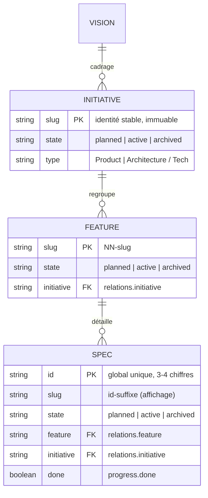

# Domaine : Workspace Management (spec-model) — Modèles de Données

> **Mission :** Modèle canonique sans état, stocké en fichiers sous la racine `.sdd/` : quatre kinds d'artefacts (métadonnée JSON + corps markdown) reliés par `relations` et indexés dans `index.json` v3 — projections markdown sous `.sdd/generated/` (100 % générées, purgées et régénérées par le CLI) ; aucun datastore SQL, aucune table.
> **Conventions Transversales :**
> * Identifiants : `id` de spec = compteur séquentiel global 3–4 chiffres (jamais réutilisé) ; initiative et feature utilisent leur slug comme id.
> * Audit : chaque métadonnée porte `createdAt` / `updatedAt` ; toute écriture passe par le CLI (zéro édition manuelle).

---

## 1. Périmètre & Frontières des Données

* **Entités gérées dans ce domaine (sous `.sdd/canonical/`) :**
  * `vision` : racine unique du graphe — `.sdd/canonical/sdd-vision.{json,md}`.
  * `initiative` : jalon stratégique — `.sdd/canonical/initiatives/<slug>/<slug>.{json,md}`.
  * `feature` : tranche livrable — `.sdd/canonical/initiatives/<init>/features/<slug>/<slug>.{json,md}`.
  * `spec` : delta d'ingénierie — `.sdd/canonical/…/specs/<id>.{json,md}` (nom de fichier = id seul).
* **Projections générées (`.sdd/generated/` — 100 % CLI, jamais éditées à la main, purge des orphelins au `render`) :**
  * `vision` → `.sdd/generated/sdd-vision.md` (une seule vision — le double racine est tombé avec la feature `02`).
  * `initiative` → `.sdd/generated/initiatives/<slug>/README.md`.
  * `feature` → `.sdd/generated/initiatives/<initiative>/features/<slug>.md` (aplatie au niveau initiative).
  * `spec` → `.sdd/generated/initiatives/<initiative>/specs/<id>.md` (nom de fichier = id seul, listes triées par id).
* **Frontières & Délégations :**
  * `knowledge/` (`.sdd/knowledge/decisions/` + `domains/`) : authored, **hors graphe**, jamais généré ni exigé (INV-4), hors de portée du render.
  * `generated/` : projections markdown régénérées par le CLI — hors graphe, intégralité régénérable (purge des orphelins, suppressions listées et prévisualisables ; l'horizon de purge est limité à `generated/` depuis le retrait du sweep hérité).
  * `config.json` (`.sdd/config.json`) : configuration du CLI, hors modèle — schéma **v3** (`version: 3`) : clés `version`, `sourceOfTruth`, `projections`, `connectors` ; toute clé top-level inconnue et tout connector `filesystem` (intrinsèque en v3) sont retirés avec warning lors de la conversion (`convertConfig`). Chaque entrée de `connectors[]` porte `{ id, type, enabled, settings }` — settings typés à l'écriture par le contrat de manifest (cf. §3) et **dépourvus de secret** (toute clé de forme `apiKey|token|secret` est rejetée par `validate`, cf. §4) ; le connecteur Linear porte un transport MCP résolu `settings.mcp` (`{command,args}` | `{url}` — cf. §3), écrit par le skill `/sdd-setup`, jamais de credential ; liste triée par id ; les connecteurs intrinsèques (`local`, `filesystem`) n'y figurent jamais.
  * `.sdd/.migration-failed.json` : marqueur d'échec de migration (`failedAt`, `stage` = `validate` | `render-check`, `message`) — fichier caché toléré par `root-layout`, hors modèle ; écrit par le gate strict quand une migration échoue, consommé par la reprise (`sdd migrate` reconstruit de zéro puis le retire avec la source).
  * `.sdd/.install-journal.json` : journal d'undo de `sdd install` (feature 01-install-command) — tableau d'entrées `{ kind, target, source, created }` (cf. §3), fichier caché toléré par `root-layout`, hors modèle ; écrit par l'install **après** `sdd init` dans un `finally` (le câblage reste réversible même si init échoue), fusionné par clé `kind:target` au re-install, consommé et supprimé par un `--undo` réussi — unique source d'undo.
  * `.sdd/.update-check.json` : cache du check de mise à jour post-run (feature 02-update-notice) — `{ lastCheck, latest }` (cf. §3), dotfile toléré par `root-layout`, hors modèle et hors graphe ; écrit par le hook post-run après chaque fetch — même en échec réseau, même en `--dry-run` — jamais créé si `.sdd/` n'existe pas (cache mémoire seule) ; `sdd validate` reste exit 0.

---

## 2. Diagramme Entité-Relation (ERD)



---

## 3. Dictionnaire des Données Métier

*Attributs porteurs de valeur métier (métadonnée schema v3 — `META_VERSION = 3`, structure inchangée du v2 hors `relations` de spec enrichi) :*

| Entité | Attribut | Type | Nullable | Contraintes | Rôle Métier |
|---|---|:---:|:---:|---|---|
| Tous | `state` | enum | Non | `planned \| active \| archived` | Cycle de vie — en métadonnée, jamais en chemin |
| Tous | `relations` | object | spec : Non | Cibles validées (`graph-integrity`) | Dérivent le chemin canonique (INV-1) |
| spec | `id` | string | Non | Global unique (INV-5) | Identité + nom de fichier |
| spec | `fields` | map | Oui | Ex. `Domain`, `Change Type` | Contexte libre typé |
| Tous | `remote` | map | Oui | Refs miroirs (Linear) | Projection distante |
| Tous | `progress.done` | boolean | Non | Cascade au `done` | Complétude remontée |

* **Source de reconstruction :** ces métadonnées (`state`, `relations`, `progress`, `remote`, `fields`, `id`, `slug`, `title`, dates) sont la seule source de vérité de la migration `sdd migrate` : toute conversion les recopie tels quels et dérive les destinations des relations — jamais de la position disque.

*Dictionnaire de `config.json` → `connectors[]` (hors graphe, écrite par le CLI via `init`/`connectors`, auditée par `validate`) :*

| Entité | Attribut | Type | Nullable | Contraintes | Rôle Métier |
|---|---|:---:|:---:|---|---|
| connector | `id` | string | Non | Unique dans `connectors[]` ; intrinsèques (`local`, `filesystem`) exclus | Identité du miroir + clé de namespace des settings flags |
| connector | `type` | string | Non | Résolu du manifest (`type ?? id`) | Sélection de la fabrique backend (`src/connectors/`) |
| connector | `enabled` | boolean | Non | `true` à la déclaration ; muté par `enable`/`disable` | Sélection des miroirs actifs (sync/status) |
| connector | `settings` | object | Oui | Typé par le manifest (`settingTypes`) ; objets par feuilles via subkeys (profondeur ≤ 2) ; tableaux uniquement nés de la répétition d'un flag (occurrence unique = scalaire) ; **aucune clé de forme secrète** (`apiKey\|token\|secret` — rejetée par `validate`) | Configuration du miroir (ex. `teamKey`, `stateMap`, `labels`, `createOnMove`, `mcp`) |

* **Contrat de manifest (`extensions/<id>/extension.json`) :** `settings` (défauts seedés), `settingTypes` (`string | boolean | number | object` — absent ⇒ tout `string` optionnel, rétrocompatible), `requiredSettings` (présence + non-vide auditées par la règle `connector-settings` de `sdd validate` pour les connecteurs activés — l'objet vide compte comme absent ; le connecteur linear exige `["teamKey", "mcp"]`), `hint` (string **optionnel** — message d'aide affiché par `connectors enable` quand les `requiredSettings` du connecteur activé restent incomplets ; absent, vide ou non-string ⇒ `null`, message générique listant les settings manquantes ; jamais affiché sur `connectors list` ni sur une activation complète ; champ rétrocompatible, ignoré par les manifests tiers). Le manifest est la source de typage : la coercion à l'écriture (`coerceSetting`) et l'audit à la lecture (`validate`) partagent le même contrat. Depuis la spec 005, le manifest linear (v2.0.0) ne porte plus aucun bloc `authentication` — suppression clean break, sans période mixte ([ADR-002](../../decisions/architecture/ADR-002-transport-connecteurs-environnement.md)) ; depuis la spec 007, il porte le `hint` de reprise et le CLI ne code plus aucun id de connecteur en dur.
* **Contrat de données `settings.mcp` (transport MCP résolu — spec 005) :**

```json
{ "mcp": { "command": "npx", "args": ["-y", "@linear/mcp-server"] } }
```
```json
{ "mcp": { "url": "https://mcp.linear.app/sse" } }
```

  * Exactement l'une des deux formes — stdio `{command, args}` (`args` tableau de strings, les flags répétés formant le tableau) ou HTTP `{url}` ; les deux à la fois, ou aucune, sont rejetées (`UsageError`, exit 2).
  * Résolu une fois par le skill `/sdd-setup` (`skills/sdd-setup/SKILL.md`) depuis les configs MCP de l'hôte (lecture seule) — jamais saisi à la main, jamais deviné par le CLI.
  * **Ne contient aucun secret :** l'authentification vit dans l'environnement ; `validate` rejette toute clé de settings de forme `apiKey|token|secret` (clé ou suffixe, case-insensitive, séparateurs tolérés, scan imbriqué — `tokenBucketRate` légitime passe).
* **Garanties de forme :** `connectors[]` est triée par id après chaque merge (diff on-disk stable) ; les merges (`mergeSettingOverrides`, `mergeConnectorConfigs`) sont purs — aucun objet partagé n'est muté ; les valeurs explicites (flags, interview) écrasent, les défauts du manifest ne remplissent que les clés absentes.

*Dictionnaire du journal d'installation (`.sdd/.install-journal.json` — hors graphe, écrit/lu/supprimé exclusivement par le CLI via `sdd install` / `sdd install --undo`, jamais édité à la main ; feature 01-install-command, spec 008) :*

| Entrée | Attribut | Type | Nullable | Contraintes | Rôle Métier |
|---|---|:---:|:---:|---|---|
| entry | `kind` | enum | Non | `symlink \| opencode-path` | Type de câblage journalisé (symlink d'hôte `.claude/`/`.agents/`, ou valeur `skills.paths` de `opencode.json`) |
| entry | `target` | string | Non | Repo-relatif (chemin du symlink ou valeur `skills.paths`, ex. `node_modules/shodo/skills`) | Ce qui a été posé dans le repo cible |
| entry | `source` | string | Non | Chemin absolu dans le package exécuté (pkgRoot résolu `import.meta.url`) | Ce que la cible pointe — rafraîchie au re-install |
| entry | `created` | string (ISO) | Non | Stamp du premier apply — conservé au re-install (fusion `kind:target`, première occurrence gagne) | Traçabilité de la pose |

* **Tolérance root-layout :** le journal est un fichier caché de la racine `.sdd/` — toléré comme `.migration-failed.json` ; `sdd validate` reste exit 0 après un `sdd install`.
* **Cycle du journal :** écrit après `init` dans un `finally` (câblage réversible même si init échoue) ; au re-install, les entrées sont fusionnées par clé `kind:target` (le `created` d'origine est conservé, la `source` périmée est rafraîchie au pkg courant) ; un `--undo` réussi le consomme intégralement (retire exactement les entrées journalisées, puis supprime le fichier) ; `readJournal` retourne `null` si absent/illisible/non-tableau — `--undo` échoue alors proprement (`UsageError` « nothing to undo »), sans suppression à la devinette.

*Dictionnaire du cache de mise à jour (`.sdd/.update-check.json` — hors graphe, écrit/lu exclusivement par le hook post-run du CLI via `checkUpdate`, jamais édité à la main ; feature 02-update-notice, spec 009) :*

| Entrée | Attribut | Type | Nullable | Contraintes | Rôle Métier |
|---|---|:---:|:---:|---|---|
| cache | `lastCheck` | number (epoch ms) | Non | Timestamp du dernier check — succès **ou** échec réseau ; fraîcheur mesurée sur 24 h | Anti-re-sondage (offline inclus) — déclenche le fetch au plus toutes les 24 h |
| cache | `latest` | string \| null | Oui | Semver strict 3 segments (`2.1.0`) — dernière version connue, conservée en cas d'échec réseau ; `null` si jamais fetché avec succès | Base de la comparaison `latest > installée` (notice) |

```json
{ "lastCheck": 1757836800000, "latest": "2.1.0" }
```

* **Tolérance root-layout :** dotfile de la racine `.sdd/` — toléré comme `.migration-failed.json` et `.install-journal.json` (la tolérance des dotfiles était déjà générique : `audit.js` non modifié) ; `sdd validate` reste exit 0.
* **Cycle du cache :** mémoire par process (par cwd, consultée en premier) puis dotfile si `.sdd/` existe (jamais créé) ; écrit après chaque fetch — succès, égalité de version ou échec réseau (les sessions offline ne re-sondent pas à chaque commande) — et même en `--dry-run` (l'invocation reste une invocation) ; un fichier illisible ou portant un `lastCheck` non-numérique est ignoré (relit comme absent) ; hors graphe, hors render, jamais dans `canonical/` ni `generated/`.

---

## 4. Règles d'Intégrité & Cycle de Vie

1. **Règles d'Unicité :**
   * `id` de spec unique au niveau du modèle (règle `spec-id-uniqueness`) ; allocation séquentielle max+1, jamais réutilisée.
   * Slug unique par kind et immuable après création (PDR-001).
2. **Politiques de Suppression & Cascade :**
   * Aucune commande de suppression exposée : l'archivage (`archived`) est la sortie du cycle ; `done --cascade` archive un parent dont tous les enfants sont complets ; `--undo` rouvre en `active`.
   * La migration est la seule opération de masse destructrice : au succès, la source legacy `.sdd/` est retirée intégralement (git sert de filet) ; un workspace à moitié construit est effacé et reconstruit de zéro, jamais fusionné.
3. **Règles d'Immutabilité & Conservation :**
   * Slug et chemin dérivé immuables ; la relocation n'a lieu qu'au changement de `relations` (`sdd link`) — jamais sur un changement d'état (INV-2).
   * `move` mute `state` + `updatedAt` in situ ; transitions légales : `planned → active|archived`, `active → planned|archived`, `archived → active`.
   * La migration conserve à l'identique : ids, slugs, relations, `progress` (dont `done`), refs `remote`, `createdAt`/`updatedAt` — aucune resynchronisation distante n'est déclenchée.
   * `index.json` vit sous `.sdd/canonical/` : préfixes `meta`/`body` = `.sdd/canonical/…`, `projection` = `.sdd/generated/…` (reciblage de la feature `02` — format v3 inchangé, pas de version 4). Un `move` régénère la projection au même chemin — plus aucun renommage de projection (fin des répertoires d'état).
   * Réécriture de tokens lors de la migration : uniquement le motif littéral `.sdd/` (racine + slash final) → `.sdd/`, appliqué aux corps, aux valeurs string de `fields` et aux markdown `knowledge/**` — chaque réécriture listée dans le plan ; les mentions sans slash final sont listées, jamais réécrites.
4. **Règles de Configuration (`config.json`) :**
   * Typage garanti par le manifest : les settings sont coercés avant écriture (`boolean` strict `true\|false` — `1/0/yes/no` refusés, `number` numérique, `object` par feuilles) ; une valeur non coercible est rejetée avant toute écriture en citant `<id>.<key>`.
   * Idempotence du merge : les défauts du manifest ne ré-écrasent jamais une valeur utilisateur ; un connecteur jamais déclaré est ajouté, jamais retiré ; `connectors[]` triée par id.
   * Complétude auditée : un connecteur activé doit porter ses `requiredSettings` (règle `connector-settings` de `sdd validate`, exit 1) ; les connecteurs sans manifest (tiers, rétrocompatibles) ne sont pas audités.
   * Zéro secret audité : toute clé de settings de forme `apiKey|token|secret` (clé ou suffixe, case-insensitive, séparateurs tolérés, scan imbriqué) produit un finding `connector-settings` (exit 1) — le framework ne détient aucun credential, l'authentification vit dans le transport d'environnement (ADR-002) ; complétude du transport : linear activé exige `teamKey` **et** un `mcp` non vide (`requiredSettings ["teamKey","mcp"]`).
5. **Règles du Journal d'Installation (`sdd install`) :**
   * Réversibilité par journal : l'`--undo` retire exactement les entrées journalisées — le journal est l'unique source, jamais de suppression « à la devinette » ; un symlink ne pointant plus la source journalisée est laissé intact (warning) ; une entrée de fallback copie (EPERM Windows, indistinguable d'un contenu utilisateur) est laissée en place avec warning.
   * Conservation : le journal est écrit après `init` dans un `finally` (réversible même si init échoue) ; la fusion `kind:target` conserve le `created` d'origine et rafraîchit la `source` ; le fichier n'est supprimé qu'au succès d'un `--undo`.
