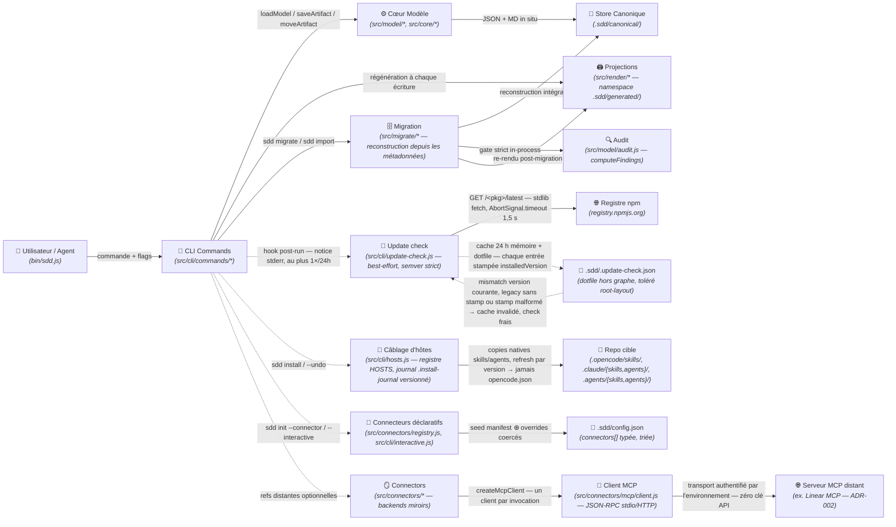

# Domaine : Workspace Management (spec-model) — Architecture Technique

> [!NOTE]
> **Mission :** Architecture du CLI `spec` et du modèle canonique sans état : lecture/écriture de `.sdd/canonical/` (état en métadonnées), index v3, projections markdown sous `.sdd/generated/` (namespace exclusif, régénéré et purgé par le CLI), migration de workspaces hérités par reconstruction intégrale (`sdd migrate`), garde-fous d'intégrité (drift de projections, racine exhaustive, coexistence verrouillée), notice de mise à jour post-run best-effort (registre npm officiel, cache 24 h, opt-outs) et mirroring distant par transport MCP d'environnement — zéro clé API dans le framework ([ADR-002](../../decisions/architecture/ADR-002-transport-connecteurs-environnement.md)).

---

## 1. Flux Architectural des Couches

---

## 2. Cartographie des Composants

| Couche | Responsabilité Technique | Composants Clés |
|---|---|---|
| **Transport / CLI** | Parsing (résolution des `<ref>` — id nu, slug, chemin ; collecte verbatim des flags dotted de settings `--<id>.<key>[.<subkey>]=<v>`, rejet des flags sans valeur), erreurs typées, `--dry-run`, garde de coexistence (`assertNoCoexistence`) posé sur toute mutatrice | `bin/sdd.js`, `src/cli/interactive.js`, `src/cli/commands/{init,install,upsert,move,done,link,validate,render,status,list,model,migrate,import,sync,connectors}.js` |
| **Connecteurs déclaratifs** | Contrat de manifest (`settings` défauts, `settingTypes` `string\|boolean\|number\|object`, `requiredSettings`, champ `hint` optionnel — rétrocompatible : absent ⇒ tout `string` optionnel) ; résolution des déclarations (`manifestFor` rejette l'id inconnu avant écriture, `resolveConnectorDeclarations` seed + coerce) ; coercion typée (`coerceSetting` — booléen strict `true\|false`, `number` numérique, `object` par feuilles) ; **grammaire unifiée `init`/`enable\|disable`** (spec 007) : `connectors enable\|disable` passent par les mêmes helpers du registre — `bindSettingsToId` rattache au `<id>` positionnel les clés non-namespacées (`--teamKey=ENG`) et les chemins dotted top-level d'un setting déclaré (`--mcp.command=npx`), la disambiguïsation du dotted lisant le `settingTypes` du manifest — zéro id de connecteur dans le code ; `--dry-run` sur `enable\|disable` (config projetée, zéro octet) ; hint de reprise lu du champ manifest (`manifestHint` — string non vide ⇒ string, sinon `null`) ; merge profond idempotent et pur (`mergeSettingOverrides`, `mergeConnectorConfigs` — explicite gagne, défauts jamais, `connectors[]` triée par id, intrinsèques exclus) ; interview TTY (`runInteractive` — `@clack/prompts` en import dynamique sur le chemin `--interactive` uniquement, prompter injectable pour les tests) | `src/connectors/registry.js` (`manifestHint`), `src/core/config.js`, `src/cli/interactive.js`, `src/cli/commands/{init,connectors,validate}.js`, `extensions/<id>/extension.json` |
| **Câblage d'hôtes (`sdd install`)** | Registre d'hôtes **extensible** `HOSTS` (`opencode` — evidence `opencode.json`, plan = copies `skills/sdd-*` vers `.opencode/skills/` (découverte native — `opencode.json` n'est **jamais** lu ni écrit) ; `claude`/`agents` — evidence `.claude/`/`.agents/`, plan = copies des 15 dossiers `skills/sdd-<name>` vers `{base}/skills/` + des agents `agents/*.md` un fichier par agent vers `{base}/agents/`) : ajouter une entrée (`detect` + `plan`) l'expose immédiatement à `--host`, à la détection et au câblage — zéro connaissance d'hôte dans l'orchestration ; **pkgRoot résolu depuis `import.meta.url`** (`resolvePkgRoot`, jamais `process.cwd()` — le CLI tourne depuis un cache npx, un `npm -g` ou un clone, les copies viennent du package exécuté) ; plan pur `[{kind: 'copy', target, source, version}]` (`target` repo-relatif, `source` absolu dans le package, `version` = version du package copieur — **cf. [ADR-003](../../decisions/architecture/ADR-003-cablage-hotes-copies-natives.md)** : la copie remplace le câblage symlink + merge `skills.paths` de la spec 008, zéro path machine dans les repos cibles, portabilité git/CI) ; apply par **politique de refresh versionné** : cible absente ⇒ copie, cible owned + version journal ≠ package ⇒ **clean replace** (`rm` préalable du dossier owned puis re-copie — jamais de merge résiduel qui ferait survivre des fichiers supprimés du package), owned + version = ⇒ no-op (idempotent), cible étrangère préexistante (présente hors journal) ⇒ warn + skip (INV-2 — jamais d'écrasement), version absente (journal legacy 008) ⇒ refresh par prudence ; aucun fallback EPERM (la copie `fs.cp(src, dst, {recursive: true})` n'a plus aucun problème de symlink) ; journal fusionné par clé `kind:target` (le `created` d'origine conservé, `source` et `version` rafraîchies) ; `undoPlan` retire exactement le journal — dossiers copiés retirés (jamais de `rm` récursif au-dessus, `.opencode/skills/` peut contenir d'autres skills utilisateur) et **entrées legacy 008 (`symlink`/`opencode-path`) encore honorées** (symlink journalisé retiré même posé par l'ancien régime) ; orchestration `install.js` : détection → plan → câblage → `init` (INV-4), récap `copied n item(s) — x new, y refreshed, z up to date, w skipped` (dry-run : plan `copy/refresh/skip` affiché, rien d'écrit), porte TTY (`@clack/prompts` en import dynamique, multiselect avec `initialValues`, annulation ⇒ `UsageError`) / `UsageError` hors TTY, `--undo` sans journal ⇒ « nothing to undo », aucun hôte ⇒ init seul + instructions manuelles (copies `cp -R`, templates non câblés — les agents les lisent du package au runtime) ; journal écrit **après** `init` dans un `finally` (câblage réversible même si init échoue) | `src/cli/hosts.js` (`HOSTS`, `detectHosts`, `installPlan`, `applyPlan`/`undoPlan`, `readJournal`/`writeJournal`/`deleteJournal`), `src/cli/commands/install.js`, `.sdd/.install-journal.json` |
| **Cœur Modèle** | Dérivation des chemins — canoniques **et** de projection (relations seul), walk de `canonical/`, relocation sur changement de `relations` uniquement, index v3 ; **plus aucune connaissance des chemins à états** : le savoir layout-legacy (`STATE_DIRS`, `STATE_BY_DIR`, `MODEL_DIRNAME`, `modelRoot`) a été transféré à `migrate/v2-layout.js` | `src/model/{layout,store,graph,index,schema}.js` (`META_VERSION = 3`), `src/core/{paths,transitions}.js` (`SPECS_DIRNAME = '.sdd'`, `ALLOWED_ROOT_ENTRIES`) |
| **Migration & Audit** | Détection **déterministe** du layout (seuls marqueurs lus : `config.json` + `index.json` — jamais d'heuristique de disque), plan de migration (divergences disque ↔ métadonnée, réécritures de tokens, warnings de config), **reconstruction intégrale** depuis les métadonnées, gate strict in-process, marker d'échec, garde de coexistence ; moteur de validate extrait en lecture pure | `src/migrate/{migrate,v2-layout,parse,import}.js` (`detectLayout`, `planMigration`, `runMigration`, `assertNoCoexistence`, `gateAndRetire`), `src/model/audit.js` (`computeFindings`) |
| **Projections** | Rendu markdown sous `.sdd/generated/` (aplati au niveau initiative, trié par id) ; purge des orphelins (`MANAGED = ['generated']` — le sweep v2 et le démontage des répertoires hérités sont retirés) ; prévisualisation `--dry-run` ; garde anti-drift `render --check` limitée à `generated/` | `src/render/{projections,markdown}.js`, `src/model/layout.js` (`projectionRelativePath`) |
| **Persistance** | Store fichier JSON + MD ; répertoires créés à la volée ; élagage jamais au-dessus de `canonical/` ; configuration au schéma **v3** | `.sdd/canonical/**`, `.sdd/canonical/index.json`, `.sdd/config.json` (`src/core/config.js`, `CONFIG_VERSION = 3`) |
| **Mirrors** | Projection distante optionnelle ; refs stockées dans la métadonnée `remote` (préservées telles quelles par la migration — jamais resynchronisées par elle) ; le connecteur Linear est un client MCP fin — plus aucun fetch GraphQL ni notion d'apiKey, l'authentification vit dans le transport d'environnement ([ADR-002](../../decisions/architecture/ADR-002-transport-connecteurs-environnement.md)) ; les erreurs de miroir sont isolées par artefact/connecteur dans `sync`/`move` (warning, aucun `remoteRef` écrit pour l'artefact en échec) ; agrégation d'exit par connecteur (spec 007) : tous les miroirs activés en échec avec ≥ 1 opération tentée ⇒ exit 1 + synthèse `all enabled mirrors failed (n/n)` posée sur `process.exitCode` — jamais une exception levée (le rapport par artefact reste affiché, warnings d'abord, synthèse ensuite) ; succès partiel, aucune opération tentée ou `--dry-run` ⇒ exit 0 | `src/connectors/linear.js` (désactivé par défaut, inopérant sans `settings.mcp`), `src/connectors/mcp/linear-tools.js`, `src/connectors/registry.js` (catalogue + fabriques), `src/cli/commands/{sync,move}.js` (agrégation) |
| **Notice de mise à jour (post-run)** | Un seul check best-effort par invocation `run()` — hook dans un `finally` après le handler, enveloppé d'un try/catch total (notice **après** la sortie utile, stderr seul, exit code et timing perçus jamais affectés, même si le handler a levé) ; fetch du registre npm officiel (stdlib `fetch` + `AbortSignal.timeout(1500)`), semver strict 3 segments numériques ; cache 24 h — mémoire par process puis dotfile `.sdd/.update-check.json` (jamais créé si `.sdd/` absent, écrit même en échec réseau, même en `--dry-run`) ; **cache stampé `installedVersion`** (schéma additif `{ lastCheck, latest, installedVersion }` — les trois chemins d'écriture, succès / échec réseau / égalité, portent la version du binaire au moment de l'écriture) ; **invalidation à la lecture** : un cache frais dont le stamp ≠ version courante (upgrade), sans stamp (cache legacy) ou au stamp malformé (non-string) est ignoré — exactement un check frais, dotfile jamais supprimé (réécrit frais, avec le nouveau stamp, par l'écriture qui suit le check) ; stamp égal ⇒ comportement 009 strictement inchangé ; opt-outs `--no-update-check` / `SDD_NO_UPDATE_CHECK` (no-op total) ; `fetchImpl` injectable (tests sans réseau) ; la notice n'est affichée que si l'invocation courante a elle-même fetché (`notice && !cached` — jamais depuis le cache : au plus 1 affichage/24 h) | `src/cli/update-check.js` (`checkUpdate`, `updateCheckDisabled`), `src/cli/main.js` (hook post-run `finally`), `src/cli/help.js` (flag `--no-update-check` documenté) |
| **Transport MCP** | Client JSON-RPC 2.0 minimal, standard library uniquement (`node:child_process`, `node:http`/`node:https` — zéro dépendance nouvelle) : deux transports mutuellement exclusifs — **stdio** (spawn `{command, args}`, frames JSON newline-delimited, sans framing LSP/Content-Length) et **HTTP streamable** (POST JSON-RPC, réponse JSON ou flux SSE apparié par id de requête, sans reconnexion) ; handshake strict `initialize` → `notifications/initialized` avant tout `tools/call` ; timeouts (défaut 15 s) sur le handshake **et** chaque call → `ConnectorError` citant le transport et invitant `/sdd-setup` ; transport malformé (les deux formes à la fois, ou aucune) → `UsageError` ; cycle de vie éphémère — un client par invocation, `close()` garanti (SIGTERM, grâce SIGKILL 1 s, handler d'exit — zéro process zombie) ; mapping miroir → tools Linear MCP (`get_issue`, `list_issues`, `update_issue`, `create_issue`) et parsing des payloads isolés de l'orchestrateur ; tests sans réseau via un serveur MCP factice spawné (stdio ou HTTP en boucle locale ; modes d'échec `silent` — jamais de réponse, et `hangAfterInit` — call timeout) — aucun test ne parle à `mcp.linear.app` | `src/connectors/mcp/{client,linear-tools}.js`, `src/connectors/linear.js`, `test/helpers/fake-mcp-server.js` |

> [!IMPORTANT]
> **Frontière de Domaine :** les namespaces `generated/` (feature `02-generated-namespace`), la migration de workspaces `sdd migrate` (feature `03-sdd-migration` — cutover de racine `.specs/` → `.sdd/` effectué, workspace de ce repo basculé en one-shot), l'init déclarative des connecteurs (feature `01-declarative-init` — `sdd init --connector`, interview TTY, règle `connector-settings`, première dépendance runtime `@clack/prompts` cf. [ADR-001](../../decisions/architecture/ADR-001-dependance-runtime-clack-prompts.md)), la couche transport MCP du mirroring (feature `03-linear-mcp` — client JSON-RPC stdio/HTTP, garde-fou zéro secret, manifest sans bloc `authentication`, cf. [ADR-002](../../decisions/architecture/ADR-002-transport-connecteurs-environnement.md)), l'amorçage guidé agent-side (feature `02-setup-skill`, étendue par `03-setup-protocol-v2` — skill `skills/sdd-setup/SKILL.md` : `/sdd-setup` est la voie d'adoption unique, protocole v2 à phases conditionnelles et confirmées — état des lieux read-only, migration legacy conditionnelle via `sdd migrate`, câblage + init via `sdd install`, connecteur optionnel via `sdd connectors enable … --dry-run`, récap → `/sdd-vision` ; la validation MCP de 006 reste la phase 3 ; couche agent seule, aucune logique ni invariant CLI nouveau) et l'amorçage one-command d'un repo adoptant (`sdd install` — feature `01-install-command`, mécanisme révisé par la spec `012-installed-copies` : registre d'hôtes extensible `src/cli/hosts.js`, détection → **copies natives journalisées + refresh versionné** → `sdd init`, `--host auto|opencode|claude|agents`, `--undo` journal-based (copies + legacy 008), `--dry-run`, dégradation propre sans hôte, templates non câblés par défaut) et le durcissement de la surface connecteurs (feature `01-connector-hardening` — grammaire de settings unifiée `init`/`connectors enable\|disable`, `--dry-run` réel, exit honnête `sync`/`move` sur échec total de miroir, hint manifest-driven — plus aucun id de connecteur dans `src/`) et la notice de mise à jour post-run (feature `02-update-notice` — `src/cli/update-check.js`, hook post-run dans un `finally` de `main.js`, cache 24 h mémoire + dotfile `.sdd/.update-check.json` hors graphe — stampé `installedVersion` et invalidé au changement de version du binaire (bugfix spec 011), opt-outs `--no-update-check`/`SDD_NO_UPDATE_CHECK` ; stdlib fetch, aucune dépendance nouvelle ; `audit.js` non modifié — la tolérance des dotfiles de `root-layout` était déjà générique) sont livrés. Reste scellé : l'entrée racine optionnelle `site/` (feature `04-static-site`, extension de `ALLOWED_ROOT_ENTRIES`), le connecteur GitHub via `gh` et toute découverte MCP par le CLI (rôle exclusif de l'agent `/sdd-setup`).

---

## 3. Dépendances Inter-Domaines

| Relation | Domaine Lié | Contrat & Échange |
|---|---|---|
| **Expose à** | `02-generated-namespace` | Namespace `generated/` exclusif (**livré**) : toutes les projections markdown vivent sous `.sdd/generated/` ; champ `projection` de `index.json` reciblé (format v3 inchangé, pas de version 4) |
| **Expose à** | `03-sdd-migration` | Métadonnées schema v3 + `index.json` comme source de reconstruction (**livré**) : `sdd migrate` reconstruit `.sdd/` intégralement depuis ces métadonnées — destinations dérivées des relations, jamais de la position disque |
| **Expose à** | `04-static-site` | `ALLOWED_ROOT_ENTRIES` : la feature ajoutera l'entrée `site` (site statique optionnel) |

---

## 4. Invariants Techniques & Sécurité

| Règle | Exigence d'Intégrité | Mécanisme de Contrôle |
|---|---|---|
| **`INV-1`** | **Aucun état de cycle de vie dans un chemin** — canonique ou de projection : les deux dérivent des slugs/ids + `relations` seul ; un `move` régénère la projection au même chemin | `validate` règles `canonical-layout` + `graph-integrity` ; `projectionRelativePath` (signature sans option d'état) |
| **`INV-2`** | **`move` sans relocation ni renommage de projection** : la transition mute la métadonnée et régénère l'index + les projections au même chemin — rien d'autre ne bouge | `moveArtifact` in situ + tests |
| **`INV-3`** | **Zéro pré-allocation** : `sdd init` crée exactement 2 répertoires + `config.json` — `generated/` n'est pas pré-alloué, il naît au premier rendu | `standardLayout` + tests |
| **`INV-4`** | **`knowledge/` regroupe `decisions/` + `domains/`** ; authored, hors graphe, jamais généré ni exigé, hors de portée du render | `knowledgeRoot` ; validate exit 0 avec/sans knowledge |
| **`INV-5`** | **Unicité globale des ids de spec** — condition de l'aplatissement des projections : deux ids identiques produiraient une collision silencieuse sous `generated/initiatives/<slug>/specs/` | `validate` règle `spec-id-uniqueness` (garde post-hoc, pas de verrou d'allocation) |
| **`INV-6`** | **Slug immuable** (PDR-001) ; re-upsert = mise à jour in situ | Pas de commande rename + tests |
| **`INV-7`** | **Allocation d'id séquentielle, jamais réutilisée ; `\d{3,4}`** | `parseSpecSlug` + `sdd list --kind spec --json` |
| **`INV-8`** | **Projections exclusivement sous `.sdd/generated/`, racine `.sdd/` exhaustive** : `config.json`, `canonical/`, `generated/`, `knowledge/` — toute autre entrée est une violation (dotfiles tolérés, dont le marker de migration) | `validate` règle `root-layout` ; `render --check` (couverture `generated/` seul) |
| **`INV-9`** | **`generated/` intégralement régénérable** : purge de tout `.md` non projeté, suppressions listées et prévisualisables (`--dry-run`) ; `knowledge/`, `canonical/` et `config.json` hors de portée du render ; horizon `MANAGED` réduit à `['generated']` — le sweep v2 est retiré : les entrées héritées parasites ne sont plus purgées au render, `validate` (`root-layout`) les refuse et la reprise passe par `sdd migrate` | `pruneStaleProjections` + tests |
| **`INV-10`** | **`render --check` échoue sur tout drift** (`stale`, `missing`, `unexpected`) et ne couvre que `generated/` | `renderProjections({ check })` + tests |
| **`INV-11`** | **Option `projections.markdown` honorée** : `false` coupe toute écriture de projection (index régénéré) ; absence de la clé dans `config.json` = défaut activé | `normalizeConfig` (tolérance verrouillée par test) |
| **`INV-12`** | **Migration par reconstruction intégrale, jamais de merge** : `sdd migrate` reconstruit toujours `.sdd/` de zéro depuis la source ; un workspace partiel/en échec est effacé avant reconstruction ; un second appel est un no-op (« already migrated », exit 0) | `runMigration` + tests (feature `03` INV-1) |
| **`INV-13`** | **Destinations dérivées des métadonnées, jamais de la position disque** : chaque destination est `modelRelativePaths(meta)` recalculé depuis `state`/`relations` ; les divergences (`position-mismatch`, `state-mismatch`, `unresolved-relations` — bloquante, `legacy-residue`) sont listées dans le plan et n'influencent jamais la destination | `planMigration` (feature `03` INV-2) |
| **`INV-14`** | **Préservation du graphe + réécriture littérale des tokens** : ids, slugs, relations, `progress` (dont `done`), refs `remote` recopiés tels quels ; tokens de racine `.specs/` (slash final) réécrits en `.sdd/` dans les corps, les valeurs `fields` et les markdown `knowledge/**`, chaque réécriture listée dans le plan ; `config.json` converti au schéma v3 (clés inconnues et connectors `filesystem` retirés avec warning) | `runMigration`, `convertConfig` (feature `03` INV-3) |
| **`INV-15`** | **Gate strict in-process — sinon marker d'échec, source conservée, exit 1** : succès seulement si `computeFindings` = 0 finding ET `renderProjections({ check: true })` = 0 drift (mêmes moteurs que les commandes, jamais les commandes CLI elles-mêmes) ; sinon `.sdd/.migration-failed.json` écrit (`failedAt`, `stage`, `message`), source `.specs/` conservée intégralement | `gateAndRetire` (feature `03` INV-4) |
| **`INV-16`** | **Coexistence `.specs/` + `.sdd/` : mutations refusées, lectures sur `.sdd/`** : tant que les deux racines coexistent, toute commande mutatrice est refusée (exit 1, instruction de relancer `sdd migrate`) ; les lectures opèrent exclusivement sur `.sdd/` ; `sdd migrate` s'affranchit explicitement du garde (c'est l'outil de reprise) | `assertNoCoexistence` posé sur `upsert`, `move`, `done`, `link`, `render` (écriture), `import`, `init --force`, `model --write`, `sync`, `connector` (feature `03` INV-5) |
| **`INV-17`** | **`--dry-run` sur toutes les écritures de la migration** : `sdd migrate --dry-run` et `sdd import --dry-run` calculent le plan complet (divergences, réécritures, warnings, suppressions) sans aucune écriture ; sortie terminée par `(dry-run: nothing was written)` | `planMigration` (feature `03` INV-6) |
| **`INV-18`** | **Connecteurs manifest-driven, rejet avant écriture** : le CLI ne contient aucune connaissance spécifique à un connecteur ; un `--connector <id>` absent du catalogue (builtin + `extensions/*/extension.json`) est refusé en `UsageError` — zéro octet écrit | `manifestFor`, `resolveConnectorDeclarations` + tests (spec 004 INV-1) |
| **`INV-19`** | **Settings namespacés, merge profond typé** : grammaire `--<id>.<key>[.<subkey>]=<value>` (profondeur ≤ 2) ; les types viennent du `settingTypes` du manifest — booléen strict (`true\|false` uniquement, `1/0/yes/no` refusés), `number` numérique, `object` par feuilles ; namespace inconnu, clé malformée ou valeur non coercible → `UsageError` citant `<id>.<key>` | `coerceSetting`/`coerceSettingPath`, `mergeSettingOverrides` (pur, jamais de mutation en place) + tests (spec 004 INV-2) |
| **`INV-20`** | **Re-init idempotent, `local` intrinsèque** : ré-exécuter `init`/`connectors enable` fusionne sans dupliquer ni effacer — les valeurs explicites (flags ou interview) gagnent, les défauts du manifest ne ré-écrasent jamais une valeur utilisateur ; un connecteur jamais déclaré est ajouté, jamais retiré ; `local`/`filesystem` ne figurent jamais dans `connectors[]` ; liste triée par id (diff stable) | `mergeConnectorConfigs` (`pickDeclarationSettings`, `isIntrinsicBackend`) + tests (spec 004 INV-3) |
| **`INV-21`** | **Interactif explicite et CI-safe** : les prompts ne surviennent que si `--interactive` ET un stdout TTY ; sinon `UsageError` invitant aux flags — sans `--interactive`, aucun prompt jamais ; `@clack/prompts` chargé en import dynamique (jamais au niveau module) sur un prompter injectable | `runInteractive` (`src/cli/interactive.js`) + tests (spec 004 INV-4) |
| **`INV-22`** | **Validation structurelle de la config** : `sdd validate` émet `connector-settings` (exit 1) si un connecteur activé manque d'une `requiredSettings` de son manifest (présente et non vide) ou porte un type déclaré invalide ; les connecteurs sans manifest (tiers) ne sont pas audités — rétrocompatibilité | `connectorSettingsFindings` (règle `connector-settings`, `src/cli/commands/validate.js`) + tests (spec 004 INV-5) |
| **`INV-23`** | **Zéro secret dans le framework** : le manifest Linear ne porte aucun bloc `authentication` ; `validate` rejette des settings portant une clé de forme secrète — `apiKey`, `token`, `secret` en clé ou en **suffixe**, case-insensitive, séparateurs (`_`, `-`, espaces) tolérés, scan imbriqué — un mot au milieu d'une clé légitime ne matche jamais (`tokenBucketRate` passe) ; aucun fallback auth directe | `secretSettingPaths` (règle `connector-settings`, `src/cli/commands/validate.js`) + tests (spec 005 INV-1 ; cf. [ADR-002](../../decisions/architecture/ADR-002-transport-connecteurs-environnement.md)) |
| **`INV-24`** | **Inopérant sans transport résolu** : sans `settings.mcp` (absent ou vide), `sync`/`move` n'opèrent aucun mirroring — erreur par artefact `ConnectorError` « no MCP transport configured — run /sdd-setup » (aucun `remoteRef` écrit) — et `validate` émet un finding `connector-settings` (`requiredSettings` inclut `mcp`, l'objet vide comptant comme absent) ; jamais de repli implicite | `transport()` de `src/connectors/linear.js`, `isEmptySetting` + règle `connector-settings` + tests (spec 005 INV-2) |
| **`INV-25`** | **Contrat miroir inchangé** : le port `resolve/list/transition/create/link`, les refs `remoteRef` persistées dans `remote`, le `--dry-run` et les call-sites `sync/move/done` sont strictement identiques à l'ère GraphQL — seul le transport sous-jacent change ; `sync`/`move` restent déterministes et CI-friendly | `src/connectors/mcp/linear-tools.js` (mapping) + `test/linear-connector.test.js` (spec 005 INV-3) |
| **`INV-26`** | **Client MCP éphémère, zéro dépendance** : un client par invocation de commande, `close()` toujours garanti (SIGTERM + grâce SIGKILL + handler d'exit — zéro process zombie) ; JSON-RPC 2.0 sur `node:child_process` + `node:http`/`node:https` uniquement | `createMcpClient` + `test/mcp-client.test.js` (fake serveur stdio, vérification de mort du process) (spec 005 INV-4) |
| **`INV-27`** | **Grammaire de settings unifiée `init`/`connectors enable\|disable` + dry-run réel** : les deux commandes passent par les mêmes helpers du registre — clés top-level non-namespacées (`--teamKey=ENG`) et chemins dotted top-level d'un setting déclaré (`--mcp.command=npx`) rattachés au `<id>` positionnel, namespacé accepté si == `<id>` ; un flag dotted dont le premier segment n'est ni le `<id>` ni un setting top-level déclaré (lu dans `settingTypes` du manifest) est refusé en `UsageError` exit 2 ; `--dry-run` affiche la config projetée sans écrire un octet | `bindSettingsToId` + `resolveConnectorDeclarations` (`src/cli/commands/connectors.js`, `src/connectors/registry.js`) + tests (spec 007 INV-1) |
| **`INV-28`** | **Exit honnête sur échec total de miroir** : dans `sync`/`move`, tous les miroirs activés en échec avec ≥ 1 opération tentée (hors `--dry-run`) ⇒ exit 1 + synthèse `all enabled mirrors failed (n/n)` posée sur `process.exitCode` — jamais une exception (le rapport par artefact/connecteur reste affiché, warnings d'abord) ; succès partiel ou aucune opération tentée ⇒ exit 0 | agrégation dans `src/cli/commands/{sync,move}.js` + tests (spec 007 INV-2, fake MCP vivant/mort/mixte) |
| **`INV-29`** | **Zéro id de connecteur dans `src/`, hint manifest-driven** : le message d'aide affiché quand les `requiredSettings` d'un connecteur activé sont incomplètes vient du champ optionnel `hint` du manifest (`manifestHint` — absent ou non-string/non-trimable ⇒ `null`, fallback générique citant les settings manquantes) ; le hint ne s'affiche qu'à l'`enable` incomplet, jamais sur `connectors list` | `manifestHint` (`src/connectors/registry.js`), champ `hint` de `extensions/linear/extension.json` + test de conformité (aucune occurrence de `'linear'` en logique dans `src/`) (spec 007 INV-3) |
| **`INV-30`** | **Câblage par copies natives, zéro path machine** *(réécrit par la spec 012 — supersedes le câblage symlink de la 008, dont l'INV-1 « jamais de copie » est révoqué)* : `sdd install` **copie** les skills (`skills/sdd-*`, 15 dossiers) et les agents (`agents/*.md`) aux chemins natifs des hôtes (`.opencode/skills/`, `.claude/{skills,agents}/`, `.agents/{skills,agents}/`) — aucun symlink, aucune écriture d'`opencode.json`, cibles repo-relatives ; `pkgRoot` résolu depuis `import.meta.url` (jamais `process.cwd()` — les copies proviennent du package en cours d'exécution) ; re-install idempotent (no-op à version égale) | `resolvePkgRoot`, `installPlan`/`applyPlan` + journal (`src/cli/hosts.js`) + tests (spec 012 INV-1, cf. [ADR-003](../../decisions/architecture/ADR-003-cablage-hotes-copies-natives.md)) |
| **`INV-31`** | **Jamais d'écrasement hors journal, refresh propre des cibles owned** : cible étrangère préexistante (présente hors journal) ⇒ warn + skip ; cible owned + version journal ≠ package ⇒ **clean replace** (rm préalable du dossier owned, jamais de merge résiduel) ; owned + version = ⇒ no-op ; version absente (journal legacy 008) ⇒ refresh par prudence — les dérogations 008 (repointage de symlink, merge `opencode.json`, fallback EPERM) sont supprimées avec le mécanisme | `classifyEntry`/`applyPlan` (warn + skip, clean replace) + tests (spec 012 INV-2) |
| **`INV-32`** | **Journal versionné, undo exact** : chaque entrée porte `version` = version du package copieur (réutilise le motif du stamp 011) ; la fusion `kind:target` conserve le `created` d'origine et rafraîchit `source` + `version` ; `--undo` retire exactement les entrées journalisées (dossiers copiés, jamais de `rm` au-delà des cibles) — et **honor encore les entrées legacy 008** (`kind: 'symlink'`/`'opencode-path'`, symlink journalisé retiré) | `applyPlan`/`undoPlan` + journal `.sdd/.install-journal.json` (`src/cli/hosts.js`) + tests (spec 012 INV-3) |
| **`INV-33`** | **Install offline, ordre de phases, dry-run** : aucun réseau, aucune clé — tout passe par `node:fs` (`fs.cp` récursif) ; détection → câblage → `sdd init` ; `--dry-run` affiche le plan complet (hôtes, entrées `copy/refresh/skip`, init) et n'écrit rien ; le journal est écrit **après** `init` dans un `finally` — le câblage reste réversible même si init échoue ; `sdd init` conserve sa sémantique (local par défaut, connecteurs via `--connector`/`/sdd-setup`) | `src/cli/commands/install.js` (phases + `try/finally`) + `src/cli/hosts.js` (imports `node:*` exclusifs) + tests (spec 012 INV-4 ; absorb INV-3+INV-4 de la 008) |
| **`INV-34`** | **Dégrade proprement sans hôte** : rien de détecté ⇒ `sdd init` seul + instructions de câblage manuel (copies `cp -R` des `skills/sdd-*` et `agents/*.md`), jamais d'échec ; les templates ne sont pas câblés par défaut (les agents les lisent du package au runtime) | `manualInstructions` (`src/cli/commands/install.js`) + tests (spec 008 INV-5, inchangé par la 012 hors wording) |
| **`INV-35`** | **Notice après la commande, stderr, au plus 1×/24h** : la notice n'apparaît jamais avant la sortie utile, uniquement sur stderr (stdout = contrat machine — `--json`, pipes restent propres) ; l'exit code et le timing perçus de la commande ne sont jamais affectés ; une réponse servie du cache n'est jamais ré-affichée — l'affichage exige que l'invocation courante ait elle-même fetché (au plus 1 affichage par 24 h par workspace) | hook post-run `finally` de `run()` (`notice && !cached`, `src/cli/main.js`) + tests (spec 009 INV-1) |
| **`INV-36`** | **Best-effort strict** : timeout réel 1,5 s (`AbortSignal.timeout` sur le fetch — jamais d'abort théorique) ; tout échec (réseau, HTTP ≠ 2xx, JSON malformé, semver distant invalide, fs en lecture seule, throw du module) est silencieux — try/catch total autour du check ; `lastCheck` est rafraîchi même en échec (les sessions offline ne re-sondent pas à chaque commande) | `checkUpdate` + enveloppe `try/catch` du hook (`src/cli/{update-check,main}.js`) + tests (spec 009 INV-2) |
| **`INV-37`** | **Opt-outs totaux** : flag `--no-update-check` ou env `SDD_NO_UPDATE_CHECK` non vide (toute valeur compte, même `0`) ⇒ no-op total — ni fetch, ni écriture de cache | `updateCheckDisabled` (`src/cli/update-check.js`) + tests (spec 009 INV-3) |
| **`INV-38`** | **Cache hors graphe** : mémoire par process (cwd → entrée) puis dotfile `.sdd/.update-check.json` — jamais créé si `.sdd/` absent (cache mémoire seule, durée de vie = session), toléré par `root-layout` (tolérance dotfile déjà générique — `audit.js` non modifié), jamais dans `canonical/` ni `generated/`, écrit même en `--dry-run` (l'invocation reste une invocation) | `readDotfileCache`/`writeDotfileCache` (`src/cli/update-check.js`) + règle `root-layout` + tests (spec 009 INV-4) |
| **`INV-39`** | **Registre npm officiel, stdlib uniquement** : endpoint `https://registry.npmjs.org/<pkg>/latest` (stdlib `fetch`, Node ≥ 18.17 — pas d'undici direct, pas d'endpoint maison) ; semver strict 3 segments numériques (pas de range, pas de prerelease — version distante malformée ⇒ silencieux) ; `fetchImpl` injectable — aucun test ne parle au vrai registre | `checkUpdate` (seam `fetchImpl`) + tests (spec 009 INV-5) |

> *Traçabilité : les invariants `INV-1`…`INV-4` de la feature `02-generated-namespace` (spec 002, §5) correspondent aux `INV-8`…`INV-11` du domaine, les invariants `INV-1`…`INV-6` de la feature `03-sdd-migration` (spec 003, §5) correspondent aux `INV-12`…`INV-17` du domaine, les invariants `INV-1`…`INV-5` de la feature `01-declarative-init` (spec 004, §5) correspondent aux `INV-18`…`INV-22` du domaine, et les invariants `INV-1`…`INV-4` de la feature `03-linear-mcp` (spec 005, §5) correspondent aux `INV-23`…`INV-26` du domaine (numérotation locale à la feature). Les invariants `INV-1`…`INV-3` de la feature `01-connector-hardening` (spec 007, §5) correspondent aux `INV-27`…`INV-29` du domaine ; son `INV-4` (merge inchangé, idempotence et explicit-wins via les helpers existants) est déjà couvert par `INV-20` du domaine — aucune nouvelle mécanique de merge. Les invariants `INV-1`…`INV-4` de la feature `02-setup-skill` (spec 006, §5) sont des contrats de protocole de la couche agent (skill `skills/sdd-setup/SKILL.md`) — ils n'ajoutent aucun invariant CLI : la barrière dure reste le CLI, automatisée par les suites 004/005/007. Il en va de même pour les invariants `INV-1`…`INV-5` de la feature `03-setup-protocol-v2` (spec 010, §5) — protocole `/sdd-setup` v2 (état des lieux, migration conditionnelle, câblage + init, connecteur optionnel, récap) : contrats de protocole agent-layer, aucun invariant CLI nouveau — les primitives orchestrées (`sdd migrate`, `sdd install`, `sdd connectors enable`) sont déjà verrouillées par les invariants du domaine (migration `INV-12`…`INV-17`, connecteurs `INV-18`…`INV-29`, câblage d'hôtes `INV-30`…`INV-34`). Les invariants `INV-1`…`INV-5` de la feature `01-install-command` (spec 008, §5) correspondent historiquement aux `INV-30`…`INV-34` du domaine (numérotation locale à la feature) — mapping conservé, mais **le mécanisme est révisé par la spec `012-installed-copies`** : les invariants `INV-1`…`INV-4` de la 012 correspondent aux `INV-30`…`INV-33` du domaine (`INV-34`, dégradation sans hôte, inchangé hors wording). La 012 **révoque l'INV-1 de la 008** (« câblage vers le module installé, jamais de copie ») : les symlinks posaient des paths machine absolus dans les repos cibles (non portables pour les collègues, bruités dans git, cassés en CI) et le merge `skills.paths` lie la config de l'hôte au layout du package — la copie native remplace le mécanisme, et la prévention de drift autrefois assurée par le pointage du package exécuté l'est désormais par le **refresh versionné au journal** (clean replace des cibles owned au changement de version). Avec le mécanisme tombent les dérogations historiques de la 008 (repointage des symlinks périmés, merge `opencode.json`, fallback copie EPERM Windows) — `INV-31`/`INV-32` portent les nouvelles sémantiques ; les journaux legacy 008 restent honorés par `--undo`. Le choix de mécanisme est formalisé dans [ADR-003](../../decisions/architecture/ADR-003-cablage-hotes-copies-natives.md). Les invariants `INV-1`…`INV-5` de la feature `02-update-notice` (spec 009, §5) correspondent aux `INV-35`…`INV-39` du domaine (numérotation locale à la feature) ; l'écart de la spec 009 §1 est assumé : la tolérance `root-layout` prévue sur `audit.js` était déjà générique (dotfiles tolérés) — aucun code d'audit n'a été touché. Les invariants `INV-1`…`INV-3` de la spec `011-update-cache-invalidation` (stamp `installedVersion`, invalidation des caches legacy/mismatch, schéma additif) sont absorbés par la ligne « Notice de mise à jour » ci-dessus — variations du mécanisme de cache `INV-38`, aucun invariant de domaine nouveau (bugfix sans décision structurante).*

---

## 5. Décisions d'Architecture de Référence

| Référence | Décision Structurante | Impact Technique |
|---|---|---|
| [`PDR-001`](../../decisions/product/PDR-001-slug-immuable.md) | Slug immuable après création | Élimine la classe des renommages destructeurs (relocation en chaîne, resync de mirrors) |
| [`ADR-001`](../../decisions/architecture/ADR-001-dependance-runtime-clack-prompts.md) | `@clack/prompts` ^0.11.0 — première dépendance runtime (import dynamique, chemin `--interactive` seul) | Levée du principe « zero-dependency » ; UX TTY immédiate, coût runtime nul hors chemin interactif, tests par prompter injectable |
| [`ADR-002`](../../decisions/architecture/ADR-002-transport-connecteurs-environnement.md) | Transport des connecteurs délégué à l'environnement — zéro clé API (Linear via serveur MCP, GitHub futur via `gh`) ; **implémentée par la spec 005** | Client MCP JSON-RPC stdio/HTTP sur standard library (aucune dépendance nouvelle), transport résolu `settings.mcp` écrit par `/sdd-setup` (spec 006), manifest sans bloc `authentication`, secret-scan `connector-settings` — la surface de secrets du framework tombe à zéro |
| [`ADR-003`](../../decisions/architecture/ADR-003-cablage-hotes-copies-natives.md) | Câblage d'hôtes par **copies natives** + refresh versionné au journal — **implémentée par la spec 012**, révoque le mécanisme symlink de la 008 | Zéro path machine dans les repos cibles (portabilité collègues/git/CI), `opencode.json` jamais touché, fraîcheur garantie par le refresh versionné (clean replace) au lieu du pointage du package exécuté |

> Les arbitrages structurants de la migration (détection déclarative, reconstruction intégrale, gate strict, garde de coexistence) sont portés par la spec `003-sdd-migration` elle-même (§1 Intent, §5 Invariants) — aucun ADR distinct n'a été requis. La notice de mise à jour (spec 009) ne lève pas non plus d'ADR : stdlib `fetch` et zéro dépendance nouvelle — la levée du zéro-dépendance reste portée exclusivement par [ADR-001](../../decisions/architecture/ADR-001-dependance-runtime-clack-prompts.md), et le choix du registre officiel est verrouillé par l'INV-39. L'invalidation du cache au changement de version (spec 011) n'en lève pas davantage d'ADR — bugfix additive sur le schéma du cache, aucune dépendance ni décision de protocole. La révision du câblage d'hôtes par la spec 012 (copie native remplaçant le symlink, refresh versionné au journal) **lève en revanche [ADR-003](../../decisions/architecture/ADR-003-cablage-hotes-copies-natives.md)** : décision structurante car elle révoque un invariant tracé (l'INV-1 de la 008 et sa rationale de drift-prevention), change le contrat du journal (`version` par entrée, `kind: 'copy'`) et le mode de fraîcheur des cibles déployées.

---

## 6. Conventions Interim Basculées (historique)

Tombées avec les livraisons des features `02-generated-namespace` puis `03-sdd-migration` — conservées pour l'audit, ne plus s'y référer. **La section « conventions interim restantes » du précédent état est entièrement tombée avec la livraison de `03`** : aucune convention provisoire ne subsiste.

| Convention | Ancien état | État livré |
|---|---|---|
| **Racine legacy `.specs/`** | `SPECS_DIRNAME` valait `.specs/` — désaligné du nom du framework ; `core/` portait encore le savoir des chemins à états (`STATE_DIRS`, `STATE_BY_DIR`, `MODEL_DIRNAME`, `modelRoot`) | **TOMBÉE (basculée par 003)** : racine `.sdd/` unique (`SPECS_DIRNAME = '.sdd'`), le CLI ne reconnaît que `.sdd/` ; savoir layout-legacy transféré à `src/migrate/v2-layout.js` — `core/` ne connaît plus aucun chemin à état ; cutover du workspace de ce repo effectué (one-shot `sdd migrate`, git en filet) |
| **Scanners legacy gelés** : `src/core/artifact.js`, `src/migrate/{import,parse}.js` | `src/core/artifact.js` encodait les états en chemins avec une regex `\d{3}` (incompatible 4 chiffres) ; `import.js` portait un patch de compat et restait gelé/obsolète après cutover | **TOMBÉE (basculée par 003)** : `src/core/artifact.js` supprimé (listers → `src/migrate/v2-layout.js`, regex `\d{3,4}`) ; `parse.js` : `\d{3,4}` + `extractParentInitiative` ; `import.js` re-owné (réécriture de tokens des corps importés, refus exit 2 si un modèle JSON existe, finish partagé avec migrate) |
| **Horizon de purge v2** : `MANAGED` dans `src/render/projections.js` | Contenait encore `specs`, `initiatives`, `vision.md` — le sweep v2 était inerte après cutover mais son code restait en place | **TOMBÉE (basculée par 003)** : `MANAGED = ['generated']` — sweep v2 et démontage des répertoires hérités retirés ; les entrées héritées parasites sont refusées par `validate` (règle `root-layout`), reprise par `sdd migrate` |
| **Repointage doc-wide des 34 fichiers writers** (dont `templates/FEATURE_TEMPLATE.md:66`, lien de projection codé en dur vers l'arbre v2) | Agents, skills, templates, règles et manifestes pointaient des chemins de modèle v2 (`.specs/model/…`) et des projections héritées | **TOMBÉE (basculée par 003)** : convention post-bascule — chemins de modèle = `.sdd/canonical/…` (formes v3), projections = `.sdd/generated/…`, config = `.sdd/config.json` |
| **Projections v2 aux chemins avec dirs d'état** : `.specs/specs/<state>/`, `.specs/initiatives/<state>/<init>/…`, `.specs/sdd-vision.md` | Chemins encodant l'état, renommage des projections au `move` | **TOMBÉE (basculée par 002)** : projections sous `.sdd/generated/` — features et specs aplaties au niveau initiative, triées par id, zéro répertoire d'état, un `move` régénère au même chemin |
| **Double `vision.md`** : projection racine coexiste avec la vision authored | Deux visions indiscernables à la racine | **TOMBÉE (basculée par 002)** : une seule vision, à `generated/sdd-vision.md` |
| **Préfixes `index.json`** : `projection` pointant l'arbre v2 | `meta`/`body` = canonique, `projection` = ancien arbre hérité | **TOMBÉE (basculée par 002)** : `projection` = `.sdd/generated/…` — format v3 inchangé, pas de version 4 |

> *NB de traçabilité : les chemins `.specs/…` cités ci-dessus désignent l'ancienne racine legacy. Les documents du domaine avaient été token-réécrits mécaniquement (`.specs/` → `.sdd/`, réécriture littérale sans lecture sémantique) lors du cutover — le repointage sémantique de cette section historique a été appliqué à la synchronisation de `03`.*
