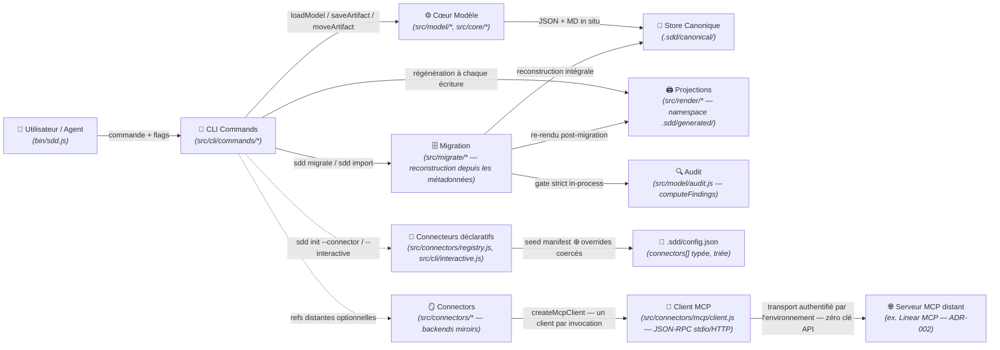

# Domaine : Workspace Management (spec-model) — Architecture Technique

> [!NOTE]
> **Mission :** Architecture du CLI `spec` et du modèle canonique sans état : lecture/écriture de `.sdd/canonical/` (état en métadonnées), index v3, projections markdown sous `.sdd/generated/` (namespace exclusif, régénéré et purgé par le CLI), migration de workspaces hérités par reconstruction intégrale (`sdd migrate`), garde-fous d'intégrité (drift de projections, racine exhaustive, coexistence verrouillée) et mirroring distant par transport MCP d'environnement — zéro clé API dans le framework ([ADR-002](../../decisions/architecture/ADR-002-transport-connecteurs-environnement.md)).

---

## 1. Flux Architectural des Couches

---

## 2. Cartographie des Composants

| Couche | Responsabilité Technique | Composants Clés |
|---|---|---|
| **Transport / CLI** | Parsing (résolution des `<ref>` — id nu, slug, chemin ; collecte verbatim des flags dotted de settings `--<id>.<key>[.<subkey>]=<v>`, rejet des flags sans valeur), erreurs typées, `--dry-run`, garde de coexistence (`assertNoCoexistence`) posé sur toute mutatrice | `bin/sdd.js`, `src/cli/interactive.js`, `src/cli/commands/{init,upsert,move,done,link,validate,render,status,list,model,migrate,import,sync,connectors}.js` |
| **Connecteurs déclaratifs** | Contrat de manifest (`settings` défauts, `settingTypes` `string\|boolean\|number\|object`, `requiredSettings` — rétrocompatible : absent ⇒ tout `string` optionnel) ; résolution des déclarations (`manifestFor` rejette l'id inconnu avant écriture, `resolveConnectorDeclarations` seed + coerce) ; coercion typée (`coerceSetting` — booléen strict `true\|false`, `number` numérique, `object` par feuilles) ; merge profond idempotent et pur (`mergeSettingOverrides`, `mergeConnectorConfigs` — explicite gagne, défauts jamais, `connectors[]` triée par id, intrinsèques exclus) ; interview TTY (`runInteractive` — `@clack/prompts` en import dynamique sur le chemin `--interactive` uniquement, prompter injectable pour les tests) | `src/connectors/registry.js`, `src/core/config.js`, `src/cli/interactive.js`, `src/cli/commands/{init,connectors,validate}.js`, `extensions/<id>/extension.json` |
| **Cœur Modèle** | Dérivation des chemins — canoniques **et** de projection (relations seul), walk de `canonical/`, relocation sur changement de `relations` uniquement, index v3 ; **plus aucune connaissance des chemins à états** : le savoir layout-legacy (`STATE_DIRS`, `STATE_BY_DIR`, `MODEL_DIRNAME`, `modelRoot`) a été transféré à `migrate/v2-layout.js` | `src/model/{layout,store,graph,index,schema}.js` (`META_VERSION = 3`), `src/core/{paths,transitions}.js` (`SPECS_DIRNAME = '.sdd'`, `ALLOWED_ROOT_ENTRIES`) |
| **Migration & Audit** | Détection **déterministe** du layout (seuls marqueurs lus : `config.json` + `index.json` — jamais d'heuristique de disque), plan de migration (divergences disque ↔ métadonnée, réécritures de tokens, warnings de config), **reconstruction intégrale** depuis les métadonnées, gate strict in-process, marker d'échec, garde de coexistence ; moteur de validate extrait en lecture pure | `src/migrate/{migrate,v2-layout,parse,import}.js` (`detectLayout`, `planMigration`, `runMigration`, `assertNoCoexistence`, `gateAndRetire`), `src/model/audit.js` (`computeFindings`) |
| **Projections** | Rendu markdown sous `.sdd/generated/` (aplati au niveau initiative, trié par id) ; purge des orphelins (`MANAGED = ['generated']` — le sweep v2 et le démontage des répertoires hérités sont retirés) ; prévisualisation `--dry-run` ; garde anti-drift `render --check` limitée à `generated/` | `src/render/{projections,markdown}.js`, `src/model/layout.js` (`projectionRelativePath`) |
| **Persistance** | Store fichier JSON + MD ; répertoires créés à la volée ; élagage jamais au-dessus de `canonical/` ; configuration au schéma **v3** | `.sdd/canonical/**`, `.sdd/canonical/index.json`, `.sdd/config.json` (`src/core/config.js`, `CONFIG_VERSION = 3`) |
| **Mirrors** | Projection distante optionnelle ; refs stockées dans la métadonnée `remote` (préservées telles quelles par la migration — jamais resynchronisées par elle) ; le connecteur Linear est un client MCP fin — plus aucun fetch GraphQL ni notion d'apiKey, l'authentification vit dans le transport d'environnement ([ADR-002](../../decisions/architecture/ADR-002-transport-connecteurs-environnement.md)) ; les erreurs de miroir sont isolées par artefact/connecteur dans `sync`/`move` (warning, aucun `remoteRef` écrit pour l'artefact en échec) | `src/connectors/linear.js` (désactivé par défaut, inopérant sans `settings.mcp`), `src/connectors/mcp/linear-tools.js`, `src/connectors/registry.js` (catalogue + fabriques) |
| **Transport MCP** | Client JSON-RPC 2.0 minimal, standard library uniquement (`node:child_process`, `node:http`/`node:https` — zéro dépendance nouvelle) : deux transports mutuellement exclusifs — **stdio** (spawn `{command, args}`, frames JSON newline-delimited, sans framing LSP/Content-Length) et **HTTP streamable** (POST JSON-RPC, réponse JSON ou flux SSE apparié par id de requête, sans reconnexion) ; handshake strict `initialize` → `notifications/initialized` avant tout `tools/call` ; timeouts (défaut 15 s) sur le handshake **et** chaque call → `ConnectorError` citant le transport et invitant `/setup` ; transport malformé (les deux formes à la fois, ou aucune) → `UsageError` ; cycle de vie éphémère — un client par invocation, `close()` garanti (SIGTERM, grâce SIGKILL 1 s, handler d'exit — zéro process zombie) ; mapping miroir → tools Linear MCP (`get_issue`, `list_issues`, `update_issue`, `create_issue`) et parsing des payloads isolés de l'orchestrateur ; tests sans réseau via un serveur MCP factice spawné (stdio ou HTTP en boucle locale ; modes d'échec `silent` — jamais de réponse, et `hangAfterInit` — call timeout) — aucun test ne parle à `mcp.linear.app` | `src/connectors/mcp/{client,linear-tools}.js`, `src/connectors/linear.js`, `test/helpers/fake-mcp-server.js` |

> [!IMPORTANT]
> **Frontière de Domaine :** les namespaces `generated/` (feature `02-generated-namespace`), la migration de workspaces `sdd migrate` (feature `03-sdd-migration` — cutover de racine `.specs/` → `.sdd/` effectué, workspace de ce repo basculé en one-shot), l'init déclarative des connecteurs (feature `01-declarative-init` — `sdd init --connector`, interview TTY, règle `connector-settings`, première dépendance runtime `@clack/prompts` cf. [ADR-001](../../decisions/architecture/ADR-001-dependance-runtime-clack-prompts.md)), la couche transport MCP du mirroring (feature `03-linear-mcp` — client JSON-RPC stdio/HTTP, garde-fou zéro secret, manifest sans bloc `authentication`, cf. [ADR-002](../../decisions/architecture/ADR-002-transport-connecteurs-environnement.md)) et l'amorçage guidé agent-side (feature `02-setup-skill` — skill `skills/setup/SKILL.md` : interview, découverte read-only du transport MCP de l'hôte, validation sémantique via MCP, application CLI-only ; aucune logique dans `src/`) sont livrés. Reste scellé : l'entrée racine optionnelle `site/` (feature `04-static-site`, extension de `ALLOWED_ROOT_ENTRIES`), le connecteur GitHub via `gh` et toute découverte MCP par le CLI (rôle exclusif de l'agent `/setup`).

---

## 3. Dépendances Inter-Domaines

| Relation | Domaine Lié | Contrat & Échange |
|---|---|---|
| **Expose à** | `02-generated-namespace` | Namespace `generated/` exclusif (**livré**) : toutes les projections markdown vivent sous `.sdd/generated/` ; champ `projection` de `index.json` reciblé (format v3 inchangé, pas de version 4) |
| **Expose à** | `03-sdd-migration` | Métadonnées schema v3 + `index.json` comme source de reconstruction (**livré**) : `sdd migrate` reconstruit `.sdd/` intégralement depuis ces métadonnées — destinations dérivées des relations, jamais de la position disque |
| **Expose à** | `04-static-site` | `ALLOWED_ROOT_ENTRIES` : la feature ajoutera l'entrée `site` (site statique optionnel) |

---

## 4. Invariants Techniques & Sécurité

| Règle | Exigence d'Intégrité | Mécanisme de Contrôle |
|---|---|---|
| **`INV-1`** | **Aucun état de cycle de vie dans un chemin** — canonique ou de projection : les deux dérivent des slugs/ids + `relations` seul ; un `move` régénère la projection au même chemin | `validate` règles `canonical-layout` + `graph-integrity` ; `projectionRelativePath` (signature sans option d'état) |
| **`INV-2`** | **`move` sans relocation ni renommage de projection** : la transition mute la métadonnée et régénère l'index + les projections au même chemin — rien d'autre ne bouge | `moveArtifact` in situ + tests |
| **`INV-3`** | **Zéro pré-allocation** : `sdd init` crée exactement 2 répertoires + `config.json` — `generated/` n'est pas pré-alloué, il naît au premier rendu | `standardLayout` + tests |
| **`INV-4`** | **`knowledge/` regroupe `decisions/` + `domains/`** ; authored, hors graphe, jamais généré ni exigé, hors de portée du render | `knowledgeRoot` ; validate exit 0 avec/sans knowledge |
| **`INV-5`** | **Unicité globale des ids de spec** — condition de l'aplatissement des projections : deux ids identiques produiraient une collision silencieuse sous `generated/initiatives/<slug>/specs/` | `validate` règle `spec-id-uniqueness` (garde post-hoc, pas de verrou d'allocation) |
| **`INV-6`** | **Slug immuable** (PDR-001) ; re-upsert = mise à jour in situ | Pas de commande rename + tests |
| **`INV-7`** | **Allocation d'id séquentielle, jamais réutilisée ; `\d{3,4}`** | `parseSpecSlug` + `sdd list --kind spec --json` |
| **`INV-8`** | **Projections exclusivement sous `.sdd/generated/`, racine `.sdd/` exhaustive** : `config.json`, `canonical/`, `generated/`, `knowledge/` — toute autre entrée est une violation (dotfiles tolérés, dont le marker de migration) | `validate` règle `root-layout` ; `render --check` (couverture `generated/` seul) |
| **`INV-9`** | **`generated/` intégralement régénérable** : purge de tout `.md` non projeté, suppressions listées et prévisualisables (`--dry-run`) ; `knowledge/`, `canonical/` et `config.json` hors de portée du render ; horizon `MANAGED` réduit à `['generated']` — le sweep v2 est retiré : les entrées héritées parasites ne sont plus purgées au render, `validate` (`root-layout`) les refuse et la reprise passe par `sdd migrate` | `pruneStaleProjections` + tests |
| **`INV-10`** | **`render --check` échoue sur tout drift** (`stale`, `missing`, `unexpected`) et ne couvre que `generated/` | `renderProjections({ check })` + tests |
| **`INV-11`** | **Option `projections.markdown` honorée** : `false` coupe toute écriture de projection (index régénéré) ; absence de la clé dans `config.json` = défaut activé | `normalizeConfig` (tolérance verrouillée par test) |
| **`INV-12`** | **Migration par reconstruction intégrale, jamais de merge** : `sdd migrate` reconstruit toujours `.sdd/` de zéro depuis la source ; un workspace partiel/en échec est effacé avant reconstruction ; un second appel est un no-op (« already migrated », exit 0) | `runMigration` + tests (feature `03` INV-1) |
| **`INV-13`** | **Destinations dérivées des métadonnées, jamais de la position disque** : chaque destination est `modelRelativePaths(meta)` recalculé depuis `state`/`relations` ; les divergences (`position-mismatch`, `state-mismatch`, `unresolved-relations` — bloquante, `legacy-residue`) sont listées dans le plan et n'influencent jamais la destination | `planMigration` (feature `03` INV-2) |
| **`INV-14`** | **Préservation du graphe + réécriture littérale des tokens** : ids, slugs, relations, `progress` (dont `done`), refs `remote` recopiés tels quels ; tokens de racine `.specs/` (slash final) réécrits en `.sdd/` dans les corps, les valeurs `fields` et les markdown `knowledge/**`, chaque réécriture listée dans le plan ; `config.json` converti au schéma v3 (clés inconnues et connectors `filesystem` retirés avec warning) | `runMigration`, `convertConfig` (feature `03` INV-3) |
| **`INV-15`** | **Gate strict in-process — sinon marker d'échec, source conservée, exit 1** : succès seulement si `computeFindings` = 0 finding ET `renderProjections({ check: true })` = 0 drift (mêmes moteurs que les commandes, jamais les commandes CLI elles-mêmes) ; sinon `.sdd/.migration-failed.json` écrit (`failedAt`, `stage`, `message`), source `.specs/` conservée intégralement | `gateAndRetire` (feature `03` INV-4) |
| **`INV-16`** | **Coexistence `.specs/` + `.sdd/` : mutations refusées, lectures sur `.sdd/`** : tant que les deux racines coexistent, toute commande mutatrice est refusée (exit 1, instruction de relancer `sdd migrate`) ; les lectures opèrent exclusivement sur `.sdd/` ; `sdd migrate` s'affranchit explicitement du garde (c'est l'outil de reprise) | `assertNoCoexistence` posé sur `upsert`, `move`, `done`, `link`, `render` (écriture), `import`, `init --force`, `model --write`, `sync`, `connector` (feature `03` INV-5) |
| **`INV-17`** | **`--dry-run` sur toutes les écritures de la migration** : `sdd migrate --dry-run` et `sdd import --dry-run` calculent le plan complet (divergences, réécritures, warnings, suppressions) sans aucune écriture ; sortie terminée par `(dry-run: nothing was written)` | `planMigration` (feature `03` INV-6) |
| **`INV-18`** | **Connecteurs manifest-driven, rejet avant écriture** : le CLI ne contient aucune connaissance spécifique à un connecteur ; un `--connector <id>` absent du catalogue (builtin + `extensions/*/extension.json`) est refusé en `UsageError` — zéro octet écrit | `manifestFor`, `resolveConnectorDeclarations` + tests (spec 004 INV-1) |
| **`INV-19`** | **Settings namespacés, merge profond typé** : grammaire `--<id>.<key>[.<subkey>]=<value>` (profondeur ≤ 2) ; les types viennent du `settingTypes` du manifest — booléen strict (`true\|false` uniquement, `1/0/yes/no` refusés), `number` numérique, `object` par feuilles ; namespace inconnu, clé malformée ou valeur non coercible → `UsageError` citant `<id>.<key>` | `coerceSetting`/`coerceSettingPath`, `mergeSettingOverrides` (pur, jamais de mutation en place) + tests (spec 004 INV-2) |
| **`INV-20`** | **Re-init idempotent, `local` intrinsèque** : ré-exécuter `init`/`connectors enable` fusionne sans dupliquer ni effacer — les valeurs explicites (flags ou interview) gagnent, les défauts du manifest ne ré-écrasent jamais une valeur utilisateur ; un connecteur jamais déclaré est ajouté, jamais retiré ; `local`/`filesystem` ne figurent jamais dans `connectors[]` ; liste triée par id (diff stable) | `mergeConnectorConfigs` (`pickDeclarationSettings`, `isIntrinsicBackend`) + tests (spec 004 INV-3) |
| **`INV-21`** | **Interactif explicite et CI-safe** : les prompts ne surviennent que si `--interactive` ET un stdout TTY ; sinon `UsageError` invitant aux flags — sans `--interactive`, aucun prompt jamais ; `@clack/prompts` chargé en import dynamique (jamais au niveau module) sur un prompter injectable | `runInteractive` (`src/cli/interactive.js`) + tests (spec 004 INV-4) |
| **`INV-22`** | **Validation structurelle de la config** : `sdd validate` émet `connector-settings` (exit 1) si un connecteur activé manque d'une `requiredSettings` de son manifest (présente et non vide) ou porte un type déclaré invalide ; les connecteurs sans manifest (tiers) ne sont pas audités — rétrocompatibilité | `connectorSettingsFindings` (règle `connector-settings`, `src/cli/commands/validate.js`) + tests (spec 004 INV-5) |
| **`INV-23`** | **Zéro secret dans le framework** : le manifest Linear ne porte aucun bloc `authentication` ; `validate` rejette des settings portant une clé de forme secrète — `apiKey`, `token`, `secret` en clé ou en **suffixe**, case-insensitive, séparateurs (`_`, `-`, espaces) tolérés, scan imbriqué — un mot au milieu d'une clé légitime ne matche jamais (`tokenBucketRate` passe) ; aucun fallback auth directe | `secretSettingPaths` (règle `connector-settings`, `src/cli/commands/validate.js`) + tests (spec 005 INV-1 ; cf. [ADR-002](../../decisions/architecture/ADR-002-transport-connecteurs-environnement.md)) |
| **`INV-24`** | **Inopérant sans transport résolu** : sans `settings.mcp` (absent ou vide), `sync`/`move` n'opèrent aucun mirroring — erreur par artefact `ConnectorError` « no MCP transport configured — run /setup » (aucun `remoteRef` écrit) — et `validate` émet un finding `connector-settings` (`requiredSettings` inclut `mcp`, l'objet vide comptant comme absent) ; jamais de repli implicite | `transport()` de `src/connectors/linear.js`, `isEmptySetting` + règle `connector-settings` + tests (spec 005 INV-2) |
| **`INV-25`** | **Contrat miroir inchangé** : le port `resolve/list/transition/create/link`, les refs `remoteRef` persistées dans `remote`, le `--dry-run` et les call-sites `sync/move/done` sont strictement identiques à l'ère GraphQL — seul le transport sous-jacent change ; `sync`/`move` restent déterministes et CI-friendly | `src/connectors/mcp/linear-tools.js` (mapping) + `test/linear-connector.test.js` (spec 005 INV-3) |
| **`INV-26`** | **Client MCP éphémère, zéro dépendance** : un client par invocation de commande, `close()` toujours garanti (SIGTERM + grâce SIGKILL + handler d'exit — zéro process zombie) ; JSON-RPC 2.0 sur `node:child_process` + `node:http`/`node:https` uniquement | `createMcpClient` + `test/mcp-client.test.js` (fake serveur stdio, vérification de mort du process) (spec 005 INV-4) |

> *Traçabilité : les invariants `INV-1`…`INV-4` de la feature `02-generated-namespace` (spec 002, §5) correspondent aux `INV-8`…`INV-11` du domaine, les invariants `INV-1`…`INV-6` de la feature `03-sdd-migration` (spec 003, §5) correspondent aux `INV-12`…`INV-17` du domaine, les invariants `INV-1`…`INV-5` de la feature `01-declarative-init` (spec 004, §5) correspondent aux `INV-18`…`INV-22` du domaine, et les invariants `INV-1`…`INV-4` de la feature `03-linear-mcp` (spec 005, §5) correspondent aux `INV-23`…`INV-26` du domaine (numérotation locale à la feature). Les invariants `INV-1`…`INV-4` de la feature `02-setup-skill` (spec 006, §5) sont des contrats de protocole de la couche agent (skill `skills/setup/SKILL.md`) — ils n'ajoutent aucun invariant CLI : la barrière dure reste le CLI, automatisée par les suites 004/005.*

---

## 5. Décisions d'Architecture de Référence

| Référence | Décision Structurante | Impact Technique |
|---|---|---|
| [`PDR-001`](../../decisions/product/PDR-001-slug-immuable.md) | Slug immuable après création | Élimine la classe des renommages destructeurs (relocation en chaîne, resync de mirrors) |
| [`ADR-001`](../../decisions/architecture/ADR-001-dependance-runtime-clack-prompts.md) | `@clack/prompts` ^0.11.0 — première dépendance runtime (import dynamique, chemin `--interactive` seul) | Levée du principe « zero-dependency » ; UX TTY immédiate, coût runtime nul hors chemin interactif, tests par prompter injectable |
| [`ADR-002`](../../decisions/architecture/ADR-002-transport-connecteurs-environnement.md) | Transport des connecteurs délégué à l'environnement — zéro clé API (Linear via serveur MCP, GitHub futur via `gh`) ; **implémentée par la spec 005** | Client MCP JSON-RPC stdio/HTTP sur standard library (aucune dépendance nouvelle), transport résolu `settings.mcp` écrit par `/setup` (spec 006), manifest sans bloc `authentication`, secret-scan `connector-settings` — la surface de secrets du framework tombe à zéro |

> Les arbitrages structurants de la migration (détection déclarative, reconstruction intégrale, gate strict, garde de coexistence) sont portés par la spec `003-sdd-migration` elle-même (§1 Intent, §5 Invariants) — aucun ADR distinct n'a été requis.

---

## 6. Conventions Interim Basculées (historique)

Tombées avec les livraisons des features `02-generated-namespace` puis `03-sdd-migration` — conservées pour l'audit, ne plus s'y référer. **La section « conventions interim restantes » du précédent état est entièrement tombée avec la livraison de `03`** : aucune convention provisoire ne subsiste.

| Convention | Ancien état | État livré |
|---|---|---|
| **Racine legacy `.specs/`** | `SPECS_DIRNAME` valait `.specs/` — désaligné du nom du framework ; `core/` portait encore le savoir des chemins à états (`STATE_DIRS`, `STATE_BY_DIR`, `MODEL_DIRNAME`, `modelRoot`) | **TOMBÉE (basculée par 003)** : racine `.sdd/` unique (`SPECS_DIRNAME = '.sdd'`), le CLI ne reconnaît que `.sdd/` ; savoir layout-legacy transféré à `src/migrate/v2-layout.js` — `core/` ne connaît plus aucun chemin à état ; cutover du workspace de ce repo effectué (one-shot `sdd migrate`, git en filet) |
| **Scanners legacy gelés** : `src/core/artifact.js`, `src/migrate/{import,parse}.js` | `src/core/artifact.js` encodait les états en chemins avec une regex `\d{3}` (incompatible 4 chiffres) ; `import.js` portait un patch de compat et restait gelé/obsolète après cutover | **TOMBÉE (basculée par 003)** : `src/core/artifact.js` supprimé (listers → `src/migrate/v2-layout.js`, regex `\d{3,4}`) ; `parse.js` : `\d{3,4}` + `extractParentInitiative` ; `import.js` re-owné (réécriture de tokens des corps importés, refus exit 2 si un modèle JSON existe, finish partagé avec migrate) |
| **Horizon de purge v2** : `MANAGED` dans `src/render/projections.js` | Contenait encore `specs`, `initiatives`, `vision.md` — le sweep v2 était inerte après cutover mais son code restait en place | **TOMBÉE (basculée par 003)** : `MANAGED = ['generated']` — sweep v2 et démontage des répertoires hérités retirés ; les entrées héritées parasites sont refusées par `validate` (règle `root-layout`), reprise par `sdd migrate` |
| **Repointage doc-wide des 34 fichiers writers** (dont `templates/FEATURE_TEMPLATE.md:66`, lien de projection codé en dur vers l'arbre v2) | Agents, skills, templates, règles et manifestes pointaient des chemins de modèle v2 (`.specs/model/…`) et des projections héritées | **TOMBÉE (basculée par 003)** : convention post-bascule — chemins de modèle = `.sdd/canonical/…` (formes v3), projections = `.sdd/generated/…`, config = `.sdd/config.json` |
| **Projections v2 aux chemins avec dirs d'état** : `.specs/specs/<state>/`, `.specs/initiatives/<state>/<init>/…`, `.specs/vision.md` | Chemins encodant l'état, renommage des projections au `move` | **TOMBÉE (basculée par 002)** : projections sous `.sdd/generated/` — features et specs aplaties au niveau initiative, triées par id, zéro répertoire d'état, un `move` régénère au même chemin |
| **Double `vision.md`** : projection racine coexiste avec la vision authored | Deux visions indiscernables à la racine | **TOMBÉE (basculée par 002)** : une seule vision, à `generated/vision.md` |
| **Préfixes `index.json`** : `projection` pointant l'arbre v2 | `meta`/`body` = canonique, `projection` = ancien arbre hérité | **TOMBÉE (basculée par 002)** : `projection` = `.sdd/generated/…` — format v3 inchangé, pas de version 4 |

> *NB de traçabilité : les chemins `.specs/…` cités ci-dessus désignent l'ancienne racine legacy. Les documents du domaine avaient été token-réécrits mécaniquement (`.specs/` → `.sdd/`, réécriture littérale sans lecture sémantique) lors du cutover — le repointage sémantique de cette section historique a été appliqué à la synchronisation de `03`.*
