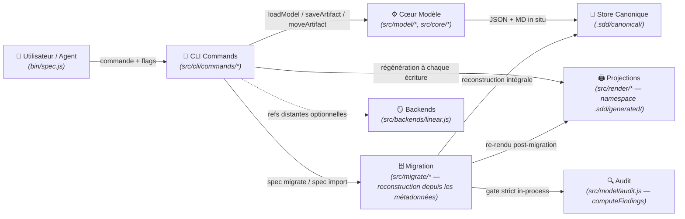

# Domaine : Workspace Management (spec-model) — Architecture Technique

> [!NOTE]
> **Mission :** Architecture du CLI `spec` et du modèle canonique sans état : lecture/écriture de `.sdd/canonical/` (état en métadonnées), index v3, projections markdown sous `.sdd/generated/` (namespace exclusif, régénéré et purgé par le CLI), migration de workspaces hérités par reconstruction intégrale (`spec migrate`) et garde-fous d'intégrité (drift de projections, racine exhaustive, coexistence verrouillée).

---

## 1. Flux Architectural des Couches

---

## 2. Cartographie des Composants

| Couche | Responsabilité Technique | Composants Clés |
|---|---|---|
| **Transport / CLI** | Parsing, résolution des `<ref>` (id nu, slug, chemin), erreurs typées, `--dry-run`, garde de coexistence (`assertNoCoexistence`) posé sur toute mutatrice | `bin/spec.js`, `src/cli/commands/{init,upsert,move,done,link,validate,render,status,list,model,migrate,import,sync,backend}.js` |
| **Cœur Modèle** | Dérivation des chemins — canoniques **et** de projection (relations seul), walk de `canonical/`, relocation sur changement de `relations` uniquement, index v3 ; **plus aucune connaissance des chemins à états** : le savoir layout-legacy (`STATE_DIRS`, `STATE_BY_DIR`, `MODEL_DIRNAME`, `modelRoot`) a été transféré à `migrate/v2-layout.js` | `src/model/{layout,store,graph,index,schema}.js` (`META_VERSION = 3`), `src/core/{paths,transitions}.js` (`SPECS_DIRNAME = '.sdd'`, `ALLOWED_ROOT_ENTRIES`) |
| **Migration & Audit** | Détection **déterministe** du layout (seuls marqueurs lus : `config.json` + `index.json` — jamais d'heuristique de disque), plan de migration (divergences disque ↔ métadonnée, réécritures de tokens, warnings de config), **reconstruction intégrale** depuis les métadonnées, gate strict in-process, marker d'échec, garde de coexistence ; moteur de validate extrait en lecture pure | `src/migrate/{migrate,v2-layout,parse,import}.js` (`detectLayout`, `planMigration`, `runMigration`, `assertNoCoexistence`, `gateAndRetire`), `src/model/audit.js` (`computeFindings`) |
| **Projections** | Rendu markdown sous `.sdd/generated/` (aplati au niveau initiative, trié par id) ; purge des orphelins (`MANAGED = ['generated']` — le sweep v2 et le démontage des répertoires hérités sont retirés) ; prévisualisation `--dry-run` ; garde anti-drift `render --check` limitée à `generated/` | `src/render/{projections,markdown}.js`, `src/model/layout.js` (`projectionRelativePath`) |
| **Persistance** | Store fichier JSON + MD ; répertoires créés à la volée ; élagage jamais au-dessus de `canonical/` ; configuration au schéma **v3** | `.sdd/canonical/**`, `.sdd/canonical/index.json`, `.sdd/config.json` (`src/core/config.js`, `CONFIG_VERSION = 3`) |
| **Mirrors** | Projection distante optionnelle ; refs stockées dans la métadonnée `remote` (préservées telles quelles par la migration — jamais resynchronisées par elle) | `src/backends/linear.js` (désactivé par défaut) |

> [!IMPORTANT]
> **Frontière de Domaine :** les namespaces `generated/` (feature `02-generated-namespace`) et la migration de workspaces `spec migrate` (feature `03-sdd-migration` — cutover de racine `.specs/` → `.sdd/` effectué, workspace de ce repo basculé en one-shot) sont livrés. Reste scellé à la feature sœur : l'entrée racine optionnelle `site/` (feature `04`, extension de `ALLOWED_ROOT_ENTRIES`).

---

## 3. Dépendances Inter-Domaines

| Relation | Domaine Lié | Contrat & Échange |
|---|---|---|
| **Expose à** | `02-generated-namespace` | Namespace `generated/` exclusif (**livré**) : toutes les projections markdown vivent sous `.sdd/generated/` ; champ `projection` de `index.json` reciblé (format v3 inchangé, pas de version 4) |
| **Expose à** | `03-sdd-migration` | Métadonnées schema v3 + `index.json` comme source de reconstruction (**livré**) : `spec migrate` reconstruit `.sdd/` intégralement depuis ces métadonnées — destinations dérivées des relations, jamais de la position disque |
| **Expose à** | `04-static-site` | `ALLOWED_ROOT_ENTRIES` : la feature ajoutera l'entrée `site` (site statique optionnel) |

---

## 4. Invariants Techniques & Sécurité

| Règle | Exigence d'Intégrité | Mécanisme de Contrôle |
|---|---|---|
| **`INV-1`** | **Aucun état de cycle de vie dans un chemin** — canonique ou de projection : les deux dérivent des slugs/ids + `relations` seul ; un `move` régénère la projection au même chemin | `validate` règles `canonical-layout` + `graph-integrity` ; `projectionRelativePath` (signature sans option d'état) |
| **`INV-2`** | **`move` sans relocation ni renommage de projection** : la transition mute la métadonnée et régénère l'index + les projections au même chemin — rien d'autre ne bouge | `moveArtifact` in situ + tests |
| **`INV-3`** | **Zéro pré-allocation** : `spec init` crée exactement 2 répertoires + `config.json` — `generated/` n'est pas pré-alloué, il naît au premier rendu | `standardLayout` + tests |
| **`INV-4`** | **`knowledge/` regroupe `decisions/` + `domains/`** ; authored, hors graphe, jamais généré ni exigé, hors de portée du render | `knowledgeRoot` ; validate exit 0 avec/sans knowledge |
| **`INV-5`** | **Unicité globale des ids de spec** — condition de l'aplatissement des projections : deux ids identiques produiraient une collision silencieuse sous `generated/initiatives/<slug>/specs/` | `validate` règle `spec-id-uniqueness` (garde post-hoc, pas de verrou d'allocation) |
| **`INV-6`** | **Slug immuable** (PDR-001) ; re-upsert = mise à jour in situ | Pas de commande rename + tests |
| **`INV-7`** | **Allocation d'id séquentielle, jamais réutilisée ; `\d{3,4}`** | `parseSpecSlug` + `spec list --kind spec --json` |
| **`INV-8`** | **Projections exclusivement sous `.sdd/generated/`, racine `.sdd/` exhaustive** : `config.json`, `canonical/`, `generated/`, `knowledge/` — toute autre entrée est une violation (dotfiles tolérés, dont le marker de migration) | `validate` règle `root-layout` ; `render --check` (couverture `generated/` seul) |
| **`INV-9`** | **`generated/` intégralement régénérable** : purge de tout `.md` non projeté, suppressions listées et prévisualisables (`--dry-run`) ; `knowledge/`, `canonical/` et `config.json` hors de portée du render ; horizon `MANAGED` réduit à `['generated']` — le sweep v2 est retiré : les entrées héritées parasites ne sont plus purgées au render, `validate` (`root-layout`) les refuse et la reprise passe par `spec migrate` | `pruneStaleProjections` + tests |
| **`INV-10`** | **`render --check` échoue sur tout drift** (`stale`, `missing`, `unexpected`) et ne couvre que `generated/` | `renderProjections({ check })` + tests |
| **`INV-11`** | **Option `projections.markdown` honorée** : `false` coupe toute écriture de projection (index régénéré) ; absence de la clé dans `config.json` = défaut activé | `normalizeConfig` (tolérance verrouillée par test) |
| **`INV-12`** | **Migration par reconstruction intégrale, jamais de merge** : `spec migrate` reconstruit toujours `.sdd/` de zéro depuis la source ; un workspace partiel/en échec est effacé avant reconstruction ; un second appel est un no-op (« already migrated », exit 0) | `runMigration` + tests (feature `03` INV-1) |
| **`INV-13`** | **Destinations dérivées des métadonnées, jamais de la position disque** : chaque destination est `modelRelativePaths(meta)` recalculé depuis `state`/`relations` ; les divergences (`position-mismatch`, `state-mismatch`, `unresolved-relations` — bloquante, `legacy-residue`) sont listées dans le plan et n'influencent jamais la destination | `planMigration` (feature `03` INV-2) |
| **`INV-14`** | **Préservation du graphe + réécriture littérale des tokens** : ids, slugs, relations, `progress` (dont `done`), refs `remote` recopiés tels quels ; tokens de racine `.specs/` (slash final) réécrits en `.sdd/` dans les corps, les valeurs `fields` et les markdown `knowledge/**`, chaque réécriture listée dans le plan ; `config.json` converti au schéma v3 (clés inconnues et backends `filesystem` retirés avec warning) | `runMigration`, `convertConfig` (feature `03` INV-3) |
| **`INV-15`** | **Gate strict in-process — sinon marker d'échec, source conservée, exit 1** : succès seulement si `computeFindings` = 0 finding ET `renderProjections({ check: true })` = 0 drift (mêmes moteurs que les commandes, jamais les commandes CLI elles-mêmes) ; sinon `.sdd/.migration-failed.json` écrit (`failedAt`, `stage`, `message`), source `.specs/` conservée intégralement | `gateAndRetire` (feature `03` INV-4) |
| **`INV-16`** | **Coexistence `.specs/` + `.sdd/` : mutations refusées, lectures sur `.sdd/`** : tant que les deux racines coexistent, toute commande mutatrice est refusée (exit 1, instruction de relancer `spec migrate`) ; les lectures opèrent exclusivement sur `.sdd/` ; `spec migrate` s'affranchit explicitement du garde (c'est l'outil de reprise) | `assertNoCoexistence` posé sur `upsert`, `move`, `done`, `link`, `render` (écriture), `import`, `init --force`, `model --write`, `sync`, `backend` (feature `03` INV-5) |
| **`INV-17`** | **`--dry-run` sur toutes les écritures de la migration** : `spec migrate --dry-run` et `spec import --dry-run` calculent le plan complet (divergences, réécritures, warnings, suppressions) sans aucune écriture ; sortie terminée par `(dry-run: nothing was written)` | `planMigration` (feature `03` INV-6) |

> *Traçabilité : les invariants `INV-1`…`INV-4` de la feature `02-generated-namespace` (spec 002, §5) correspondent aux `INV-8`…`INV-11` du domaine, et les invariants `INV-1`…`INV-6` de la feature `03-sdd-migration` (spec 003, §5) correspondent aux `INV-12`…`INV-17` du domaine (numérotation locale à la feature).*

---

## 5. Décisions d'Architecture de Référence

| Référence | Décision Structurante | Impact Technique |
|---|---|---|
| [`PDR-001`](../../decisions/product/PDR-001-slug-immuable.md) | Slug immuable après création | Élimine la classe des renommages destructeurs (relocation en chaîne, resync de mirrors) |

> Les arbitrages structurants de la migration (détection déclarative, reconstruction intégrale, gate strict, garde de coexistence) sont portés par la spec `003-sdd-migration` elle-même (§1 Intent, §5 Invariants) — aucun ADR distinct n'a été requis.

---

## 6. Conventions Interim Basculées (historique)

Tombées avec les livraisons des features `02-generated-namespace` puis `03-sdd-migration` — conservées pour l'audit, ne plus s'y référer. **La section « conventions interim restantes » du précédent état est entièrement tombée avec la livraison de `03`** : aucune convention provisoire ne subsiste.

| Convention | Ancien état | État livré |
|---|---|---|
| **Racine legacy `.specs/`** | `SPECS_DIRNAME` valait `.specs/` — désaligné du nom du framework ; `core/` portait encore le savoir des chemins à états (`STATE_DIRS`, `STATE_BY_DIR`, `MODEL_DIRNAME`, `modelRoot`) | **TOMBÉE (basculée par 003)** : racine `.sdd/` unique (`SPECS_DIRNAME = '.sdd'`), le CLI ne reconnaît que `.sdd/` ; savoir layout-legacy transféré à `src/migrate/v2-layout.js` — `core/` ne connaît plus aucun chemin à état ; cutover du workspace de ce repo effectué (one-shot `spec migrate`, git en filet) |
| **Scanners legacy gelés** : `src/core/artifact.js`, `src/migrate/{import,parse}.js` | `src/core/artifact.js` encodait les états en chemins avec une regex `\d{3}` (incompatible 4 chiffres) ; `import.js` portait un patch de compat et restait gelé/obsolète après cutover | **TOMBÉE (basculée par 003)** : `src/core/artifact.js` supprimé (listers → `src/migrate/v2-layout.js`, regex `\d{3,4}`) ; `parse.js` : `\d{3,4}` + `extractParentInitiative` ; `import.js` re-owné (réécriture de tokens des corps importés, refus exit 2 si un modèle JSON existe, finish partagé avec migrate) |
| **Horizon de purge v2** : `MANAGED` dans `src/render/projections.js` | Contenait encore `specs`, `initiatives`, `vision.md` — le sweep v2 était inerte après cutover mais son code restait en place | **TOMBÉE (basculée par 003)** : `MANAGED = ['generated']` — sweep v2 et démontage des répertoires hérités retirés ; les entrées héritées parasites sont refusées par `validate` (règle `root-layout`), reprise par `spec migrate` |
| **Repointage doc-wide des 34 fichiers writers** (dont `templates/FEATURE_TEMPLATE.md:66`, lien de projection codé en dur vers l'arbre v2) | Agents, skills, templates, règles et manifestes pointaient des chemins de modèle v2 (`.specs/model/…`) et des projections héritées | **TOMBÉE (basculée par 003)** : convention post-bascule — chemins de modèle = `.sdd/canonical/…` (formes v3), projections = `.sdd/generated/…`, config = `.sdd/config.json` |
| **Projections v2 aux chemins avec dirs d'état** : `.specs/specs/<state>/`, `.specs/initiatives/<state>/<init>/…`, `.specs/vision.md` | Chemins encodant l'état, renommage des projections au `move` | **TOMBÉE (basculée par 002)** : projections sous `.sdd/generated/` — features et specs aplaties au niveau initiative, triées par id, zéro répertoire d'état, un `move` régénère au même chemin |
| **Double `vision.md`** : projection racine coexiste avec la vision authored | Deux visions indiscernables à la racine | **TOMBÉE (basculée par 002)** : une seule vision, à `generated/vision.md` |
| **Préfixes `index.json`** : `projection` pointant l'arbre v2 | `meta`/`body` = canonique, `projection` = ancien arbre hérité | **TOMBÉE (basculée par 002)** : `projection` = `.sdd/generated/…` — format v3 inchangé, pas de version 4 |

> *NB de traçabilité : les chemins `.specs/…` cités ci-dessus désignent l'ancienne racine legacy. Les documents du domaine avaient été token-réécrits mécaniquement (`.specs/` → `.sdd/`, réécriture littérale sans lecture sémantique) lors du cutover — le repointage sémantique de cette section historique a été appliqué à la synchronisation de `03`.*
