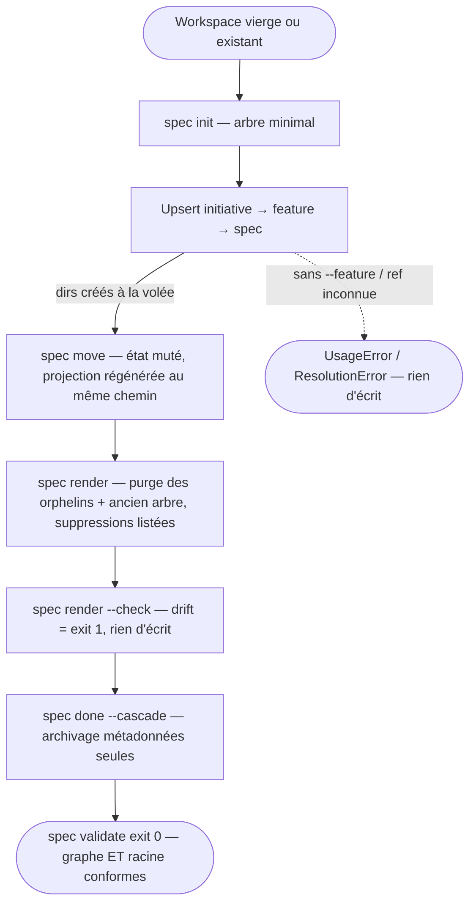

# Domaine : Workspace Management (workspace-management) — Comportement Produit

> **Mission :** Gouverner le workspace SDD : créer, lier, faire vivre et archiver les artefacts du modèle canonique (`vision`, `initiative`, `feature`, `spec`) via le CLI `spec`, avec un cycle de vie porté par les métadonnées — jamais par les chemins.
> **Acteurs & Personas :** Utilisateur humain (lead/dev qui pilote le process), Agent (orchestrateurs spécialisés : `/initiative`, `/feature`, `/spec`, `/sync-knowledge`…).

---

## 1. Périmètre & Frontières du Domaine (Bounded Context)

* **Ce qui relève de ce domaine (In Scope) :**
  * Bootstrap et layout du workspace : `.sdd/canonical/` sans état, tout répertoire créé à la volée.
  * Cycle de vie des artefacts : cadrage du graphe, transitions d'état, achèvement en cascade.
  * Intégrité du graphe : relations, unicité des ids, dérivabilité des chemins.
  * Gouvernance des projections : elles vivent sous `.sdd/generated/`, écrites et purgées exclusivement par le CLI — jamais éditées à la main.
* **Ce qui relève d'autres domaines (Out of Scope & Frontières) :**
  * *Rendu des projections markdown :* feature `02-generated-namespace` (livrée) — namespace `.sdd/generated/`, purge des orphelins listée et prévisualisable, garde de drift `render --check` (cf. `PAR-WM-05`).
  * *Migration de workspaces :* déléguée à `03-sdd-migration` (`spec migrate`, à venir).
  * *Mirroring distant :* Linear reste un miroir ; le modèle canonique est la seule vérité.

---

## 2. Vue d'Ensemble & Diagramme des Flux

---

## 3. Cartographie des Parcours

| Réf | Parcours | Acteur principal | Déclencheur | Résultat visible |
|---|---|---|---|---|
| `PAR-WM-01` | Bootstrap du workspace | Utilisateur / Agent | `spec init` | `.sdd/` + `canonical/` + `config.json`, rien d'autre |
| `PAR-WM-02` | Cadrer le graphe | Agent orchestrateur | `spec upsert <kind>` | Artefacts écrits à leur emplacement canonique définitif |
| `PAR-WM-03` | Piloter le cycle de vie | Utilisateur / Agent | `spec move <ref> --to <state>` | État muté ; projections régénérées au même chemin — zéro fichier déplacé ni renommé |
| `PAR-WM-04` | Achever & archiver en cascade | Agent orchestrateur | `spec done <ref> --cascade` | Spec puis parents complets archivés |
| `PAR-WM-05` | Synchroniser & auditer les projections | Utilisateur / Agent | `spec render` / `--dry-run` / `--check` | Projections sous `.sdd/generated/` fidèles au modèle ; drift signalé sans écriture |

---

## 4. Fiches Détaillées des Parcours

### `PAR-WM-01` : Bootstrap du workspace
* **Acteur :** Utilisateur / Agent.
* **Prérequis :** répertoire de travail ; `--force` seul écrase une config existante.
* **Déclencheur :** `spec init`.
* **Déroulement nominal :** 1. création de `.sdd/` et `.sdd/canonical/` ; 2. écriture de `config.json` ; 3. aucun autre répertoire n'est pré-alloué.
* **Post-conditions :** workspace minimal ; le reste naît à la volée à la première écriture.

### `PAR-WM-02` : Cadrer le graphe
* **Acteur :** Agent orchestrateur (skills `/initiative`, `/feature`, `/spec`).
* **Prérequis :** workspace initialisé ; pour une spec, une feature parente existante.
* **Déclencheur :** `spec upsert <kind> --slug … [--feature <ref>]`.
* **Déroulement nominal :** 1. résolution du parent ; 2. dérivation des `relations` (l'initiative dérive de la feature) ; 3. écriture JSON + MD à l'emplacement définitif.
* **Post-conditions :** artefact indexé, projections régénérées sous `.sdd/generated/` ; re-upserter un slug existant met à jour titre/état in situ sans déplacer le répertoire.
* **Variantes :** *Re-parentage :* `spec link <ref> --feature|--initiative` change le parent et reloge les fichiers de la spec (et de ses descendants pour une feature) — seule opération qui déplace des fichiers.

### `PAR-WM-03` : Piloter le cycle de vie
* **Acteur :** Utilisateur / Agent.
* **Prérequis :** artefact existant ; transition cible légale : `planned → active|archived`, `active → planned|archived`, `archived → active`.
* **Déclencheur :** `spec move <ref> --to <state>` (saisie tolérante : `archive`, `Active`, `plan`…).
* **Déroulement nominal :** 1. mutation de `state` + `updatedAt` dans la métadonnée ; 2. régénération index + projections **au même chemin** — plus aucun répertoire d'état ni renommage ; 3. confirmation de la transition.
* **Post-conditions :** arborescence bit-à-bit inchangée ; idempotent, `--dry-run` n'écrit rien.

### `PAR-WM-04` : Achever & archiver en cascade
* **Acteur :** Agent orchestrateur (`/sync-knowledge`), après quality gates verts.
* **Prérequis :** spec livrée ; parents à archiver identifiables par complétude des enfants.
* **Déclencheur :** `spec done <ref> [--cascade]`.
* **Déroulement nominal :** 1. `progress.done = true` + archivage de la spec ; 2. remontée : chaque parent dont **tous** les enfants sont complets est archivé à son tour ; 3. régénération des projections affectées.
* **Post-conditions :** `--undo` rouvre l'artefact en `active` ; aucun fichier déplacé.

### `PAR-WM-05` : Synchroniser & auditer les projections
* **Acteur :** Utilisateur / Agent.
* **Prérequis :** workspace initialisé ; `knowledge/`, `canonical/` et `config.json` sont hors de portée de cette commande.
* **Déclencheur :** `spec render` (rendu + purge), `spec render --dry-run` (prévisualisation), `spec render --check` (garde CI).
* **Déroulement nominal (rendu) :** 1. les projections attendues sont écrites sous `.sdd/generated/` (vision, README d'initiative, features et specs aplaties triées par id) ; 2. tout markdown non projeté est purgé et sa suppression listée ; 3. table des changements (`created` / `updated` / `removed`).
* **Variantes :** *Prévisualisation :* `--dry-run` exécute les mêmes calculs sans rien écrire et se termine par `(dry-run: nothing was written)` — le sweep de l'ancien arbre hérité est prévisualisé. *Garde CI :* `--check` est en lecture seule et sort 1 dès qu'une projection est obsolète, manquante ou parasite — seule `generated/` est couverte.
* **Post-conditions :** `generated/` reflète exactement le modèle ; avec `projections.markdown: false`, aucune projection markdown n'est écrite ni exigée (`--check` sort 0 vacuement).

---

## 5. Invariants & Règles Métier

* **`RULE-WM-01` (État en métadonnées) :** l'état de cycle de vie vit exclusivement dans la métadonnée `state` et l'index ; aucun chemin ne l'encode, `spec move` ne déplace aucun fichier.
* **`RULE-WM-02` (Slug immuable) :** le slug d'un artefact — donc son chemin — ne change jamais après création ; seul le titre est modifiable (PDR-001).
* **`RULE-WM-03` (Ids uniques et non réutilisés) :** l'id de spec est unique au niveau du modèle, alloué séquentiellement (max+1), jamais réalloué ; 3 ou 4 chiffres.
* **`RULE-WM-04` (Chemin dérivé des relations) :** tout chemin canonique dérive des slugs/ids et de `relations` seul ; une spec sans parent est rejetée avant toute écriture.
* **`RULE-WM-05` (Dry-run d'abord) :** toute mutation est prévisualisable (`--dry-run`), idempotente en ré-exécution, réversible (`done --undo`) ; toute erreur laisse le workspace intact.
* **`RULE-WM-06` (Projections sous `generated/`, racine exhaustive) :** toute projection markdown vit sous `.sdd/generated/` ; la racine `.sdd/` ne contient que `config.json`, `canonical/`, `generated/`, `knowledge/` — toute autre entrée est rejetée par `spec validate` (règle `root-layout`, dotfiles tolérés).
* **`RULE-WM-07` (`generated/` intégralement régénérable) :** le CLI est le seul écrivain de `generated/` ; tout markdown non projeté est purgé et sa suppression listée, prévisualisable via `--dry-run` ; `knowledge/`, `canonical/` et `config.json` sont hors de portée du render.

---

## 6. Matrice des États, Échecs & Cas Limites

| Situation / Déclencheur | Comportement & Réaction visible | Action de reprise utilisateur |
|---|---|---|
| `spec upsert spec` sans `--feature` | UsageError « spec requires --feature », rien d'écrit | Lier la spec à une feature existante via `--feature` |
| Ref inconnue ou ambiguë (`move`, `done`, `link`) | ResolutionError, sortie non nulle, rien d'écrit | Vérifier la ref via `spec list` / `spec status` |
| Transition illégale (ex. `archived → planned`) | TransitionError listant les transitions permises | Repasser par `archived → active` ou choisir un état légal |
| Id de spec dupliqué (2 features distinctes) | `spec validate` → règle `spec-id-uniqueness`, exit 1 | Réallouer l'id du nouvel artefact (max+1) |
| Projection obsolète, manquante ou parasite sous `generated/` | `spec render --check` sort 1 en listant le drift (`stale` / `missing` / `unexpected`), rien n'est écrit | Lancer `spec render` pour régénérer, puis re-vérifier |
| Entrée parasite à la racine `.sdd/` | `spec validate` → règle `root-layout`, exit 1 | Déplacer ou supprimer l'entrée hors de `.sdd/` |
| Ancien arbre hérité (`specs/`, `initiatives/`, `vision.md` sous `.sdd/`) | `spec render` le supprime et liste les suppressions ; `--dry-run` prévisualise sans écrire | Vérifier `git status` avant de committer (cutover destructif, git sert de filet) |
| Projections désactivées (`projections.markdown: false`) | Aucune projection markdown n'est écrite ; `--check` sort 0 (aucune projection attendue) | Réactiver dans `config.json` (absence de la clé = activé) |
