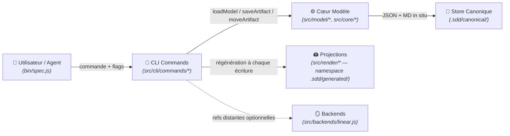

# Domaine : Workspace Management (workspace-management) — Architecture Technique

> [!NOTE]
> **Mission :** Architecture du CLI `spec` et du modèle canonique sans état : lecture/écriture de `.sdd/canonical/` (état en métadonnées), index v3, projections markdown sous `.sdd/generated/` (namespace exclusif, régénéré et purgé par le CLI) et garde-fous d'intégrité (drift de projections, racine exhaustive).

---

## 1. Flux Architectural des Couches

---

## 2. Cartographie des Composants

| Couche | Responsabilité Technique | Composants Clés |
|---|---|---|
| **Transport / CLI** | Parsing, résolution des `<ref>` (id nu, slug, chemin), erreurs typées, `--dry-run` | `bin/spec.js`, `src/cli/commands/{init,upsert,move,done,link,validate,render,status,list,model,sync,backend}.js` |
| **Cœur Modèle** | Dérivation des chemins — canoniques **et** de projection (relations seul), walk de `canonical/`, relocation sur changement de `relations` uniquement, index v3 | `src/model/{layout,store,graph,index,schema}.js` (`META_VERSION = 3`), `src/core/{paths,transitions}.js` (`ALLOWED_ROOT_ENTRIES`) |
| **Projections** | Rendu markdown sous `.sdd/generated/` (aplati au niveau initiative, trié par id) ; purge des orphelins + sweep v2 ; prévisualisation `--dry-run` ; garde anti-drift `render --check` limitée à `generated/` | `src/render/{projections,markdown}.js`, `src/model/layout.js` (`projectionRelativePath`) |
| **Persistance** | Store fichier JSON + MD ; répertoires créés à la volée ; élagage jamais au-dessus de `canonical/` | `.sdd/canonical/**`, `.sdd/canonical/index.json` |
| **Mirrors** | Projection distante optionnelle ; refs stockées dans la métadonnée `remote` | `src/backends/linear.js` (désactivé par défaut) |

> [!IMPORTANT]
> **Frontière de Domaine :** le namespace `generated/` est livré (feature `02-generated-namespace` — cutover du workspace effectué). Restent scellés aux features sœurs : la migration de workspaces `spec migrate` (feature `03`, cf. §6) et l'entrée racine optionnelle `site/` (feature `04`, extension de `ALLOWED_ROOT_ENTRIES`).

---

## 3. Dépendances Inter-Domaines

| Relation | Domaine Lié | Contrat & Échange |
|---|---|---|
| **Expose à** | `02-generated-namespace` | Namespace `generated/` exclusif (**livré**) : toutes les projections markdown vivent sous `.sdd/generated/` ; champ `projection` de `index.json` reciblé (format v3 inchangé, pas de version 4) |
| **Expose à** | `03-sdd-migration` | Métadonnées schema v3 + `index.json` comme source de reconstruction (`spec migrate`) |
| **Expose à** | `04-static-site` | `ALLOWED_ROOT_ENTRIES` : la feature ajoutera l'entrée `site` (site statique optionnel) |

---

## 4. Invariants Techniques & Sécurité

| Règle | Exigence d'Intégrité | Mécanisme de Contrôle |
|---|---|---|
| **`INV-1`** | **Aucun état de cycle de vie dans un chemin** — canonique ou de projection : les deux dérivent des slugs/ids + `relations` seul ; un `move` régénère la projection au même chemin | `validate` règles `canonical-layout` + `graph-integrity` ; `projectionRelativePath` (signature sans option d'état) |
| **`INV-2`** | **`move` sans relocation ni renommage de projection** : la transition mute la métadonnée et régénère l'index + les projections au même chemin — rien d'autre ne bouge | `moveArtifact` in situ + tests |
| **`INV-3`** | **Zéro pré-allocation** : `spec init` crée exactement 2 répertoires + `config.json` — `generated/` n'est pas pré-alloué, il naît au premier rendu | `standardLayout` + tests |
| **`INV-4`** | **`knowledge/` regroupe `decisions/` + `domains/`** ; authored, hors graphe, jamais généré ni exigé, hors de portée du render | `knowledgeRoot` ; validate exit 0 avec/sans knowledge |
| **`INV-5`** | **Unicité globale des ids de spec** — condition de l'aplatissement des projections : deux ids identiques produiraient une collision silencieuse sous `generated/initiatives/<slug>/specs/` | `validate` règle `spec-id-uniqueness` (garde post-hoc, pas de verrou d'allocation) |
| **`INV-6`** | **Slug immuable** (PDR-001) ; re-upsert = mise à jour in situ | Pas de commande rename + tests |
| **`INV-7`** | **Allocation d'id séquentielle, jamais réutilisée ; `\d{3,4}`** | `parseSpecSlug` + `spec list --kind spec --json` |
| **`INV-8`** | **Projections exclusivement sous `.sdd/generated/`, racine `.sdd/` exhaustive** : `config.json`, `canonical/`, `generated/`, `knowledge/` — toute autre entrée est une violation | `validate` règle `root-layout` ; `render --check` (couverture `generated/` seul) |
| **`INV-9`** | **`generated/` intégralement régénérable** : purge de tout `.md` non projeté + sweep v2, suppressions listées et prévisualisables (`--dry-run`) ; `knowledge/`, `canonical/` et `config.json` hors de portée du render | `pruneStaleProjections` + tests |
| **`INV-10`** | **`render --check` échoue sur tout drift** (`stale`, `missing`, `unexpected`) et ne couvre que `generated/` | `renderProjections({ check })` + tests |
| **`INV-11`** | **Option `projections.markdown` honorée** : `false` coupe toute écriture de projection (index régénéré) ; absence de la clé dans `config.json` = défaut activé | `normalizeConfig` (tolérance verrouillée par test) |

> *Traçabilité : les invariants `INV-1`…`INV-4` de la feature `02-generated-namespace` (spec 002, §5) correspondent aux `INV-8`…`INV-11` du domaine (numérotation locale à la feature).*

---

## 5. Décisions d'Architecture de Référence

| Référence | Décision Structurante | Impact Technique |
|---|---|---|
| [`PDR-001`](../../decisions/product/PDR-001-slug-immuable.md) | Slug immuable après création | Élimine la classe des renommages destructeurs (relocation en chaîne, resync de mirrors) |

---

## 6. Conventions Interim Restantes (ne pas rouvrir)

Ces conventions sont volontairement provisoires et déjà arbitrées : le prochain agent ne les « corrige » pas et n'y touche pas sans rouvrir la feature porteuse. Les conventions tombées sont listées en §7 (historique).

| Convention interim | Périmètre | Levier de basculement |
|---|---|---|
| **Scanners legacy gelés** : `src/core/artifact.js`, `src/migrate/{import,parse}.js` encodent encore les états en chemins et une regex `\d{3}` (incompatible 4 chiffres) ; `spec import` obsolète après cutover | Import / parsing legacy | Feature `03-sdd-migration` (rework complet : `spec migrate`) |
| **Horizon de purge v2** : `MANAGED` dans `src/render/projections.js` contient encore `specs`, `initiatives`, `vision.md` — le sweep v2 est inerte après cutover mais son code reste en place | Rendu / purge | Feature `03-sdd-migration` (retrait avec les scanners legacy) |
| **`templates/FEATURE_TEMPLATE.md:66`** : lien de projection codé en dur vers l'arbre v2 (`specs/planned/…`) | Template writer des features | Feature `03-sdd-migration` (repointage complet des chemins de modèle) |
| **Racine `.sdd/`** (future `.sdd/`) | Tout le framework | Feature `03-sdd-migration` |

---

## 7. Conventions Interim Basculées (historique)

Tombées avec la livraison de la feature `02-generated-namespace` — conservées pour l'audit, ne plus s'y référer :

| Convention | Ancien état | État livré |
|---|---|---|
| **Projections v2 aux chemins avec dirs d'état** : `.sdd/specs/<state>/`, `.sdd/initiatives/<state>/<init>/…`, `.sdd/vision.md` | Chemins encodant l'état, renommage des projections au `move` | **TOMBÉE (basculée par 002)** : projections sous `.sdd/generated/` — features et specs aplaties au niveau initiative, triées par id, zéro répertoire d'état, un `move` régénère au même chemin |
| **Double `vision.md`** : `.sdd/vision.md` (projection) coexiste avec `.sdd/canonical/vision.md` (authored) | Deux visions indiscernables à la racine | **TOMBÉE (basculée par 002)** : une seule vision, à `generated/vision.md` |
| **Préfixes `index.json`** : `meta`/`body` = `.sdd/canonical/…`, `projection` = `.sdd/…` (chemins v2) | Champ projection pointant l'arbre v2 | **TOMBÉE (basculée par 002)** : `projection` = `.sdd/generated/…` — format v3 inchangé, pas de version 4 |
