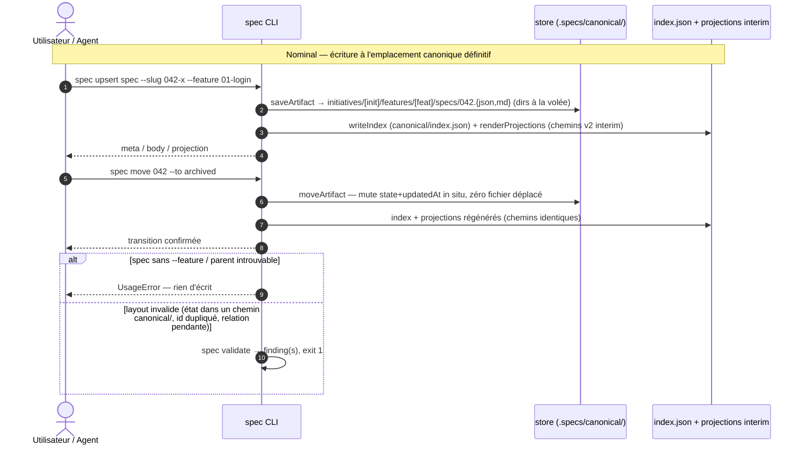

# Spec: 001 - Layout canonique v3

## Metadata
* **Domain:** `.specs/knowledge/domains/workspace-management/`
* **Change Type:** `Refactor`
* **Complexity:** `Large`
* **Feature:** `01-canonical-tree`
* **Initiative:** `layout-v3`

---

## 1. Intent & Context (*The Why*)

* **Problem Statement / Need:** Le modèle v2 encode l'état du cycle de vie dans les chemins (`specs/<état>/`, `initiatives/<étatInit>/<slug>/<étatFeat>/`), pré-alloue 17 répertoires vides, isole les specs du graphe et maintient `decisions/` hors de `knowledge/`. Chaque transition d'état déplace physiquement des fichiers (bruit git, races de relocation) et l'état existe en double (chemin + métadonnée).
* **User / System Impact:** Cutover dur vers un layout canonique sans état : le CLI ne lit **que** `.specs/canonical/`. L'état vit exclusivement dans la métadonnée et l'index — `spec move` ne déplace plus aucun fichier. `knowledge/` regroupe décisions et domaines ; `spec init` ne pré-alloue rien. La conversion one-shot du workspace courant de ce repo est une tâche de la phase 3 ; l'industrialisation (`spec migrate`) est la feature `03-sdd-migration`.
* **In Scope (What is added / modified):**
  * `canonical/` (état en métadonnées, zéro répertoire d'état, création à la volée) avec `index.json` déplacé dedans.
  * Réécriture de `src/model/layout.js` et `src/core/paths.js` (signatures simplifiées, fin du threading `initiativeState`).
  * `spec move` sans relocation de fichier ; `spec upsert spec` exige `--feature` ; `spec link` dérive `relations.initiative` et relaie la relocation aux descendants.
  * `spec init` minimal : `.specs/` + `canonical/` + `config.json`, rien d'autre.
  * `spec validate` : règles `canonical-layout` et `spec-id-uniqueness` ; ids de spec à 4 chiffres tolérés au-delà de 999.
  * Migration one-shot du workspace de ce repo + mise à jour des chemins dans les skills/agents écrivains (`new-adr`, `new-pdr`, `sync-knowledge`, orchestrators).
* **Out of Scope (Strict Exclusions):**
  * Le namespace `generated/` (feature `02-generated-namespace`) — les projections interim restent aux chemins v2 (`.specs/specs/<state>/`, `.specs/initiatives/…`, `.specs/vision.md`), le rendu est un watchout §6.
  * Le renommage `.sdd/` (feature `03-sdd-migration`) — la racine reste `.specs/`.
  * `spec migrate` industrialisé, migration des workspaces v2 tiers, commande de rename de slug (PDR-001 : slug immuable), mirroring Linear (inchangé).

> *Clean Omission Note : Section 4.3 Infrastructure & Runtime : sans objet (refactor interne du CLI, aucune infra/config/CI changée).*

---

## 2. Flow & Architecture



---

## 3. File Inventory & Responsibilities

### 3.1. Factorized File Tree

```text
src/
├── core/
│   ├── paths.js                                 [MOD] canonicalRoot/knowledgeRoot, standardLayout minimal, parseSpecSlug \d{3,4}
│   └── config.js                                [MOD] chaîne doc « .specs/canonical/ » (cosmétique)
├── model/
│   ├── layout.js                                [MOD] chemins canoniques sans état ; signature sans {initiativeState}
│   ├── store.js                                 [MOD] loadModel walk canonical/, moveArtifact sans relocation, initiativeStateFor supprimé
│   ├── index.js                                 [MOD] index v3 écrit dans .specs/canonical/index.json, préfixes .specs/canonical/
│   ├── schema.js                                [MOD] META_VERSION 3
│   └── graph.js                                 (inchangé — graphe par slugs, insensible au layout)
├── cli/
│   ├── context.js                               [MOD] suppression du threading initiativeState (persistArtifact, runCascade)
│   ├── help.js                                  [MOD] texte d'aide « .specs/canonical/ »
│   └── commands/
│       ├── init.js                              [MOD] layout minimal : .specs/ + canonical/ + config.json, rien d'autre
│       ├── upsert.js                            [MOD] spec exige --feature ; relations.initiative dérivée du parent
│       ├── move.js                              [MOD] transition = métadonnées seules (aucun mv)
│       ├── done.js                              [MOD] idem via persistArtifact/moveArtifact, cascade sans relocation
│       ├── link.js                              [MOD] dérive relations.initiative ; relocation enfant/descendants si parent change
│       ├── validate.js                          [MOD] règles canonical-layout + spec-id-uniqueness
│       ├── status.js / model.js / backend.js    [MOD] affichages préfixés .specs/canonical/
│       └── import.js (src/migrate/**)           (gelé — obsolète après cutover, rework feature 03, cf. §6)
├── render/
│   ├── projections.js                           (inchangé — projections interim v2, watchout §6)
│   └── markdown.js                              (inchangé)
└── backends/linear.js                           [MOD] affichage de chemin .specs/canonical/
test/
├── helpers.js                                   [MOD] fixtures seedées au layout canonical (plus de carte initiativeStates)
├── canonical-layout.test.js                     [NEW] @unit + @component : layout, parseSpecSlug, store, index, validate
├── cli.test.js                                  [MOD] @integration/@e2e : init minimal, cycle complet, chemins imprimés
├── model-store.test.js                          [MOD] chemins canonical, move in situ, findByRef nouveaux chemins
└── render.test.js / graph.test.js / config.test.js / transitions.test.js  [MOD] index sous canonical/ (assertions de chemins)
```

### 3.2. Key Contracts & Signatures

```js
// src/core/paths.js
export const CANONICAL_DIRNAME = 'canonical';
export const KNOWLEDGE_DIRNAME = 'knowledge';
export const canonicalRoot = (cwd) => path.join(cwd, SPECS_DIRNAME, CANONICAL_DIRNAME);   // .specs/canonical/
export const knowledgeRoot = (cwd) => path.join(cwd, SPECS_DIRNAME, KNOWLEDGE_DIRNAME);   // .specs/knowledge/
export function standardLayout(cwd);   // → [specsRoot(cwd), canonicalRoot(cwd)] — INV-3, rien d'autre
export function parseSpecSlug(slug);   // ^(\d{3,4})-(.+)$ → { id, suffix } | null — INV-7

// src/model/layout.js — plus d'option { initiativeState } : les chemins dérivent de relations seul
modelRelativePaths(meta);
//   vision     → { dir: '', meta: 'vision.json', body: 'vision.md' }
//   initiative → initiatives/<slug>/<slug>.{json,md}
//   feature    → initiatives/<initiative>/features/<slug>/<slug>.{json,md}
//   spec       → initiatives/<initiative>/features/<feature>/specs/<id>.{json,md}   // nom de fichier = id (INV-5)
projectionRelativePath(meta, { initiativeState });   // INCHANGÉ — projections interim v2

// src/model/store.js
loadModel(cwd);                                      // walk récursif de .specs/canonical/ (vision, initiatives/**)
saveArtifact(cwd, meta, body, { previous } = {});    // relocation uniquement si relations changent (plus jamais sur state)
moveArtifact(cwd, artifact, toState);                // mute state + updatedAt in situ — zéro fichier déplacé (INV-2)
findByRef(artifacts, reference, { kind });           // inchangé — id nu, slug, suffixe, chemin (INV-5)
// initiativeStateFor() supprimé (les features ne dépendent plus de l'état du parent pour leur chemin)

// src/cli/commands/validate.js — nouvelles règles
{ artifact, rule: 'canonical-layout',   detail }     // état de cycle de vie dans un chemin canonical/ (INV-1)
{ artifact, rule: 'spec-id-uniqueness', detail }     // id de spec non unique au niveau du modèle (INV-5)
{ artifact, rule: 'graph-integrity',    detail }     // spec sans relations.feature ou relations.initiative (dérivabilité de chemin)
```

---

## 4. Detailed Specifications

### 4.1. Data Models & API Contracts

* **Métadonnées (schema v3, `META_VERSION = 3`)** : structure inchangée (kind/id/slug/title/state/relations/fields/remote/progress/dates). Delta : les métadonnées de `spec` portent désormais `relations: { feature, initiative }` (requis pour dériver le chemin) ; `state` reste la seule trace de cycle de vie.
* **`canonical/index.json` (version 3)** : déplacé de `.specs/model/index.json` vers `.specs/canonical/index.json`. Entrées inchangées sauf préfixes : `meta`/`body` → `.specs/canonical/…`, `projection` → `.specs/…` (interim v2, jusqu'à la feature 02).
* **Arbre canonique livré** (racine `.specs/` jusqu'à la feature 03) :

```text
.specs/
├── config.json
├── canonical/
│   ├── index.json
│   ├── vision.{json,md}
│   └── initiatives/<slug>/
│       ├── <slug>.{json,md}
│       └── features/<fslug>/
│           ├── <fslug>.{json,md}
│           └── specs/<id>.{json,md}      ← 042.json / 042.md (id global unique)
└── knowledge/                            ← créé à la volée
    ├── decisions/{architecture,product}/
    └── domains/
```

* **Ids de spec** : uniques au niveau du modèle (`validate` règle `spec-id-uniqueness`, car l'arbre nesté ne les rend plus visibles par collision de répertoire) ; grammaire `<ref>` par id nu inchangée ; allocation séquentielle max+1, jamais réutilisée ; `\d{3,4}` accepté.

### 4.2. UI & Interaction Specifications (CLI)

| État | Déclencheur | Comportement système |
|---|---|---|
| **Bootstrap** | `spec init` | Crée exactement `.specs/`, `.specs/canonical/` et `config.json`. Aucun autre répertoire. |
| **Création spec** | `spec upsert spec --slug 042-x --feature <ref>` | Résout la feature → dérive `relations.initiative` → écrit à l'emplacement canonique définitif. Sans `--feature` : `UsageError` (chemin non dérivable), rien d'écrit. |
| **Transition** | `spec move <ref> --to <state>` | Mute `state` + `updatedAt` dans la métadonnée in situ, régénère index + projections. `dry-run` sans écriture. |
| **Achevement** | `spec done <ref> [--cascade]` | Persist + archive (métadonnées seules) ; cascade sans relocation ; `--undo` retourne à `active`. |
| **Re-parentage** | `spec link <spec> --feature <ref>` | Écrit `relations.{feature, initiative}` (initiative dérivée du parent) ; relocate les fichiers de la spec si le parent a changé. |
| **Re-parentage feature** | `spec link <feat> --initiative <slug>` | Reloge la feature **et** toutes ses specs descendantes (ordre topologique). Le slug est immuable (INV-6). |
| **Erreur** | ref inconnue/ambiguë, transition illégale, `--to` invalide | `ResolutionError`/`TransitionError`/`UsageError`, sortie non nulle, aucun fichier écrit. |

> *Section 4.3 Infrastructure, Configuration & Runtime : sans objet (aucune variable d'environnement, conteneur ou pipeline modifié).*

---

## 5. Business Invariants & Test Traceability

Chaque invariant de la feature `01-canonical-tree` (INV-1…INV-7) est couvert par un scénario Gherkin en §8.1 :

* **INV-1 · Aucun état de cycle de vie dans un chemin canonique**
  Tout chemin sous `.specs/canonical/` dérive exclusivement de slugs/ids et de `relations` ; les répertoires `planned/`, `active/`, `archive/` n'y existent pas et `validate` le refuse. `spec move` ne change aucun chemin.
  ↳ *Covered by:* [`canonical-layout.test.js`](#appendix-file-index), [`cli.test.js`](#appendix-file-index)

* **INV-2 · `spec move` ne déplace aucun fichier**
  La transition mute la métadonnée `state`, l'index et les projections — rien d'autre. La relocation par `previous` ne sert plus qu'aux changements de `relations`.
  ↳ *Covered by:* [`canonical-layout.test.js`](#appendix-file-index)

* **INV-3 · Répertoires tous créés à la volée ; `spec init` ne pré-alloue rien**
  `standardLayout` = [`.specs/`, `.specs/canonical/`] ; `saveArtifact` crée les répertoires manquants (`ensureDir`) à chaque écriture, y compris `knowledge/**` côté agents. Après `init`, l'arbre contient exactement 2 répertoires + `config.json`.
  ↳ *Covered by:* [`canonical-layout.test.js`](#appendix-file-index)

* **INV-4 · `knowledge/` regroupe `decisions/{architecture,product}/` et `domains/` ; `decisions/` disparaît du premier niveau**
  `knowledgeRoot` est la référence unique ; la migration one-shot (phase 3) déplace `.specs/decisions/**` vers `.specs/knowledge/decisions/**` et les skills écrivains (`new-adr`, `new-pdr`) sont repointés.
  ↳ *Covered by:* [`canonical-layout.test.js`](#appendix-file-index)

* **INV-5 · Ids de spec uniques au niveau du modèle ; grammaire `<ref>` par id nu inchangée**
  Les fichiers de spec sont nommés `<id>.{json,md}` dans un arbre nesté : l'unicité globale n'est plus garantie par collision de répertoire, `validate` la vérifie. `findByRef` (id nu, slug, suffixe, chemin) est inchangé.
  ↳ *Covered by:* [`canonical-layout.test.js`](#appendix-file-index)

* **INV-6 · Slug d'initiative immuable après création (titre modifiable, chemin jamais)**
  Aucune commande rename ; re-upserter un slug existant met à jour titre/état in situ sans créer ni déplacer de répertoire (PDR-001).
  ↳ *Covered by:* [`cli.test.js`](#appendix-file-index)

* **INV-7 · Allocation d'id séquentielle, jamais réutilisée ; 4 chiffres tolérés au-delà de 999**
  `parseSpecSlug` accepte `\d{3,4}` ; l'allocation est séquentielle (max existant + 1, calculé via `spec list --kind spec --json`) et un id libéré n'est jamais réalloué (pas de commande delete exposée).
  ↳ *Covered by:* [`canonical-layout.test.js`](#appendix-file-index)

---

## 6. Technical Watchouts & Anti-Patterns

* **Double `vision.md` interim:** jusqu'à la feature 02, `.specs/canonical/vision.md` (authored) coexiste avec `.specs/vision.md` (projection). Ne pas « corriger » les projections interim vers `generated/` — c'est le scope de la feature 02 ; documenter la convention dans le README du repo.
* **Scanners legacy gelés:** `src/core/artifact.js`, `src/migrate/import.js`, `src/migrate/parse.js` encodent encore les états en chemins et une regex `\d{3}` (incompatible 4 chiffres). Ne pas les brancher sur `canonical/` ; rework complet en feature 03 (`spec migrate`). `spec import` est obsolète après cutover.
* **`index.json` déplacé:** tout lecteur externe pointant `.specs/model/index.json` casse (agents, mirrors, scripts). La one-shot supprime l'ancien fichier ; balayer `status.js`, `model.js`, `backend.js`, `help.js`, `linear.js`, `config.js` dont les chaînes codées en dur mentionnent `.specs/model/`.
* **Relocation en cascade au re-parentage:** `spec link feature --initiative <autre>` doit reloger la feature PUIS ses specs descendantes (ordre topologique, `previous`-based) ; sinon les specs restent orphelines à l'ancien chemin et le prochain `loadModel` les perd. Interdire l'opération si une spec descendante manque (validate d'abord).
* **Concurrence d'allocation d'id:** pas de verrou ni d'allocateur CLI (INV-7) ; deux sessions peuvent choisir le même id. Le filet est la règle `spec-id-uniqueness` de `validate` — la documenter comme garde-fou post-hoc, pas préventif.
* **`pruneEmptyDirs` ne doit jamais remonter au-delà de `canonical/`:** conserver le garde `current !== root` ; un vidage de `initiatives/<slug>/features/<f>/specs/` supprime les répertoires vides mais jamais `canonical/` ni `initiatives/`.
* **Nom de fichier de spec = id:** perte du suffixe lisible (`042.json` vs `042-login.json`). Accepté (ids globalement uniques, titre/portabilité dans l'index) — ne pas « réparer » en réintroduisant le slug dans le nom de fichier sans rouvrir la feature.
* **Sequencing du cutover:** implémenter et valider le code sur des workspaces temporaires AVANT la one-shot du repo ; sinon `spec validate`/`render` du repo tournent sur un layout à moitié converti.

---

## 7. Sequential Execution Plan

- [x] **Phase 1: Fondations & contrats de données**
  - [x] `src/core/paths.js` : `CANONICAL_DIRNAME`, `KNOWLEDGE_DIRNAME`, `canonicalRoot`, `knowledgeRoot`, `standardLayout` minimal, `parseSpecSlug` `\d{3,4}` (conserver `STATE_DIRS`/`STATE_BY_DIR` pour les projections interim).
  - [x] `src/model/schema.js` : `META_VERSION = 3`.
  - [x] Tests unitaires layout/parse dans `test/canonical-layout.test.js` (@unit U1–U5).

- [x] **Phase 2: Cœur logique & interfaces CLI**
  - [x] `src/model/layout.js` : `modelRelativePaths(meta)` sans état ; `projectionRelativePath` inchangé.
  - [x] `src/model/store.js` : `loadModel` walk canonical/, `saveArtifact` (relocation sur relations seul), `moveArtifact` sans relocation, suppression `initiativeStateFor`.
  - [x] `src/model/index.js` : index v3 dans `.specs/canonical/index.json` ; `src/cli/context.js` sans threading `initiativeState`.
  - [x] Commandes : `init` (minimal), `upsert` (spec exige `--feature`, dérive `initiative`), `move`/`done` (zéro mv), `link` (dérive + relocation descendants), `validate` (règles `canonical-layout`, `spec-id-uniqueness`), chaînes d'affichage (`status`, `model`, `backend`, `help`, `linear.js`, `config.js`).
  - [x] Tests composant (@component C1–C9) + adaptation `test/helpers.js`, `test/model-store.test.js`, `test/render.test.js`, `test/graph.test.js`, `test/config.test.js`.

- [x] **Phase 3: Cutover one-shot, E2E & quality gates**
  - [x] Migration one-shot du workspace de ce repo : `model/**` → `canonical/**` (re-nesting features/specs, renommage `specs/<id>`), `decisions/**` → `knowledge/decisions/**`, suppression des répertoires d'état vides et de l'ancien `.specs/model/`, régénération index + projections.
  - [x] Repointer les skills/agents écrivains : `skills/new-adr/SKILL.md`, `skills/new-pdr/SKILL.md`, `skills/sync-knowledge/SKILL.md`, `agents/knowledge-orchestrator.md`, `agents/product-orchestrator.md` (chemins `knowledge/decisions/…`).
  - [x] Tests E2E (@integration I1–I4, @e2e E1–E2) dans `test/cli.test.js` + `test/canonical-layout.test.js`.
  - [x] Exécuter 100 % des gates : `npm test` (93+ tests verts), `spec validate` exit 0, `spec render --check` sans drift.

---

## 8. BDD Validation & Quality Gates

### 8.1. Exhaustive Gherkin Scenarios

```gherkin
Feature: Layout canonique v3 — état en métadonnées, arbre canonical/

  # ============================================================================
  # 1. Unit Tests (@unit) — test/canonical-layout.test.js
  # ============================================================================

  @unit
  Scenario: [INV-1][INV-5] Chemin canonique d'une spec dérivé des relations seul
    Given une métadonnée spec { slug: "042-login", id: "042", relations: { feature: "01-login", initiative: "demo" } }
    When modelRelativePaths(meta) est appelée (sans option initiativeState)
    Then le résultat est initiatives/demo/features/01-login/specs/042.{json,md} — aucun segment d'état

  @unit
  Scenario: [INV-1] Chemins canoniques initiative / feature / vision
    Given les métadonnées vision, initiative "demo", feature "01-login" (relations.initiative = "demo")
    When modelRelativePaths(meta) est appelée pour chacune
    Then vision → vision.{json,md} à la racine de canonical/, initiative → initiatives/demo/<slug>, feature → initiatives/demo/features/01-login/<slug>

  @unit
  Scenario: [INV-7] parseSpecSlug tolère 3 et 4 chiffres, rejette 2 et 5
    Given la regex parseSpecSlug
    When "042-login", "1042-x" sont parsés puis "42-x" et "10442-x"
    Then ids "042" et "1042" extraits ; les deux derniers retournent null

  @unit
  Scenario: [INV-3] standardLayout ne retourne que la racine et canonical/
    Given un cwd temporaire
    When standardLayout(cwd) est évaluée
    Then le tableau vaut exactement [".specs/", ".specs/canonical/"] — aucun répertoire d'état, ni model/, ni decisions/, ni knowledge/

  @unit
  Scenario: [INV-2][INV-3] saveArtifact écrit à la volée et ne reloge qu'au changement de relations
    Given un workspace vide et une spec à relations { feature, initiative }
    When saveArtifact est appelée puis rappelée avec un autre parent (previous fourni)
    Then les répertoires sont créés à la volée, et seule la 2ᵉ écriture déplace les fichiers (les anciens sont élagués)

  @unit
  Scenario: [INV-1] buildIndex v3 préfixe meta/body par .specs/canonical/ et écrit dans canonical/index.json
    Given trois artefacts hydratés depuis canonical/
    When buildIndex(artifacts) puis writeIndex
    Then index.json version 3 vit sous .specs/canonical/index.json, meta/body préfixés ".specs/canonical/", projection préfixée ".specs/"

  @unit
  Scenario: [INV-2] moveArtifact mute l'état in situ sans déplacer un fichier
    Given une spec persistée en planned (chemins connus)
    When moveArtifact(cwd, artifact, "active")
    Then model.meta et model.body sont identiques avant/après, seul state et updatedAt changent, aucun fichier déplacé

  # ============================================================================
  # 2. Component Tests (@component) — test/canonical-layout.test.js
  # ============================================================================

  @component
  Scenario: [INV-3] loadModel découvre l'arbre canonical nesté
    Given un workspace seedé (initiative → feature → spec) via saveArtifact au nouveau layout
    When loadModel(cwd)
    Then 3 artefacts hydratés avec model.meta sous canonical/ et projection interim v2 correcte

  @component
  Scenario: [INV-2] spec move planifie la mutation sans relocation
    Given un workspace seedé
    When `spec move 042 --to active`
    Then l'index reflète state=active, l'arborescence de fichiers est inchangée, et les projections restent aux mêmes chemins

  @component
  Scenario: [INV-2] done --cascade archive la chaîne sans déplacer un seul fichier
    Given une chaîne spec → feature → initiative dont la spec est la dernière enfant
    When `spec done 042 --cascade`
    Then la spec, la feature et l'initiative passent archived en métadonnée seule, l'arborescence est inchangée

  @component
  Scenario: [INV-5] validate signale un id de spec dupliqué au niveau du modèle
    Given deux features portant chacune une spec d'id 042 (collision nestée invisible au FS)
    When `spec validate`
    Then une règle spec-id-uniqueness liste le doublon et exit 1

  @component
  Scenario: [INV-1] validate refuse un état de cycle de vie sous canonical/ et une spec sans relations complètes
    Given un workspace avec un répertoire canonical/initiatives/demo/planned/ parasite et une spec sans relations.initiative
    When `spec validate`
    Then des findings canonical-layout et graph-integrity sont émis, exit 1

  @component
  Scenario: [INV-1] upsert spec sans --feature est rejeté avant toute écriture
    Given un workspace initialisé sans feature existante
    When `spec upsert spec --slug 042-x` (sans --feature)
    Then UsageError « spec requires --feature » et aucun fichier créé

  @component
  Scenario: [INV-1][INV-5] link dérive relations.initiative et reloge la spec au changement de parent
    Given une spec liée à feature A (dans initiatives/i1/features/a/)
    When `spec link 042 --feature 01-other` (feature sous initiatives/i2/features/b/)
    Then relations = { feature: "01-b", initiative: "i2" } et les fichiers sont relogés sous initiatives/i2/features/01-b/specs/, l'ancien répertoire élagué

  @component
  Scenario: [INV-1][INV-6] re-parenter une feature reloge la feature et toutes ses specs descendantes
    Given une feature "01-a" sous i1 avec deux specs nichées
    When `spec link 01-a --initiative i2`
    Then feature et specs sont relogées sous initiatives/i2/features/01-a/, slugs inchangés, aucun slug renommé

  @component
  Scenario: [INV-1] projections interim v2 et index canonical coexistent sans conflit
    Given un workspace seedé avec un artefact active
    When renderProjections + writeIndex
    Then la projection reste à .specs/specs/active/… (interim v2), l'index à .specs/canonical/index.json, et render --check ne signale aucun drift

  # ============================================================================
  # 3. Integration Tests (@integration) — test/canonical-layout.test.js + cli.test.js
  # ============================================================================

  @integration
  Scenario: [INV-3] init produit l'arbre minimal exact
    Given un workspace vide
    When `spec init`
    Then l'arbre contient exactement .specs/config.json et .specs/canonical/ — aucun répertoire d'état, ni model/, ni knowledge/

  @integration
  Scenario: [INV-1][INV-2][INV-3] cycle complet CLI sans aucun déplacement de fichier
    Given un workspace après `spec init`
    When upsert initiative → feature → spec, puis `spec move` sur chacun
    Then tous les répertoires sont créés à la volée à la première écriture, aucune transition ne crée/déplace de répertoire, index + projections régénérés à chaque étape

  @integration
  Scenario: [INV-5][INV-7] ids 3 et 4 chiffres coexistent et les refs par id nu résolvent
    Given les specs 042-a et 1042-b dans deux features distinctes
    When `spec list --kind spec --json` puis résolution par "042" et "1042"
    Then les deux ids sont distincts et résolus vers les bonnes specs (grammaire inchangée)

  @integration
  Scenario: [INV-4][INV-3] validate passe avec knowledge/ absent puis avec knowledge/decisions/product présent
    Given un workspace canonique sans knowledge/ puis avec knowledge/decisions/product/PDR-XXX.md
    When `spec validate`
    Then exit 0 dans les deux cas — knowledge/ est authored, hors du graphe, jamais exigé ni pré-alloué

  # ============================================================================
  # 4. End-to-End Tests (@e2e) — test/cli.test.js
  # ============================================================================

  @e2e
  Scenario: [INV-1..INV-7] parcours utilisateur complet depuis un workspace vierge
    Given un workspace vide avec le CLI construit
    When `spec init`, upsert initiative "layout-v3", re-upsert avec un titre modifié, upsert feature "01-canonical-tree", upsert spec "001-canonical-layout" --feature, `spec move` jusqu'à archived, `spec done --cascade`, `spec validate`
    Then le snapshot final de l'arbre est canonical/ sans aucun état en chemin, le re-upsert du même slug n'a pas déplacé le répertoire (INV-6), l'index liste state=archived, validate exit 0

  @e2e
  Scenario: [INV-2] idempotence du move : ré-exécution et dry-run sans effet de bord
    Given un workspace au terme du cycle précédent
    When `spec move 001 --to archived` (déjà archived), puis `--dry-run`, puis un second move réel
    Then aucune erreur, arborescence et index bit-à-bit identiques après chaque exécution, sortie "(dry-run: nothing was written)"
```

### 8.2. Execution Commands & Quality Gates

```bash
# 1. Tests ciblés (layout + store adaptés)
node --test test/canonical-layout.test.js test/model-store.test.js

# 2. Suite complète (gate principal — aucun linter configuré dans ce repo)
npm test

# 3. Gates canoniques du framework
node bin/spec.js validate
node bin/spec.js render --check
```

---

<a id="appendix-file-index"></a>
## Appendix: File Index

| Short File Name | Project Relative Path |
|---|---|
| `paths.js` | `src/core/paths.js` |
| `config.js` | `src/core/config.js` |
| `layout.js` | `src/model/layout.js` |
| `store.js` | `src/model/store.js` |
| `index.js` | `src/model/index.js` |
| `schema.js` | `src/model/schema.js` |
| `graph.js` | `src/model/graph.js` |
| `context.js` | `src/cli/context.js` |
| `help.js` | `src/cli/help.js` |
| `init.js` | `src/cli/commands/init.js` |
| `upsert.js` | `src/cli/commands/upsert.js` |
| `move.js` | `src/cli/commands/move.js` |
| `done.js` | `src/cli/commands/done.js` |
| `link.js` | `src/cli/commands/link.js` |
| `validate.js` | `src/cli/commands/validate.js` |
| `status.js` | `src/cli/commands/status.js` |
| `model-cmd.js` | `src/cli/commands/model.js` |
| `backend.js` | `src/cli/commands/backend.js` |
| `linear.js` | `src/backends/linear.js` |
| `helpers-test.js` | `test/helpers.js` |
| `canonical-layout.test.js` | `test/canonical-layout.test.js` |
| `cli.test.js` | `test/cli.test.js` |
| `model-store.test.js` | `test/model-store.test.js` |
| `render.test.js` | `test/render.test.js` |
| `new-adr-skill.md` | `skills/new-adr/SKILL.md` |
| `new-pdr-skill.md` | `skills/new-pdr/SKILL.md` |
| `sync-knowledge-skill.md` | `skills/sync-knowledge/SKILL.md` |
| `knowledge-orchestrator.md` | `agents/knowledge-orchestrator.md` |
| `product-orchestrator.md` | `agents/product-orchestrator.md` |
