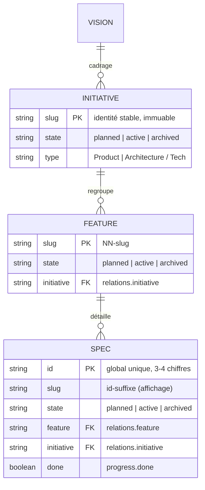

# Domaine : Workspace Management (workspace-management) — Modèles de Données

> **Mission :** Modèle canonique sans état, stocké en fichiers : quatre kinds d'artefacts (métadonnée JSON + corps markdown) reliés par `relations` et indexés dans `index.json` v3 — projections markdown sous `.specs/generated/` (100 % générées, purgées et régénérées par le CLI) ; aucun datastore SQL, aucune table.
> **Conventions Transversales :**
> * Identifiants : `id` de spec = compteur séquentiel global 3–4 chiffres (jamais réutilisé) ; initiative et feature utilisent leur slug comme id.
> * Audit : chaque métadonnée porte `createdAt` / `updatedAt` ; toute écriture passe par le CLI (zéro édition manuelle).

---

## 1. Périmètre & Frontières des Données

* **Entités gérées dans ce domaine :**
  * `vision` : racine unique du graphe — `canonical/vision.{json,md}`.
  * `initiative` : jalon stratégique — `initiatives/<slug>/<slug>.{json,md}`.
  * `feature` : tranche livrable — `initiatives/<init>/features/<slug>/<slug>.{json,md}`.
  * `spec` : delta d'ingénierie — `…/specs/<id>.{json,md}` (nom de fichier = id seul).
* **Projections générées (`generated/` — 100 % CLI, jamais éditées à la main, purge des orphelins au `render`) :**
  * `vision` → `generated/vision.md` (une seule vision — le double racine est tombé avec la feature `02`).
  * `initiative` → `generated/initiatives/<slug>/README.md`.
  * `feature` → `generated/initiatives/<initiative>/features/<slug>.md` (aplatie au niveau initiative).
  * `spec` → `generated/initiatives/<initiative>/specs/<id>.md` (nom de fichier = id seul, listes triées par id).
* **Frontières & Délégations :**
  * `knowledge/` (`decisions/` + `domains/`) : authored, **hors graphe**, jamais généré ni exigé (INV-4), hors de portée du render.
  * `generated/` : projections markdown régénérées par le CLI — hors graphe, intégralité régénérable (purge + sweep hérité, suppressions listées et prévisualisables).
  * `config.json` : configuration du CLI, hors modèle.

---

## 2. Diagramme Entité-Relation (ERD)

---

## 3. Dictionnaire des Données Métier

*Attributs porteurs de valeur métier (métadonnée schema v3 — `META_VERSION = 3`, structure inchangée du v2 hors `relations` de spec enrichi) :*

| Entité | Attribut | Type | Nullable | Contraintes | Rôle Métier |
|---|---|:---:|:---:|---|---|
| Tous | `state` | enum | Non | `planned \| active \| archived` | Cycle de vie — en métadonnée, jamais en chemin |
| Tous | `relations` | object | spec : Non | Cibles validées (`graph-integrity`) | Dérivent le chemin canonique (INV-1) |
| spec | `id` | string | Non | Global unique (INV-5) | Identité + nom de fichier |
| spec | `fields` | map | Oui | Ex. `Domain`, `Change Type` | Contexte libre typé |
| Tous | `remote` | map | Oui | Refs miroirs (Linear) | Projection distante |
| Tous | `progress.done` | boolean | Non | Cascade au `done` | Complétude remontée |

---

## 4. Règles d'Intégrité & Cycle de Vie

1. **Règles d'Unicité :**
   * `id` de spec unique au niveau du modèle (règle `spec-id-uniqueness`) ; allocation séquentielle max+1, jamais réutilisée.
   * Slug unique par kind et immuable après création (PDR-001).
2. **Politiques de Suppression & Cascade :**
   * Aucune commande de suppression exposée : l'archivage (`archived`) est la sortie du cycle ; `done --cascade` archive un parent dont tous les enfants sont complets ; `--undo` rouvre en `active`.
3. **Règles d'Immutabilité & Conservation :**
   * Slug et chemin dérivé immuables ; la relocation n'a lieu qu'au changement de `relations` (`spec link`) — jamais sur un changement d'état (INV-2).
   * `move` mute `state` + `updatedAt` in situ ; transitions légales : `planned → active|archived`, `active → planned|archived`, `archived → active`.
   * `index.json` vit sous `.specs/canonical/` : préfixes `meta`/`body` = `.specs/canonical/…`, `projection` = `.specs/generated/…` (reciblage de la feature `02` — format v3 inchangé, pas de version 4). Un `move` régénère la projection au même chemin — plus aucun renommage de projection (fin des répertoires d'état).
