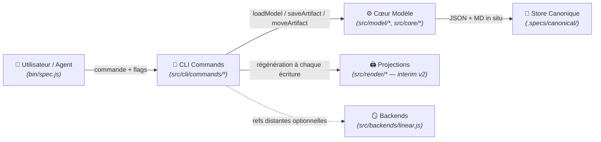

# Domaine : Workspace Management (workspace-management) — Architecture Technique

> [!NOTE]
> **Mission :** Architecture du CLI `spec` et du modèle canonique sans état : lecture/écriture de `.specs/canonical/` (état en métadonnées), index v3, projections et garde-fous d'intégrité.

---

## 1. Flux Architectural des Couches

---

## 2. Cartographie des Composants

| Couche | Responsabilité Technique | Composants Clés |
|---|---|---|
| **Transport / CLI** | Parsing, résolution des `<ref>` (id nu, slug, chemin), erreurs typées, `--dry-run` | `bin/spec.js`, `src/cli/commands/{init,upsert,move,done,link,validate,render,status,list,model,sync,backend}.js` |
| **Cœur Modèle** | Dérivation des chemins (relations seul), walk de `canonical/`, relocation sur changement de `relations` uniquement, index v3 | `src/model/{layout,store,graph,index,schema}.js` (`META_VERSION = 3`), `src/core/{paths,transitions}.js` |
| **Projections** | Rendu markdown vers les chemins interim v2 ; garde anti-drift `render --check` | `src/render/{projections,markdown}.js` |
| **Persistance** | Store fichier JSON + MD ; répertoires créés à la volée ; élagage jamais au-dessus de `canonical/` | `.specs/canonical/**`, `.specs/canonical/index.json` |
| **Mirrors** | Projection distante optionnelle ; refs stockées dans la métadonnée `remote` | `src/backends/linear.js` (désactivé par défaut) |

> [!IMPORTANT]
> **Frontière de Domaine :** le rendu sous `generated/` (feature `02`) et la migration de workspaces (`spec migrate`, feature `03`) sont scellés aux features sœurs — cf. §6 pour les conventions interim à ne pas rouvrir.

---

## 3. Dépendances Inter-Domaines

| Relation | Domaine Lié | Contrat & Échange |
|---|---|---|
| **Expose à** | `02-generated-namespace` | Projections interim v2 (chemins à dirs d'état) consignées dans `index.json` jusqu'au basculement `generated/` |
| **Expose à** | `03-sdd-migration` | Métadonnées schema v3 + `index.json` comme source de reconstruction (`spec migrate`) |

---

## 4. Invariants Techniques & Sécurité

| Règle | Exigence d'Intégrité | Mécanisme de Contrôle |
|---|---|---|
| **`INV-1`** | **Aucun état de cycle de vie dans un chemin canonique** : chemins dérivés de slugs/ids + `relations` seul | `validate` règles `canonical-layout` + `graph-integrity` |
| **`INV-2`** | **`move` sans relocation** : la transition mute la métadonnée, l'index et les projections — rien d'autre | `moveArtifact` in situ + tests |
| **`INV-3`** | **Zéro pré-allocation** : `spec init` crée exactement 2 répertoires + `config.json` | `standardLayout` + tests |
| **`INV-4`** | **`knowledge/` regroupe `decisions/` + `domains/`** ; authored, hors graphe, jamais généré ni exigé | `knowledgeRoot` ; validate exit 0 avec/sans knowledge |
| **`INV-5`** | **Unicité globale des ids de spec** (plus garantie par collision de répertoire dans l'arbre nesté) | `validate` règle `spec-id-uniqueness` (garde post-hoc, pas de verrou d'allocation) |
| **`INV-6`** | **Slug immuable** (PDR-001) ; re-upsert = mise à jour in situ | Pas de commande rename + tests |
| **`INV-7`** | **Allocation d'id séquentielle, jamais réutilisée ; `\d{3,4}`** | `parseSpecSlug` + `spec list --kind spec --json` |

---

## 5. Décisions d'Architecture de Référence

| Référence | Décision Structurante | Impact Technique |
|---|---|---|
| [`PDR-001`](../../decisions/product/PDR-001-slug-immuable.md) | Slug immuable après création | Élimine la classe des renommages destructeurs (relocation en chaîne, resync de mirrors) |

---

## 6. Conventions Interim SCELLÉES (ne pas rouvrir)

Ces conventions sont volontairement provisoires et déjà arbitrées : le prochain agent ne les « corrige » pas et n'y touche pas sans rouvrir la feature porteuse.

| Convention interim | Périmètre | Levier de basculement |
|---|---|---|
| **Projections v2 aux chemins avec dirs d'état** : `.specs/specs/<state>/`, `.specs/initiatives/<state>/<init>/…`, `.specs/vision.md` | Tout le rendu markdown | Feature `02-generated-namespace` → namespace `generated/` |
| **Double `vision.md`** : `.specs/canonical/vision.md` (authored) coexiste avec `.specs/vision.md` (projection) | Racine du workspace | Feature `02` (une seule vision, sous `generated/`) |
| **Préfixes `index.json`** : `meta`/`body` = `.specs/canonical/…`, `projection` = `.specs/…` | `.specs/canonical/index.json` | Feature `02` (reciblage des projections) |
| **Scanners legacy gelés** : `src/core/artifact.js`, `src/migrate/{import,parse}.js` encodent encore les états en chemins et une regex `\d{3}` ( incompatible 4 chiffres) ; `spec import` obsolète après cutover | Import / parsing legacy | Feature `03-sdd-migration` (rework complet : `spec migrate`) |
| **Racine `.specs/`** (future `.sdd/`) | Tout le framework | Feature `03-sdd-migration` |
