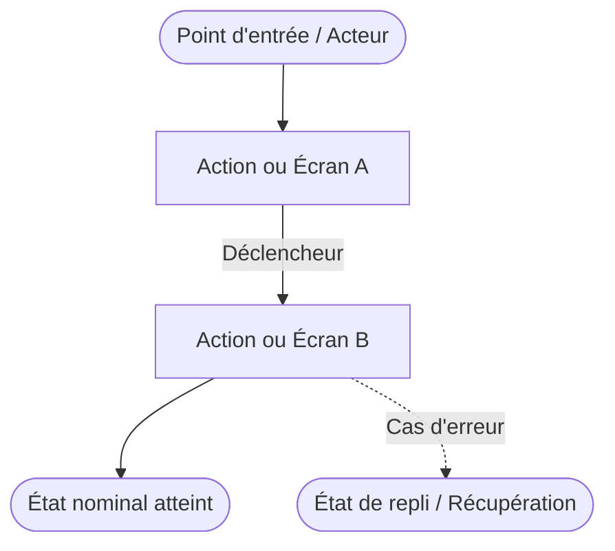

# Domaine : [Nom du Domaine] ([slug]) — Comportement Produit

> **Mission :** [1 à 2 phrases claires sur la raison d'être du domaine et la valeur délivrée à l'utilisateur]  
> **Acteurs & Personas :** [Visiteur anonyme, Utilisateur authentifié, Propriétaire d'organisation, etc.]

---

## 1. Périmètre & Frontières du Domaine (Bounded Context)

* **Ce qui relève de ce domaine (In Scope) :**
  * [Responsabilité métier clé 1]
  * [Responsabilité métier clé 2]
  * [Responsabilité métier clé 3]
* **Ce qui relève d'autres domaines (Out of Scope & Frontières) :**
  * *[Autre Domaine A] :* Délégué à `[slug-domaine-a]` ([Préciser ce qui est délégué]).
  * *[Autre Domaine B] :* Délégué à `[slug-domaine-b]` ([Préciser ce qui est délégué]).

---

## 2. Vue d'Ensemble & Diagramme des Flux

---

## 3. Cartographie des Parcours

| Réf | Parcours | Acteur principal | Déclencheur | Résultat visible |
|---|---|---|---|---|
| `PAR-01` | [Nom court du parcours] | [Acteur] | [Action ou événement initial] | [État final obtenu par l'utilisateur] |
| `PAR-02` | [Nom court du parcours] | [Acteur] | [Action ou événement initial] | [État final obtenu par l'utilisateur] |

---

## 4. Fiches Détaillées des Parcours

### `PAR-01` : [Nom du Parcours]
* **Acteur :** [Qui agit ou bénéficie du parcours]
* **Prérequis :** [Conditions nécessaires avant déclenchement, ex: session active, droits spécifiques]
* **Déclencheur :** [Clic, saisie, raccourci clavier, événement asynchrone, chargement de page...]
* **Déroulement nominal :**
  1. [Étape 1 : Action utilisateur ou déclenchement système]
  2. [Étape 2 : Réaction du système ou validation intermédiaire]
  3. [Étape 3 : Transition ou mise à jour de l'affichage]
* **Post-conditions :** [Ce qui a changé concrètement : écran actif, persistance, état global]
* **Variantes & Cas d'exception :** *(optionnel si le parcours comporte des embranchements notables)*
  * *Variante A :* [Description concise]

---

## 5. Invariants & Règles Métier

*Les règles absolues et pérennes gouvernant le domaine (non liées à un détail d'implémentation éphémère) :*

* **`RULE-[DOM]-01` ([Nom de la règle]) :** [Énoncé précis, vérifiable et testable de la règle métier].
* **`RULE-[DOM]-02` ([Nom de la règle]) :** [Énoncé précis, vérifiable et testable de la règle métier].

---

## 6. Matrice des États, Échecs & Cas Limites

| Situation / Déclencheur | Comportement & Réaction visible UI | Action de reprise utilisateur |
|---|---|---|
| [Erreur ou cas limite 1] | [Message clair, blocage explicite, état de repli] | [Action concrète pour débloquer la situation] |
| [Erreur ou cas limite 2] | [Message clair, blocage explicite, état de repli] | [Action concrète pour débloquer la situation] |
