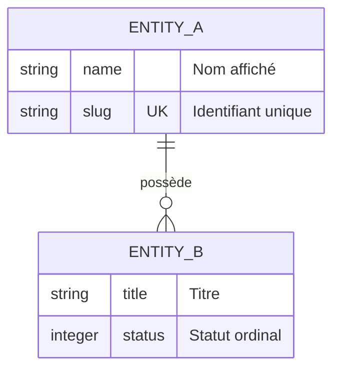

# Domaine : [Nom du Domaine] ([slug]) — Modèles de Données

> **Mission :** [1 phrase claire sur les concepts modélisés dans ce domaine]  
> **Conventions Transversales :**  
> * Toute entité dispose d'une clé primaire technique immuable `id` ([Type d'ID standard du projet, ex: UUIDv7, ULID...]).
> * Toute entité porte des timestamps d'audit automatiques (`created_at`, `updated_at`).

---

## 1. Périmètre & Frontières des Données

* **Entités gérées dans ce domaine :**
  * `[entite_1]` : [Description en une ligne]
  * `[entite_2]` : [Description en une ligne]
* **Frontières & Délégations :**
  * *[Entité externe liée] :* Relève de `[slug-autre-domaine]` (lié ici par clé étrangère).

---

## 2. Diagramme Entité-Relation (ERD)

---

## 3. Dictionnaire des Données Métier

*Seuls les attributs porteurs de valeur métier et de contraintes spécifiques sont détaillés ci-dessous (hors clés techniques standards et timestamps) :*

| Entité | Attribut | Type | Nullable | Contraintes Clés | Rôle Métier |
|---|---|:---:|:---:|---|---|
| **`[entite_1]`** | `[champ_1]` | string | Non | `UNIQUE` | [Description du rôle métier] |
| | `[champ_2]` | integer | Non | `DEFAULT 0` | [Description du rôle métier] |
| **`[entite_2]`** | `[champ_1]` | string | Non | — | [Description du rôle métier] |

---

## 4. Règles d'Intégrité & Cycle de Vie

1. **Règles d'Unicité :**
   * [Règles d'unicité simples ou composites]
2. **Politiques de Suppression & Cascade :**
   * [Comportement lors de la suppression d'une entité parent : cascade, rejet, anonymisation...]
3. **Règles d'Immutabilité & Conservation :**
   * [Champs ou entités protégés contre la modification ou suppression]
