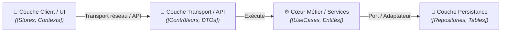

# Domaine : [Nom du Domaine] ([slug]) — Architecture Technique

> [!NOTE]
> **Mission :** [1 phrase claire sur les responsabilités techniques et architecturales de ce domaine]

---

## 1. Flux Architectural des Couches

---

## 2. Cartographie des Composants

| Couche | Responsabilité Technique | Composants Clés |
|---|---|---|
| **Client / Frontend** | [Gestion d'état, formulaires, rendu UI et synchronisation] | `[Composant 1]`, `[Store / Context]` |
| **Transport / API** | [Exposition réseau, désérialisation, validation des entrées] | `[Contrôleur 1]`, `[DTO 1]` |
| **Cœur Métier (Core)** | [Logique d'affaires pure, règles de gestion et autorisations] | `[UseCase 1]`, `[Service 1]` |
| **Persistance / Stockage** | [Accès aux données, intégrité référentielle, transactions] | `[Repository 1]`, `[Adaptateur 1]` |

> [!IMPORTANT]
> **Frontière de Domaine :** [Préciser explicitement les responsabilités déléguées à d'autres domaines].

---

## 3. Dépendances Inter-Domaines

| Relation | Domaine Lié | Contrat & Échange |
|---|---|---|
| **Consomme** | `[slug-domaine-amont]` | [Données reçues ou services invoqués] |
| **Expose à** | `[slug-domaine-aval]` | [Données fournies ou événements émis] |

---

## 4. Invariants Techniques & Sécurité

| Règle | Exigence d'Intégrité | Mécanisme de Contrôle |
|---|---|---|
| **`INV-TECH-01`** | **[Nom de la règle]** : [Règle technique ou de sécurité non négociable] | [Guard applicatif / Middleware / CI / DB] |
| **`INV-TECH-02`** | **[Nom de la règle]** : [Règle de performance, résilience ou concurrence] | [Transaction / Index / Rate limiting] |

---

## 5. Décisions d'Architecture de Référence

| Référence | Décision Structurante | Impact Technique |
|---|---|---|
| [`ADR-XXX`](../../../decisions/architecture/ADR-XXX.md) | [Titre de l'arbitrage technique] | [Conséquence concrète sur l'architecture] |
| [`PDR-XXX`](../../../decisions/product/PDR-XXX.md) | [Titre de l'arbitrage produit/ergonomie] | [Conséquence concrète sur l'architecture] |
