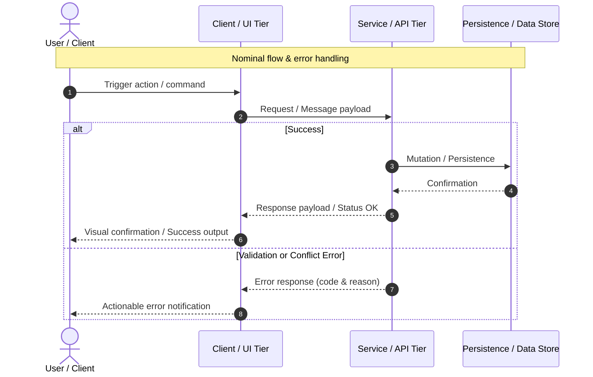

# Spec: [XXX] - [Specification Title]

## Metadata
* **Domain:** `.specs/knowledge/domains/[domain-name]/`
* **Change Type:** `New Domain Bootstrap` | `New Capability` | `Enhancement` | `Refactor` | `Bugfix`
* **Target Tier:** `Fullstack` | `Backend / Service` | `Frontend / UI` | `Infra / DevOps` | `Tests / Tooling`
* **Complexity:** `Low` | `Medium` | `High`

---

## 1. Intent & Context (*The Why*)

* **Problem Statement / Need:** [1-2 sentences explaining the user problem, architectural bottleneck, or need addressed].
* **User / System Impact:** [Concrete delta in user experience or system capabilities compared to current ground truth].
* **In Scope (What is added / modified):**
  * [Deliverable or modification 1]
  * [Deliverable or modification 2]
* **Out of Scope (Strict Exclusions):**
  * [Untouched behavior or deliberately deferred capability]

> *Clean Omission Note (if applicable): "Sections [Data Model / UI / Infrastructure]: Not Applicable ([Reason: e.g., client-only state / internal refactor / no infrastructure changes])."*

---

## 2. Flow & Architecture



---

## 3. File Inventory & Responsibilities

### 3.1. Factorized File Tree
*Workspace-relative paths, `[NEW]` (creation) or `[MOD]` (modification) tags, and single-line responsibility summaries.*

```text
[project-source-directory]/
├── [module-or-package]/
│   ├── [CoreUnit].[ext]                        [NEW] Single-line role summary
│   ├── [ExistingComponent].[ext]               [MOD] Single-line role summary
│   └── tests/
│       └── [CoreUnitTest].[ext]                [NEW] Unit and integration test suite
[tests-directory]/
└── [feature-acceptance-test].[ext]             [NEW] Acceptance / E2E test scenarios
```

### 3.2. Key Contracts & Signatures
*Strict interface contracts in the project's native language (TypeScript interfaces, Go/Rust structs, Python/PHP DTOs, protobuf/OpenAPI definitions).*

```text
[ Code snippet showcasing critical types, interfaces, or payload schemas ]
```

---

## 4. Detailed Specifications

*(Retain relevant subsections based on the scope of the change; omit irrelevant tiers with a single clean note)*

### 4.1. Data Models & API Contracts
*(Complete if evolution touches database persistence, schemas, endpoints, or RPCs)*

* **Schema / Migration:** `[path/to/migration-or-schema-file]`
* **Endpoint / Interface Contract:** `[PROTOCOL/METHOD] [path-or-rpc-name]` (`Success Payload` / `Error Conditions`)

### 4.2. UI & Interaction Specifications
*(Complete if evolution touches graphical UI, CLI commands, or interactive views)*

```text
[ ASCII WIREFRAME / INTERACTION LAYOUT ]
+-------------------------------------------------------+
|  [View / Interface Component]                         |
|  +---------------------------+                        |
|  | Input: [                ] |                        |
|  | [ Primary Action ]        |                        |
|  +---------------------------+                        |
+-------------------------------------------------------+
```

#### State / Interaction Matrix
| State | Trigger | System Behavior & Output |
|---|---|---|
| **Idle / Default** | Initial state / mount | Default data display or empty state prompt. |
| **Active / Input** | User input / interaction | Transient feedback, active validation. |
| **Success** | Valid submission | State committed, confirmation presented. |
| **Error** | Invalid input / system failure | Actionable error message, input preserved. |

### 4.3. Infrastructure, Configuration & Runtime
*(Complete if evolution touches environment variables, containerization, cloud resources, queues, or CI/CD)*

* **Configuration & Secrets:** `[ENV_VAR_NAME]`, configuration files, or flag definitions.
* **Containers & Runtime:** `Dockerfile`, compose files, or resource allocation adjustments.
* **Pipelines & CI/CD:** GitHub Actions / GitLab CI workflows impacted.
* **Background Jobs / Queues:** Scheduled tasks, workers, retry policies, or cache invalidation rules.

---

## 5. Business Invariants & Test Traceability

Every functional invariant maps to a dedicated Gherkin scenario in Section 8.1:

* **INV-1 · [Rule Title 1]**  
  [Concise definition of the invariant and guaranteed behavior under all conditions].  
  ↳ *Covered by:* [`[TestFile].[ext]`](#appendix-file-index)

* **INV-2 · [Rule Title 2]**  
  [Concise definition of the invariant and guaranteed behavior under all conditions].  
  ↳ *Covered by:* [`[OtherTestFile].[ext]`](#appendix-file-index)

---

## 6. Technical Watchouts & Anti-Patterns

* **[Pitfall 1]:** [Concrete implementation pitfall and recommended safeguard (e.g., concurrency, state mutation, boundary validation)].
* **[Pitfall 2]:** [Concrete implementation pitfall and recommended safeguard].
* **[Pitfall 3]:** [Concrete implementation pitfall and recommended safeguard].

---

## 7. Sequential Execution Plan

- [ ] **Phase 1: Foundation & Data Contracts**
  - [ ] Implement data structures, schemas, and core types in [`[file].[ext]`](#appendix-file-index).
  - [ ] Implement unit tests validating contracts in [`[test-file].[ext]`](#appendix-file-index).

- [ ] **Phase 2: Core Logic & Interface Implementation**
  - [ ] Implement business logic / components in [`[file].[ext]`](#appendix-file-index).
  - [ ] Implement integration tests in [`[test-file].[ext]`](#appendix-file-index).

- [ ] **Phase 3: Infrastructure, E2E & Quality Gates**
  - [ ] Apply configuration / infrastructure updates in [`[infra-file].[ext]`](#appendix-file-index).
  - [ ] Implement end-to-end / acceptance tests in [`[e2e-file].[ext]`](#appendix-file-index).
  - [ ] Execute and validate 100% of project quality gates.

---

## 8. BDD Validation & Quality Gates

### 8.1. Exhaustive Gherkin Scenarios
*Every invariant in Section 5 must have a corresponding Gherkin scenario below.*

```gherkin
Feature: [Feature Name]

  # ============================================================================
  # 1. Unit Tests (@unit)
  # ============================================================================

  @unit
  Scenario: [INV-X] [Specific isolated unit behavior]
    Given [isolated initial state]
    When [function or method called with parameters]
    Then [returned value conforms to invariant]

  # ============================================================================
  # 2. Integration & Component Tests (@component / @integration)
  # ============================================================================

  @integration
  Scenario: [INV-Y] [Service or component interaction across boundaries]
    Given [system initialized in given state]
    When [action performed across layer boundary]
    Then [integrated result conforms to invariant]

  # ============================================================================
  # 3. End-to-End Tests (@e2e)
  # ============================================================================

  @e2e
  Scenario: [INV-Z] [Full end-to-end user or consumer flow]
    Given [system running in target environment]
    When [complete user or client workflow executed]
    Then [observable end-to-end outcome verified and persistent]
```

### 8.2. Execution Commands & Quality Gates

```bash
# 1. Targeted test command
[project test command for targeted files]

# 2. Static Quality Gates (Linter, Typechecker, Formatter)
[project static analysis / typecheck command]
[project linter command]

# 3. Acceptance / End-to-End Tests
[project e2e test execution command]
```

---

<a id="appendix-file-index"></a>
## Appendix: File Index

Path resolution mapping for tooling and automated agents:

| Short File Name | Project Relative Path |
|---|---|
| `[ShortName].[ext]` | `[path/to/.../ShortName].[ext]` |
| `[TestName].[ext]` | `[path/to/.../TestName].[ext]` |
